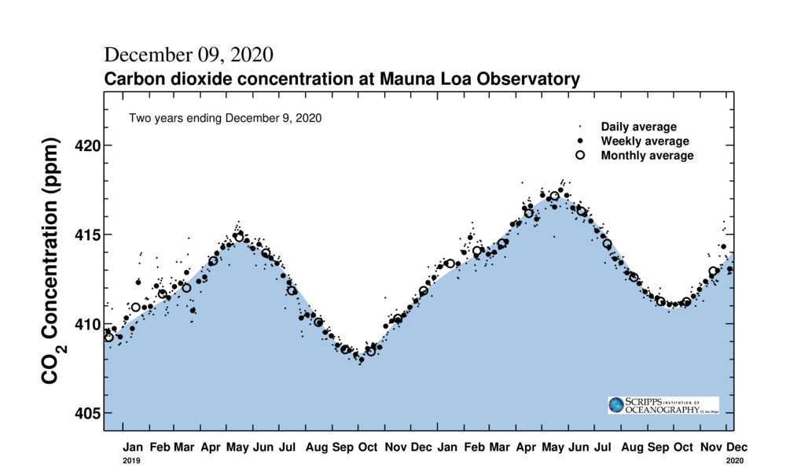
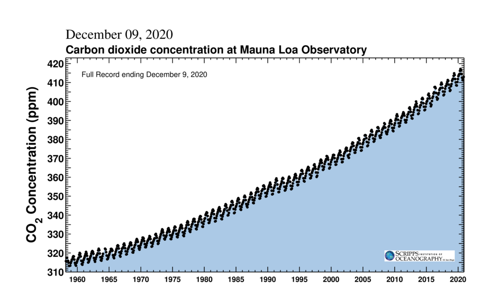
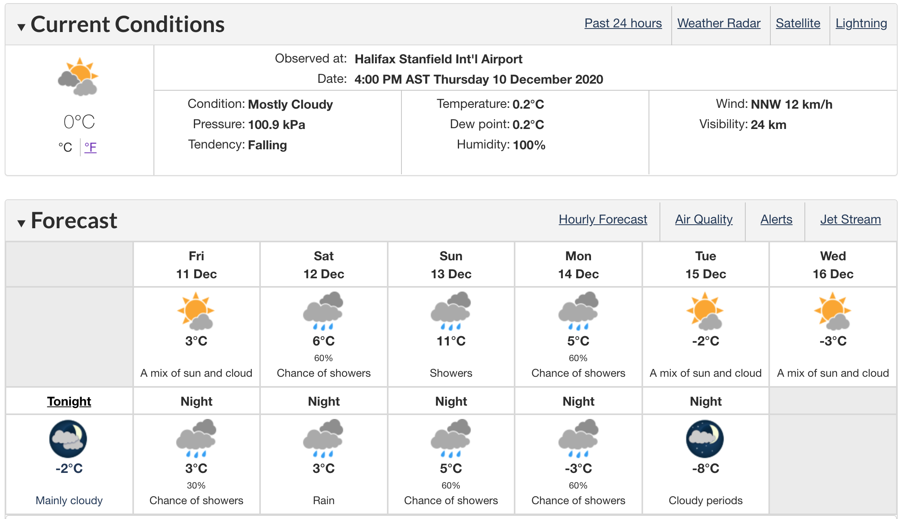

# Invitation to Data Visualization {#invitation}

In this lesson I will provide some examples of interesting and influential data visualizations.

At the end of the lesson, I will ask you to identify two visualizations you find interesting and provide a brief description and analysis of each.

## Atmospheric carbon dioxide concentration

Climate change in the recent past and coming century will be controled by human-driven emission (and possibly sequestration) of carbon dioxide from fossil fuels into the atmosphere. Starting in the 1950s, the amount of carbon dioxide in the atmosphere (in parts per million) was regularly measured. Subsequently, methods for analyzing gasses trapped in ice were used to extend this record back about one million years. There is a direct physical link between atmospheric concentration of carbon dioxide and the loss of heat from Earth to space, resulting in a mechanistic link between increasing carbon dioxide concentration in the atmosphere and the mean temperature of the surface of the Earth. Visualizations of this data and assocated global mean temperature data have been extremely influential, forming the [cornerstone of books](https://en.wikipedia.org/wiki/The_Hockey_Stick_and_the_Climate_Wars), a [documentary movie](https://en.wikipedia.org/wiki/An_Inconvenient_Truth), and countless educational and environmental change movements.

```{r co2-2-year, echo=FALSE, fig.cap="Two years of atmospheric CO$_2$ concentration from Mauna Loa observatory. Source [co2.earth](https://www.co2.earth/daily-co2) and [sioweb.ucsd.edu](https://sioweb.ucsd.edu/programs/keelingcurve/) ", out.width = '100%'}

```

```{r co2-full-record, echo=FALSE, fig.cap="Atmospheric CO$_2$ concentration from Mauna Loa observatory, 1958 to present. Source [co2.earth](https://www.co2.earth/daily-co2) and [sioweb.ucsd.edu](https://sioweb.ucsd.edu/programs/keelingcurve/) ", out.width = '100%'}

```

Sample [visualizations of atmospheric carbon dioxide](https://scrippsco2.ucsd.edu/data/atmospheric_co2/primary_mlo_co2_record.html) are available from the institute that has been collecting this data for decades.

Estimates of [global mean temperature](https://climate.nasa.gov/vital-signs/global-temperature/) over time are available from NASA.

Many other sites have information on this important problem, usually presenting [data visually](https://www.climate.gov/news-features/understanding-climate/climate-change-atmospheric-carbon-dioxide) as a testament to the importance of visualizations.

## Human health and development 

[Hans Rosling](https://en.wikipedia.org/wiki/Hans_Rosling) was a physician and popularizer of data visualizations to develop understanding of human health and economic development over time and across countries. His [public presentations](https://www.ted.com/talks/hans_rosling_the_best_stats_you_ve_ever_seen) illustrate his view of how dyanmic charts can help us come to see the trajectory of global development, particularly the connections between health and economic development. I strongly encourage you to watch his presentations.

## Weather 

In contrast to climate, many people are strongly interested in their local weather conditions both today and anticipated in the near future. Because of this strong interest and the complextity of the data, many visualizations have been developed. Forecasts, such as those produced by [Environment Canada](https://weather.gc.ca/city/pages/ns-19_metric_e.html), and historical retrospectives, such as those produced by [Weatherspark](https://weatherspark.com/y/28434/Average-Weather-in-Halifax-Canada-Year-Round) are examples that leverage familiarity with the data, broad-scale human interest, and data-rich but not overly complicated displays. Two examples are shown below.

```{r env-canada-weather, echo=FALSE, fig.cap="Environment Canada weather forecast for Halifax NS, December 10, 2020", out.width = '100%'}

```

```{r weatherspark, echo=FALSE, fig.cap="Climatological mean temperatures in Halifax NS from weatherspark.com", out.width = '100%'}
knitr::include_graphics("static/weatherspark-hfx-temperature.png")
```

## Journalism

In the past decade there has been a resurgence of interest in data visualizations, stimulated in part by journalists emphasising visualizations in their publications. This example in the New York Times shows [projected earnings for college graduates in a range of fields of study](https://www.nytimes.com/2018/01/04/learning/whats-going-on-in-this-graph-jan-9-2018.html) and is accompanied by notes and discussion questions. The New York Times has a series of educational materials on both [visualizations and their stories](https://www.nytimes.com/column/whats-going-on-in-this-graph).


## Historically important visualizations

Many ideas in contemporary data visulizations can be traced back to the 19th century, as represented by several impactful examples. In 1869, Charles Minard produced a map of [Napoleon's Russian campaign of 1812](https://en.wikipedia.org/wiki/Charles_Joseph_Minard#The_map_of_Napoleon's_Russian_campaign). Florence Nightingale was a pioneer user of data visualizations to communicate messages about sanitation and public health, famously in a [polar histogram showing causes of mortality of soldiers](https://en.wikipedia.org/wiki/Florence_Nightingale#Statistics_and_sanitary_reform). Also in public health, John Snow mapped a cholera outbreak in London, [visually linking deaths to a water source](https://en.wikipedia.org/wiki/John_Snow#Cholera). All of these visualizations were great advances over the [bills of mortality](https://en.wikipedia.org/wiki/Bills_of_mortality) produced a few centuries earlier.


## Stories


## Ideas 

Grammar of graphics. For reading and for creating
Use of element. Length slope shape dot colour box plot histogram
Organize and reshape data
Colour challenges


## Stories

https://www.openculture.com/2014/02/kurt-vonnegut-masters-thesis-rejected-by-u-chicago.html

COWilke chapter
