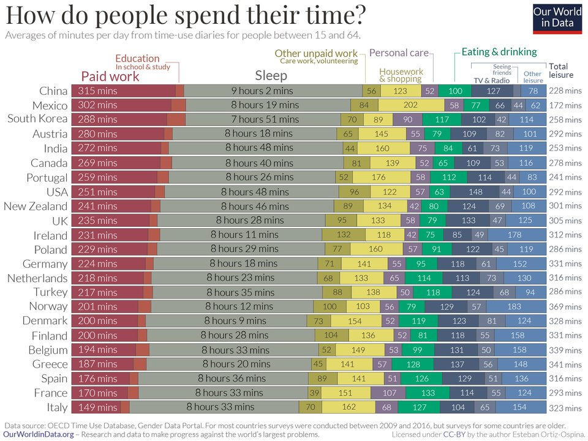
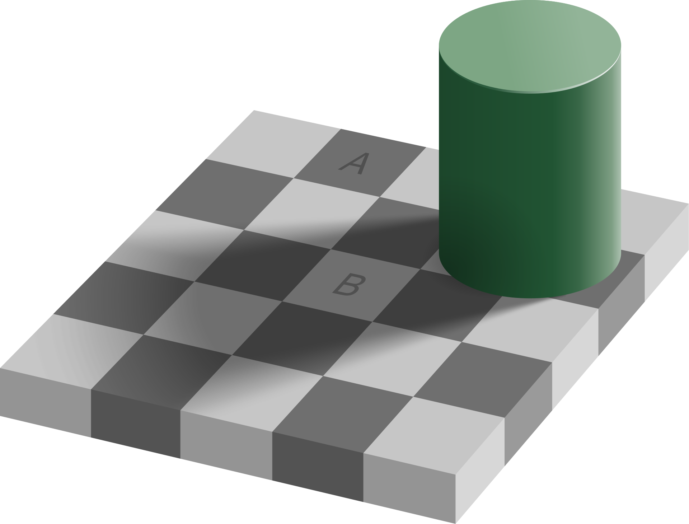
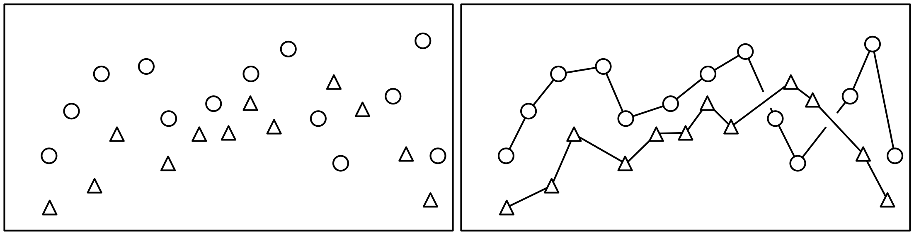

# Look at Data {#look-data}


## Review

Course introduction and goals done. Computer setup done.

## Goals

We're learning to make data visualizations, so naturally we want to make good ones. What makes one visualization good and another bad? Are there specific qualities to emulate or avoid? How can we meaningfully discuss visualization quality without emphasizing personal preferences and taste? [Healy Chapter 1](https://socviz.co/lookatdata.html#lookatdata) has many good answers to these questions, while recognizing that the subject is somewhat subjective. 

In this lesson we will try to develop some tentative answers to the following questions:

* What can you learn more easily from a visualization than from a table of data?
* What makes a good visulization?
* What features of human visual perception should be considered when designing data visualizations?

There is much more in [Healy Chapter 1](https://socviz.co/lookatdata.html#lookatdata) than the highlights in this lesson. I suggest you read the chapter carefully and return to it several times throughout the course.


## Problems with numerical summaries 

Numerical summaries of data (e.g., mean, median, quantiles, standard deviation) are very useful but sometimes conceal more than they reveal. Discussions of financial aspects of life in the news -- whether incomes, taxes, or [assets](https://en.wikipedia.org/wiki/Distribution_of_wealth) often suffer from these problems because distributions of the underlying data are skewed. Similarly, numerical summaries of relationships between two or more variables (e.g., correlation, linear regression parameters) can be misleading in the presence of outliers (see [Healy](https://socviz.co/lookatdata.html#lookatdata) Figure 1.2, 1.3) or unexplored features of the relationship. The main problem with these numerical summaries is the distillation of a complex data set to a very small set of numbers. Visualizing data allows many more data to be represented and exploits the human visual system to interpret the relationships, without any statistical pre-filtering (e.g., by selecting an average or a linear model).

Two synthesized datasets illustrate these phenomena through extreme cases: [Anscombe's Quartet](https://en.wikipedia.org/wiki/Anscombe%27s_quartet) and the [Datasaurus Dozen](https://github.com/thomasp85/gganimate/wiki/The-Datasaurus-Dozen). The data on each panel have the same numerical summaries (mean, standard deviation, and correlation), yet the underlying patterns are clearly very different.

These problems are generally resolved by the rule: always plot your data; don't rely only on numerical and statistical analysis.

## Good and bad figures

What makes a visualization good? Or bad? We'll explore some answers, but the simplest test is this

* Is the main impression a viewer gets the one you intended as a designer?
* Is the interpretation faithful to the underlying data?

### Chart junk

Somtimes to dress up a display of data, designers will add graphic elements which are not determined by the data, but are instead designed to guide your interpretation of the display. These elements are not part of the visualizations we will create -- they are elements of infographics or advertising to persuade and illustrate rather than display data. We are focused on displaying data. (For examples of bad infographic, just [search](https://duckduckgo.com/?q=misleading+infographics.)

```{r, fig.cap="Still from CBC Canadian Federal election coverage, October 21, 2019. Does the three-dimensional bar chart help you understand the election outcome? Are the bars the right height? Is it helpful to have the bar chart appear in the middle of the studio set? Can you judge the height of the bars?"}
knitr::include_graphics("static/cbc-2019-oct-21-election.jpg")
```

### Distracting colours, images or shapes

Good visualizations don't have to be minimalist black and white, but the use of colour, shape and other elements should be chosen deliberately to enhance the message told by the data. Colour can be used to highlight contrasts or create groups. Shapes are harder to distinguish, especially if there are many parts.

### Bad data

Data can be wrong in many ways, but even if the data underlying a figure are correct, you must be sure that the message conveyed by the data matches the presentation of the figure. This survey of how people spend their time reported in Our World In Data is typical -- does the plot really tell you what it looks like at first glance? Or is it more about age distributions, gender roles, and other sociological factors than the experience of a "typical person" in each country? If it's too hard to tell, the visualization doesn't work.

```{r, echo=FALSE, fig.cap="Source: OECD [time use database](https://stats.oecd.org/Index.aspx?DataSetCode=TIME_USE), [Our World in Data](https://ourworldindata.org/time-use-living-conditions) and tweet by @simongerman600 on 2020-12-13."}

```


## Perception guidelines and cautions

Many features of a visualization can make it harder to interpret than you, as a designer, intend. Once you know the message of a graph, it may be difficult to see problems with visualizations you create, since you know the intended message. So you must keep an eye out for unintended messages and difficult to decode graphs.

Stacked bar charts ([Healy](https://socviz.co/lookatdata.html#what-makes-bad-figures-bad) Figure 1.11) make some comparisons across groups difficult because the baseline of one colour does not line up to the corresponding region from one bar to the next.

The aspect ratio ([Healy](https://socviz.co/lookatdata.html#what-makes-bad-figures-bad) Figure 1.12) can make a small change look large, and the reverse by exploiting our perceptions.

The checkerboard illusion ([Healy](https://socviz.co/lookatdata.html#perception-and-data-visualization) Figure 1.14) is an example of how our brains process brightness in the context of neighbouring parts of the image. The squares labeled A and B are the same colour, represented by the same underlying data, but look completely different.

```{r fig.cap="The checker shadow illusion. [Wikipedia](https://en.wikipedia.org/wiki/Checker_shadow_illusion)"}

```


## Decoding graphs

Data are generally described as quantitative or categorical. Each type of data has its own suite of representations and challenges with perception.

For quantitative data, the most direct representation is the position of a symbol on a line, like the 'number line' of elementary school math classes. Other comparisons such as the lengths of a line, slopes of a line or angles in a pie chart, colour brightness and saturation, and area or volume are more difficult to make quantiative (roughly in that order from easiest to hardest). These orderings are reasonably intuitive, once explained, but are also supported by quantitative experimental data ([Healy](https://socviz.co/lookatdata.html#visual-tasks-and-decoding-graphs) Figures 1.22-1.24).

The options for categorical data are somewhat simpler: position is still useful, then colour hue, and shape (Figure 1.25). The number of categories should be kept small, particularly for colour and shape, or your message will likely be lost in the detail of the visualization.

## Where to put 0?

A common rule for quantitative displays using position is that you should always include 0 on your axis. The reason is simple, we often want to make  comparisons of absolute differences and relative differences. Ratios of two quantities read from distances will only be sensible if the distance from 0 can be seen. Rules which are absolute and always true are rare, and this may be an example of this. For the data shown below, which visualization is better? What if dots were used on the left and bars on the right?

```{r echo=FALSE, warning=FALSE, message=FALSE, fig.height = 3, fig.cap="A bar chart and dot chart version of the same data. The extent of the horizontal axis differs on the two panels."}
# knitr::include_graphics(c("static/ch-01-bar-simple-1.png", "static/ch-01-bar-simple-2.png"))
library(tidyverse)
library(patchwork)
library(gapminder)
d1 <- gapminder %>% filter(year == 2007) %>% group_by(continent) %>% summarize(lifeExp = mean(lifeExp))
p1 <- d1 %>% ggplot(aes(x=lifeExp, y=fct_reorder(continent, lifeExp))) + geom_col() +
  labs(x="Life expectancy in years, 2007", y = "") + theme_bw() +
  theme(axis.title =  element_text(size=13),
        axis.text =  element_text(size=12))
p2 <- d1 %>% ggplot(aes(x=lifeExp, y=fct_reorder(continent, lifeExp))) + geom_point() +
  labs(x="Life expectancy in years, 2007", y = "") + theme_bw() +
  theme(axis.title =  element_text(size=13),
        axis.text =  element_text(size=12))
p1 + p2
```

## Lines, shapes, or connect the dots?

A common question when plotting a scatter plot of two quantitative variables is whether to use lines, points, or both for the data (see the sketch below.) Which is appropriate? Often data points are discrete and little is known about values between the points; lines can thus be misleading because they give a visual indication of data between points. Lines act as guides joining points with the same symbol, which gives a stronger visual impression and can simplify the message of a complex plot. If the underlying data are continuous and the lines are a reasonable representation of the process being represented, then symbols may be unnecessary. In short, the most appropriate representation depends on your understanding of the data and the message to be communicated.

```{r fig.cap="Points or lines?"}

```


## Thinking about your goals

Almost all decisions about data visualizations come down to this: what is the best choice to highlight the most important feature of the dataset? Does your picture represent the data fairly? Are there perceptual problems that make the picture easy to misinterpret or difficult to understand?


## Sources

* [Healy Chapter 1](https://socviz.co/lookatdata.html#lookatdata)
* [Wilke Chapter 1](https://clauswilke.com/dataviz/introduction.html) emphasizes the difference between ugly, bad, and wrong figures, echoing many of the observations made here. The rest of his book addresses these questions in considerable detail from the perspective of someone training students in good and bad features of graphics, focussing on many of the same perceptual issues introduced here.
