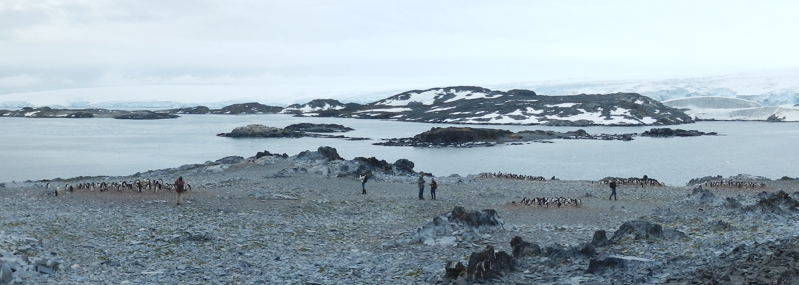

# Data Sources, Abstracts and Dictionaries {#data2}

```{r include=FALSE}
library(naniar)
library(palmerpenguins)
library(codebook)
library(weathercan)
library(lubridate)
library(skimr)
```

A data abstract is a short descriptive paragraph that provides the essential facts about the dataset including the who, what, where, when, why,
and how of the data, a quantitiative summary of the most important features (the number and type of variables, the number of observations, the range of key quantitative variables, and the levels or number of levels of key categorical variables.) A data dictionary lists all the variables by variable name from the dataset, providing a type (categorical, quantitative, date, etc.), units if applicable, a longer description, and key notations such as method of collection, number of missing data, or other notable feature.

## Palmer Penguins

The Palmer Penguins package provides a dataset `penguins` with biometric data (flipper and bill dimensions, body mass) for 344 observations over three species of penguin observed on three islands in archipelago along the the West Antarctic Peninsula. The data were obtained as part of the US NSF Palmer LTER program between 2007 and 2009. Additional data including additional morphometrics, reproductive success, and carbon and nitrogen stable isotopic composition of blood samples from adults is in the `penguins_raw` data.

```{r fig.cap="Number of missing observations of each variable from the `penguins` dataset.", echo=FALSE}
gg_miss_var(penguins)
```

```{r}
# codebook(penguins)  # not sure this works or does anythign interesting. Can create a csv file to document the dataset.
```

Citation: Allison Marie Horst and Alison Presmanes Hill and Kristen B Gorman (2020) palmerpenguins: Palmer Archipelago (Antarctica) penguin data. version 0.1.0,  https://allisonhorst.github.io/palmerpenguins/

```{r fig.cap="Adelie penguin colonies on Torgerson Island (Andrew Irwin, January 2012)"}

```

## World population

From Gapminder [population](http://gapm.io/dpop).

```{r}
populationW <- read_csv("static/population_total.csv")
populationL <- populationW %>% pivot_longer(-country, names_to = "year", values_to = "population") %>%
  mutate(year = as.integer(year))
populationL %>% filter(country == "Canada" | country == "China" | country == "France" | country == "Mexico") %>%
  ggplot(aes(x = year, y = population, color=country)) + geom_line() +
  scale_y_log10()
```

## Environment Canada Weather Data for Selected Cities

Meterological data obtained from Environment Canada for several cities in Canada (Vancouver, Calgary, Winnipeg, Toronto, Montreal, Halifax) using the `weathercan` package. Data are provided for XX years in both hourly and daily time resolutions. The variables differ somewhat between the two tables. The `glossary` function provides a data dictionary.

How the data were collected.

First we obtained the station IDs for select airports reporting hourly and daily data.

```{r}
selected_stations <- stations %>% filter(TC_id %in% c("YVR", "YYC", "YWG", "YYZ", "YUL", "YHZ")) %>% filter(interval %in% c("day", "hour"))
download_big_files = FALSE
if (download_big_files) {
  selected_weather_hour <- weather_dl(unique(selected_stations$station_id), interval="hour") # takes a while to download data!
  selected_weather_day <- weather_dl(unique(selected_stations$station_id), interval="day") # takes a while to download data!
  write_csv(selected_weather_day, "static/selected_weather_day.csv")
  saveRDS(selected_weather_day, "static/selected_weather_day.rds")
  write_csv(selected_weather_hour, "static/selected_weather_hour.csv")
  saveRDS(selected_weather_hour, "static/selected_weather_hour.rds")
} else {
  selected_weather_day <- readRDS("static/selected_weather_day.rds")
  selected_weather_hour <- readRDS("static/selected_weather_hour.rds")
}
```


Compute quantiles of windspeed for each of 36 directions

```{r}
selected_weather_hour %>% 
  filter(TC_id == "YHZ") %>%
  group_by(wind_dir) %>%
  filter(!is.na(wind_spd)) %>%
  filter(wind_dir != 0) %>%
  summarize(wind_min = min(wind_spd), wind_max = max(wind_spd), wind_median = median(wind_spd),
                                     wind_10 = quantile(wind_spd, 0.10), wind_90 = quantile(wind_spd, 0.90),
                                     wind_25 = quantile(wind_spd, 0.25), wind_75 = quantile(wind_spd, 0.75)) %>%
  ggplot(aes(x = 10*wind_dir, y = wind_median)) +
  geom_line() +
  geom_line(aes(y = wind_75), color="blue", linetype=3) + 
  geom_line(aes(y = wind_25), color="blue", linetype=3) + 
  coord_polar()
```

Overview of data

```{r}
selected_weather_hour %>% slice_sample(n=1000) %>% skim()
selected_weather_day %>% slice_sample(n=1000) %>% skim()
```

## Questions

* What is the probability of snow / rain / preciptation today?
* What is the distribution of mean temperature change from today to tomorrow?
* What is the distribution of the temperature range (high - low) for today?
* How many days this  year had record highs or lows (compared to past 30 years)?
* When is the last day of the year in winnipeg with no snow on the ground?


```{r}
selected_weather_day %>% filter(TC_id == "YWG") %>%
  filter(snow_grnd == 0) %>%
  group_by(year) %>%
  summarize(latest_date = max(date)) %>%
  mutate(jd = lubridate::yday(latest_date)) %>%
  ggplot(aes(x=jd)) + geom_histogram() +
  labs(title = "Last day of the year with no snow") +
  geom_vline(aes(xintercept = yday(ymd("2020-10-31")))) +
  xlim(NA, 365)
```

Fraction of the days each year after Halloween with no snow on the ground.


```{r}
selected_weather_day %>% filter(TC_id == "YWG") %>%
  mutate(jd = yday(date)) %>%
  filter(jd > yday(ymd("2020-10-31"))) %>%
  group_by(year) %>%
  summarize(n_snow = sum(snow_grnd > 0, na.rm=TRUE),
            n_nosnow = sum(snow_grnd == 0, na.rm=TRUE),
            n = n_snow + n_nosnow,
            f_snow = n_snow/n) %>%
  filter(n > 45) %>%
  ggplot(aes(x=f_snow)) + geom_histogram(binwidth=0.1) +
  xlim(0,1) + 
  labs(title = "Proportion of the last two months with snow on the ground") 
```

## Statistics Canada data

Statistics Canada produces and distributes a huge number of datasets. These can be easily read into R using the `cansim` package. A good approach is to use the [Statistics Canada](https://www150.statcan.gc.ca/n1/en/type/data) website to discover and explore the data you want, then come back to R with the table (or cansim) number.


```{r}
library(cansim)
library(tidyverse)
pop <- get_cansim("1710011501")
pop1 <- pop %>% filter(Statistics == "Population") %>%
  filter(`Age group` == "0 to 29 years old") %>%
  filter(GEO != "Canada") 
pop1 %>%  ggplot(aes(x = REF_DATE, y = VALUE, color=GEO)) +
  geom_line(aes(group=GEO)) +
  labs(title = "Residents, age 0-29", y = "Number", x = "Year", subtitle="Observed and projected")
```

```{r}
pop2 <- pop1 %>% mutate(region = case_when(GEO %in% c("Nunavut", "Yukon", "Northwest Territories") ~ "Territories",
                                   GEO %in% c("British Columbia", "Alberta", "Saskatchewan", "Manitoba") ~ "West",
                                   GEO %in% c("Newfoundland and Labrador", "Prince Edward Island", 
                                              "Nova Scotia", "New Brunswick") ~ "Atlantic",
                                   TRUE ~ "Central")) 
p1 <- pop2 %>%
  group_by(REF_DATE, region) %>%
  summarise(total = sum(VALUE)) %>%
  ggplot(aes( x=REF_DATE, y = total, color = region)) + 
  geom_line(aes(group=region))
p1
```


## Other interesting multivariate data for analysis

## Suggested reading

* https://www.kalzumeus.com/2010/06/17/falsehoods-programmers-believe-about-names/
* https://gist.github.com/timvisee/fcda9bbdff88d45cc9061606b4b923ca


