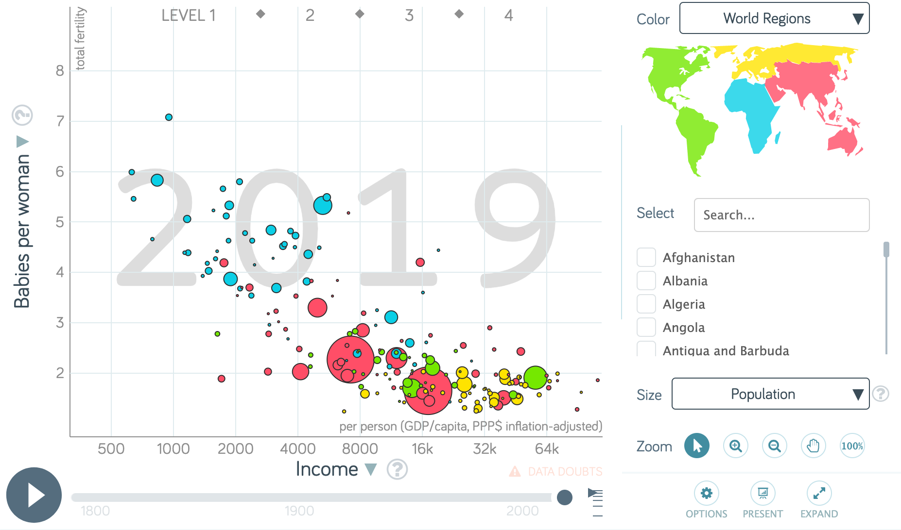
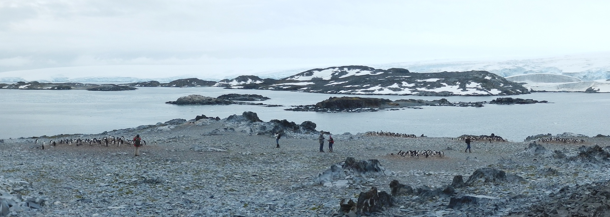

# Welcome

Data visualization is a critical skill for anyone interested in using data to think and persuade. 

This course focusses on three aspects of data visualization: 

* What makes a good data visualization?
* Designing, improving, and communicating with visualizations, and 
* the technical computer skills needed to create visualizations.

##  What is Data Visualization?

Data visualization is the practice of turning data into graphics. Good graphics are more easily interpreted than the raw data. A well-designed visualization is faithful to the original data and does not mislead the intended audience. Almost every data visualization is a simplification and approximation of a raw dataset, and thus involves a perspective--the goals and biases of the person producing the visualization.

Data visualization approaches vary. For some purposes, highly customized graphic design and visual style are paramount. That's not our focus. We emphasize standardized graphical presentations -- which span a wide variety of visualizations -- that minimize the use of graphical elements not directly linked to the data.

## What is the purpose of data visualization?

Data visualization is used to help tell [stories](https://clauswilke.com/dataviz/telling-a-story.html) with data. The usual goal is to communicate an interpretation of a dataset to a particular audience, to make an argument you have worked out from an analysis of the data. The visualization is a device to help you do that. Visualizations are best when accompanied by written explanations; even if a [picture is worth a thousand words](https://en.wikipedia.org/wiki/A_picture_is_worth_a_thousand_words), visualizations do not usually stand on their own. Once the message is understood and internalized, a good visualization can sometimes tell the story "by itself".
  
## Course Goals

By the end of the course you will be familiar with several aspects of data visualzation.

*Visual impact and aesthetic aspects of graphics*

- Understand the relationship between the structure of your data and the perceptual features of your graphics.
- Describe aesthetic features of good plots. 
- Use length, shape, size, colour, annotations, and other features to effectively display data and enable comparitive visual interpretation.

*Visualization as communication*

- Visualization is a visual language for communication, which should be accompanied by written interpretations
- Communication effectiveness should be evaluated by peer-review and critical, constructive feedback
- Visualizations should be developed through an iterative process akin to editing text, including the process of refining plots to highlight key features of the data, labeling items of interest, annotating plots, and changing overall appearance
- Visualizations can be presented in different formats for different audiences and different communications goals

*Computing skills*

- Learn the basics of using R, Rstudio, several R add-on packages, and git
- Read data in several different formats into R
- Create graphs with ggplot2 for continuous and categorical variables with informative legends.
- Add error bars, linear models, smooths, labels, and other annotations to a graph
- Create small-multiple (facetted) plots.
- Use the principles of [tidy data](https://cran.r-project.org/web/packages/tidyr/vignettes/tidy-data.html) tables to facilitate transformation and analysis of data. Reshape data to make it tidy.
- Summarize and transform data using dplyr
- Reshape data using pivots
- Create maps and some alternatives for presenting spatial data.
- Write reproducible documents with R markdown to document your analysis process and present your results
- Distribute data, code, and results using git and github
- Access and interpret help resources (built-in help, vignettes, web pages, online discussion forums, blogs).
- Develop skills for independently learning new data visualization methods and software

*Statistical models*

- Use a variety of modeling techniques such as LOESS, OLS, robust regression, polynomial regression, and quantile regression
- Learn how to extract model information to compare different statistical models
- Use principal component analysis (PCA) to reduce the dimensionality of complex datasets, increasing interpretability while minimizing information loss
- Use multidimensional scaling (MDS) to visualize and compare similarities and dissimilarities between variables
- Divide observations into homogeneous and distinct groups using K-means


<!--chapter:end:index.rmd-->

# Syllabus

```{r  include=FALSE, message=FALSE}
knitr::opts_chunk$set(echo = TRUE)
library(tidyverse)
library(gt)
```

This is the syllabus for the Data Visualization (STAT 2430) course in Winter 2021 at Dalhousie University.

## Course Description

Data visualization is the art and science of turning data into readable graphics. We will explore
how to design and create data visualizations.
This exploration will include both the principles and
techniques of data visualization. Students will learn the value of visualization, specific techniques and understand
how to select the best visualization method.

## Course Prerequisites

At least one MATH or STAT course at or above the 1000 level. No experience with R or computer programming is required, but a desire to learn about both is essential.  

## Course materials
 
Course notes:

- Andrew J Irwin (2021) [Data visualization](https://andrewirwin.github.io/data-visualization/) _Will be written and revised during the course._

Required textbook: 

- Kieran Healy (2018) [Data Visualization: A Practical Introduction](https://socviz.co). Princeton University Press. 

Supplemental textbooks: 

- Garret Grolemund & Hadley Wickham (2017) [R for data science](https://r4ds.had.co.nz/). O'Reilly. 
- Claus O. Wilke (2019) [Fundamentals of data visualization](https://clauswilke.com/dataviz/). O'Reilly.

The textbook and supplemental textbooks are available in printed form and online. The online versions are free to use. You are not required to buy the books on paper. All three are excellent books with very distinct goals.

There are a lot of materials for this course. The course videos and notes highlight the most important information, with many references  to the textbooks and other online materials.

## Course structure

Each week will be structured around the following components:

- Watching recorded mini-lectures for each lesson
- Reading course notes and excerpts from the textbooks
- Scheduled office hours (Tuesday 8:30 am Atlantic). Come if you have questions or want to listen in to discussions about course material based on questions asked by other students.
- Live coding tutorial / lab (Thursday 8:30 am Atlantic)
- Opportunities to develop and demonstrate your knowledge (tasks, assignments, and a term project)

**Follow the [detailed outline](#outline) for each week's plan to keep you on track.**

If you have questions about the course material, please ask them during the  synchronous meetings or office hours. If your question can't wait, write it on the Piazza [discussion forum](https://piazza.com/dal.ca/winter2021/stat2430/home). If you have questions specific to your situation that should not be shared with the class, please send me an [email](a.irwin@dal.ca). Please only use email for communication that should be private, as general questions are best asked in public where everyone in the class can benefit from the exchange. Please  use the discussion forum to talk with other classmates and help each other.

We will use Collaborate Ultra accessed through [Brightspace](https://dal.brightspace.com/d2l/home/159870) for the interactive sessions, which will help structure your work. These will usually be recorded so that you can watch them later if you are unable to participate. You are strongly encouraged to come to these meetings since the interactive sessions are the primary forum for asking questions and discussing course material. I strongly encourage you to "raise your hand" during the discussion and ask questions using your voice. Some students prefer to use the chat to ask questions, and that is fine with me, but from my perspective it leads to a more disjointed and less useful interaction. 

**Plan to review the [agenda](#sync) for each meeting before it begins.**

## Evaluation

_Tasks_ are opportunities to test your understanding of the key concepts from the lessons and demonstrate you have developed basic proficiency with essential computing skills. Most lessons will have a task for you to complete.

_Assignments_ combine skills from multiple lessons into a meaningful data visualization activity. These are opportunities to apply the content of lessons in thoughtful and sometimes creative ways.

The _final project_ is an opportunity to combine many of the skills learned in the course. You will explore, analyze, and present to a reader an analysis of a dataset of your choice. Your proposal will select a dataset and describe some of your planned analyses. The oral presentation will be a 5 minute overview of your data and key visualizations. The report will be a polished reproducible document demonstrating many of the ideas of the course using your selected dataset.

* Tasks for most lessons (30%, roughly 2 per week, due weekly, equally weighted)
* Assignments (40%, roughly 1 every two weeks, equally weighted)
* Term project, divided into three components
  * Proposal, due Friday 5 March, 5%
  * Oral presentation, due Thursday 1 April, 10%
  * Report, due Friday 9 April, 15%

Tasks are due on Monday. Assignments are due on Wednesday. Late work will be accepted without penalty until the work is graded or solutions are posted. After that, no later work will be accepted, but your two lowest (or missing) _task_ marks will be dropped from your evaluation. If an additional accommodation is requested and granted, the value of that work will be redistributed to other tasks or assignments. *If you anticipate not being able to submit the proposal, oral presentation, or report on time, please contact me by email.*

Grades will be reported on [Brightspace](https://dal.brightspace.com/d2l/home/159870)

## Software {#syllabus_software}

We will use the statistical software R and RStudio and version control software git. No prior experience with
R, RStudio or git is assumed. We'll take class time to learn the software.

* To download and install R go to [r-project.org](https://www.r-project.org/) and click on the link to [download R](http://cran.r-project.org/mirrors.html)
* To download and install Rstudio, go to [Rstudio.com](https://www.rstudio.com/) and click on the link to [download Rstudio](https://rstudio.com/products/rstudio/download/)
* To download and install git: 
  * on Windows, go to [git-scm.org](https://git-scm.org) and click on the link to [download a version for Windows](https://git-scm.com/download/win)
  * on Macintosh, use the [Terminal app](https://www.dummies.com/computers/macs/mac-operating-systems/unix-terminal-application-on-your-macbook/) and type `xcode-select --install` to download and install git.

These tools can be installed on Linux computers as well. Contact me if you have trouble. If you have a Chromebook you can use all these tools through the cloud service [rstudio.cloud](https://rstudio.cloud/project/1998812). Everyone should learn to use the cloud service as a backup in case of problems with setting up the software on their own computer.

R and Rstudio are available on Dalhousie computer labs, but the git version control software must be installed following the instructions for Windows computers above. Since all your user files are erased from lab computers when you log out, this process must be repeated on each login.

[Videos](https://dal.brightspace.com/d2l/le/content/159870/Home?itemIdentifier=D2L.LE.Content.ContentObject.ModuleCO-2083726) demonstrating how to install this software are on Brightspace.

## Course Policies

Credit will not be given for assignments submitted after grading is complete or the solutions are posted. If you miss an assignment due to illness or other event outside your control, contact me for an accommodation. If an accomodation is granted, assignment weight will be shifted to the rest of the assignments. Your two lowest _Task_ grades will be dropped from the calculation of your final grade automatically and as a result I will be reluctant to offer accommodation for late or missed tasks.

Your goal in this course is to learn the principles and skills of data visualization. Most people benefit from a mixture of collaborative and independent work. The general guideline is that work you submit should be your own---your ideas, your thoughts, your choices, your code, your typing. You are encouraged to discuss your work with the instructor and students. When you help another student, be careful you don't help them so much that you inhibit their learning.

_Tasks_ are primarily designed to help you learn and you are encouraged to seek assistance from classmates, but work you submit must be your own. _Assignments_ are assessments of your skills and should be done independently. The _final project_ and its components may be done in groups, but the work on the project should only be the work of members of the group.

Copying work from any other sources is not allowed and will be considered an academic offense for this course. You are encouraged to learn from many different sources. If you make use of material outside of course materials on assignments or the project report, include references to the material and a description of what you used in a "Sources used" section at the end of your work.
 
## Important dates

* Wed 6 Jan: Term begins
* Fri 5 Feb: Munro day, University closed
* 15-19 Feb: Study break
* Fri 12 March: Project proposal due
* Fri 2 Apr: Good Friday, University closed
* Tue 6 Apr: Last Tuesday/Thursday class
* Thu 8 Apr: Last day of classes
* Fri 9 Apr: Final project due
* 10-23 Apr: Exam period


## Letter grades

Your numerical grade will be converted to a 
[letter grade for the course](https://www.dal.ca/campus_life/academic-support/grades-and-student-records/grade-scale-and-definitions.html) using the Dalhousie Common Grade Scale.

First your numerical grade will be rounded up to the nearest integer, then it will be converted to a letter using this table.

```{r echo=FALSE}
grade_table <- tibble(
        letter = c("A+", "A", "A-", "B+", "B", "B-", "C+", "C", "C-", "D", "F"),
        min_grade = c(90, 85, 80, 77, 73, 70, 65, 60, 55, 50, 0),
        max_grade = c(100, min_grade[1:10]-1)
)
grade_table %>% unite(`Grade range`, min_grade, max_grade, sep="-") %>%
        rename(`Letter grade`=letter) %>% gt() %>% cols_align("center")
```


## University Policies and Statements

This course is governed by the academic rules and regulations set forth in the University Calendar and by Senate

*Missed or Late Academic Requirements due to Student Absence*.
As per Senate decision instructors may not require medical notes of students who must miss an academic requirement, including the final exam, for courses offered during fall or winter 2020-21 (until April 30, 2021). Information on regular policy, including the use of the Student Declaration of Absence can be found [here](https://www.dal.ca/dept/university_secretariat/policies/academic/missed-or-late-academic-requirements-due-to-student-absence.html).

*Academic Integrity*.
At Dalhousie University, we are guided in all of our work by the values of academic integrity: honesty, trust, fairness, responsibility and respect (The Center for Academic Integrity, Duke University, 1999). As a student, you are required to demonstrate these values in all of the work you do. The University provides policies and procedures that every member of the university community is required to follow to ensure academic integrity. [More information](https://www.dal.ca/dept/university_secretariat/academic-integrity.html).

*Accessibility*.
The Advising and Access Services Centre is Dalhousie's centre of expertise for student accessibility and accommodation. The advising team works with students who request accommodation as a result of a disability, religious obligation, or any barrier related to any other characteristic protected under Human Rights legislation (Canada and Nova Scotia). [More information](https://www.dal.ca/campus_life/academic-support/accessibility.html).

*Student Code of Conduct*.
Everyone at Dalhousie is expected to treat others with dignity and respect. The Code of Student Conduct allows Dalhousie to take disciplinary action if students don’t follow this community expectation. When appropriate, violations of the code can be resolved in a reasonable and informal manner—perhaps through a restorative justice process. If an informal resolution can’t be reached, or would be inappropriate, procedures exist for formal dispute resolution. [Code](https://www.dal.ca/dept/university_secretariat/policies/student-life/code-of-student-conduct.html).

*Diversity and Inclusion - Culture of Respect*.
Every person at Dalhousie has a right to be respected and safe. We believe inclusiveness is fundamental to education. We stand for equality. Dalhousie is strengthened in our diversity. We are a respectful and inclusive community. We are committed to being a place where everyone feels welcome and supported, which is why our Strategic Direction prioritizes fostering a culture of diversity and inclusiveness. [Statement](http://www.dal.ca/cultureofrespect.html).

*Recognition of Mi’kmaq Territory*.
Dalhousie University would like to acknowledge that the University is on Traditional Mi’kmaq Territory. The Elders in Residence program provides students with access to First Nations elders for guidance, counsel and support. Visit or e-mail the Indigenous Student Centre (1321 Edward St) (elders@dal.ca). [Information](https://www.dal.ca/campus_life/communities/indigenous.html).

* [Important Dates in the Academic Year (including add/drop dates)](https://www.dal.ca/academics/important_dates.html)
* [University Grading Practices](https://www.dal.ca/dept/university_secretariat/policies/academic/grading-practices-policy.html)

## Student Resources and Support

Please follow the following links for additional resources and support.

*Advising*: 
[General Advising](https://www.dal.ca/campus_life/academic-support/advising.html),
[Science Program Advisors](https://www.dal.ca/faculty/science/current-students/academic-advising.html),
[Indigenous Student Centre](https://www.dal.ca/campus_life/communities/indigenous.html),
[Black Advising Centre](https://www.dal.ca/campus_life/communities/black-student-advising.html),
[International Centre](https://www.dal.ca/campus_life/international-centre/current-students.html)

*Academic supports*: 
[Library](https://libraries.dal.ca/), 
[Writing Centre](https://www.dal.ca/campus_life/academic-support/writing-and-study-skills.html),
[Studying for Success](https://www.dal.ca/campus_life/academic-support/study-skills-and-tutoring.html),
[Copyright Office](https://libraries.dal.ca/services/copyright-office.html),
[Fair Dealing Guidelines](https://libraries.dal.ca/services/copyright-office/fair-dealing.html)

*Other supports and services*:
[Student Health & Wellness Centre](https://www.dal.ca/campus_life/health-and-wellness/services-support/student-health-and-wellness.html),
[Student Advocacy](https://dsu.ca/dsas),
[Ombudsperson](https://www.dal.ca/campus_life/safety-respect/student-rights-and-responsibilities/where-to-get-help/ombudsperson.html)

*Safety*:
[Biosafety](https://www.dal.ca/dept/safety/programs-services/biosafety.html),
[Chemical Safety](https://www.dal.ca/dept/safety/programs-services/chemical-safety.html),
[Radiation Safety](https://www.dal.ca/dept/safety/programs-services/radiation-safety.html),
[Scent‐Free Program](https://www.dal.ca/dept/safety/programs-services/occupational-safety/scent-free.html)

<!--chapter:end:001-syllabus.rmd-->

# Detailed outline {#outline}

```{r include=FALSE}
library(tidyverse)  # fussy, but might be useful later on
library(knitr)
library(kableExtra)
schedule <- tribble(
  ~item, ~date, ~title, ~notes, ~video, ~slides, ~link_name, ~link_url,
  "Leson 1", NA, "An Invitation to Data Visualization", "(#ch-invitation)", "(https://dal.brightspace.com/d2l/le/content/159870/viewContent/2139938/View)", "(slides/01-invitation.html)", NA, NA,
  "Synchronous meeting", "2021-01-07 08:35", "[Agenda](#sync-1)", NA, NA, NA, "Collaborate (Brightspace)", "(https://dal.brightspace.com/d2l/le/content/159870/viewContent/2083793/View)",
)
sh <- function(i, shedule = schedule) {
  schedule %>% slice(i) %>%
    mutate(notes = case_when(!is.na(notes) ~ paste0("[Notes]", notes), TRUE ~ notes),
           video = case_when(!is.na(video) ~ paste0("[Video]", video), TRUE ~ video),
           slides = case_when(!is.na(slides) ~ paste0("[Slides]", slides), TRUE ~ slides),
           link = case_when(!is.na(link_url) ~ paste0("[", link_name, "]", link_url), TRUE ~ as.character(NA))) %>%
    kable() %>% kableExtra::kable_styling()
}
```

Synchronous sessions will be held on Thursday starting at 8:35 and ending at 9:55 or earlier. You can find the link to these sessions on [Brightspace](https://dal.brightspace.com/d2l/le/content/159870/Home?itemIdentifier=D2L.LE.Content.ContentObject.ModuleCO-2083791). There is an [agenda](#sync) for each session.  Most sessions will be recorded and posted on Brightspace. The other synchronous time in the timetable (Tuesday starting at 8:35) will be used for drop-in office hours. 

## Course calendar

**This is a tentative schedule which will be revised throughout the term.**

Each lesson has written notes, a recorded video (with slides), and links to textbook readings. There is some duplication across these materials. Some students will prefer to begin with the video, others will prefer to begin with the written notes and slides. I suggest you learn which you prefer by experimentation. The tasks are designed to be sure you know the most important parts of each lesson.

### Week 0: Before the course begins

An introduction to the course is provided by a welcome presentation called Course Mechanics: [video](https://dal.hosted.panopto.com/Panopto/Pages/Viewer.aspx?id=9eabe994-44ad-42b8-9db3-aca00024fe2b) and [slides](slides/00-course-mechanics.html). After you watch this video, review the [course welcome](#welcome) and [syllabus](#syllabus). Then move on to Week 1.

### Week 1: Jan 6-8

These lessons introduce the content of the course and the tools we will use. 

Work on these elements in the following suggested order:

- Lesson 1: An Invitation to Data Visualization. [Notes](#ch-invitation), [Video](https://dal.brightspace.com/d2l/le/content/159870/viewContent/2139938/View), [Slides](slides/01-invitation.html).
- Synchronous meeting Thursday 7 January, 8:35 Atlantic on [Collaborate (Brightspace)](https://dal.brightspace.com/d2l/le/content/159870/viewContent/2083793/View). [Agenda](#sync).
- Lesson 2: The tools we will use and why: R, Rstudio, ggplot, tidyverse, markdown, git, github. [Notes](#ch-tools), Video, [Slides](slides/02-computer-tools.html)
- Task 1. [Instructions](#task-1). Submit on Brightspace.

Task 1 is due Monday 11 January at 9:00 am Atlantic time.

### Week 2: Jan 11-15

The three lessons this week show you how to get your computer set up for the course, discuss how we perceive visualizations, and how to make your own simple scatter plot.

- Lesson 3: Installing R, Rstudio, packages, creating github account. [Notes](#setup), [Video](https://dal.brightspace.com/d2l/le/content/159870/Home?itemIdentifier=D2L.LE.Content.ContentObject.ModuleCO-2083726).
- Task 2. [Instructions](#task-2). Submit on Brightspace.
- Office hours. Tuesday 12 January, 8:35 Atlantic on Collaborate. If you are having trouble with Task 2, come at this time for help.
- Lesson 4: Look at data. [Notes](#look-data), Video, [Slides](slides/04-look-at-data.html)
- Task 3. [Instructions](#task-3). Submit on Brightspace.
- Lesson 5: Making your first plot. [Notes](#first-plot), Video, [Slides](slides/05-making-your-first-plot.html)
- Synchronous meeting Thursday 14 January, 8:35 Atlantic on Collaborate. Live coding material: [R markdown](static/live-coding-01.rmd), [html](static/live-coding-01.html).  [Agenda](#sync).

Tasks 2 and 3 are due Monday 18 January at 9:00 am Atlantic time. 


### Week 3: Jan 18-22

These lessons show you how and why we will use git in this course, describe the design of the grammar of graphics which we will use to make visualizations, and show you more examples of making plots.

- Lesson 6: Version control concepts and working with git. [Notes](#vcs), Video, [Slides](slides/06-version-control.html).
- Task 4. [Instructions](#task-4). Nothing to submit. This is preparation for Assignment 1. Everyone who *submits* Assignment 1 on time will get 10/10 for this task.
- Office hours. Tuesday 19 January, 8:35 Atlantic on Collaborate. If you are having trouble with Task 4, come to these office hours with your questions.
- Lesson 7 Introduction to the Grammar of Graphics. [Notes](#grammar), Video, [Slides](slides/07-grammar.html)
- Lesson 8 Make a plot. [Notes](#ggplot), Video, [Slides](slides/08-ggplot.html)

- Assignment 1. [Instructions](#assignment-1). Submit on github.
- Synchronous meeting Thursday 21 January, 8:35 Atlantic on Collaborate. Live coding material: [R markdown](static/live-coding-02.rmd), [html](static/live-coding-02.html).  [Agenda](#sync).

Connect your github account to our course on github and get access to the repository for Task 4 and Assignment 1 by clicking [here](https://classroom.github.com/a/FWE3dcDr). You will be asked to join the github organization "Dalhousie-AndrewIrwin-Teaching" and then select your name from a list of students. If your name does not appear in the list, please contact me so I can add your name to the list of students.

Assignment 1 is due Wednesday 27 January at 6:00 pm Atlantic time.

### Week 4: Jan 25-29

- Lesson 10 Show the right numbers. [Healy Chapter 4](https://socviz.co/groupfacettx.html#groupfacettx)
- Office hours. Tuesday 26 January, 8:35 Atlantic on Collaborate.
- Task 5. Check out from and sumbit on github.
- Lesson 11 Summarizing data with dplyr (group_by, filter, mutate, summarize)
- Lesson 12 Display and graph tables, add labels, make notes. [Healy Chapter 5](https://socviz.co/workgeoms.html#workgeoms)
- Synchronous meeting Thursday 28 January, 8:35 Atlantic on Collaborate. Live coding material: [R markdown](static/live-coding-03.rmd), [html](static/live-coding-03.html).  [Agenda](#sync).
- Task 6. Check out from and submit on github.

Tasks 5 and 6 are due Monday 1 February at 9:00 am Atlantic time. Complete both tasks using the same repository. 

Assignment 2 is due Wednesday 3 February at 6:00 pm Atlantic time.

Click the following links to get two repostories: [tasks-5+6](no link yet) and [assignment-2](no link yet).


### Week 5: Feb 1-5

- [Lesson 13](#reading-data) Reading data (csv, tsv, xlsx); import menu item; r commands
- Office hours. Tuesday 2 February, 8:35 Atlantic on Collaborate.
- [Lesson 14](#pivot) Reshaping data
- [Lesson 15](#facets) Plotting small multiples (facets)
- Lesson 16 Scales: shape, color, lines, and more. [Notes](#ggplot2), Video, [Slides](slides/09-ggplot-custom.html)
- Task 7 and 8. Check out from and submit on github.

Tasks 7 and 8 are due Monday 8 February at 9:00 am Atlantic time. Complete both tasks using the same [repository](no link yet). 

### Week 6: Feb 8-12

- Lesson 16 Work with models. [Healy Chapter 6](https://socviz.co/modeling.html#modeling)
- Lesson 17 Linear models (lines, polynomials, robust, quantile); equationomatic 
- Lesson 18 LOESS, GAM

Tasks 11 and 12 are due Monday 22 February at 9:00 am Atlantic time. Complete both tasks using the same repository. 
Assignment 3 is due Friday 12 February at 6:00 pm Atlantic time. (Change in due date to keep time free during the break for other projects.)

Follow these links to get two repostories: [tasks-11+12](no link yet) and [assignment-3](no link yet).

You will receive an invitation to a term project repository on Friday 12 February.

### Week 7: Feb 22-26

- Lesson 19 PCA
- Lesson 20 MDS 
- Lesson 21 K-means

Tasks 13 and 14 are due Monday 1 March  at 9:00 am Atlantic time. Complete both tasks using the same repository. 

### Week 8: Mar 1-5

- Reproducible reports and R markdown
- Slide presentations using R markdown

Tasks 15 and 16 are due Monday 8 March  at 9:00 am Atlantic time. Complete both tasks using the same repository. 

Assignment 4 is due Wednesday 10 March at 6:00 pm Atlantic time.

### Week 9: Mar 8-12

- Lesson 22 Tidy data; Making data tidy (datapasta)
- Lesson 23 Data validation (pointblank)
- Lesson 24 Finding, describing data with metadata (codebook)

Tasks 17 and 18 are due Monday 15 March  at 9:00 am Atlantic time. Complete both tasks using the same repository. 

- Project proposal due Friday 12 March at 6:00 pm Atlantic.

### Week 10: Mar 15-19

- Lesson 25 Draw maps. [Healy Chapter 7](https://socviz.co/maps.html#maps)
- Lesson 26 Making maps and chloropleths. Heatmaps.
- Lesson 27 Refine your plots. [Healy Chapter 8](https://socviz.co/refineplots.html#refineplots). Ordering factors.

- Synchronous session. Thursday 18 March. Review of selected work from Assigment 4 (sharing ideas and techniques)

Tasks 19 and 20 are due Monday 22 March  at 9:00 am Atlantic time. Complete both tasks using the same repository. 

Assignment 5 is due Wednesday 24 March at 6:00 pm Atlantic time.

### Week 11: Mar 22-26

- Lesson 28 Themes
- Lesson 29 Annotations
- Lesson 30 Graphics output (PDF, png, sizes, colors, themes; ragg) repurposing graphics for different media and purposes

- Synchronous session. Thursday 18 March. Review of selected work from Assigment 5 (sharing ideas and techniques) and problem solving for visualizations you are trying to create for presentation in a week. Send me your questions or challenges in advance.

Tasks 21 and 22 are due Monday 29 March  at 9:00 am Atlantic time. Complete both tasks using the same repository. 

### Week 12: Mar 29-April 1

- graphs for categorical data
- graphs for quantitative data
- Working with dates

- Synchronous session. Thu 1 April, 8:35 Atlantic. Oral presentations day 1. [Agenda](#sync).

No more tasks.

Assignment 6 due Wednesday 7 April at 6:00 pm. Peer assessment of two randomly selected oral presentations. Submit on github.

### Week 13: Apr 5-8

- Synchronous session. Tue 6 April, 8:35 Atlantic. Oral presentations day 2. [Agenda](#sync).

Project report due Friday 9 April, 6:00 pm Atlantic. Submit on github.

## Bonus Material

- [Data sources](#data)
- [Staying organized](#organization)
- Getting help: solving problems and asking questions
- [A bit more about R](#r-details). 
- Using R markdown for reproducibility and report writing
- Collaborating with git
- A tour of plot types
- Learning computing tools on your own (project overview)
- What is the tidyverse? Contrast with other conventions
- How do I know I've done it right?
- Text data and regular expressions introduction
- Examples of building up figures step by step


<!--chapter:end:002-detailed-outline.rmd-->

# Synchronous meeting agendas {#sync}

```{r setup, include=FALSE}
knitr::opts_chunk$set(echo = TRUE)
```

We have 13 synchronous sessions. The last two will be used for oral presentations.

## Thu 7 Jan 8:35 {#sync-1}

Before the meeting: 

* Review Week 0 material (in the [detailed outline](#outline))
* Watch the video for Lesson 1

Meeting agenda:

* Course goals
* How the course works
* Purpose of each component (recorded videos, notes, slides, textbook readings, evaluation activities)
* Questions and discussion
* Demonstration of basics of Rstudio

## Tue 12 Jan 8:35

This is a drop-in office hour. Come with questions about the course. In particular, if you are having difficulty settung up R, Rstudio, git, bring those questions.

## Thu 14 Jan 8:35

Before the meeeting:

* Work up to Lesson 4 or 5

Meeting agenda:

* Introduce how R markdown documents work and why we use them
* Live coding examples from Lesson 5 and Lesson 6
* Questions and discussion

## Tue 19 Jan 8:35

This is a drop-in office hour. Come with questions about the course. In particular, you may want to bring questions about Assignment 1 (it was due yesterday, but any ligering questions should be resolved as soon as possible).

## Thu 21 Jan 8:35

Before the meeeting:

* Work up to Lesson 8

Meeting agenda:

* Live coding examples of using ggplot

## Tue 26 Jan 8:35

This is a drop-in office hour. Come with questions about the course.

## Thu 28 Jan 8:35

Before the meeeting:

* Lesson 11

Meeting agenda:

* Live coding examples using `dplyr` tools


## Thu 1 April 8:35

Oral presentations day 1. Each presentation will be a maximum of 5 minutes, so there will be time for about 12 presentations.

A sign-up sheet will be posted on Brightspace once the proposals have been submitted.

Presentations may be made live or can be pre-recorded.

## Tue 6 April 8:35

This is not an office hour day, but instead is a required synchronous session.

Oral presentations day 2. Each presentation will be a maximum of 5 minutes, so there will be time for about 12 presentations.

A sign-up sheet will be posted on Brightspace once the proposals have been submitted.

Presentations may be made live or can be pre-recorded.


<!--chapter:end:003-synchronous.rmd-->

# Evaluation {#evaluation}

All the work students will complete for evaluation and credit in the course is described below.

## Tasks

Tasks for each lesson are described here. Each task is designed to demonstrate a particular skill or idea from the lesson or prepare for the next lesson.

Tasks will usually be evaluated on a 0-10 scale on the following rubric:

* 0-5: Work missing or mostly incomplete.
* 6-7: Mostly complete or complete with major deficiencies.
* 8: Complete and meets expectations.
* 9-10: Complete and excels in some respect: organization, clarity, creativity. 

### Task 1 (Lesson 1) {#task-1}

Find two data visualizations that you find informative, compelling, or in need of improvement.

Create a document that shows each visualization (the figure, or a snapshot of a dynamic visualization), provides the source (e.g., url and publication details if applicable). In a few sentences describe 

1. the data behind the visualization, 
2. main message conveyed by the visualization,
3. one or two features of the visualization that make it effective or suggestions for improvement. 

The goal of this project isn't to be right or wrong, but rather to start the process of looking at data visualizations through the perspective of creator, designer, and critic. It's okay if you find visualizations from secondary sources and not the creator or original publisher. Include the reference to the source you used to find the visualiztions.

Submit your work as a single PDF on Brightspace.

### Bonus task (Lesson 2)

Read [Healy, Sections 2.1-2.4](https://socviz.co/gettingstarted.html#gettingstarted). There is nothing to submit for this task.

### Task 2 (Lesson 3) {#task-2}

See the instructions in the [syllabus](#syllabus_software) or in [Lesson 3 notes](#setup)

1. Install R, Rstudio, and the packages identified in Healy's [Preface](https://socviz.co/index.html#install).
2. Install git.
3. Create a github account. 
2. Login to [rstudio.cloud](https://rstudio.cloud/project/1998812). This is a complete R, Rstudio, and git setup "in the cloud" that can be used if you have trouble using R on your own computer.
5. Ask for help with any of these tasks if you need it. 

Answer the quiz on Brightspace which will ask if you were successful with each task or if you need help. Provide your github name in one of the quiz questions.

### Task 3 (Lesson 4) {#task-3}

1. Some people feel very strongly about the placement of 0 on the vertical scale of plots. Look again at the carbon dioxide plots in [Lesson 1](#ch_invitation). The vertical scale does not start at 0. Use the ideas in [Healy Chapter 1.6](https://socviz.co/lookatdata.html#problems-of-honesty-and-good-judgment) to describe how you would interpret vertical position on the carbon dioxide plots and how you could interpret this position if 0 was included on the vertical scale.

2. Hans Rosling's visualizations (as shown in [Lesson 1](#ch_invitation)) use many channels for conveying data: x and y position, color, size, an annotation for year in the plot background. The interactive versions use an animation for change over time, and mouse-over pop-ups to identify the country for each dot. These are very complex visualizations! 

a. For the plot linked above, what variables are shown for each of x and y position, color, and symbol size?
b. According to [Healy Chapter 1](https://socviz.co/lookatdata.html#channels-for-representing-data) which of these 4 features is most difficult to make quantitative comparisons with? Why? Do you agree? 
c. In your judgment, is this visualization effective or too complex. Watch the [TED talk](https://www.ted.com/talks/hans_rosling_the_best_stats_you_ve_ever_seen) or experiment with the [interactive version](https://bit.ly/3oAb0Uq) before answering the question.

Write answers for these two questions in a word processor (we'll start using R markdown soon) and submit as a single PDF on Brightspace. Assesment: 10 points total, 5 points per question.

### Task 4 (Lesson 6) {#task-4}

Use Rstudio to create a new project from the github repository for Assignment 1. This is a new task, but it's going to be a recurring task throughout the course. Here are step-by-step instructions. If you have trouble with this task, ask for help. It's very important.

* Look for an invitation in your email sent earlier this week.
* Copy the link.
* Use Rstudio, menu File > New Project > From repository... > Git. Insert the link to the repository and tell R where to put the repository on your computer (or in your Rstudio.cloud workspace.)
* If you use rstudio.cloud, start at the [projects](https://rstudio.cloud/projects) page and choose New Project from git repository (pop-up menu). rstudio.cloud must be linked to your github account to access private repositories. You'll get instructions on how to do this when you try to create a new project from a github repository. 

### Task 5 (Lesson 5) {#task-5}

Make the plot from Healy Section 2.6. Look at the other variables in the gapminder dataset and make some other plots of your choosing. Put your plots in an Rmd. Knit the R markdown file. Nothing to submit. Ask for help if you have problems.

### Task 6 (Lesson X) {#task-6}

Using scales effectively. Improving figures.
Diverging continuous colour
Colour blind tester
Hiding guides. Unifying guides.

### Task 7 (Lesson X) {#task-7}
dplyr summarize

### Task 8 (Lesson X) {#task-8}
tables

### Task 9 (Lesson X) {#task-9}
Reading data

### Task 10 (Lesson X) {#task-10}
Facets

### Task 11 (Lesson X) {#task-11}
Work with models

### Task 12 (Lesson X) {#task-12}
Add smooths to plots

### Task 13 (Lesson X) {#task-13}
PCA
### Task 14 (Lesson X) {#task-14}
MDS, Kmeans

### Task 15 (Lesson X) {#task-15}
### Task 16 (Lesson X) {#task-16}
### Task 17 (Lesson X) {#task-17}
### Task 18 (Lesson X) {#task-18}
### Task 19 (Lesson X) {#task-19}

### Task 20 (Lesson X) {#task-20}
### Task 21 (Lesson X) {#task-21}
### Task 22 (Lesson X) {#task-22}


## Assignments

Assignments are opportunities to apply and combine the skills from several lessons. They are both structured, in that you are asked to use specific skills to accomplish a task, and creative in that you have some flexibility in the product you produce. You will be assessed on your use of technical skills and your judgement in making well-designed and effective visualizations, following the principles explored in the course.

Assignments should be submitted to the relevant github repository, generally as an R markdown document.


### Assignment 1 {#assignment-1}

Make a simple markdown document with a figure and commit to a github repository. Ensures you know a foundation of of using git, github, R markdown, and ggplot to build new knowledge and skills on top.

### Assignment 2 {#assignment-2}

learn, describe, and use a ggplot extension. 
- ggridges, ggupset, ggrepel, cowplot, patchwork, viridislite
- violin, uncertainty displays (half eye, etc)


### Assignment 3 {#assignment-3}

learn, describe, and use a table layout package.
- DT, gt, flextable, kable/kableExtra

### Assignment 4 {#assignment-4}

[Tidy Tuesday]() is a weekly activity to support people learning to use R for data analysis and visualization. Each week a new dataset is posted and interested participants post their visualizations. Some are complex pieces of work by people with lots of experience, but many are the work of beginners just learning to make good visualizations. I encourage you to explore the datasets and example visualizations others have made as a source of ideas and inspiration.

For the next two assignments, I'll select a few datasets and ask you to work with one of those for your assignment.

For this assignment you will make scatter plots with smooths (linear, loess, or gam) and dimensionality reduction (PCA or MDS). The goal is to gain some insight into the data and present some aspect of the data in a visually appealing way. You may be able to use the data as its presented, or you may need to transform it in some way first (for example using the dplyr tools). You should feel free to show a subset of the data if you think that makes a better visualization to highlight a particular feature of the data.

Present your work as a short R markdown report. You should describe the dataset, explain any analysis or transformations you did, present at least 2 visualizations, and describe the main messages conveyed by your visualization. Full instructions are in the repostory.

### Assignment 5 {#assignment-5}

This is the second Tidy Tuesday assignment. You should create a map and some other analysis such as a data table or other visualization already discussed in class.

Organize your work as a slide presentation with presenter notes. An example and instructions are in the repository.

### Assignment 6 {#assignment-6}

This is a peer evaluation assignment. You should provide, in separate documents as described in the repository,

* confidental feedback on your team mates work for the term project
* a peer evaluation of two oral presentations from other teams, which will be shared with the presenters.

You should provide thoughtful and constructive feedback on the work of your classmates. Everyone's work has good aspects and areas where there could be improvement; you should aim to provide useful feedback in both areas.

Your assignment for the peer evaluation is in the project planning repository we all share. Pull an updated version from github after XXX to see your assigment. Remember to do this before the first day of presentations so you know which presentation to evaluate!

A rubric and guide for your evaluations is in the repository for this assignment.

## Term project

Your final project is an analysis on a dataset of your own choosing. You can choose the data based on your interests, based on work in other courses, or independent research projects. You should demonstrate many of the techniques from the course, applying them as appropriate to develop and communicate insight into the data.

You should create compelling visualizations of your data. Pay attention to your presentation: neatness, coherency, and clarity will count. All analyses must be done in RStudio using R.

### Deliverables

* Proposal - due Fiday 12 March at 6:00 pm
* Presentation - due Thursday 1 April or Tuesday 6 April during synchronous meeting.
* Report - due Friday 9 April at 6:00 pm

Work in groups of 2. You can produce team products, or one product per team member, whichever you prefer. You have two roles in the project. First you will contribute your original creative work for the project. Second, you will act as a collaborator, providing your teammate with feedback, suggestions, debugging help, proofreading and other assistance as requested.

Use a single github repository for the proposal, presentation, and final report. If you work in pairs, producing joint work, use the repository for one team member and add the other member to the repository. See the notes on [collaboration with github](#collaboration) for guidance.

### Proposal

Your main task for the proposal is to find a dataset to analyze for your project and describe at least one question you can address with data visualizations.

It is important that you choose a readily accessible dataset that is large enough so multiple relationships can be explored, but no so complex that you get lost. I suggest your dataset should have at least 50 observations and about 10 variables. The variables should include categorical variables, discrete numerical variables, and continuous numerical variables. If you plan to use a dataset that comes in a format that we haven’t encountered in class, make sure that you are able to load it into R as this can be tricky depending on the source. If you are having trouble ask for help before it is too late.

Do not reuse datasets from any part of the course.

Here is list of data repositories containing many interesting datasets. Feel free to use data from other sources if you prefer.

* [TidyTuesday](https://github.com/rfordatascience/tidytuesday)
* [Kaggle](https://www.kaggle.com/datasets) datasets
* [OpenIntro](https://www.openintro.org/book/statdata/index.php) datasets
* [Awesome public](https://github.com/awesomedata/awesome-public-datasets) datasets
* [Bikeshare](https://www.bikeshare.com/data/) data portal
* [Harvard Dataverse](https://dataverse.harvard.edu/)
* [Statistics Canada](https://www150.statcan.gc.ca/n1/en/type/data)
* Open government data: [Canada](https://open.canada.ca/en/open-data), [NS](https://data.novascotia.ca/), and many other sources
* Other sources listed in the [Data sources]() section of these notes or that you find on your own.

Describe a dataset and question you can address with the data for your report. How you plan to use 5 things (overview plot, dplyr/table summary, small multiples, knn/PCA, map)


Your proposal should include an Rmd document called proposal.rmd with the following sections and the proposed dataset.

* Introduction: The introduction should introduce your general research question and your data (where it came from, how it was collected, what are the cases, what are the variables, etc.).
* Data: Place your data in the /data folder, and add dimensions and codebook to the README in that folder. Include the output of `dplyr::glimpse()` or `skimr::skim()` on your data frame.
* Visualization and analysis plan:
  * The outcome (response, Y) and predictor (explanatory, X) variables you will use to answer your question.
  * Ideas for at least two possible visualizations for exploratory data analysis, including some summary statistics and visualizations, along with some explanation on how they help you learn more about your data.
  * An idea of how at least one statistical methods described in the course (smoothing, PCA, k-means) could be useful in analyzing your data


*Assessment*. Your proposal will be assessed for the following elements: a dataset is identifed and described (size of dataset, variables, source), a question to be investigated is clearly described, a visualization plan is presented. Scoring will be similar to exercises:

* 4 points (1 each) for the following 4 elements: description of data, size of data, source of data, question, 
* 2 points for a visualization plan
* 2 points for presentation quality, 
* 2 points for creativity / thoughtfulness / imagination

Total 10.

### Oral presentation

The oral presentation should be about 5 minutes long. The goal is to present the highlights of your project and allow for feedback which can be incorporated as you revise your written report.

You should have a small number of slides to accompany your presentation. I suggest a format such as the following:

* A title with your name
* A description of the data you are analyzing
* At least one question you can investigate with your data visualization
* At least two data visualizations
* A conclusion

A template for a presentation (presentation.rpres) is in the project repository.

Don't show your R code; the focus should be on your results and visualzations not your computing. Set `echo = FALSE` to hide R code (this is already done in the template).

Your presentation should not just be an account of everything you tried ("then we did this, then we did this, etc."), instead it should convey what choices you made, and why, and what you found.

Presentation schedule: Presentations will take place during the last workshop of the semester. You can choose to do your presentation live or pre-record it. During your workshop you will watch presentations from other teams in your workshop and provide feedback in the form of peer evaluations. The presentation line-up will be generated randomly.
 
### Written report

Required elements:

* README.rmd
* Data Dictionary
* Written report (report.rmd) presenting your visualizations and insights about your data

This write-up, which you can also think of as an summary of your project, should provide information on the dataset you’re using, your research question(s), your methodology, and your findings.

Repo organization
The following folders and files in your project repository:

presentation.Rmd + presentation.html: Your presentation slides
README.md: Your write-up
/data/*: Your dataset in csv or RDS format, in the /data folder.
/proposal: Your proposal from earlier in the semester

Style and format does count for this assignment, so please take the time to make sure everything looks good and your data and code are properly formated.

If you work in the same repository as your teammate, so merge conflicts will happen, issues will arise, and that’s fine! Commit and push often, and ask questions when stuck.

Review the marking guidelines below and ask questions if any of the expectations are unclear.

Code: In your presentation your code should be hidden (echo = FALSE) so that your document is neat and easy to read. However your document should include all your code such that if I re-knit your R Markdown file I should be able to obtain the results you presented. Exception: If you want to highlight something specific about a piece of code, you’re welcomed to show that portion.

Marking
Write-up	15 pts
Reproducibility and organization	10 pts
Team peer evaluation	10 pts
Classmates’ evaluation	5 pts

Criteria
Content - What is the quality of research and/or policy question and relevancy of data to those questions?
Correctness - Are statistical procedures carried out and explained correctly?
Writing and Presentation - What is the quality of the statistical presentation, writing, and explanations?
Creativity and Critical Thought - Is the project carefully thought out? Are the limitations carefully considered? Does it appear that time and effort went into the planning and implementation of the project?


<!--chapter:end:007-evaluation.rmd-->

# Invitation to Data Visualization {#ch-invitation}

In this lesson I will provide some examples of interesting and influential data visualizations.

In the task for this lesson, I will ask you to identify two visualizations you find interesting and provide a brief description and analysis of each.

## Atmospheric carbon dioxide concentration

Climate change in the recent past and coming century will be controled by human-driven emission (and possibly sequestration) of carbon dioxide from fossil fuels into the atmosphere. Starting in the 1950s, the amount of carbon dioxide in the atmosphere (in parts per million) was regularly measured. Subsequently, methods for analyzing gasses trapped in ice were used to extend this record back about one million years. There is a direct physical link between atmospheric concentration of carbon dioxide and the loss of heat from Earth to space, resulting in a mechanistic link between increasing carbon dioxide concentration in the atmosphere and the mean temperature of the surface of the Earth. Visualizations of this data and assocated global mean temperature data have been extremely influential, forming the [cornerstone of books](https://en.wikipedia.org/wiki/The_Hockey_Stick_and_the_Climate_Wars), a [documentary movie](https://en.wikipedia.org/wiki/An_Inconvenient_Truth), and countless educational and environmental change movements.

```{r co2-2-year, echo=FALSE, fig.cap="Two years of atmospheric CO$_2$ concentration from Mauna Loa observatory. Source [co2.earth](https://www.co2.earth/daily-co2) and [sioweb.ucsd.edu](https://sioweb.ucsd.edu/programs/keelingcurve/) ", out.width = '100%'}
knitr::include_graphics("static/mlo_two_years.png")
```

```{r co2-full-record, echo=FALSE, fig.cap="Atmospheric CO$_2$ concentration from Mauna Loa observatory, 1958 to present. Source [co2.earth](https://www.co2.earth/daily-co2) and [sioweb.ucsd.edu](https://sioweb.ucsd.edu/programs/keelingcurve/) ", out.width = '100%'}
knitr::include_graphics("static/mlo_full_record.png")
```

Sample [visualizations of atmospheric carbon dioxide](https://scrippsco2.ucsd.edu/data/atmospheric_co2/primary_mlo_co2_record.html) are available from the institute that has been collecting this data for decades.

Estimates of [global mean temperature](https://climate.nasa.gov/vital-signs/global-temperature/) over time are available from NASA.

Many other sites have information on these data, usually presenting [data visually](https://www.climate.gov/news-features/understanding-climate/climate-change-atmospheric-carbon-dioxide) as a testament to the importance of visualizations.

## Human health and development 

[Hans Rosling](https://en.wikipedia.org/wiki/Hans_Rosling) was a physician and popularizer of data visualizations to develop understanding of human health and economic development over time and across countries. His [public presentations](https://www.ted.com/talks/hans_rosling_the_best_stats_you_ve_ever_seen) illustrate his view of how dyanmic charts can help us come to see the trajectory of global development, particularly the connections between health and economic development. I strongly encourage you to watch his presentations. He was especially well known for his effort to dispell misunderstandings about differences across countries in health and human development. He popularized a style of scatterplot which combined the use of colour, symbol size, and animations to show changes over time.

```{r gapminder-fertility, echo=FALSE, fig.cap="Fertility rate (babies per woman) as a function of median national income across countries. See the animated version showing how [this relationship has changed over time](https://bit.ly/3oAb0Uq). Source [gapminder.org](https://gapminder.org)", out.width = '100%'}

```

## Weather 

Many people are strongly interested in their local weather conditions. As a result of this strong interest and the complextity of the data, many visualizations have been developed. Forecasts, such as those produced by [Environment Canada](https://weather.gc.ca/city/pages/ns-19_metric_e.html), and historical retrospectives, such as those produced by [Weatherspark](https://weatherspark.com/y/28434/Average-Weather-in-Halifax-Canada-Year-Round) are examples that leverage familiarity with the data, broad-scale human interest, and data-rich but not overly complicated displays. Two examples are shown below.

```{r env-canada-weather, echo=FALSE, fig.cap="Environment Canada weather forecast for Halifax NS, December 10, 2020", out.width = '100%'}
knitr::include_graphics("static/env-canada-halifax-snapshot.png")
```

```{r weatherspark, echo=FALSE, fig.cap="Climatological mean daily high and low temperatures in Halifax NS from weatherspark.com", out.width = '100%'}
knitr::include_graphics("static/weatherspark-hfx-temperature.png")
```

## Journalism

In the past decade there has been a resurgence of interest in data visualizations, stimulated in part by journalists emphasising visualizations in their publications. This example in the New York Times shows [projected earnings for college graduates in a range of fields of study](https://www.nytimes.com/2018/01/04/learning/whats-going-on-in-this-graph-jan-9-2018.html) and is accompanied by notes and discussion questions. The New York Times has a series of educational materials on both [visualizations and their stories](https://www.nytimes.com/column/whats-going-on-in-this-graph).


## Historically important visualizations

Many ideas in contemporary data visulizations can be traced back to the 19th century, as represented by several impactful examples. In 1869, Charles Minard produced a map of [Napoleon's Russian campaign of 1812](https://en.wikipedia.org/wiki/Charles_Joseph_Minard#The_map_of_Napoleon's_Russian_campaign). Florence Nightingale was a pioneer user of data visualizations to communicate messages about sanitation and public health, famously in a [polar histogram showing causes of mortality of soldiers](https://en.wikipedia.org/wiki/Florence_Nightingale#Statistics_and_sanitary_reform). Also in public health, John Snow mapped a cholera outbreak in London, [visually linking deaths to a water source](https://en.wikipedia.org/wiki/John_Snow#Cholera). All of these visualizations were great advances over the [bills of mortality](https://en.wikipedia.org/wiki/Bills_of_mortality) produced a few centuries earlier.


## Stories

A common observation is that humans [learn from stories](https://en.wikipedia.org/wiki/Storytelling#Storytelling_and_learning). What is the role of data and its visualization in story telling?  A graph does not tell a story by itself, but a story can be weaved from a combination of words and some data visulizations.

Wilke's book has an excellent argument in favour of [storytelling with data](https://clauswilke.com/dataviz/telling-a-story.html) which he tells in a [video](https://www.youtube.com/watch?v=g-AzIYsyqvo) (starting at time 6:42). His essential elements of a story are an arc including an opening, challenge, action, and resolution, which results in an emotional reaction such as excitement, curiosity or surprise. The principle is that the emotional response from the resolution of the challenge gets your audience engaged and helps them retain your message.

It may seem that a graph is far removed from a story. A pair of graphs, or a dynamic graph, or even just an original graph and an updated graph can be used to tell a story. For example, return to the carbon dioxide figures at the top of this section. Two years of data show a seasonal cycle in atmospheric carbon dioxide with a modest year over year trend. Suppose that was all you knew about carbon dioxide. It would be hard to know why there was a problem. Now look at the record since 1958. It's now clear that there is a long-term increase and the interannual variation is small in comparison. If you find the [800,000 year record from ice cores](https://www.climate.gov/news-features/understanding-climate/climate-change-atmospheric-carbon-dioxide), you will see even more context -- current atmospheric carbon dioxide concentrations are outside the range of documented variability for the past 800k years.

We will return to the theme of story telling frequently in the course, particularly in assignments. 


## Futher reading

* Kurt Vonnegut summary of [story arcs](https://www.openculture.com/2014/02/kurt-vonnegut-masters-thesis-rejected-by-u-chicago.html)
* Wilke, Fundamentals of Data Visualization [Chapter 29](https://clauswilke.com/dataviz/telling-a-story.html)

<!--chapter:end:101-introduction.rmd-->


# Computer tools {#ch-tools}

We will use R and Rstudio in this course. R is widely used to analyze data and comes with many add-on packages for statistical analysis, data visualization, and specialized tools for many disciplines and applications. We will just scratch the surface of what R can do, but by the end of the course you should feel comfortable learning to use R for data visulization and you will have the skills to learn how to use R for many other tasks. Rstudio is a graphical user interface for R with many convenient features including tools to support report writing, getting help, and project management. For data visualization we will use '[ggplot2](https://en.wikipedia.org/wiki/Ggplot2)', for data analysis we will use the '[tidyverse](https://www.tidyverse.org/)' style of programming, for report writing we will use '[R markdown](https://rmarkdown.rstudio.com/)', and for project management we will use R projects and '[git](https://git-scm.com/)' version control. All of these computer terms will mean much more to you later on in the course!

In this lesson I will explain why we use each of these tools and the main features that make each useful. Your task for this lesson is to get your computer set up with the necessary software so that you are ready for the rest of the course.

## R

[R](https://en.wikipedia.org/wiki/R_(programming_language)) is open-source software developed by a core team of programmers, which is made available for free to all users along with the full 'source code' for the software so that any one can find out exactly how any part of the software works. R was first developed in the mid-1990s and is now a quite mature language, although development continues. For example a brand new notation was just introduced in December 2020. R was developed after a couple decades of experience with its predecessor [S](https://en.wikipedia.org/wiki/S_(programming_language)) and a commercial product known as S+.

R has many strengths that account for its popularity and longevity. It is a very flexible and expressive language, which allows for many styles of programming and the use of both powerful tools to perform sophisticated analyses easily and also the flexibility to develop your own computational tools from basic computations. There is a huge, global community of users who continually develop new tools for R and make them available and easy to install on your computer. This means that anyone can develop a new data analysis method and readily distribute it on a widely-used platform to anyone comparatively easily. This is tremendously powerful! A third key ingredient is a very helpful community of users who develop tutorials and books to help newcomers to R learn to use it. Our course will use three such books, which can be purchased, but are also available for free on the internet.

On the other hand, R is a challenging tool to learn. To accomplish any task you must type instructions into the computer. This can be daunting as you must first learn what instructions are available, what they do, and how to use them. If you have had experience with programming before (for example using Python or Java) you will know that there are many ways to go wrong and the computer's output is not always easy to understand, especially when things go wrong! Nevertheless, the R style of computing with data, once you have been initiated, allows for endless possibilities in terms of data analysis.

Our approach in this course will be to demonstrate a few sample calculations and computing tasks in each lesson and encourage you to become proficient in these tasks through repetition and minor modifications. Over time, you will come to understand both how to use the tools to analyze and visualize data and how to interact with R to accomplish new tasks.

## Rstudio

Rstudio is a graphical 'front end' (or [integrated development environment](https://en.wikipedia.org/wiki/Integrated_development_environment)) to the R software. It provides an editor for documents, a convenient way to see plots, get help, explore data objects created with R, manage report writing, and sets of files used collectively as part of projects. As with R, you will find that Rstudio has many features that will take you a while to discover. In this course we will focus on a few features and leave you to find others on your own. 

## Grammar of graphics (ggplot2)

Since this is a course in data visualization, creating plots from data is a core skill. To get a computer to make a graph, you need to bring data together with instructions for producing the graph. Traditional ways to make graphs have been idiosyncratic, with each kind of graph having its own specialized instructions, even for features common to many plots such as the use of size adjustments, symbols, or colors to represent numerical or categorical scales.  The 'ggplot' style arose out of a recognition that having a language (or 'grammar') to describe graphical displays of data was superior to other styles of graphics creation. (The gg in ggplot is an abbreviation for the grammar of graphics.) A common language is used to connect variables in your dataset to aesthetic features in your plot, such as position along an axis, symbol size, shape, or colour. This association is separate from selecting how the data are to be represented (e.g., as points, a line, a histogram). Another key element is how ranges of values are associated to sizes, shapes, and colours; these are called scales and they too have their own functions, which work regardless of the type of plot being made. Finally, annotations such as axis labels, and formatting of other elements (e.g., fonts, sizes, positions of non-data elements) may be adjusted to customize a plot. Essentially ggplot provides a tool for making graphs which is modular, and thus allows you to quickly and efficiently learn to make new kinds of plots and modify them. The proof that this works is that since ggplot2 was first developed, many users of the software have contributed their own styles of plotting which can be incorporated into the design of the original software. All this makes plotting data sound complicated, but in fact making a simple plot with few customizations is actually very easy once you get the idea behind the grammar of graphics.


## tidyverse

The starting point for each visualization we will produce and each analysis we will do is data. The developers of the tidyverse set of tools in R noticed that we all do many of the same kinds of operations to our data. A few style suggestions about how to organize your data and how to analyze data can provide both great flexibility and simplify common tasks. There is nothing that can be done in the tidyverse style that I couldn't figure out how to do before these tools were developed, but the R code I write now is much easier for me and others to read. The problem solving process I use is much more streamlined than it used to be since I tend to use the same kinds of solutions for each new dataset I examine.

There are two central ideas in the tidyverse approach to data analysis. (1) Data should be arranged in rectangles (or two dimensional arrays) with variables in columns and observations in rows. (2) A data analysis calculation should be broken down into a series of simple, modular functions that are composed together, such as filtering rows, grouping rows together, and computing summaries. Essentially this forms a grammar of data analysis, analogous to what ggplot did for plotting graphics.

## R Markdown

Once you know how to produce a data visualization or statistical analysis, new challenges quickly arrive. You must communicate these results to someone else. You must be prepared to revise your analysis and repeat it on revised or new data. A common approach is write lots of little bits of computer code, cut and paste the results into a word processor, and try to remember how it all fits together. R markdown documents are key step in a better solution. An R markdown document contains both natural-langauge (e.g., English) text for humans to read and R code for the computer to use. The R markdown document can be compiled (we will say 'knitted') together with the results of R computations to provide a finished report. This enables the computer code and data analysis results to be kept together with the exposition about the data and results.

## Git and Github

Git is distributed version control software. This means that it is a tool to help you keep track of versions of computer code, including R markdown documents, both in your own files and however you choose to share them with others. It has tools for managing versions of software in databases called _repositories_. Version history and management is useful if you revise a report you have prepared but want to keep access to the old style of report for archival purposes. Having access to old versions of data visualizations is essential for auditing and quality control as well. Git also enables two or more people working in different locations to collaborate on the same project, managing  changes that are logically independent but made between file exchanges and helping collaborators resolve conflicts in edits. Git is widely used in the data science world and among software developers. 

We will be learning the most basic uses of git in our course.

Github is a web service that allows you to easily publish your git repositories. Rstudio has easy to use tools for managing your work using git and github. These course notes are written and published using Rstudio, git, and github. You will use the same tools for your assignments and term project.

## Further reading

[Healy Sections 2.1-2.4](https://socviz.co/gettingstarted.html#gettingstarted) contains excellent advice on the reasons for using R markdown, R/Rstudio, projects, the basics of R, and being patient as you learn computing tasks. We will return to the basics of R at various points in the course.
[Wilke](https://clauswilke.com/dataviz/preface.html) has a thoughtful perspecitive on the ever changing landscape of software for data analysis. The tools we use will change, but we need to learn to make visualizations today, so we consider both the why and the how of data visualizations. Wilke emphasizes the why, but he has been strongly influenced by the tools we are using. I've been drawing computer graphics for over 30 years and used countless tools and ideas. The methods in this course are the best I've ever used; ggplot and the tidyverse constrain my work in just the right way to make it better. 

[R4DS Chapters 26 and 27](https://r4ds.had.co.nz/communicate-intro.html) contain a valuable introduction to R markdown and its use for commuication.

## Resources

* If you want to know a lot more about using Rstudio, here is an [hour-long video overview of Rstudio features](https://www.youtube.com/watch?v=PXiY8muVUec)
* If you want to know more than we will cover about git and github, see the notes called [Happy git with R](https://happygitwithr.com/). All the essentials of using these tools will be explained in future lessons.
* [R Markdown for scientists](https://rmd4sci.njtierney.com/)
* Some [R Markdown](https://towardsdatascience.com/ten-awesome-r-markdown-tricks-56ef6d41098) tips

<!--chapter:end:102-intro-to-r.rmd-->

# Setting up your computer {#setup}

The statistical software R and RStudio and version control software git will be used in this course. No prior experience with
R, RStudio or git is assumed. We'll take class time to learn the software.

In this lesson you will 

* install the software on your computer, 
* learn to use the software "in the cloud",
* create a github account, and
* complete a task to let me know this is done or ask for help and tell me your github account name.

The steps below are demonstrated for a Windows and Macintosh computer in [videos](https://dal.brightspace.com/d2l/le/content/159870/Home?itemIdentifier=D2L.LE.Content.ContentObject.ModuleCO-2083726) on Brightspace. available on Brightspace. If you use a Chromebook, you can't install this software, so skip ahead to the rstudio.cloud section. If you use linux, follow the instructions below to install the software and contact me if you have trouble.

## R

* To download and install R go to [r-project.org](https://www.r-project.org/) and click on the link to [download R](http://cran.r-project.org/mirrors.html)

## Rstudio

* To download and install Rstudio, go to [Rstudio.com](https://www.rstudio.com/) and click on the link to [download Rstudio](https://rstudio.com/products/rstudio/download/)

## Git

* To download and install git: 
  * on Windows, go to [git-scm.org](https://git-scm.org) and click on the link to [download a version for Windows](https://git-scm.com/download/win)
  * on Macintosh, use the [Terminal app](https://www.dummies.com/computers/macs/mac-operating-systems/unix-terminal-application-on-your-macbook/) and type 'xcode-select --install' to download and install git.

## rstudio.cloud

If you have a Chromebook you can use R, Rstudio and git through the cloud service [rstudio.cloud](https://rstudio.cloud/project/1998812). **Everyone** should learn to use the cloud service as a backup in case of problems with the software on their own computer.

## Dalhousie on-campus labs

R and Rstudio are available on Dalhousie computer labs, but the git version control software must be installed following the instructions for Windows computers above. Since all your user files are erased from lab computers when you log out, this process must be repeated on each login.

## Packages

You are not done downloading and installing software yet! Most of the tools we will use with R are distributed as add-on packages. These are bundles of software that add new functions to R. There are three steps to use a pacakge:

* Install the package (done only once)
* Tell R you will be using the package (done each time you start R)
* Learn how to use the package (a major goal of this course)

I install new packages all the time on my machine. Right now I have 203 installed. It's also common to update to new versions. Rstudio trys to help you identify packages you need to install -- we'll see how later on. An optional task for today is to install packages suggested by Healy in his [Preface](https://socviz.co/index.html#install). (We'll use lots more packages than this, but this is a good start.) Cut and paste the following R code into the window marked "Console" in Rstudio.

```
my_packages <- c("tidyverse", "broom", "coefplot", "cowplot",
                 "gapminder", "GGally", "ggrepel", "ggridges", "gridExtra",
                 "here", "interplot", "margins", "maps", "mapproj",
                 "mapdata", "MASS", "quantreg", "rlang", "scales",
                 "survey", "srvyr", "viridis", "viridisLite", "devtools")

install.packages(my_packages)
```

## Github

Github is a web service for sharing and publishing github repositories and many related services. For today, all you need to do is [create an account](https://github.com/join?ref_cta=Sign+up) and tell me your github name on a Brightspace quiz. Once I have your github name I will send you an invitation to join course resources by email.


<!--chapter:end:103-setup.rmd-->

# Look at Data {#look-data}

We're learning to make data visualizations, so naturally we want to make good ones. What makes one visualization good and another bad? Are there specific qualities to emulate or avoid? How can we meaningfully discuss visualization quality without emphasizing personal preferences and taste? [Healy Chapter 1](https://socviz.co/lookatdata.html#lookatdata) has many good answers to these questions, while recognizing that the subject is somewhat subjective. 

In this lesson we will try to develop some tentative answers to the following questions:

* What can you learn more easily from a visualization than from a table of data?
* What makes a good visualization?
* What features of human visual perception should be considered when designing data visualizations?

There is much more in [Healy Chapter 1](https://socviz.co/lookatdata.html#lookatdata) than the highlights in this lesson. I suggest you read the chapter carefully and return to it several times throughout the course.

## Problems with numerical summaries 

Numerical summaries of data (e.g., mean, median, quantiles, standard deviation) are very useful but sometimes conceal more than they reveal. Discussions of financial aspects of life in the news -- whether incomes, taxes, or [assets](https://en.wikipedia.org/wiki/Distribution_of_wealth) often suffer from these problems because distributions of the underlying data are skewed. Similarly, numerical summaries of relationships between two or more variables (e.g., correlation, linear regression parameters) can be misleading in the presence of outliers (see [Healy](https://socviz.co/lookatdata.html#lookatdata) Figure 1.2, 1.3) or unexplored features of the relationship. The main problem with these numerical summaries is the distillation of a complex data set to a very small set of numbers. Visualizing data allows many more data to be represented and exploits the human visual system to interpret the relationships, without any statistical pre-filtering (e.g., by selecting an average or a linear model).

Two synthesized datasets illustrate these phenomena through extreme cases: [Anscombe's Quartet](https://en.wikipedia.org/wiki/Anscombe%27s_quartet) and the [Datasaurus Dozen](https://github.com/thomasp85/gganimate/wiki/The-Datasaurus-Dozen). The data on each panel have the same numerical summaries (mean, standard deviation, and correlation), yet the underlying patterns are clearly very different.

These problems are generally resolved by the rule: always plot your data; don't rely only on numerical and statistical analysis.

## Good and bad figures

What makes a visualization good? Or bad? We'll explore some answers, but the simplest test is this

* Is the main impression a viewer gets the one you intended as a designer?
* Is the interpretation faithful to the underlying data?

To answer these questions, you need to do some work after you've made the visualization. You need to continue to probe the data to be sure you are not misrepresenting the data. You need to use the visualization for communication and find out if your audience understood your message, or if they got some other impression as a result of the visualization choices you made.

### Chart junk

Sometimes to dress up a display of data, designers will add graphic elements which are not determined by the data, but are instead designed to guide your interpretation of the display. These elements are not part of the visualizations we will create -- they are elements of infographics or advertising to persuade and illustrate rather than display data. We are focused on displaying data. (For examples of bad infographics, just [search](https://duckduckgo.com/?q=misleading+infographics.)

```{r, fig.cap="Still from CBC Canadian Federal election coverage, October 21, 2019. Does the three-dimensional bar chart help you understand the election outcome? Are the bars the right height? Is it helpful to have the bar chart appear in the middle of the studio set? Can you judge the height of the bars?"}
knitr::include_graphics("static/cbc-2019-oct-21-election.jpg")
```

### Distracting colours, images or shapes

Good visualizations don't have to be minimalist black and white, but the use of colour, shape and other elements should be chosen deliberately to enhance the message told by the data. Colour can be used to highlight contrasts or create groups. Shapes are harder to distinguish, especially if there are many parts. Healy examined many of these perceptual aspects of plots in Sections [1.4](https://socviz.co/lookatdata.html#visual-tasks-and-decoding-graphs) and [1.5](https://socviz.co/lookatdata.html#channels-for-representing-data).

### Bad data

Data can be wrong in many ways, but even if the data underlying a figure are correct, you must be sure that the message conveyed by the data matches the presentation of the figure. A survey of how people spend their time reported in Our World In Data is typical -- does the plot really tell you what it looks like at first glance? Or is it more about age distributions, gender roles, and other sociological factors than the experience of a "typical person" in each country? If it's too hard to tell, the visualization doesn't work.

```{r, echo=FALSE, fig.cap="Source: OECD [time use database](https://stats.oecd.org/Index.aspx?DataSetCode=TIME_USE), [Our World in Data](https://ourworldindata.org/time-use-living-conditions) and tweet by @simongerman600 on 2020-12-13."}
knitr::include_graphics("static/time-survey.jpeg")
```


## Perception guidelines and cautions

Many features of a visualization can make it harder to interpret than you, as a designer, intend. Once you know the message of a graph, it may be difficult to see problems with visualizations you create, since you know the intended message. So you must keep an eye out for unintended messages and difficult to decode graphs.

Stacked bar charts ([Healy](https://socviz.co/lookatdata.html#what-makes-bad-figures-bad) Figure 1.11) make some comparisons across groups difficult because the baseline of one colour does not line up to the corresponding region from one bar to the next.

The aspect ratio ([Healy](https://socviz.co/lookatdata.html#what-makes-bad-figures-bad) Figure 1.12) can make a small change look large, and the reverse by exploiting our perceptions.

The checkerboard illusion ([Healy](https://socviz.co/lookatdata.html#perception-and-data-visualization) Figure 1.14) is an example of how our brains process brightness in the context of neighbouring parts of the image. The squares labeled A and B are the same colour, represented by the same underlying data, but look completely different. Colour or grayscale brightness, as a result, is not a good way to indicate a quantity to be compared across regions of a plot. (By contrast, a small number of colours can be very effective at distinguishing a small number of categories.)

```{r echo=FALSE, out.width = "80%", fig.cap="The checker shadow illusion. [Wikipedia](https://en.wikipedia.org/wiki/Checker_shadow_illusion)"}
knitr::include_graphics("static/checker-shadow-illusion.png")
```


## Decoding graphs

Data are generally described as quantitative or categorical. Each type of data has its own suite of representations and challenges with perception.

For quantitative data, the most direct representation is the position of a symbol on a line, like the 'number line' of elementary school math classes. Other comparisons such as the lengths of a line, slopes of a line or angles in a pie chart, colour brightness and saturation, and area or volume are more difficult to make quantiative (roughly in that order from easiest to hardest). These orderings are reasonably intuitive, once explained, but are also supported by quantitative experimental data ([Healy](https://socviz.co/lookatdata.html#visual-tasks-and-decoding-graphs) Figures 1.22-1.24).

The options for categorical data are somewhat simpler: position is still useful, then colour hue, and shape (Figure 1.25). The number of categories should be kept small, particularly for colour and shape, or your message will likely be lost in the detail of the visualization.

## Where to put 0?

A common rule for quantitative displays using position is that you should always include 0 on your axis. The reason is simple, we often want to make  comparisons of absolute differences and relative differences. Ratios of two quantities read from distances will only be sensible if the distance from 0 can be seen. Rules which are absolute and always true are rare. For the data shown below, which visualization is better? What if dots were used on the left and bars on the right?

```{r echo=FALSE, warning=FALSE, message=FALSE, fig.height = 3, fig.cap="A bar chart and dot chart version of the same data. The extent of the horizontal axis differs on the two panels."}
# knitr::include_graphics(c("static/ch-01-bar-simple-1.png", "static/ch-01-bar-simple-2.png"))
library(tidyverse)
library(patchwork)
library(gapminder)
d1 <- gapminder %>% filter(year == 2007) %>% group_by(continent) %>% summarize(lifeExp = mean(lifeExp))
p1 <- d1 %>% ggplot(aes(x=lifeExp, y=fct_reorder(continent, lifeExp))) + geom_col() +
  labs(x="Life expectancy in years, 2007", y = "") + theme_bw() +
  theme(axis.title =  element_text(size=13),
        axis.text =  element_text(size=12))
p2 <- d1 %>% ggplot(aes(x=lifeExp, y=fct_reorder(continent, lifeExp))) + geom_point() +
  labs(x="Life expectancy in years, 2007", y = "") + theme_bw() +
  theme(axis.title =  element_text(size=13),
        axis.text =  element_text(size=12))
p1 + p2
```

## Lines, shapes, or connect the dots?

A common question when plotting a scatter plot of two quantitative variables is whether to use lines, points, or both for the data (see the sketch below.) Which is appropriate? Often data points are discrete and little is known about values between the points; lines can thus be misleading because they give a visual indication of data between points. Lines act as guides joining points with the same symbol, which gives a stronger visual impression and can simplify the message of a complex plot. If the underlying data are continuous and the lines are a reasonable representation of the process being represented, then symbols may be unnecessary. In short, the most appropriate representation depends on your understanding of the data and the message to be communicated.

```{r echo=FALSE, fig.cap="Points or lines?", out.width="80%"}
knitr::include_graphics("static/points-lines.png")
```


## Thinking about your goals

Almost all decisions about data visualizations come down to this: what is the best choice to highlight the most important feature of the dataset? How will your reader interpret your visualization? Does your picture represent the data fairly? Are there perceptual problems that make the picture easy to misinterpret or difficult to understand?


## Further reading

Both these chapters are strongly recommended. These notes are just a brief introduction.

* [Healy Chapter 1](https://socviz.co/lookatdata.html#lookatdata)
* [Wilke Chapter 1](https://clauswilke.com/dataviz/introduction.html) emphasizes the difference between ugly, bad, and wrong figures, echoing many of the observations made here. The rest of his book addresses these questions in considerable detail from the perspective of someone training students in good and bad features of graphics, focusing on many of the same perceptual issues introduced here.

<!--chapter:end:104-look-at-data.rmd-->

# Making your first plot {#first-plot}

```{r include=FALSE}
guc <- paste0("https://raw.githubusercontent.com/AndrewIrwin/data-visualization/master/", knitr::current_input())
```

In this lesson you will start to learn how to use ggplot to visualize data. There is one simple example with several exercises, designed to make the essentials clear in your mind. All plots share the three features explained below, but many plots we draw later in the course are much more complex. 

You can read these notes as a static document in a web browser, but it's better to download the R markdown file [here](`r guc`), open it in Rstudio, and edit the examples as you read.

## Required elements for a plot

You need three elements to make a plot using ggplot:

* data, in the form of tidy data (a data frame or tibble in the language of R)
* a mapping from variables in the data to features on the graph (e.g., position on the x- or y-axis, colour, shape, size)
* the kind of graph to draw, such as a scatter plot, histogram, or bar chart.

## Your first plot

We will use the `gapminder` data, which must be installed as part of the `gapminder` package and is adapted from the data at gapminder.org.

The function to create a plot is `ggplot`. You must specify the data (`gapminder`) and the mapping between various columns of the data and the features of the graph. Once these basics are established, we add (`+`) one thing to the graph: an instruction to place a symbol at each x, y combination using the "geometry" `geom_point`.

We'll have a lot more to say about how data are organized in tables later, but for now you can look at the data by typing `View(gapminder)` in the Rstudio Console.

```{r}
library(gapminder)
library(ggplot2)
ggplot(data = gapminder, 
       mapping = aes(y=lifeExp, x=gdpPercap)) +
  geom_point()
```

## Improving your plot

We're going to revise the plot by building on these instructions. I'll repeat the instructions above, but instead of displaying the figure, I will store the result in a variable (conventionally called `p` for plot to keep it simple, but you can use any name you like.) This will simplify the examples to follow, highlighting what makes each example different.

```{r}
p <- ggplot(data = gapminder, 
       mapping = aes(y=lifeExp, x=gdpPercap)) +
       geom_point()
```

Add better labels to your plot using `labs` and `x`, `y`, `title`, `subtitle`, `tag`. My example has placeholder text. Get the R markdown file from [here](`r guc`) and revise the figure to show sensible text in these spaces.

```{r}
p + labs(title="Title here",
         subtitle="A subtitle",
         x="x axis label",
         y="y axis label",
         caption="A caption.",
         tag="A.")
```

Almost everyone makes the text on their figures too small. How small is too small is obviously a matter of judgement, but it depends on your age (and vision), the medium (on screen for yourself, on a website, in a presentation, printed on paper), and whether the figure is made by you for you, or if you are trying to reach a wider audience. It's essential to know how to make text bigger! Many visual aspects of a ggplot can be controlled as part of the `theme`; we will introduce these gradually throughout the course and summarize some of the most important themes in a lesson near the end of the course.

```{r}
p + theme(text = element_text(size=18))
```

Let's make a simple use of colour. There are many countries, so that's not a good choice for a colour feature -- there will be too many to distinguish. Let's colour points by continent. All we need to do is to link the variable `continent` to the colour aesthetic.

```{r}
p + geom_point(aes(color=continent))
```

Gross domestic product varies widely across countries. The uneven spread over the x-axis makes the visualization hard to read. It's got a couple of other features, notably the fact that it is always bigger than 0 and that we tend to be interested in multiplicative comparisons, that mean a log-transformation makes a better plot. (This is debatable if you are not used to reading or noticing log scales. Log scales are very useful and well worth the trouble to learn about, so put that on your "to do list" if you haven't learned how to read them yet.) ggplot makes changing the scale farily easily, at least for a few special cases. The stuff in brackets after `scale_x_log10` is optional and makes the labels look a bit prettier. (Notice we're using a function from a new package here.)

```{r message=FALSE}
library(scales)
p + scale_x_log10(labels = trans_format('log10', math_format(10^.x)))
```

This formatting of the numbers on the x-axis is a bit tricky to get right and to explain. In fact its the sort of thing you might keep in a file of examples if, like me, you really don't like to see $10^3$ formatted as $1.0e3$. (Try `labels = scientific` to see this other format.)

## Exercises

* Combine several features of the examples above into one example: colour, log scale on the x axis, better axis labels and titles, and of course changing the text size.
* Repeat these examples using variables of your choice from the `penguins` data from the package `palmerpenguins`

## Further reading

* [Healy Section 2.5-2.6](https://socviz.co/gettingstarted.html#gettingstarted)
* For more on aesthetics and mappings from data to visualizations, see [Wilke Chapter 2](https://clauswilke.com/dataviz/aesthetic-mapping.html)

<!--chapter:end:105-first-plot.rmd-->

# What is version control software? {#vcs}

[Version control](https://en.wikipedia.org/wiki/Version_control) software is used to manage the process of creating software. It is commonly used to track changes, manage the revision process of correcting errors and adding new features, tracking the history of a project through different versions, synchronizing contributions from many different people, and faciliating the distribution to a broad audience. Version control software is most commonly applied to the production of complex projects like software, but it can be used for text documents, data, and many other applications.

## What software is used for version control?

Version control software has a history dating back several decades, so there are [many different tools available](https://en.wikipedia.org/wiki/Comparison_of_version-control_software). We will be using one of the most popular packages, known as git ([Wikipedia](https://en.wikipedia.org/wiki/Git), [homepage](https://git-scm.com/)). Git keeps the entire history of a project on your own computer and does not require any central repository. Since version control software is often used to coordinate the work of many authors and to distribute the product, central repositories such as GitHub ([Wikipedia](GitHub), [homepage](https://github.com/)) have become very popular, to the point that some people see them as an integrated set of tools. Other popular version control software packages include [Mercurial](https://en.wikipedia.org/wiki/Mercurial) and [Subversion](https://en.wikipedia.org/wiki/Apache_Subversion) and central repositories such as [bitbucket](https://en.wikipedia.org/wiki/Bitbucket) and [more](https://en.wikipedia.org/wiki/Comparison_of_source-code-hosting_facilities).

We will be using git and github in this book.

## Why is version control used in data visualization?

Data visualization is the process of combining data with computer code to create a visualization. Both of these parts can change with new information and new ideas, can require synthesis of skills from multiple authors, and benefit from transparency in design and distribution. As a result, version control software is a natural tool to help with the work of data visualization. 

Suppose you develop a data visualization and you want to distribute the result, but you anticipate updating the data and revising the analyses. This sequence of steps is very similar to software development: an initial version is produced and released to users, changes are made, new versions are produced. Users (of software and data visulizations) want to know what version they are using, if there are any updates, and what the changes were between the versions. Version control software can help with these tasks and, once the key concepts are understood, without much extra effort on the part of the team producing the data visualization. Understanding this workflow is a valuable technical skill on its own.

In this course we will integrate just enough use of version control to help you see how it can be helpful and to get you past the uncomfortable stage of knowing what version control is without knowing the basics of how to use it. You will be fluent beginner users of the git model of version control by the end of the course.

## How will we use version control?

Most evaluations in our course will require you to use git and github. Depending on how you work on your final project, you may use it as a tool for collaboration. This course will emphasize the most basic uses of git and give you an opportunity to practice core elements of using git.

## Introduction to git

Git organizes data in a _repository_, commonly called a _repo_. The repo contains a copy of all the files you ask git to track and it tracks all changes you make to the files. One you create a repository you must _stage_ or add files to the repository. Staging is a declaration that the current version of a file is the one you want to added to the repository. Each file must be staged as a separate step. (In Rstudio this just means checking a box.) Once you have staged all the files you want, you _commit_ them to the repository. This updates the repository, moving files from the staged area. New files are stored in their entirety. If a file has been changed, only the differences between the old and new versions are retained. All of these changes happen on your own computer, in a subfolder called `.git` used by git to keep track of the repository. If you are using a service like github you can then _push_ your changes to the _remote_ location so that they can easily be obtained by others.

## Using git with Rstudio

Here are the most important steps for using git with Rstudio. It looks like a lot of steps, because I've broken down each task into simple steps. In practice, once you are used to the process, it's all quite simple. I've prepared a video walkthrough (Brightspace, link to come) of each step that you can follow along with. 

* Check to be sure git is working on your computer
* Create a new Rstudio project in a new folder and enable version control
* Add a file to your project
* Stage your files to your local git repository
* Commit your staged changes to your local git repository
* Create a remote repository on github
* Tell Rstudio and git where to find this remote repository
* Push your changes to your github repository
* Revise a file in your project (including renaming, creating new files)
* Stage those changes
* Commit those changes
* Push the changes

An important variation on this process in our course will arise with assignments. For assignments, I will create a repository for you on github containing instructions and possibly some data files. You will create a new Rstudio project on your computer based on this repository (known as _cloning_ a repository). This takes care of a lot of the steps above: creating the repository, adding files, creating a github repository, and connecting your local repository to the remote location. Then you just focus on the main steps: staging, committing, and pushing.


## Setup

You should have already done this step as part of an earlier lesson. The instructions are repeated below in case you missed the step or something went wrong.

### On rstudio.cloud

Git is already installed on rstudio.cloud. There are several ways to confirm this. 

* You can click on the "terminal" tab and type `git`. You will see a help message instead of an error message.
* Under the menu item Tools > Version Control > Project setup, you will see git as a choice in the popup menu for "version control system" instead of "none".
* Using File > New Project > Version Control > Git to create a new project using a remote repository (such as this sample) will work.

### On a Macintosh (OSX) computer

To install git, open "Terminal", either within R or using the application Terminal found in the Applications > Utilities folder, and type

* xcode-select --install

and wait a few minutes. 

Type `git` at the terminal to check that the installation worked.

### On a Windows computer

Download git from [git-scm](https://git-scm.com/) using the [download](https://git-scm.com/downloads) link. Run the installer, accepting all the default options in the many dialog boxes that appear.

When you are done, type `git` in the Rstudio terminal. If you see some help text displayed instead of an error message you know git is installed.

### Set up a github account

* Create a free account at [github.com](https://github.com/join)
* Tell me your github account name by filling in the brightspace survey for Task 1.
* In a day or less you will get an invitation by email to join the course on github. Accept the invitation.
* When you pull files from or push files to github you will need to enter your password. An authorization key can be place on your computer to let you skip this authentication step. (Instructions to come.)

**Do not move on to the next steps until you have git working properly on your computer.** If you can't get it working, use [rstudio.cloud](https://rstudio.cloud/project/1998812) for now.

## Practice tasks

Here's a step-by-step guide to creating a new Rstudio project in a new folder using git version control. 

### Create a project

* Start Rstudio. 
* If you are already working on some other files, choose: Session > New session
* Use the Rstudio menu: File > New Project... > New Directory > New Project
* Give the directory for your new project and place in a deliberate place on your computer (e.g., on the Desktop, in a folder called STAT2430, or whatever you prefer.). Make sure "Create a git repository" is checked. Then click "Create Project".

### Create a new markdown file 

* Use Rstudio menu: File > New file > R Markdown ...
* Give the document a title and make sure your name appears in the space for Author. Use HTML output.
* A standard template for an R markdown file will be created. 
* Save the file in your new project. Call it something like "example" or "testing".
* If you like, click "knit" to see the output of the R markdown document. We'll learn more about this later.

### Stage and commit your changes

* Click the "Git" tab in the upper right of the Rstudio window.
* You should see three files -- the Rmd file you just created plus ".gitignore" and and Rproj file that stores information about your project.
* Check the "Staged" box beside all three files. You have now told git you want to add these to your local repository when you next commit changes.
* Click "Commit". A pop-up window will show you the files you are committing with changes (everything, since we're making our first commit). You are asked for a "commit message" in the upper right. Type a short informative message here. This is a valuable record of what you were hoping to achieve with these changes. I'll type "learning git and making my first commit to my first repository".
* Click "Commit". A message box appears showing you what happened. I don't usually read this. 
* Click "Close".
* Close the Commit popup by using the "X" button to close a window on your computer.

### Make some more changes to your files

You should notice that the "status" display in the Git tab is now blank. There are no differences between the files in your R project and your local git repository. Let's see what happens when we change this.

* Make a simple change to your Rmd file. For example, set the date to tomorrow. Save the file.
* Notice that the file now appears in your Git status tab. There should be a blue M beside the file name to indicate the file has been modified.
* Check the staged button.
* Commit the changes to your local repository.

### Connect to github

To publish these files on github you have to do a few steps.

* You need to create a repository on github. 
* You need to connect your local repository to the github repository. 
* You need to push the changes from your computer to the github (remote) repository.

Repositories on github can be public (so anyone can see them) or private (so that only you and people you give explicit permission can see them.) We'll make this repository private.

* Go to github.com. 
* Click the bright green button "New" on the left next to the word "Repositories".
* Give your repository a name. Don't use spaces; use - or _ to connect words. I suggest "my_first_repository".
* Click the radio button beside "Private"
* Don't check any other boxes. 
* Click the green button "Create repository"
* Copy the third last line of code on the next screen: `git branch -M main`.
* Go back to Rstudio. Paste the git command into the "Terminal" window and hit enter.
* Copy the second last line of code on the next screen. On my example its `git remote add origin https://github.com/AndrewIrwin/my_first_repository.git`. Your's will have your github name and repository name. Paste it into the Terminal window.
* Do the same thing with the last line of code: `git push -u origin main`
* Go back to github and refresh your window. You should see your three files from your R project there in the web browser now.

### Make and push another change

You're all done the setup now. Now we will practice the normal day-to-day work on an R project.

* Make a change to your Rmd file. Perhaps change the title or add your middle initial.
* Save the file.
* Stage and commit your changes to your local repository.
* Click the green up arrow in the Git tab to "push" your new changes to github.
* Reload the github window in your web browser. The start of your commit message should appear next to the files you changed.

Congratulations! You are a git and github novice now.

## Clean up

If you don't want to keep this repository, you can get rid of it in two steps.

* Delete the folder from your computer by dragging it to the trash (Finder on Macintosh, File explorer on Windows)
* Delete it from gitub. On the repository page on github.com, go to: Settings, then scroll to the bottom. From the "danger zone" choose "Delete this repository". Github really doesn't want you to do this by mistake, so it requires two confirmation steps. You must type the repository name to confirm and then enter your github password to confirm.

## Your first assignment from github

In the _task_ for this lesson you'll clone an exiting repository I created for you on github to create a new project on your computer (or rstudio.cloud account). This will be the first step for assignment 1.

## Resources

* Rstudio [help](https://support.rstudio.com/hc/en-us/articles/200532077?version=1.2.5001&mode=desktop) for git
* Software Carpentry [tutorial using git with Rstudio](https://swcarpentry.github.io/git-novice/14-supplemental-rstudio/index.html)
* [Happy Git with R](https://happygitwithr.com/)
* Highlights of key features of git and github for [developers](https://dev.to/firangizg/git-github-key-things-you-will-want-to-remember-5390)
* [Advanced Git cheat sheet](https://www.maxpou.fr/git-cheat-sheet)
* A more advanced look at the [internals of git](https://www.freecodecamp.org/news/git-internals-objects-branches-create-repo/)


<!--chapter:end:106-version-control.rmd-->

# Grammar of Graphics {#grammar}

By the end of this lesson you should understand the design of the grammar of graphics. This will help you develop a mental model of what the R functions for plotting do, making the process easier to remember and modify to suit your own goals.

The next lesson will show you the R commands that accompany each concept.

After both lessons, and some practice, you should be able to create new visualizations of many different types, customize them, and be ready to learn many more methods and extensions to the basics.

## The layers of a plot

A plot is assembled in layers (see below), starting with data, then adding aesthetic mappings from variables to features, geometries that determine how the features are displayed, optional facets for splitting the plot into subplots, statistics for computing new variables from the data, a coordinate system (usuallly Cartesian), and finally themes for modifying the appearance of the plot independently from the data.

```{r echo=FALSE, out.width="80%", fig.align="center", fig.caption="Summary of the layers in a ggplot. From erikaris.com/2020/02/11/understanding-ggplot-the-grammar-of-graphic/"}
knitr::include_graphics("static/ggplot-layers.png")
```
## Data

Data always come from a data frame (or tibble) with columns representing variables and each row corresponding to a different observation. We'll have a lot more to say about organizing and manipulating data [later](#todydata).

## Aesthetic mappings

Variables in your data are connected to features of your visualization, such as position on the x and y axes, colours, shapes, sizes, and other features with a mapping that connects the two.

Each mapping has an associated scale. If a variable is represented on the x axis, the scale translates a numerical value onto a position. For the aesthetic shape, the scale converts a categorical value into a square, circle or other shape. Similarly for colours, line types, symbol sizes and more.

Aesthetic mappings can be used in several ways in the same plot, for example to help place symbols and text labels. A process called inheritance allows this to happen. Inherited aesthetics can be overridden too; thinking this through can be a subtle but have dramatic effects on your plot. Be on the lookout when we get to examples.

Sometimes you will want to customize a plot by making all symbols quares or changing all the lines to green. You don't use aesthetic mappings for this, because you are not connecting a variable to a feature of the graph. Instead you will override the default plot appearance specifying a particular colour or shape as part of the geometry.

## Geometries

A geometry is a visual representation of data: points, lines, shaded regions, boxplots, histograms, tiles, text labels, and many, many more. The representation is defined by the geometry using the data mapped to aesthetic features (position, colour) of the geometry. You need at least one geometry to create a plot, but you can combine two or more geometries (lines and points for example) to make more complex plots.


## Facets

A simple plot has one facet -- think about standard x-y plots. You can also separate out the data in one plot into many facets, using a variable from the dataset to define which data appear on each facets. Depending on the data you might arrange facets in a grid with common x and y axes on all the facets. Or you might arrange them in a line with different scales on each facet. Facets can make complex plots! We will skip over facets on our discussion of making plots in the next lesson, but come back to them later.

## Statistics

Sometimes you want to use a variable for a feature -- position on the y axis -- but before you do that, you want to perform some computations. Perhaps you want to plot a mean or compute a standard error of the mean. Or maybe you want to count the number of occurrences of a level of a categorical variable. There are two ways to go about this. You can compute the derived variables "by hand" -- writing R code to do it. Or you can use `stat` features of a plot to compute these for you. For routine plots like bar graphs, histograms, and boxplots, its generally easiest to let ggplot do these calculations for you. For less commonly used plot types, or custom plots you invent, you will want do to the calculations yourself. We'll talk about summarizing data in a future [lesson](#summarize).

## Coordinates

Usually we plot data on the familiar (Cartesian) x-y axes. But you can use polar coordinates. Or project a 3d model onto a plane. Or draw lots of other shapes like trees or maps. Cartesian coordinates are so familiar we usually pass over this choice without even thinking.

## Themes

All other features of the visualization are combined into the idea of the theme. This includes colour schemes, line thicknesses, how tick marks are drawn, the font type and size, and where legends are placed. We will look at these features -- in fact we've already seen a simple example of changing font size -- throughout the course and collect a bunch of examples [at the end](#themes).

## Extensions

There are several kinds of extensions to the basic `ggplot` plots. Many R packages define new geometries, colour palettes, map projections, and themes. A few packages define amazing new ways of transforming ggplots, for example to create [animations](https://gganimate.com/articles/gganimate.html) or three dimesnional rendering using [raytracing](https://github.com/tylermorganwall/rayshader).

## Summary

That's the basic idea behind the grammar of graphics approach to plotting. It takes a bit of getting used to, and seems like a lot of work when you first get started, but you'll see that the flexibility and structure the grammar provides allows you to think creatively to build a huge number of visualizations from these few elements.

## Further reading

* A chapter on these ggplot concepts from a [data science course](https://rafalab.github.io/dsbook/ggplot2.html)
* A ggplot [cheatsheet](https://rstudio.com/wp-content/uploads/2015/03/ggplot2-cheatsheet.pdf) summarizing a huge amount of information in two pages
* [Understanding ggplot](http://erikaris.com/2020/02/11/understanding-ggplot-the-grammar-of-graphic/)


<!--chapter:end:107-grammar-graphics.Rmd-->

# Using the grammar of graphics {#ggplot}

By the end of this lesson you should understand how to make many different plots using ggplot. The mental model developed in the previous lesson will connect directly to the R commands in this lesson.

Incidentally, Hadley Wickham, who originally developed `ggplot2` is from New Zealand and one consequence is that he allows for "British" and "American" spellings of some words. So you can use `color` or `colour`. In a future lesson when we summarize data you'll see we can write `summarize` or `summarise`. If I switch back and forth, don't get confused. Both are OK.

## Data

We will use the `diamonds` dataset for examples in this lesson. As always, you should use `str` or `View` to take a look at the data to famiiarize yourself with the variables and the number of rows in the data before you begin to make a plot.

```{r}
str(diamonds)
```

This is a large dataset, with over 50,000 rows. There are 7 quantiative variables and three categorical variables. Read the help page on the dataset to learn more.

## Aesthetic mappings and geometries

We usually pick the aesthetic mappings once we've thought about what geometry we want to use. The goal of this lesson will be to demonstrate some of the basics: histogram, box plot, and scatter plot. For a survey of other common geometries, consult [Wilke, chapter 5]](https://clauswilke.com/dataviz/directory-of-visualizations.html). Even these three kinds give us lots of room to show of the power of the grammar of graphics.

## Histogram

Let's draw a histogram of the price of diamonds in the dataset. We map price to the x axis and request the histogram geometry.

```{r warning=FALSE}
diamonds %>% ggplot(aes(x=price)) + geom_histogram()
```
This is  very skewed distribution -- with lots more observations at the low end of the price range.

Maybe one of the categorical features will help us see features in the data. Let's break the bars down by cut using colour.

```{r warning=FALSE}
diamonds %>% ggplot(aes(x=price, fill=cut)) + geom_histogram()
```

For skewed distribution of positive numbers, a log transform can sometimes help reveal patterns. Let's change the scale to see if that works.

```{r warning=FALSE}
diamonds %>% ggplot(aes(x=price, fill=cut)) + geom_histogram() +
  scale_x_log10()
```

Stacked bar graphs like this are interesting, but they can be hard to read. Is the distribution the same for all the cuts? Or are there more Premium and Very Good cuts for the more expensive diamonds? Let's try a few different ways to split the histogram.

We can modify the geometry by modifing the histogram geom. It's helpful to have fewer bars in this histogram, so I've set the number of bars to 10 using `bins=10`.

```{r warning=FALSE}
diamonds %>% ggplot(aes(x=price, fill=cut)) + scale_x_log10() + geom_histogram(bins = 10, position="dodge")
```

The peak for Ideal is definitely at a lower price than the peak for Premium or Very Good.

## Box plots

Box plots are useful for showing distributions too. You can draw a box plot with one quantitative variable, or with a quantitative variable and a categorical variable. You can use either x or y for the quantitative variable. A plot with too many colours is hard to read, but we can interpret lots of side-by-side boxplots. So I'll switch to clarity for the categorical variable.


```{r}
diamonds %>% ggplot(aes(x = price, y = clarity)) + geom_boxplot()
```
As before the distributions are skewed, so let's use the log transform again. Notice how similar the code is to the boxplots.

```{r}
diamonds %>% ggplot(aes(x = price, y = clarity)) + geom_boxplot() + scale_x_log10()
```
If you are willing to read a complex plot, you can fill the boxes using cut. (Try `color=` instead of `fill=` to compare the two ways of using colour.) This figure is probably too complicated to show someone else, but might be useful as an exploratory plot to see a lot of information in a small space. Think of it -- this is a summary of over 50,000 prices across two cateogorical variables with 5 x 8 = 40 different combinations!

```{r}
diamonds %>% ggplot(aes(x = price, y = clarity, fill= cut)) + geom_boxplot() + scale_x_log10()
```
## Scatter plot

For our third geom, we will use `geom_point` to make a scatter plot. Just knowing that you can probably create the plot below by modifying the code above. In the code below, I changed `geom_boxplot` to `geom_point`, changed `fill` to `color` and changed `clarity` to `carat` to have a second quantative variable on the y axis.

```{r}
diamonds %>% ggplot(aes(x = price, y = carat, color= cut)) + geom_point() + scale_x_log10()
```

That's too many points on a scatter plot! There are a few tricks you can use, like making the points smaller and making them partly transparent -- but they don't really help with this much data.

```{r}
diamonds %>% ggplot(aes(x = price, y = carat, color= cut)) +
  geom_point(alpha = 0.5, size = 0.2) + 
  scale_x_log10() 
```

## Two dimensional histogram

What to do? Let's create a histogram with two quantitative variables, and show the height of each bar using color.

```{r}
diamonds %>% ggplot(aes(x = price, y = carat)) + geom_bin2d() + scale_x_log10()
```

Accurate quantitative assessment is hard to make (basically impossible) with colour brightness, but you can see the price and carat combinations for most of the diamonds. We had to give up using colour for clarity. We'll return to this data when we talk about facets in a future lesson to see how we can add in one more categorical variable.

We can do a little better with a contour plot instead of colours. You can even add `color=cut` back in if you like. Try `geom_density_2d_filled` for an interesting variant.

```{r}
diamonds %>% ggplot(aes(x = price, y = carat)) + geom_density_2d() + scale_x_log10()
```

### Statistics

We said that in addition to connecting variables to aesthetic features, we could use statistical transformations to create new derived variables for our plots. So let's try that!

Instead of plotting a point for each diamond in the dataset, let's compute averages and standard errors for all the diamonds group by clarity.

```{r}
diamonds %>% ggplot(aes(x = price, y = clarity)) +  stat_summary(fun.data = "mean_se") + scale_x_log10()
```

Now adding a colour for each cut doesn't make the plot too complicated.

```{r}
diamonds %>% ggplot(aes(x = price, y = clarity, color=cut)) +  stat_summary(fun.data = "mean_se") + scale_x_log10()
```

Most of the `stat_` functions are directly linked to `geom_` functions, but a few like `stat_summary` or `stat_unique` are handy on their own.

## Scales

We've seen how scales can be used to transform the x axis, but there is a lot more we can do.

First, we can set the limits of the axis anywhere we want, to highlight some values or expand the range. (Maybe we have a very specific price range in mind for our data analysis.)

```{r}
diamonds %>% ggplot(aes(x = price, y = clarity, color=cut)) +  stat_summary(fun.data = "mean_se") + scale_x_log10() +
  xlim(2000,4000)
```

This is an example of using the power of ggplot and accidentally shooting your own (data) foot off. The data outside this x range were discarded before the mean and standard error were computed! We got a warning, but it was hard to understand! So this is dangerous with summary statistics. (Another reason we will learn to summarize data on our own in a future lesson.) 

It's perfectly safe with raw unsummarized data. We still get a warning, but all the dots shown are untransformed, so we don't need to wonder if the axis limits were set before or after transforming the data.

```{r warning=FALSE, message=FALSE}
diamonds %>% ggplot(aes(x = price, y = carat, color=cut)) +  geom_point(size=0.1) + scale_x_log10() +
  xlim(2000,4000) + ylim(0,1.7)
```
Colors are also controlled with a scale. We'll have a whole lesson on colour, so here is just one example.

The yellow we used before didn't won't look good printed in a report, so let's change the range of the colours.

```{r warning=FALSE}
diamonds %>% ggplot(aes(x=price, fill=cut)) + scale_x_log10() + geom_histogram(bins = 10, position="dodge") +
  scale_fill_viridis_d(begin = 0.0, end = 0.8)
```
The viridis colour scale is supposed to be colour-blind friendly and to translate well when printed in gray scale on paper. It's a range of colours selected between two extremes. Experiment with different values for `begin` and `end` between 0 and 1.

## Annotations

The most important annotations are labels for the axes, guides for colours and shapes, and the title, subtitle, and caption. Here's an example showing how to change each one using the `labs` (for labels) function.


```{r warning=FALSE}
diamonds %>% ggplot(aes(x=price, fill=cut)) + scale_x_log10() + geom_histogram(bins = 10, position="dodge") +
  scale_fill_viridis_d(begin = 0.0, end = 0.8) +
  labs(x = "Price ($, log scale)",
       y = "Number of diamonds",
       fill = "Cut",
       title = "Diamond price varies with cut quality",
       subtitle = "I don't often use subtitles, but you can",
       caption = "For the source of the data or other note")
```

Another kind of annotation adds text to a figure. It's called an annotation instead of a geom because the annotation is a custom thing you add that doesn't come from the data. Sometimes this is a corporate branding graphic. Or a cartoon reminding the reader what the data are about. Here I'll add a text message.

```{r warning=FALSE}
diamonds %>% ggplot(aes(x=price, fill=cut)) + scale_x_log10() + geom_histogram(bins = 10, position="dodge") +
  annotate(geom="text", x = 1300, y = 4500, label = "Compare the peaks for\nIdeal and Good.",
           hjust = 0, vjust = 0.5, size = 5)
```

You can add annotations in the shape of points or arrows too.

A better way to annotate is to create a data frame with x and y locations and a label. Here I'll find the average price and carat for each combination of cut and clarity, use colour for cut and add a text label for clarity. We'll learn more about summarizing data later, so feel free to skip over the calculation and focus on the plotting for now.

```{r}
s <- diamonds %>% group_by(cut, clarity) %>%
  summarize(price = mean(price), carat = mean(carat))
s %>% ggplot(aes(x= price, y = carat, color = cut)) + scale_x_log10() +
  geom_point() +
  geom_text(aes(label = clarity ))
```

There's a few problems with that graph! The labels are coloured too. The color scale for "cut" looks strange. The text labels are on top of the points.

The colour of the labels comes from the inheritance of the aesthetics. It's easy to fix. Only map clarity to a colour in the geom_point.

```{r}
s %>% ggplot(aes(x= price, y = carat)) + scale_x_log10() +
  geom_point(aes(color=cut)) +
  geom_text(aes(label = clarity ))
```

A simple change makes a huge difference.

We can use `geom_text_repel` from the `ggrepel` package to fix the placement of the labels. I'll shrink the size of the text a bit too.

```{r}
library(ggrepel)
s %>% ggplot(aes(x= price, y = carat)) + scale_x_log10() +
  geom_point(aes(color=cut)) +
  geom_text_repel(aes(label = clarity ), size = 3)
```

There are too many labels on the plot so it's not a good final visualization, but it demonstrates how to add labels and make a plot that might be very useful for you as you explore a dataset.

## Theme

The theme allows you to set text font and size for labels and numbers on scale, line thicknesses for axes and ticks, position of the guides and many other features. You can also use predefined themes created by others. Here are a few examples that I find useful as an introduction to this topic.

My favourite gets rid of the gray background.

```{r}
s %>% ggplot(aes(x= price, y = carat, color = cut)) + scale_x_log10() +
  geom_point() +
  theme_bw()
```

Second favourite makes the text larger for all elements.

```{r}
s %>% ggplot(aes(x= price, y = carat, color = cut)) + scale_x_log10() +
  geom_point() + theme_bw() +
  theme(text = element_text(size=20))
```
If you have room you can put the guide inside the plot. The coordinates range from 0 to 1 on both scales from left to right and bottom to top.

```{r}
s %>% ggplot(aes(x= price, y = carat, color = cut)) + scale_x_log10() +
  geom_point() + theme_bw() +
  theme(text = element_text(size=20),
        legend.position = c(0.15,0.75))
```

## Further reading

* Healy Chapter 3 on [making plots](https://socviz.co/makeplot.html#makeplot)
* A chapter on these ggplot concepts from a [data science course](https://rafalab.github.io/dsbook/ggplot2.html)
* A ggplot [cheatsheet](https://rstudio.com/wp-content/uploads/2015/03/ggplot2-cheatsheet.pdf) summarizing a huge amount of information in two pages
* A guide to themes from the [ggplot2 book](https://ggplot2-book.org/polishing.html)
* A whole book on [ggplot2](https://ggplot2-book.org/index.html)

<!--chapter:end:108-ggplot.Rmd-->


# Linear models {#linear-models}

Linear regression is a powerful technique for finding a line that approximates a set of data. For the approximation to be a good one, the linear model must be appropriate for the data, which can sometimes be determined by reasoning about the processes that generate the data, and are sometimes justified based on statistical properties of the data. We will use linear models as a tool without elaboration of the methods or theoretical background; you should learn about those in a different statistical course.

We will explore how to create a linear model, which can include a lot more than straight lines, and then discuss how to add those models to a visualization.

## Making linear models

We will always make linear models with variables from a data frame. Designate one variable the response variable, which we will attempt to predict using one or more other variables (called predictors.) You are not restricted to just variables in your data frame; you can transform the varaibles first, for example by squaring, taking logarithms, or applying some other function. Additionally, you can use categorical (or factor) variables as predictors and are not restricted to only quantitative variables. Be aware that the more variables or transformations you add to your list of predictors, the more likely they will be correlated and your model will be very hard to interpret. These issues are discussed in statistics courses on regression.

Once your data frame is created, write the linear model as a "formula" object, meaning as an equation but with a `~` instead of an `=` to indicate that you are modelling the left hand side and allowing for a specific model for the mismatch between predictors and response.

We have seen that the price of a diamond increases a bit faster than linearly as the mass of the diamond increases, we will try both a linear model and a quadratic model for data in the `diamonds` dataframe.

```{r}
linear_model1 <- lm(price ~ carat, data = diamonds)
summary(linear_model1)
quadratic_model1 <- lm(price ~ carat + carat2, 
                       data = diamonds %>% mutate(carat2 = carat^2))
summary(quadratic_model1)
```

<!--- This does not work for some reason.

```{r}
library(equatiomatic)
```

You can write the formulas for the regression lines using the `equatiomatic` package.

* `r extract_eq(linear_model1)`
* `r extract_eq(quadratic_model1)`

and you can fill in the results showing the numeric coefficients in the equations:

* `r extract_eq(linear_model1, use_coefs=TRUE, fix_signs=TRUE)`
* `r extract_eq(quadratic_model1, use_coefs=TRUE, fix_signs=TRUE)`

--->


These results are the jumping off point for a lot more exploration.


## Adding linear models to visualizations

What we really want to do is to add a line to a graph. There are easy ways to do this with ggplot that don't require you to make a separate model; instead we will just add a "smooth" geometry (`geom_smooth`) to a ggplot.

We start with a straight line.

```{r}
diamonds %>% filter(cut == "Ideal", color == "G") %>%
  ggplot(aes(x=carat, y = price)) + 
  geom_point() +
  geom_smooth(method = "lm")
```

Now try a quadratic.

```{r}
diamonds %>% filter(cut == "Ideal", color == "G") %>%
  ggplot(aes(x=carat, y = price)) + 
  geom_point() +
  geom_smooth(method = "lm", formula = y ~ poly(x,2))
```

That's better, but it's still not great. If we just want to highlight the pattern in the data, we can use a smooth that doesn't work from a simple formula, such as `loess` or `gam`.

```{r}
diamonds %>% filter(cut == "Ideal", color == "G") %>%
  ggplot(aes(x=carat, y = price)) + 
  geom_point() +
  geom_smooth(method = "loess")
```

This smooth has an "S" shape -- price increases slowly for the smallest diamonds, then quickly, then slowly again for the largest diamonds.  We get a similar result from a `gam` smooth.

```{r}
diamonds %>% filter(cut == "Ideal", color == "G") %>%
  ggplot(aes(x=carat, y = price)) + 
  geom_point() +
  geom_smooth(method = "gam")
```

The `geom_smooth` is especially powerful for facetted plots. The smooth is automatically computed and plotted for each facet separately. 

```{r}
diamonds %>% 
  filter(color %in% c("D", "F", "H", "J"), 
         clarity %in% c("SI1", "VS1", "IF")) %>%
  ggplot(aes(x=carat, y=price)) + 
  geom_point(aes(color=cut)) +
  facet_grid(color ~ clarity) + 
  scale_colour_viridis_d(begin=0, end =0.8) +
  geom_smooth(color = "black", size=0.75)  # uses loess
  # geom_smooth(method = "lm", formula = y ~ poly(x,2), color = "black", size = 0.5) # alternate version
```

Notice that I've moved the `color=cut` from the ggplot function to the `geom_point` function as the aesthetic for only the points. If the colour was specified in the first ggplot function, the `geom_smooth` would "inherit" this aesthetic mapping and would make a separate smooth for each cut (5 lines per panel). There are not enough data in some panels for some cuts to do a good job, so I revised the plot to only draw one smooth per facet. You should move the `color=cut` back to the ggplot call to see how the result changes.


<!--chapter:end:119-linear-models.rmd-->

# Data Sources, Abstracts and Dictionaries {#data}

```{r include=FALSE}
library(naniar)
library(palmerpenguins)
library(codebook)
library(weathercan)
library(lubridate)
library(skimr)
```

A data abstract is a short descriptive paragraph that provides the essential facts about the dataset including the who, what, where, when, why,
and how of the data, a quantitiative summary of the most important features (the number and type of variables, the number of observations, the range of key quantitative variables, and the levels or number of levels of key categorical variables.) A data dictionary lists all the variables by variable name from the dataset, providing a type (categorical, quantitative, date, etc.), units if applicable, a longer description, and key notations such as method of collection, number of missing data, or other notable feature.

## Palmer Penguins

The Palmer Penguins package provides a dataset `penguins` with biometric data (flipper and bill dimensions, body mass) for 344 observations over three species of penguin observed on three islands in archipelago along the the West Antarctic Peninsula. The data were obtained as part of the US NSF Palmer LTER program between 2007 and 2009. Additional data including additional morphometrics, reproductive success, and carbon and nitrogen stable isotopic composition of blood samples from adults is in the `penguins_raw` data.

```{r fig.cap="Number of missing observations of each variable from the `penguins` dataset.", echo=FALSE}
gg_miss_var(penguins)
```

```{r}
# codebook(penguins)  # not sure this works or does anythign interesting. Can create a csv file to document the dataset.
```

Citation: Allison Marie Horst and Alison Presmanes Hill and Kristen B Gorman (2020) palmerpenguins: Palmer Archipelago (Antarctica) penguin data. version 0.1.0,  https://allisonhorst.github.io/palmerpenguins/

```{r fig.cap="Adelie penguin colonies on Torgerson Island (Andrew Irwin, January 2012)"}

```

## Environment Canada Weather Data for Selected Cities

Meterological data obtained from Environment Canada for several cities in Canada (Vancouver, Calgary, Winnipeg, Toronto, Montreal, Halifax) using the `weathercan` package. Data are provided for XX years in both hourly and daily time resolutions. The variables differ somewhat between the two tables. The `glossary` function provides a data dictionary.

How the data were collected.

First we obtained the station IDs for select airports reporting hourly and daily data.

```{r}
selected_stations <- stations %>% filter(TC_id %in% c("YVR", "YYC", "YWG", "YYZ", "YUL", "YHZ")) %>% filter(interval %in% c("day", "hour"))
download_big_files = FALSE
if (download_big_files) {
  selected_weather_hour <- weather_dl(unique(selected_stations$station_id), interval="hour") # takes a while to download data!
  selected_weather_day <- weather_dl(unique(selected_stations$station_id), interval="day") # takes a while to download data!
  write_csv(selected_weather_day, "static/selected_weather_day.csv")
  saveRDS(selected_weather_day, "static/selected_weather_day.rds")
  write_csv(selected_weather_hour, "static/selected_weather_hour.csv")
  saveRDS(selected_weather_hour, "static/selected_weather_hour.rds")
} else {
  selected_weather_day <- readRDS("static/selected_weather_day.rds")
  selected_weather_hour <- readRDS("static/selected_weather_hour.rds")
}
```


Compute quantiles of windspeed for each of 36 directions

```{r}
selected_weather_hour %>% 
  filter(TC_id == "YHZ") %>%
  group_by(wind_dir) %>%
  filter(!is.na(wind_spd)) %>%
  filter(wind_dir != 0) %>%
  summarize(wind_min = min(wind_spd), wind_max = max(wind_spd), wind_median = median(wind_spd),
                                     wind_10 = quantile(wind_spd, 0.10), wind_90 = quantile(wind_spd, 0.90),
                                     wind_25 = quantile(wind_spd, 0.25), wind_75 = quantile(wind_spd, 0.75)) %>%
  ggplot(aes(x = 10*wind_dir, y = wind_median)) +
  geom_line() +
  geom_line(aes(y = wind_75), color="blue", linetype=3) + 
  geom_line(aes(y = wind_25), color="blue", linetype=3) + 
  coord_polar()
```

Overview of data

```{r}
selected_weather_hour %>% slice_sample(n=1000) %>% skim()
selected_weather_day %>% slice_sample(n=1000) %>% skim()
```

## Questions

* What is the probability of snow / rain / preciptation today?
* What is the distribution of mean temperature change from today to tomorrow?
* What is the distribution of the temperature range (high - low) for today?
* How many days this  year had record highs or lows (compared to past 30 years)?
* When is the last day of the year in winnipeg with no snow on the ground?


```{r}
selected_weather_day %>% filter(TC_id == "YWG") %>%
  filter(snow_grnd == 0) %>%
  group_by(year) %>%
  summarize(latest_date = max(date)) %>%
  mutate(jd = lubridate::yday(latest_date)) %>%
  ggplot(aes(x=jd)) + geom_histogram() +
  labs(title = "Last day of the year with no snow") +
  geom_vline(aes(xintercept = yday(ymd("2020-10-31")))) +
  xlim(NA, 365)
```

Fraction of the days each year after Halloween with no snow on the ground.


```{r}
selected_weather_day %>% filter(TC_id == "YWG") %>%
  mutate(jd = yday(date)) %>%
  filter(jd > yday(ymd("2020-10-31"))) %>%
  group_by(year) %>%
  summarize(n_snow = sum(snow_grnd > 0, na.rm=TRUE),
            n_nosnow = sum(snow_grnd == 0, na.rm=TRUE),
            n = n_snow + n_nosnow,
            f_snow = n_snow/n) %>%
  filter(n > 45) %>%
  ggplot(aes(x=f_snow)) + geom_histogram(binwidth=0.1) +
  xlim(0,1) + 
  labs(title = "Proportion of the last two months with snow on the ground") 
```

## Statistics Canada data

Statistics Canada produces and distributes a huge number of datasets. These can be easily read into R using the `cansim` package. A good approach is to use the [Statistics Canada](https://www150.statcan.gc.ca/n1/en/type/data) website to discover and explore the data you want, then come back to R with the table (or cansim) number.


```{r}
library(cansim)
library(tidyverse)
pop <- get_cansim("1710011501")
pop1 <- pop %>% filter(Statistics == "Population") %>%
  filter(`Age group` == "0 to 29 years old") %>%
  filter(GEO != "Canada") 
pop1 %>%  ggplot(aes(x = REF_DATE, y = VALUE, color=GEO)) +
  geom_line(aes(group=GEO)) +
  labs(title = "Residents, age 0-29", y = "Number", x = "Year", subtitle="Observed and projected")
```

```{r}
pop2 <- pop1 %>% mutate(region = case_when(GEO %in% c("Nunavut", "Yukon", "Northwest Territories") ~ "Territories",
                                   GEO %in% c("British Columbia", "Alberta", "Saskatchewan", "Manitoba") ~ "West",
                                   GEO %in% c("Newfoundland and Labrador", "Prince Edward Island", 
                                              "Nova Scotia", "New Brunswick") ~ "Atlantic",
                                   TRUE ~ "Central")) 
p1 <- pop2 %>%
  group_by(REF_DATE, region) %>%
  summarise(total = sum(VALUE)) %>%
  ggplot(aes( x=REF_DATE, y = total, color = region)) + 
  geom_line(aes(group=region))
p1
```


## Other interesting multivariate data for analysis


<!--chapter:end:305-data.rmd-->

# Staying organized {#organization}

When you first start learning a computing tool like R, most people just put their files in "Downloads" or "Documents" or even on the "Desktop" with no particular thought to names or organization. This is fine when you are first experimenting, but it quickly gets out of control, especially when you want to keep one project separate from another, add data files, or want to share files with a collaborator.

Here are some suggestions to help you get and stay organized.

## Put everything in a folder

Many people just dump files at random on their Desktop, Documents, or Downloads directory. That's a recipe for chaos, as you eventually use the same file name as you did a few weeks ago (like example.Rmd) and you overwrite something or just mix up different projects.

Whenever you start a new project, such as a course, create a folder with an easy to understand name like "STAT2430" or "Data-Visualization". Spaces in file names in general are fine, but if you plan to share files with others its usually best to use a dash (`-`) or underscore (`_`) instead of spaces, since spaces in file names cause problems with some computing tools. (I put project folders in 'Dropbox' or 'One Drive' so I don't have to worry about backups.)


## Sub-projects

For each component of a project, create a new folder (directory) called something meaningful like "assignment-1".  
When I open R, instead of creating a new R markdown file right away, I first start a new project (File > New Project...). This new project can be in this new folder or you can create a new folder. 

You can choose to start using version control with the project. I suggest you do! Version control on your local machine takes very little extra effort and can be really handy if (when!) you delete something you didn't mean to, or decide to undo a whole bunch of changes that didn't work out the way you hoped. This works on your own computer -- no need to use github.

A project encourages you keep all your files together in the same place. Rstudio will remember which files were open when you quit and re-open them for you. It makes the process of switching from one project to another much easier. You can have two different Rstudio sessions open in different windows at the same time. Each R session has its own window and workspace and operates completely independently of any other R session you have open. I suggest you don't mix files from multiple projects in an R session; that works against your effort to stay organized.


## Files and Folders

You can put all your files in this project in this one folder, but if you have different kinds of files -- R markdown documents, data files, figures, and presentations, it can help you stay organized to create a sub-folder for each type of file. I find it particularly useful to do this for two kinds of files. Any file I get from somewhere else, typically a data file from a collaborator or the internet, goes in its own folder ("sources") and I never modify these files. That way I can clean up copies of a file and always know what the original file looked like. This is not really necessary if you use version control, but the original data file is the most likely file I'll want to use again and I think the duplication is worth the effort. Second, any files that are created by my R code: figures, data tables, or the results of time-consuming calculations, for example, because I know they can always be deleted and recreated later on. Putting them in their own folder reminds me I don't need to use version control on them; my code created them and there is no need to keep the results.

## Naming conventions

It's helpful to create informative names for files. If two files are related, use similar names with a different suffix (world-map.R and world-map.png, for example). If some steps need to be performed in a particular order, a simple way is to use a number (01, 02, etc) as a prefix. I used this convention when writing these notes to help me keep the sections in order. For advanced projects, there are specialty tools (e.g., drake) for performing calculations in a particular order, but a simple numbering scheme works for many projects that ourgrow simple sequencing of calculations in a single file.


## Resources

* Healy. Appendix. [Managing projects and files](https://socviz.co/appendix.html#managing-projects-and-files)
* Avoid using directory paths that won't exist on someone else's computer when you share files by using the [Here pacakge](https://here.r-lib.org/) ([github](https://github.com/jennybc/here_here)).
* R for Data Science notes on [scripts](https://r4ds.had.co.nz/workflow-scripts.html) and  [projects](https://r4ds.had.co.nz/workflow-projects.html)
* Drake [package](https://github.com/ropensci/drake) and [manual](https://books.ropensci.org/drake/)
* If you are worried about versions of packages changing, you can keep track of the packages you used and their versions using [checkpoint](https://github.com/RevolutionAnalytics/checkpoint) or [packrat](http://rstudio.github.io/packrat/)


<!--chapter:end:302-staying-organized.rmd-->


# Accessibility, Bias, and Ethics

Data visualization is about representing, including selecting, simplifying and organizing, data. It's an activity done by humans, for questions generated and presented to humans, even if the underlying topic is about the natural world. As as a result, it is always important to think carefully about the human element. What steps can be taken to make our work accessible to as many people as possible? How may bias or discrimination enter into data collection, selection, analysis and interpretation? What are the ethical considerations to be considered in our work with [data](https://en.wikipedia.org/wiki/Information_ethics) and the process of [research](https://en.wikipedia.org/wiki/Research#Research_ethics)?

This course only touches on these topics long enough to alert you to their importance.

## Accessibility

Data visualization is, as the name implies, the act of producing a product to be seen. This is a useful goal because our brains are very good at processing some kinds of visual information. Training to read visualizations can greatly increase the ability to extract information from a visualization, so it is important to know your audience -- students, the general public, people with well developed quantiative skills, or domain experts for the data you are presenting. All of these factors are central to knowing if a visualization is suitable and effective. Our target audience is university students.

Not everyone has the same visual abilities. Some people have vision that differs from the most common experience in some way -- perceiving [colours differently](https://en.wikipedia.org/wiki/Color_blindness), reduced [acuity](https://en.wikipedia.org/wiki/Visual_acuity), and other differences all the way to complete blindness. We should always keep these differences in mind when producing visualizations. To take the hardest challenge head on, what is the value in producing a visualization for someone who cannot see it? Data visualization is a process that uses the creator's visual and technical skills to present features of a dataset. Any data visualization should be [accompanied by a written description of the message to be conveyed](https://en.wikipedia.org/wiki/Wikipedia:Manual_of_Style/Accessibility/Alternative_text_for_images). Ideally the visual and written aspects will complement each other. A visualization does not "say" anything by itself; a written interpretation is an essential part of the process.

## Data collection and analysis

[Data](https://en.wikipedia.org/wiki/Data) collection and analysis are critical tools for understanding and interacting with the world. Data are used by academic researchers, goverments, corportations, non-profit organizations, and citizens in complex and contrasting ways. All of these processes create opportunities for bias and discrimination. The links below give a few examples and stories elaborating these challenges. 

* [Data encodes systematic racism](https://www.technologyreview.com/2020/12/10/1013617/racism-data-science-artificial-intelligence-ai-opinion/) from the MIT technology review, December 2020.
* [Case studies in data ethics](https://www.oreilly.com/content/case-studies-in-data-ethics/) from O'Reilly publishers.
* [Data and the COVID pandemic](https://www.sciencedirect.com/science/article/pii/S2666389920300866), opinion published in _Patterns_, July 2020.
* A business and marketing take on the [ethics of data science](https://towardsdatascience.com/the-ethics-of-data-science-e3b1828affa2)
* A student's perspective on [ethics in data science](https://www.loyola.edu/academics/data-science/blog/2018/why-ethics-are-important-in-data-science) from 2018.
* A professional statement on ethical data science from the [Royal statistical society  and the Institute and Faculty of Actuaries](https://www.actuaries.org.uk/system/files/field/document/An%20Ethical%20Charter%20for%20Date%20Science%20WEB%20FINAL.PDF)

The following resources are in the form of checklists or questions to think about when collecting, analyzing, and presenting data.

* [Data science ethics checklist](https://deon.drivendata.org/#data-science-ethics-checklist)
* [10 data science ethics questions](https://www.datascience-pm.com/10-data-science-ethics-questions/)


If you find discussions of these topics you find particularly thought provoking or informative, please share them with me.

## Further reading

* Data Science in a Box notes on [ethics](https://datasciencebox.org/ethics.html)

<!--chapter:end:911-ethics.rmd-->

