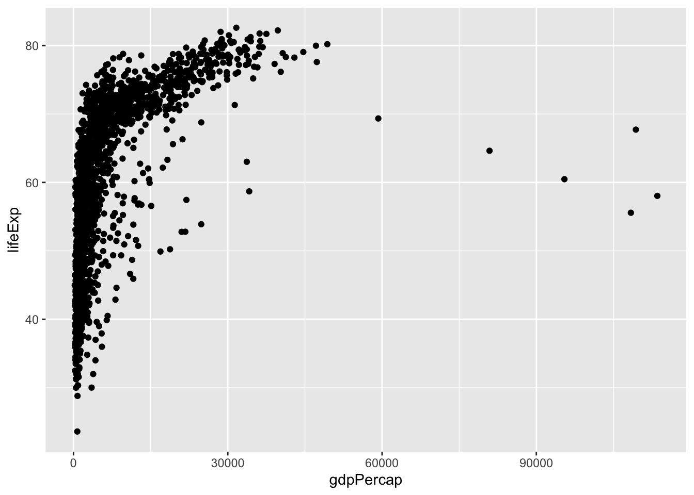
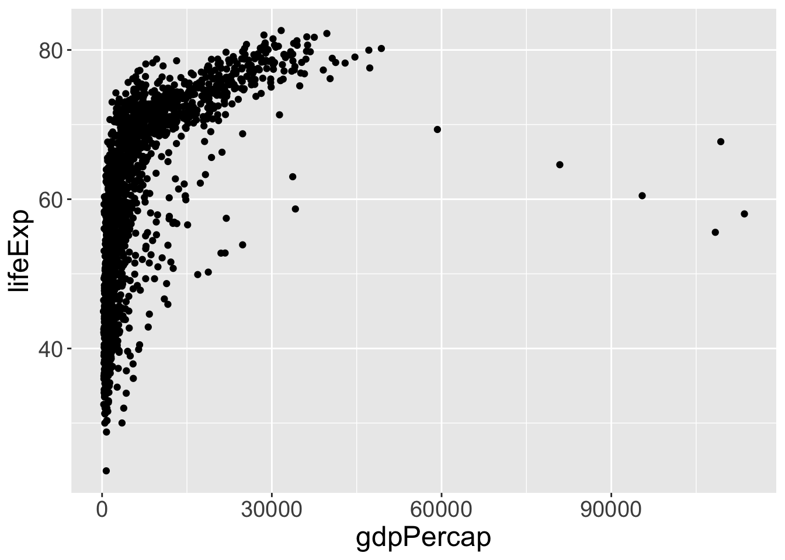
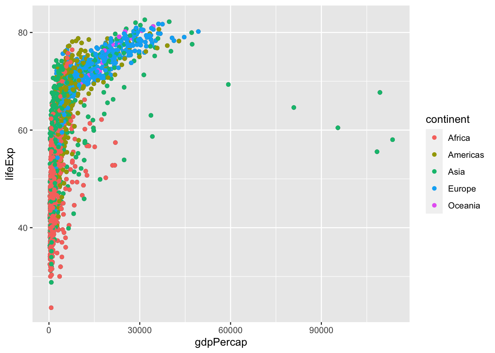
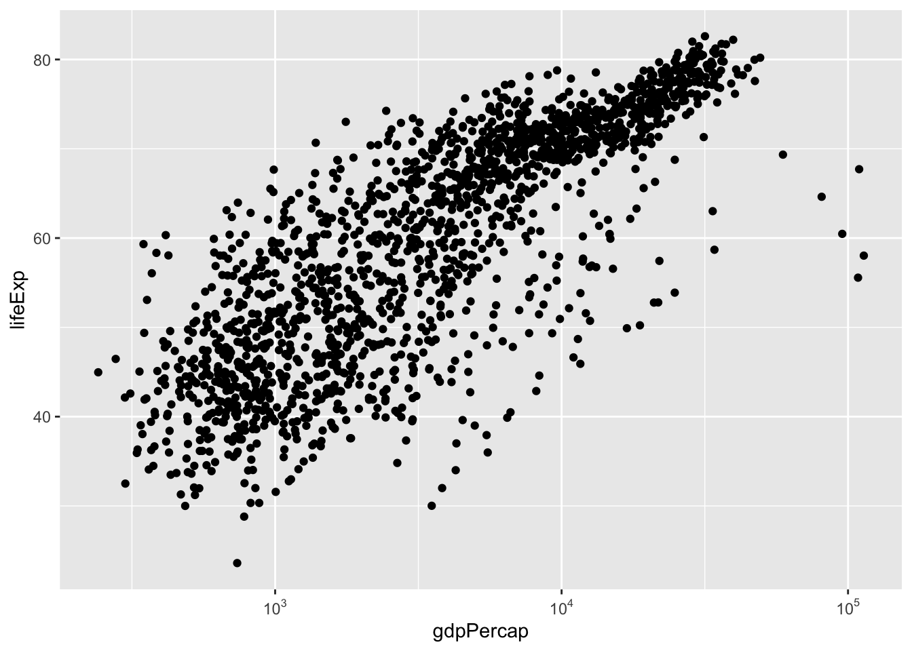

# Making your first plot {#first-plot}


## Goals

In this lesson I will show you how to create a basic plot and then demonstrate a sequence of  refinements to the plot.

Your [task](#task-b2) for this lesson is repeat the steps demonstrated here or in the accompanying video. Refer to [Healy Section 2.6](https://socviz.co/gettingstarted.html#make-your-first-figure) for a different basic plot.

## Introduction

In this lesson you will start to learn how to use ggplot to visualize data. There is one simple example with several exercises, designed to make the essentials clear in your mind. All plots share the three features explained below, but many plots we draw later in the course are much more complex. 

You can read these notes as a static document in a web browser, but it's better to download the R markdown file [here](https://raw.githubusercontent.com/AndrewIrwin/data-visualization/master/105-first-plot.rmd), open it in Rstudio, and edit the examples as you read.

## Required elements for a plot

You need three elements to make a plot using ggplot:

* data, in the form of tidy data (a data frame or tibble in the language of R)
* a mapping from variables in the data to features on the graph (e.g., position on the x- or y-axis, colour, shape, size)
* the kind of graph to draw, such as a scatter plot, histogram, or bar chart.

## Your first plot

We will use the `gapminder` data, which must be installed as part of the `gapminder` package and is adapted from the data at gapminder.org.

The function to create a plot is `ggplot`. You must specify the data (`gapminder`) and the mapping between various columns of the data and the features of the graph. Once these basics are established, we add (`+`) one thing to the graph: an instruction to place a symbol at each x, y combination using the "geometry" `geom_point`.

We'll have a lot more to say about how data are organized in tables later, but for now you can look at the data by typing `View(gapminder)` in the Rstudio Console.


```r
library(gapminder)
library(ggplot2)
ggplot(data = gapminder, 
       mapping = aes(y=lifeExp, x=gdpPercap)) +
  geom_point()
```



## Improving your plot

We're going to revise the plot by building on these instructions. I'll repeat the instructions above, but instead of displaying the figure, I will store the result in a variable (conventionally called `p` for plot to keep it simple, but you can use any name you like.) This will simplify the examples to follow, highlighting what makes each example different.


```r
p <- ggplot(data = gapminder, 
       mapping = aes(y=lifeExp, x=gdpPercap)) +
       geom_point()
```

Add better labels to your plot using `labs` and `x`, `y`, `title`, `subtitle`, `tag`. My example has placeholder text. Get the R markdown file from [here](https://raw.githubusercontent.com/AndrewIrwin/data-visualization/master/105-first-plot.rmd) and revise the figure to show sensible text in these spaces.


```r
p + labs(title="Title here",
         subtitle="A subtitle",
         x="x axis label",
         y="y axis label",
         caption="A caption.",
         tag="A.")
```


Almost everyone makes the text on their figures too small. How small is too small is obviously a matter of judgement, but it depends on your age (and vision), the medium (on screen for yourself, on a website, in a presentation, printed on paper), and whether the figure is made by you for you, or if you are trying to reach a wider audience. It's essential to know how to make text bigger! Many visual aspects of a ggplot can be controlled as part of the `theme`; we will introduce these gradually throughout the course and summarize some of the most important themes in a lesson near the end of the course.


```r
p + theme(text = element_text(size=18))
```



Let's make a simple use of colour. There are many countries, so that's not a good choice for a colour feature -- there will be too many to distinguish. Let's colour points by continent. All we need to do is to link the variable `continent` to the colour aesthetic.


```r
p + geom_point(aes(color=continent))
```



Gross domestic product varies widely across countries. The uneven spread over the x-axis makes the visualization hard to read. It's got a couple of other features, notably the fact that it is always bigger than 0 and that we tend to be interested in multiplicative comparisons, that mean a log-transformation makes a better plot. (This is debatable if you are not used to reading or noticing log scales. Log scales are very useful and well worth the trouble to learn about, so put that on your "to do list" if you haven't learned how to read them yet.) ggplot makes changing the scale farily easily, at least for a few special cases. The stuff in brackets after `scale_x_log10` is optional and makes the labels look a bit prettier. (Notice we're using a function from a new package here.)


```r
library(scales)
p + scale_x_log10(labels = trans_format('log10', math_format(10^.x)))
```



This formatting of the numbers on the x-axis is a bit tricky to get right and to explain. In fact its the sort of thing you might keep in a file of examples if, like me, you really don't like to see $10^3$ formatted as $1.0e3$. (Try `labels = scientific` to see this other format.)

## Exercises

* Combine several features of the examples above into one example: colour, log scale on the x axis, better axis labels and titles, and of course changing the text size.
* Repeat these examples using variables of your choice from the `penguins` data from the package `palmerpenguins`

## Further reading

* [Healy Section 2.5-2.6](https://socviz.co/gettingstarted.html#gettingstarted)
* For more on aesthetics and mappings from data to visualizations, see [Wilke Chapter 2](https://clauswilke.com/dataviz/aesthetic-mapping.html)
