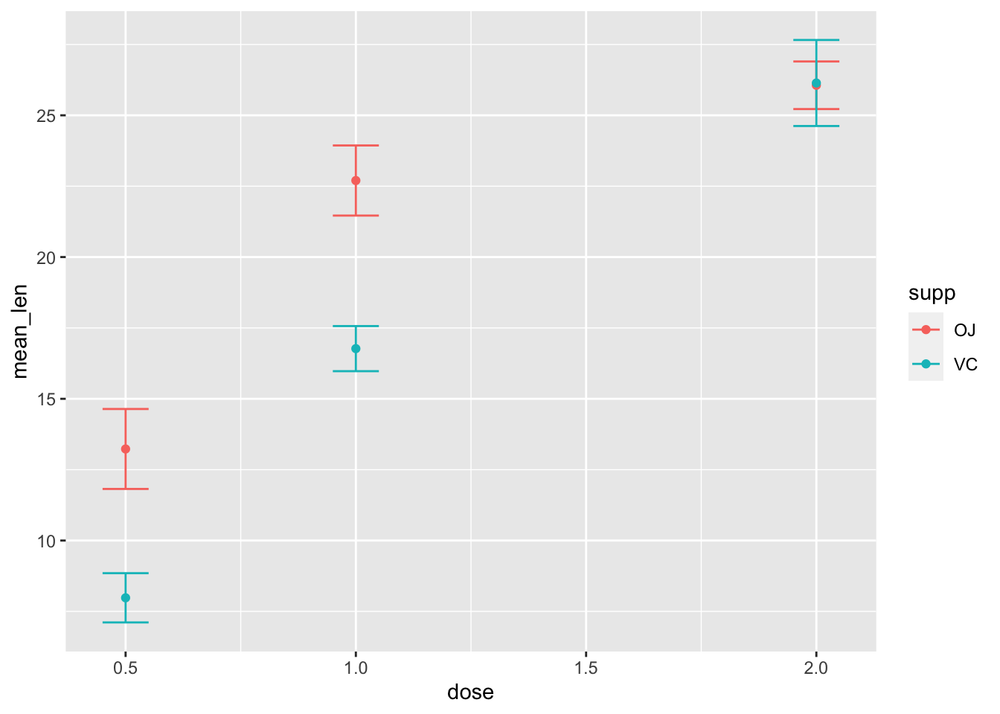

# Getting help and asking questions {#help}


When you are learning a new subject or skill, you will have a lot of questions. Detailed questions about a particular skill. General questions about a topic. Big-picture questions about how to apply the material. Not knowing where to begin, how to make progress, or what questions to ask!

Regardless of the question, asking questions well is a [superpower](https://jvns.ca/blog/2014/06/13/asking-questions-is-a-superpower/). Why? A question is a way of crystallizing the uncertainty in your mind about a specific topic. The more specific your question, the easier it is to answer, and the more likely it is that the response will be helpful to you. Often carefully posing a question will lead you to the answer yourself. Broad general questions are valuable too, primarily because they help you develop and organize more questions. Asking questions of yourself and struggling to answer them is an important part of learning and thinking.

## Asking questions to learn

Here are some examples of questions I've asked myself about R and data visualization:

* How do I add error bars to a scatter plot?
* How do I customize the colours on a plot?
* How do I change axis labels?    

Now I'll show you the steps I recommend to answer these questions. If you have no idea how to solve the problem, these steps will take you a while and you may need to ask someone for help. If you have solved the problem once before, it will be easier the second time, because you will remember part of the solution. If you have solved the problem several times, the same steps are useful, but you may only need a hint to remember the answer.

### Start with google

If I have no idea how to solve a problem, I go to google. It's often good to add "R" or "tidyverse" or "ggplot" to your search query. Here are a few searches that I've found helpful for the questions above:

* [error bars](https://www.google.com/search?q=ggplot+error+bars)
* [plot colours](https://www.google.com/search?q=ggplot+custom+plot+colours)
* [axis labels](https://www.google.com/search?q=ggplot+axis+labels)

I look for a link on the first page or two that uses a reference I've found helpful. I like the `tidyverse` and `ggplot2` documentation, the "R Graph Gallery" and some online courses (one a UBC linked below.)

Using the incognito mode in google to get results not influenced by my search history I recommend the following starting places (lots of the other links you'll find are fine too):

* [error bars](http://www.cookbook-r.com/Graphs/Plotting_means_and_error_bars_(ggplot2)/)
* [plot colours](https://www.stat.ubc.ca/~jenny/STAT545A/block17_colorsGgplot2Qualitative.html)
* [axis labels](https://ggplot2.tidyverse.org/reference/labs.html)

### Find an example

The web pages I find most helpful have lots of examples. Sometimes I realize that there are many ways to interpret the idea in my head and the examples help me figure out what I really want. I will often search three or more google links until I find an example I like -- the output looks right and the code doesn't look too complicated.

### Look at the documentation

The link for axis labels I picked above is just the help page for `labs`. You can see it by typing "labs" into the help search box on Rstudio. But maybe you didn't know to search for "labs" -- that's where google helps.

R help pages all have the same format and the part most useful to beginners is the "Examples" section at the bottom. Cut and paste some examples from the help page for "labs" into the console to see how the function works.

### Reproduce an example

Cut and paste an example from a help page or web page into your R session. If it doesn't work right away, check that (a) you have installed the package and typed the required "library()" function, and (b) you have defined any objects needed for the task -- sometimes these are defined near the top of a web or the examples on a help page. For example, on the "labs" help page, the first example creates a plot and stores it in the object called `p`. If you skip that first part of the example, the rest of the examples won't work.

### Modify the example

Test your understanding by modifying the example a little bit. If it does more than you need, try removing parts you don't want. This is the same skill I suggest for every lesson in this course -- experiment with some code that works to minimize frustration.

Gradually turn the example into what you want, changing one feature at a time. Using your data instead of the data in the example. Using your preferences (colours, font size, text for titles, etc.).

### Make notes to explain the solution

I strongly suggest you keep your experiments and notes in a separate R markdown file, then call it something  appropriate ("drawing-errorbars") and put it in a folder called something like "examples". Knit the document before moving on to be sure it works and is complete.

## Example: learning how to draw error bars

* Skim the [R cookbook](http://www.cookbook-r.com/Graphs/Plotting_means_and_error_bars_(ggplot2)/) page
* The data are fine -- some quantitative data and categorical data for grouping
* The first plot looks like what I want, at least approximately!
* Uh oh! I need a variable called `tgc` which is created from `ToothGrowth` (part of R) using a function `summarySE` (which I don't have.)
* Reading more, I see `summarySE` is defined near the bottom of the page. It looks complicated! Think a bit.
* Cut and paste the function definition, look at the result. I see. I just need to use `group_by` and `summarize` to compute means, sample sizes, and `qt` (it looks up a value in a t-table)
* I make a version of `summarySE` myself just to be sure I understand what it does. Mine is simpler -- it just does the calculation instead of creating a new function. Making a simpler example is a great way to understand what the more complicated version does. 


```r
my_summarySE <- ToothGrowth %>% group_by(supp, dose) %>%
    dplyr::summarize(N = n(),
              mean_len = mean(len),
              sd = sd(len),
              se = sd / sqrt(N),
              ci = se * qt(0.975, N-1))
```

```
## `summarise()` has grouped output by 'supp'. You can override using the `.groups` argument.
```

Great -- this produces the same output as `summarySE(ToothGrowth)`. (I used a different name for the mean column because I need `len` to compute the standard deviation after I compute the mean. If you use the function from the help page and write `summarize` above instead of `dplyr::summarize` you'll get an error because the example uses the `plyr` package that has a different definition of `summarize`. I've bumped into that error a lot, so I recognize it right away. It might stump you the first time you experience it.)

* Cut and paste the example, modified to use my data (`mean_len` instead of `len`):


```r
ggplot(my_summarySE, aes(x=dose, y=mean_len, colour=supp)) + 
    geom_errorbar(aes(ymin=mean_len-se, ymax=mean_len+se), width=.1) +
    geom_line() +
    geom_point()
```


Get rid of the lines, becasuse I don't want them. 


```r
ggplot(my_summarySE, aes(x=dose, y=mean_len, colour=supp)) + 
    geom_errorbar(aes(ymin=mean_len-se, ymax=mean_len+se), width=.1) +
    geom_point()
```



Now, drop in my favourite data, the palmer penguins, making only the changes that are absolutely necessary. I had the overlapping points problem mentioned on the help page, so I borrowed it's `position_dodge` idea. I also noticed that the web page used `se` instead of the larger `ci` to draw the error bars, so I changed that too.


```r
library(palmerpenguins)
my_summarySE <- penguins %>% na.omit() %>%
  group_by(species, island) %>%
    dplyr::summarize(N = n(),
              mean_mass = mean(body_mass_g),
              sd = sd(body_mass_g),
              se = sd / sqrt(N),
              ci = se * qt(0.975, N-1))
```

```
## `summarise()` has grouped output by 'species'. You can override using the `.groups` argument.
```

```r
pd <- position_dodge(0.2) # move them .05 to the left and right
ggplot(my_summarySE, aes(x=species, y=mean_mass, colour=island)) + 
    geom_errorbar(aes(ymin=mean_mass-ci, ymax=mean_mass+ci), width=.1, position = pd) +
    geom_point(position=pd)
```


## Asking question in this course

Asking good questions can be challenging, especially in asynchronous learning. In a classroom, it's fairly easy: Can you give another example? Why did you do that calculation? What does the answer mean? Many questions you might ask in person don't translate well to other contexts: email, office hours, or online forums, because the immediate context of group discussion is missing. So it's up to you to add that context when you ask a question.

Here I describe several different ways to get answers to your questions. Knowing which method to use is itself a skill, so I provide some guidance for that as well.  It's important to ask questions -- and [I want you to ask questions](https://jvns.ca/blog/2014/04/04/ask-if-you-have-questions-isnt-enough/), so much that you should consider it part of your assigned work to formulate questions.


### Starting out

At the start of the course you will have a bunch of computer tasks (installing R and Rstudio, installing R packagesm understanding the basics of Rstudio, working with git and github). These will range from easy to difficult depending on your previous experience. I have tried to provide written and video information to guide you, but if you get stuck on any of these, or the work associated with a "task" at any point in the course, ask for help right away. 

### Learning R basics

As you start to write R commands and make R markdown documents you will encounter problems arising from typos (forgetting, or not knowing where to place) commas, brackets, backticks, quotation marks, pipes (%>%), and many other bits of [syntax](https://en.wikipedia.org/wiki/Syntax_(programming_languages)) necessary for communcation with the computer. The error messages will frequently be hard to decipher. The best way to learn to solve these problems is the following: take a working R markdown document or example of R code and change it slightly. Make a prediction of what will happen and then get the computer to process the code. Compare what happens to what you predicted. Do this regularly until you can reliably predict outcomes of any changes you can think of. This is "playing computer" in your head -- try to understand how it will react to your input. When something happens that you don't understand: ask someone why. Describe what you did, what you thought would happen, and what really happened.

### Problem solving

Once you have developed some fluency for working with R, you will start to learn to solve problems. This means that you are trying to accomplish a data visulization task, such as make a single plot, use colour in some way, change the kind of plot, add text to an axis, or thousands of other tasks. At the start you will be just doing tasks I've given you and later on you will be trying to achieve your own goals by solving problems. The method described above is useful here: when you have a working example, change it in some way and predict the result. Make changes that you think will lead to good outcomes, but also make playful or "silly" changes that will lead to poor quality graphs but still help you learn to use the tools. This kind of experimentation is essential for develop a robust and accurate mental model of how R (or any other) computer software works.

### Learning new methods R

The tools available within R are so extensive that you can never learn them all by being taught by a course or a textbook or a website. To really master R you need to learn how to learn new tools.

R functions have **help pages** -- accessed from the help tab in Rstudio or by prefacing the function with a '?' in the R console. These help pages have a very specific style and require practice to [learn how to read them](https://socviz.co/appendix.html#a-little-more-about-r). One of the best features of the help page, especially when you are starting out, is the examples at the bottom of the page. Usually these can be simply cut and pasted into the console and you can observe the results to see how the function author intended them to be used.

Many R packages have **vignettes**. These are extended documents intended to explain how to use a key feature of the package. You can find the vignettes on the web page where you found the software (CRAN or github) or using the vignette function. Read the help page -- and especially the examples -- to see how to use the `vignette` function.

We are focussing on the tidyverse set of packages. The [tidyverse](https://www.tidyverse.org/) website contains help, examples, and reference documentation for these packages. These web pages combine the features of [books](https://www.tidyverse.org/learn/), tutorials, vignettes, and help pages. All are worth your time! Keep an eye out for [cheatsheets](https://rstudio.com/resources/cheatsheets/) that are especially helpful after you learn the basics of a package.

One of the many reasons we are using git and GitHub in this course is that it will make it easier for you to ask me a question. If you have a problem with an R markdown document or making a function work the way you think it should or you just don't know how to interpret the results of a calculation, you can ask me. But how do you know how much information to give me? And how do you make that easy? Send an email with the question -- what are you trying to do, what is the problem or error message, and why do you think might be going wrong. Or, you can put the computer code into an R markdown document, commit the changes to your project, and push it to Github. Then tell me the name of the repository and file and I'll have the full set of code that lead to your problem. That will make it much easier for me to help you. (Note that I can only see private repositories that we both have access to, for example course work repositories. So use those repositories to share files and ask questions.)


## Solving computer problems ("Debugging")

There are two kinds of computer problems,

* your code does something, but not what you want, and
* your code gives you and error, no result, and you don't know why.

Both problems can be frustrating, but the second kind is especially difficult when you are starting out.

There are sophisticated tools for debugging in R, but we won't discuss them in this course. 

My recommendation for both kinds of problem is the same: simplify what you are doing until something works and you understand what is going on. Then add one step at a time. If you are adapting code you found somewhere, make sure the original example works. Develop a "mental model" of what the computer is doing, and test it by modifying your code. Be creative and relaxed. Try hard not to get frustrated! Errors are a really important part of learning -- they help you develop deeper and more powerful understanding of the tools you are trying to use.


### Suggestions for asking questions

A few [suggestions](https://jvns.ca/blog/good-questions/):

-   Explain the context (is this about material from a video, the course notes, an assignment -- which one?, or just something that you are wondering about)

-   Say what you know (the topic is X, or the question asks for Y)

-   Say what you are trying to do (understand an argument, perform a calculation, fix an error in code)

-   Say what you think comes next or where you think you are stuck (I'm trying to figure out X, I don't know why the plot looks like Y)

### Asking a complete question

If you are trying to solve a problem with R, and the code is not working as you expect, make the smallest possible example of the problem that you can. This is called a "reproducible example" -- meaning that the person you are asking for help can make the problem repeat on their computer. There is an R package to help you create these examples called [reprex](https://www.tidyverse.org/help/#reprex), but you don't need to do this in our course.

The reprex function tests your code to see if you've included all the necessary to enable someone else to understand your code. This includes which libraries you are using and any variables that must be defined. Select your code that demonstrates the problem, then copy it to the clipboard. Type `reprex()` in the R Console. If your example is complete, it will appear in the preview window on the lower right. This can be cut and pasted into an email.

### What does this unknown function do?

There is another important kind of question -- what does `an-unfamiliar-R-function` do? This is a bit easier since you don't need to translate a goal into a question about R, you just need to figure out what the function does.

You might be wondering what `position_dodge` does. It's fairly obvious from the step-by-step example, but try to figure out by reading the help page. It's a bit hard to understand, but you should be able to get that it is a function that moves (dodges) the horizontal position of a point, error bar, or other geom.


## How to learn material in this course

The course goals are summarized in the [welcome](#goals) to the course. One of the most important is learning how to learn to use new tools for data visualization. This sort of learning is [hard](https://jvns.ca/blog/2018/09/01/learning-skills-you-can-practice/) but very worthwhile. It's also a great transferrable skill. If you can master the material in this course and learn how to keep learning, you'll be able to apply what you learned to a wide range of computing skills.

## Getting help

* [R studio tips](https://www.pipinghotdata.com/posts/2020-09-07-introducing-the-rstudio-ide-and-r-markdown/) presented as animated GIFs
* Learning resources from [R studio](https://education.rstudio.com/learn/beginner/)

## More advanced help

* [What they forgot to teach you about R](https://rstats.wtf/index.html)
  * including [Debugging tools](https://rstats.wtf/debugging-r-code.html)

