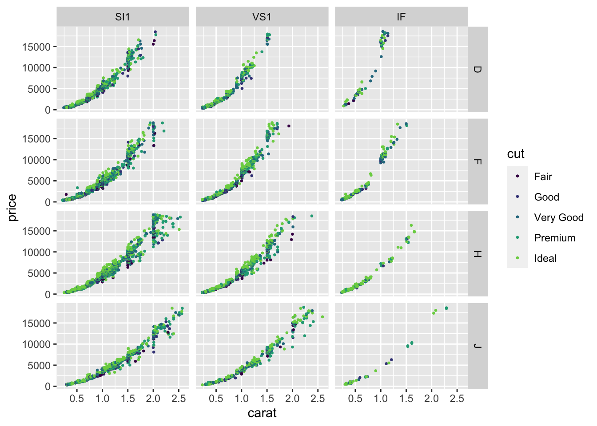

# Facetted graphs {#facets}


When a plot has too much data, or you want to emphasize a particular comparison across categories or numerical values, it is often a good idea to split the graph into several subplots. Like any method, this can be overdone, for example by producing a complex array of too many plots that distract and confuse the reader. Done well, the multiple plots let patterns jump off the page.

Making a sequence or array of similar plots goes by a variety of names: small multiples, a lattice, or facets. We'll call them facets because that's the name ggplot uses.

Facetted plots are often useful with datasets that have one or more categorical variables and lots of observations. We'll use the `diamonds` dataset because, as we've seen, variation across . Let's start by using `glimpse` to see what's there.


```r
glimpse(diamonds)
```

```
## Rows: 53,940
## Columns: 10
## $ carat   <dbl> 0.23, 0.21, 0.23, 0.29, 0.31, 0.24, 0.24, 0.26, 0.22, 0.23, 0…
## $ cut     <ord> Ideal, Premium, Good, Premium, Good, Very Good, Very Good, Ve…
## $ color   <ord> E, E, E, I, J, J, I, H, E, H, J, J, F, J, E, E, I, J, J, J, I…
## $ clarity <ord> SI2, SI1, VS1, VS2, SI2, VVS2, VVS1, SI1, VS2, VS1, SI1, VS1,…
## $ depth   <dbl> 61.5, 59.8, 56.9, 62.4, 63.3, 62.8, 62.3, 61.9, 65.1, 59.4, 6…
## $ table   <dbl> 55, 61, 65, 58, 58, 57, 57, 55, 61, 61, 55, 56, 61, 54, 62, 5…
## $ price   <int> 326, 326, 327, 334, 335, 336, 336, 337, 337, 338, 339, 340, 3…
## $ x       <dbl> 3.95, 3.89, 4.05, 4.20, 4.34, 3.94, 3.95, 4.07, 3.87, 4.00, 4…
## $ y       <dbl> 3.98, 3.84, 4.07, 4.23, 4.35, 3.96, 3.98, 4.11, 3.78, 4.05, 4…
## $ z       <dbl> 2.43, 2.31, 2.31, 2.63, 2.75, 2.48, 2.47, 2.53, 2.49, 2.39, 2…
```

As a consequence of years of relentless advertising, you may be aware of four widely reported characteristics of diamonds that influence their price: cut, colour, clarity, and carats. Let's make a plot of price vs carets (mass) showing all the data. Since there are so many points, we will make each point smaller.


```r
p1 <- diamonds %>% ggplot(aes(x=carat, y=price, color=cut)) + geom_point(size=0.4)
p1
```


## Facets indexed by one variable

If you want to display many levels of a categorical variable across many facets, the `facet_wrap` function is available. We'll do this here for just one colour using `filter` to select it. The `facet_wrap` function requires you to give a "formula" for how the facets are constructed. Here we write `~ clarity` meaning that the levels of the categorical variable `clarity` is used to facets. One facet is drawn for each value of the variable and only points with that value of clarity are shown on the corresponding facet.


```r
diamonds %>% 
  filter(color %in% c("F")) %>%
  ggplot(aes(x=carat, y=price, color=cut)) + 
  geom_point(size = 0.4) +
  facet_wrap( ~ clarity) 
```


Notice that the x and y scales are the same on each facet. A single colour scale is used for `cut` and this is the same for each facet as well. We can see that there is a similar non-linear relationship between price and carat on each panel. The price is higher at any particular size (carat) in the panels near the bottom compared to the panels near the top. Cut makes a compartively small difference to the price. 

## Facets indexed by two variables

If you want to look at the effect of two categorical variables across different facets, you can arrange them in a grid. Again we use a formula, but now we put the variables for the "y" axis of facets on the left side of `~` and the variables determining the `x` axis of the facets on the right.


```r
p1 + facet_grid(color ~ clarity)
```


The plots in those facets are really small. Let's pick out just a few colours and clarity values to make a plot that is easier to read. 


```r
diamonds %>% 
  filter(color %in% c("D", "F", "H", "J"), 
         clarity %in% c("SI1", "VS1", "IF")) %>%
  ggplot(aes(x=carat, y=price, color=cut)) + 
  geom_point(size=0.5) +
  facet_grid(color ~ clarity) + 
  scale_colour_viridis_d(begin=0, end =0.8) 
```



## Compositing

If you want to combine graphs together into a grid layout, but the graphs don't share axes or even data, then it may be easier to draw the graphs separately and then combine them together into a layout with the `patchwork` package. This package is both simple to use and quite powerful, enabling complex layouts, labelling subplots with codes to aid identification, and combining guides for colours and shapes across panels. The [documentation](https://patchwork.data-imaginist.com/) is excellent.

Here is an example showing two plots with very different views of the `gapminder` data. It's usually best to create the plots one at a time, assign them to a name in your R environment using `<-` and a name for each plot, then put them together using `+` from the `patchwork` package.


```r
library(patchwork)
p1 <- gapminder %>% 
  filter(year == max(year)) %>% count(continent) %>% 
  ggplot(aes(x=continent, y = n, fill=continent)) +
  geom_col(show.legend = FALSE) +
  labs(y = "Number of countries") 
p2 <- gapminder %>%
  ggplot(aes(x= year, y = lifeExp, color = continent)) + 
  geom_jitter(size = 0.5)
p1 + p2 
```


You can make complex layouts, collect legends from multiple panels together, and label panels with patchwork. Read the documentation if you want to learn more.


## Further reading

* The [ggplot book](https://ggplot2-book.org/facet.html) has a longer tutorial on using facets.
* The [R cookbook](http://www.cookbook-r.com/Graphs/Facets_(ggplot2)/) has more examples of facetted plots, including instructions for chaging the way the facets are labelled.
* The [patchwork](https://patchwork.data-imaginist.com/) documentation can help you with many more tasks.
* The [cowplot](https://cran.r-project.org/web/packages/cowplot/vignettes/introduction.html#:~:text=The%20cowplot%20package%20is%20a,or%20mix%20plots%20with%20images.) package package is designed to help with many plotting tasks, including combining many figures into one using `plot_grid`. "cow" stands for Claus O Wilke, the author of one of our textbooks.


