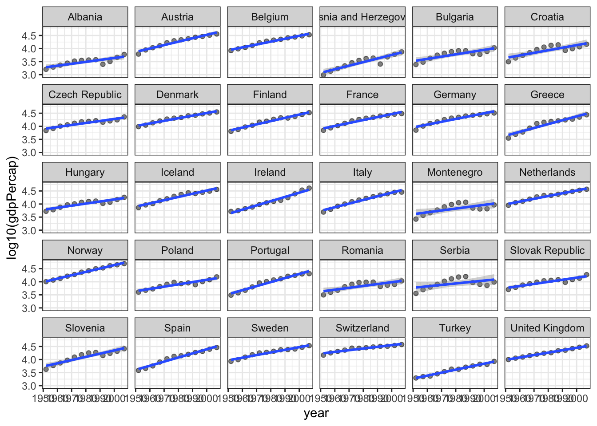

# Working with models {#working-models}


So far we have focussed on a few aspects of data visualzation: 

* making graphical displays of data,
* transforming and summarizing data,
* displaying data and summaries as tables and figures.

Models are another way to condense data or highlight patterns. Models are sometimes used for statistical inference, but that's not our focus in this course. We will use models as tools for adding features to a visualization.

R can be used to make a huge number of models. We will look at two broad classes over six lessons:

* regression and smoothing of one variable as a function of another, and
* transforming, simplification, and grouping of observations in data with many (more than 2) variables.

## Adding smooths to a visualization

In this lesson we will focus on visualizing models that smooth data. 
In the next two lessons we will take a closer look at these models, in particular getting diagnostic information about model fits and making data frames with quantitative output from the models.

First, we'll take a subset of the gapminder data and make a simple scatterplot.


```r
gp <- gapminder %>% filter(continent == "Europe")
p1 <- gp %>% ggplot(aes(x = year, y = log10(gdpPercap))) +
  geom_point(alpha = 0.5) + theme_bw()
p1
```


Now we will add some lines to highlight trends in the data.

First use linear regression to add a straight line.


```r
p1 + geom_smooth(method = "lm", formula = y ~ x)
```


We can change the formula to other curves. If you want a smoothed line that follows the data, use a [B-spline](https://en.wikipedia.org/wiki/B-spline) with degree 3 (cubic).


```r
p1 + geom_smooth(method = "lm", 
                 formula = y ~ splines::bs(x, df=5, degree=3))
```


Another way to describe a cubic spline is with a generalized additive model (or GAM). This model is quite a bit more sophisticated than the previous spline. Depending on the data, the model fitting process will add or remove oscillations ("wiggles") from the curve.


```r
p1 + geom_smooth(method = "gam", 
                 formula = y ~ s(x, bs = "cs"))
```


Another data smoothing method is called [LOESS](https://en.wikipedia.org/wiki/Local_regression) (locally estimated scatterplot smoothing) which does not require you to describe a model (line, cubic spline, etc.) for the data. Instead the model takes small subsets of the data along the independent variable and makes many models (usually first or second degree polynomials) and joins them together.


```r
p1 + geom_smooth(method = "loess",
                 formula = y ~ x)
```


As a final example we can try quantile regression.  This will make lines to approximate a specific quantile (10%, 50%, 90% are shown below) instead of a mean. This might be a good idea for these data in particular since for each year we have a range of countries spanning a large distribution of GDP per capita, so the analysis allows us to see how the short, median, and long life expectancies have changed over time. The slope of the 10 and 90 percentiles seems to be very similar, but the median life expectancy has increased faster, as countries have shifted from low life expectancy to high life expectancy.


```r
p1 + geom_quantile(formula = y ~ x, 
                   method = "rq", 
                   lambda = 1, quantiles = c(0.1, 0.50, 0.90))
```


## Putting several models on a single plot

In this example I'll show you how you can plot more than one smooth on the same plot (easily, but adding multiple smooths together with `+`) and how to add a legend and control the colours used for each line. You can learn more about colours on this [cheatsheet](https://www.nceas.ucsb.edu/sites/default/files/2020-04/colorPaletteCheatsheet.pdf) and you can get a list of all colour names with the function `colors()`.


```r
p1 + geom_smooth(method = "lm", 
                 formula = y ~ x, 
                 aes(color = "Linear", fill = "Linear")) +
  geom_smooth(method = "loess", 
              formula = y ~ x, 
              aes(color = "LOESS", fill = "LOESS")) + 
  scale_color_manual(name = "Smooth",  
                     values = c("salmon", "limegreen" ) ) + 
  scale_fill_manual(name = "Smooth", 
                    values = c("salmon", "limegreen" ) ) + 
  theme(legend.position = "top")
```


## Smooths on facetted plots

Smoothing works really easily on facetted plots. Simply adding a facet function to a plot will make a different smooth for each facet.

We will make lots of facets, one for each country, and add a smooth to each panel.


```r
p1 + facet_wrap(~country) +
  geom_smooth(method = "lm",
              formula = y ~ x)
```



This is not an ideal facetted plot -- there are too many facets (countries) and the text labels don't fit well in the space available. You might draw a plot like this for yourself to explore the data and plan an analysis or other plot.

## Summary

You've learned how to add linear regressions (`lm`), and smooths (`gam`, `loess`) to plots.


## Further reading

* In the next lesson we look at linear models in a bit more detail, showing how to extract residuals, predictions, and confidence intervals.
* Healy [Chapter 6 Working with models](https://socviz.co/modeling.html#modeling)
