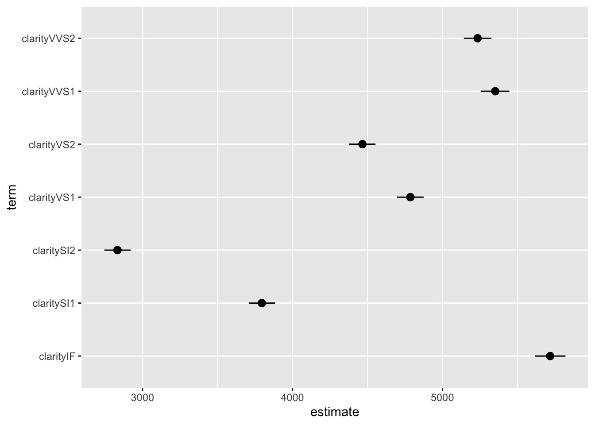
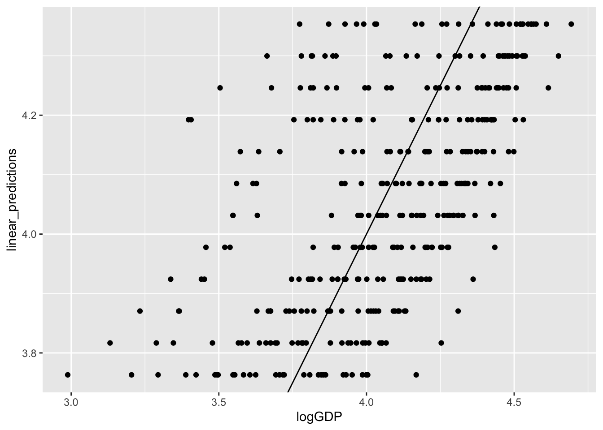
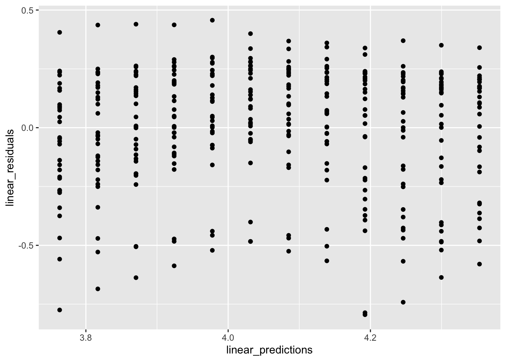

# Linear models {#linear-models}


Linear regression is a powerful technique for finding a line that approximates a set of data. For the approximation to be a good one, the linear model must be appropriate for the data, which can sometimes be determined by reasoning about the processes that generate the data, and is sometimes justified based on statistical properties of the data. We will use linear models as a tool without elaboration of the methods or theoretical background; you should learn about those in a different statistics course.

We will explore how to create a linear model, which can include a lot more than straight lines, and then discuss how to add those models to a visualization.

## Making linear models

We will always make linear models with variables from a data frame. Designate one variable the response variable, which we will attempt to predict using one or more other variables, called predictors. You are not restricted to variables in your data frame; you can transform the variables first, for example by squaring, taking logarithms, or applying some other function. Additionally, you can use categorical (or factor) variables as predictors and in combination with quantitative variables. Be aware that the more variables or transformations you add to your list of predictors, the more likely they will be correlated and your model will be very hard to interpret. These issues are discussed in statistics courses on regression.

Once your data frame is created, write the linear model as a "formula" object, meaning as an equation but with a `~` instead of an `=` to indicate that you are modelling the left hand side and allowing for a specific model for the mismatch between predictors and response.

We have seen that the price of a diamond increases a bit faster than linearly as the mass of the diamond increases, we will try both a linear model and a quadratic model for data in the `diamonds` dataframe.


```r
linear_model1 <- lm(price ~ carat, data = diamonds)
summary(linear_model1)
```

```
## 
## Call:
## lm(formula = price ~ carat, data = diamonds)
## 
## Residuals:
##      Min       1Q   Median       3Q      Max 
## -18585.3   -804.8    -18.9    537.4  12731.7 
## 
## Coefficients:
##             Estimate Std. Error t value Pr(>|t|)    
## (Intercept) -2256.36      13.06  -172.8   <2e-16 ***
## carat        7756.43      14.07   551.4   <2e-16 ***
## ---
## Signif. codes:  0 '***' 0.001 '**' 0.01 '*' 0.05 '.' 0.1 ' ' 1
## 
## Residual standard error: 1549 on 53938 degrees of freedom
## Multiple R-squared:  0.8493,	Adjusted R-squared:  0.8493 
## F-statistic: 3.041e+05 on 1 and 53938 DF,  p-value: < 2.2e-16
```

```r
quadratic_model1 <- lm(price ~ poly(carat, 2), 
                       data = diamonds)
summary(quadratic_model1)
```

```
## 
## Call:
## lm(formula = price ~ poly(carat, 2), data = diamonds)
## 
## Residuals:
##      Min       1Q   Median       3Q      Max 
## -26350.0   -724.2    -35.9    445.8  12881.1 
## 
## Coefficients:
##                  Estimate Std. Error t value Pr(>|t|)    
## (Intercept)     3.933e+03  6.631e+00   593.1   <2e-16 ***
## poly(carat, 2)1 8.539e+05  1.540e+03   554.4   <2e-16 ***
## poly(carat, 2)2 3.757e+04  1.540e+03    24.4   <2e-16 ***
## ---
## Signif. codes:  0 '***' 0.001 '**' 0.01 '*' 0.05 '.' 0.1 ' ' 1
## 
## Residual standard error: 1540 on 53937 degrees of freedom
## Multiple R-squared:  0.851,	Adjusted R-squared:  0.851 
## F-statistic: 1.54e+05 on 2 and 53937 DF,  p-value: < 2.2e-16
```

```r
linear_model2 <- lm(price ~ carat + clarity + color, 
                    data = diamonds %>% mutate(clarity = factor(clarity, ordered=FALSE), 
                                               color = factor(color, ordered=FALSE)))
summary(linear_model2)
```

```
## 
## Call:
## lm(formula = price ~ carat + clarity + color, data = diamonds %>% 
##     mutate(clarity = factor(clarity, ordered = FALSE), color = factor(color, 
##         ordered = FALSE)))
## 
## Residuals:
##      Min       1Q   Median       3Q      Max 
## -17310.9   -678.0   -192.2    473.0  10313.2 
## 
## Coefficients:
##             Estimate Std. Error t value Pr(>|t|)    
## (Intercept) -6699.95      47.20 -141.94   <2e-16 ***
## carat        8856.23      12.10  731.86   <2e-16 ***
## claritySI2   2832.65      44.77   63.27   <2e-16 ***
## claritySI1   3795.47      44.50   85.30   <2e-16 ***
## clarityVS2   4466.10      44.69   99.93   <2e-16 ***
## clarityVS1   4785.79      45.40  105.42   <2e-16 ***
## clarityVVS2  5234.16      46.72  112.03   <2e-16 ***
## clarityVVS1  5351.85      48.03  111.42   <2e-16 ***
## clarityIF    5718.23      52.01  109.95   <2e-16 ***
## colorE       -216.45      18.53  -11.68   <2e-16 ***
## colorF       -314.92      18.72  -16.82   <2e-16 ***
## colorG       -509.09      18.33  -27.78   <2e-16 ***
## colorH       -985.01      19.49  -50.54   <2e-16 ***
## colorI      -1441.77      21.90  -65.84   <2e-16 ***
## colorJ      -2340.83      27.03  -86.60   <2e-16 ***
## ---
## Signif. codes:  0 '***' 0.001 '**' 0.01 '*' 0.05 '.' 0.1 ' ' 1
## 
## Residual standard error: 1170 on 53925 degrees of freedom
## Multiple R-squared:  0.914,	Adjusted R-squared:  0.9139 
## F-statistic: 4.092e+04 on 14 and 53925 DF,  p-value: < 2.2e-16
```

You can write the formulas for the regression lines using the `equatiomatic` package. (To get the equations formatted properly, you need to add `results='asis'` to the `{r}` line in your R markdown document. The equations display correctly in the knitted document, but are show as LaTeX code in the Rstudio preview.) At present this does not work correctly for functions with mathematical transformations like `log`, `exp`, `poly(x, 2)`, so I'll only show the linear models here.


```r
library(equatiomatic)
extract_eq(linear_model1)
```

$$
\operatorname{price} = \alpha + \beta_{1}(\operatorname{carat}) + \epsilon
$$

```r
extract_eq(linear_model2, wrap=TRUE)
```

$$
\begin{aligned}
\operatorname{price} &= \alpha + \beta_{1}(\operatorname{carat}) + \beta_{2}(\operatorname{clarity}_{\operatorname{SI2}}) + \beta_{3}(\operatorname{clarity}_{\operatorname{SI1}})\ + \\
&\quad \beta_{4}(\operatorname{clarity}_{\operatorname{VS2}}) + \beta_{5}(\operatorname{clarity}_{\operatorname{VS1}}) + \beta_{6}(\operatorname{clarity}_{\operatorname{VVS2}}) + \beta_{7}(\operatorname{clarity}_{\operatorname{VVS1}})\ + \\
&\quad \beta_{8}(\operatorname{clarity}_{\operatorname{IF}}) + \beta_{9}(\operatorname{color}_{\operatorname{E}}) + \beta_{10}(\operatorname{color}_{\operatorname{F}}) + \beta_{11}(\operatorname{color}_{\operatorname{G}})\ + \\
&\quad \beta_{12}(\operatorname{color}_{\operatorname{H}}) + \beta_{13}(\operatorname{color}_{\operatorname{I}}) + \beta_{14}(\operatorname{color}_{\operatorname{J}}) + \epsilon
\end{aligned}
$$

and you can fill in the results showing the numeric coefficients in the equations:


```r
extract_eq(linear_model1, use_coefs=TRUE, fix_signs=TRUE)
```

$$
\operatorname{price} = -2256.36 + 7756.43(\operatorname{carat}) + \epsilon
$$


```r
extract_eq(linear_model2, use_coefs=TRUE, terms_per_line = 3,
           fix_signs=TRUE, wrap=TRUE)
```

$$
\begin{aligned}
\operatorname{price} &= -6699.95 + 8856.23(\operatorname{carat}) + 2832.65(\operatorname{clarity}_{\operatorname{SI2}})\ + \\
&\quad 3795.47(\operatorname{clarity}_{\operatorname{SI1}}) + 4466.1(\operatorname{clarity}_{\operatorname{VS2}}) + 4785.79(\operatorname{clarity}_{\operatorname{VS1}})\ + \\
&\quad 5234.16(\operatorname{clarity}_{\operatorname{VVS2}}) + 5351.85(\operatorname{clarity}_{\operatorname{VVS1}}) + 5718.23(\operatorname{clarity}_{\operatorname{IF}})\ - \\
&\quad 216.45(\operatorname{color}_{\operatorname{E}}) - 314.92(\operatorname{color}_{\operatorname{F}}) - 509.09(\operatorname{color}_{\operatorname{G}})\ - \\
&\quad 985.01(\operatorname{color}_{\operatorname{H}}) - 1441.77(\operatorname{color}_{\operatorname{I}}) - 2340.83(\operatorname{color}_{\operatorname{J}})\ + \\
&\quad \epsilon
\end{aligned}
$$

These results are the jumping off point for a lot more exploration.

## Smoothing on facets

The `geom_smooth` function is especially powerful for facetted plots. The smooth is automatically computed and plotted for each facet separately. 


```r
diamonds %>% 
  filter(color %in% c("D", "F", "H", "J"), 
         clarity %in% c("SI1", "VS1", "IF")) %>%
  ggplot(aes(x=carat, y=price)) + 
  geom_point(aes(color=cut)) +
  facet_grid(color ~ clarity) + 
  scale_colour_viridis_d(begin=0, end =0.8) +
  geom_smooth(method = "lm", formula = y ~ poly(x,2),
              color = "black", size = 0.5) 
```


You can fit all these lines using `lm` as well, using color and clarity as variables in the regression equation. The way `facet_*` and `geom_smooth` combine together makes the visualization of these lines very easy.

Notice that I've moved the `color=cut` from the ggplot function to the `geom_point` function as the aesthetic for only the points. If the colour was specified in the first ggplot function, the `geom_smooth` would "inherit" this aesthetic mapping and would make a separate smooth for each cut (5 lines per panel). There are not enough data in some panels for some cuts to do a good job, so I revised the plot to only draw one smooth per facet. You should move the `color=cut` back to the ggplot call to see how the result changes.

## Robust regression

We demonstrated the importance of visualizing data at the start of the course by appealing to the example of Anscombe's quartet. This is a set of four data sets which all have the same means, standard deviations, and correlation. Here I'll show how to plot four lines on a single plot and how to avoid at least one of the problems with outliers by using robust regression from the `MASS` package. 

Robust regression is designed to be less influenced by outliers.
Robust regression is a big improvement for group 3, but has little effect on any of the other problems. (Try `formula = y ~ poly(x,2)` to fix panel 2. There is no fix for the problem in panel 4.)


```r
p1 <- anscombe %>%
 pivot_longer(everything(),
   names_to = c(".value", "set"),
   names_pattern = "(.)(.)"
 ) %>% ggplot(aes(x = x, y = y)) +
  geom_point() + 
  facet_wrap(~ set) 
# p1 + geom_smooth(method="lm") # Try this instead
p1 + geom_smooth(method=MASS::rlm) # , formula  = y ~ poly(x,2))
```


## Predicting quantiles

You can also try to predict quantiles of your data. Here we make a linear model for the 0.05, 0.50 (median), and 0.95 quantiles.


```r
diamonds %>% filter(cut == "Ideal", color == "G") %>%
  ggplot(aes(x=carat, y = price)) + 
  geom_point() +
  geom_quantile(method = rqss, formula = y ~ x,
                lambda = 1, quantiles = c(0.05, 0.5, 0.95))
```


## Quantitative model output

The `broom` package has functions to obtain model coefficients and compute residuals, predictions, and confindence intervals. Healy also shows how to use `broom` to fit many models (such as a model for each facet) in his [Section 6.6](https://socviz.co/modeling.html#grouped-analysis-and-list-columns), but I will skip those steps.

Get the coefficients (and standard errors, t-statistic, p-value and confidence intervals) from your model using `tidy`.


```r
tidy(linear_model1, conf.int = TRUE) %>% kable(digits = 1)
```

<table>
 <thead>
  <tr>
   <th style="text-align:left;"> term </th>
   <th style="text-align:right;"> estimate </th>
   <th style="text-align:right;"> std.error </th>
   <th style="text-align:right;"> statistic </th>
   <th style="text-align:right;"> p.value </th>
   <th style="text-align:right;"> conf.low </th>
   <th style="text-align:right;"> conf.high </th>
  </tr>
 </thead>
<tbody>
  <tr>
   <td style="text-align:left;"> (Intercept) </td>
   <td style="text-align:right;"> -2256.4 </td>
   <td style="text-align:right;"> 13.1 </td>
   <td style="text-align:right;"> -172.8 </td>
   <td style="text-align:right;"> 0 </td>
   <td style="text-align:right;"> -2281.9 </td>
   <td style="text-align:right;"> -2230.8 </td>
  </tr>
  <tr>
   <td style="text-align:left;"> carat </td>
   <td style="text-align:right;"> 7756.4 </td>
   <td style="text-align:right;"> 14.1 </td>
   <td style="text-align:right;"> 551.4 </td>
   <td style="text-align:right;"> 0 </td>
   <td style="text-align:right;"> 7728.9 </td>
   <td style="text-align:right;"> 7784.0 </td>
  </tr>
</tbody>
</table>

The second model has the effect of each level of clarity on price (relative to the base case of I1). Here's how we can plot the regression coefficients as dot plots with uncertainties using the output from `tidy`.


```r
tidy(linear_model2, conf.int = TRUE) %>%
  filter(str_starts(term, "clarity")) %>%
  ggplot(aes(y = term, x = estimate, xmin = conf.low, xmax = conf.high)) + 
  geom_pointrange()
```



This can also be done easily using `coefplot`:


```r
library(coefplot)
coefplot(linear_model2, sort = "magnitude", intercept = FALSE)
```


You can get statistics for the model using `glance`. We don't discuss these results, but if you have taken a statistics course with topics on regression you should recognize at least some of these results.    


```r
glance(linear_model1) %>% kable()
```

<table>
 <thead>
  <tr>
   <th style="text-align:right;"> r.squared </th>
   <th style="text-align:right;"> adj.r.squared </th>
   <th style="text-align:right;"> sigma </th>
   <th style="text-align:right;"> statistic </th>
   <th style="text-align:right;"> p.value </th>
   <th style="text-align:right;"> df </th>
   <th style="text-align:right;"> logLik </th>
   <th style="text-align:right;"> AIC </th>
   <th style="text-align:right;"> BIC </th>
   <th style="text-align:right;"> deviance </th>
   <th style="text-align:right;"> df.residual </th>
   <th style="text-align:right;"> nobs </th>
  </tr>
 </thead>
<tbody>
  <tr>
   <td style="text-align:right;"> 0.8493305 </td>
   <td style="text-align:right;"> 0.8493277 </td>
   <td style="text-align:right;"> 1548.562 </td>
   <td style="text-align:right;"> 304050.9 </td>
   <td style="text-align:right;"> 0 </td>
   <td style="text-align:right;"> 1 </td>
   <td style="text-align:right;"> -472730.3 </td>
   <td style="text-align:right;"> 945466.5 </td>
   <td style="text-align:right;"> 945493.2 </td>
   <td style="text-align:right;"> 129345695398 </td>
   <td style="text-align:right;"> 53938 </td>
   <td style="text-align:right;"> 53940 </td>
  </tr>
</tbody>
</table>

The `augment` function makes it easy to plot residuals and predicted values for many models (see `?augment`). We can use `augment` on the model object to get a data frame with the data used in the model plus fitted (predicted) values, residuals, and other quantities.  You can add the other data not provided in the model object by including `data = diamonds` in the augment function (output not shown.)
 

```r
augment(linear_model1, interval = "prediction") %>% head() %>% kable(digits = 2)
```

<table>
 <thead>
  <tr>
   <th style="text-align:right;"> price </th>
   <th style="text-align:right;"> carat </th>
   <th style="text-align:right;"> .fitted </th>
   <th style="text-align:right;"> .lower </th>
   <th style="text-align:right;"> .upper </th>
   <th style="text-align:right;"> .resid </th>
   <th style="text-align:right;"> .hat </th>
   <th style="text-align:right;"> .sigma </th>
   <th style="text-align:right;"> .cooksd </th>
   <th style="text-align:right;"> .std.resid </th>
  </tr>
 </thead>
<tbody>
  <tr>
   <td style="text-align:right;"> 326 </td>
   <td style="text-align:right;"> 0.23 </td>
   <td style="text-align:right;"> -472.38 </td>
   <td style="text-align:right;"> -3507.64 </td>
   <td style="text-align:right;"> 2562.88 </td>
   <td style="text-align:right;"> 798.38 </td>
   <td style="text-align:right;"> 0 </td>
   <td style="text-align:right;"> 1548.57 </td>
   <td style="text-align:right;"> 0 </td>
   <td style="text-align:right;"> 0.52 </td>
  </tr>
  <tr>
   <td style="text-align:right;"> 326 </td>
   <td style="text-align:right;"> 0.21 </td>
   <td style="text-align:right;"> -627.51 </td>
   <td style="text-align:right;"> -3662.78 </td>
   <td style="text-align:right;"> 2407.75 </td>
   <td style="text-align:right;"> 953.51 </td>
   <td style="text-align:right;"> 0 </td>
   <td style="text-align:right;"> 1548.57 </td>
   <td style="text-align:right;"> 0 </td>
   <td style="text-align:right;"> 0.62 </td>
  </tr>
  <tr>
   <td style="text-align:right;"> 327 </td>
   <td style="text-align:right;"> 0.23 </td>
   <td style="text-align:right;"> -472.38 </td>
   <td style="text-align:right;"> -3507.64 </td>
   <td style="text-align:right;"> 2562.88 </td>
   <td style="text-align:right;"> 799.38 </td>
   <td style="text-align:right;"> 0 </td>
   <td style="text-align:right;"> 1548.57 </td>
   <td style="text-align:right;"> 0 </td>
   <td style="text-align:right;"> 0.52 </td>
  </tr>
  <tr>
   <td style="text-align:right;"> 334 </td>
   <td style="text-align:right;"> 0.29 </td>
   <td style="text-align:right;"> -7.00 </td>
   <td style="text-align:right;"> -3042.25 </td>
   <td style="text-align:right;"> 3028.26 </td>
   <td style="text-align:right;"> 341.00 </td>
   <td style="text-align:right;"> 0 </td>
   <td style="text-align:right;"> 1548.58 </td>
   <td style="text-align:right;"> 0 </td>
   <td style="text-align:right;"> 0.22 </td>
  </tr>
  <tr>
   <td style="text-align:right;"> 335 </td>
   <td style="text-align:right;"> 0.31 </td>
   <td style="text-align:right;"> 148.13 </td>
   <td style="text-align:right;"> -2887.12 </td>
   <td style="text-align:right;"> 3183.38 </td>
   <td style="text-align:right;"> 186.87 </td>
   <td style="text-align:right;"> 0 </td>
   <td style="text-align:right;"> 1548.58 </td>
   <td style="text-align:right;"> 0 </td>
   <td style="text-align:right;"> 0.12 </td>
  </tr>
  <tr>
   <td style="text-align:right;"> 336 </td>
   <td style="text-align:right;"> 0.24 </td>
   <td style="text-align:right;"> -394.82 </td>
   <td style="text-align:right;"> -3430.08 </td>
   <td style="text-align:right;"> 2640.44 </td>
   <td style="text-align:right;"> 730.82 </td>
   <td style="text-align:right;"> 0 </td>
   <td style="text-align:right;"> 1548.57 </td>
   <td style="text-align:right;"> 0 </td>
   <td style="text-align:right;"> 0.47 </td>
  </tr>
</tbody>
</table>

```r
# augment(linear_model1, interval = "prediction", data = diamonds) %>% head()
```

If you generate new data, you can make and plot predictions easily.


```r
new_data = tibble(carat = seq(0.20, 5.01, 0.01))
augment(linear_model1, newdata = new_data, interval = "prediction") %>%
  ggplot(aes(x = carat, y = .fitted, ymin = .lower, ymax = .upper)) + 
  geom_ribbon(fill="darkblue", alpha = 0.5) + 
  geom_line(color="blue")
```


Of course, this is overly complicated for plotting a straight line, but the method can be adopted to many other models.

### Revisiting models from the previous lesson

While `tidy`, `glance` and `augment` are very convenient, you will sometimes want simpler methods to get at model results. Here I will show you how to make models and predictions for each of the model types from the previous lesson.

Each of these models can be fitted independently of making a plot. If you do this, you get a complex object called a fitted model that can be used to give you a lot of information about your model. Healy [discusses](https://socviz.co/modeling.html#look-inside-model-objects) how to look at the model output, but we will skip over this with two exceptions. We will look at the difference between model and data (called residuals) and making predictions with models.

Here we will fit each of the models generated above and look at the `summary` output from each model. I'll start by computing log(GDP) and the number of years since 1950 to use as variables in my models.

A linear model fitting a straight line to the data (slope, intercept):


```r
gp <- gapminder %>% filter(continent == "Europe") %>%
  mutate(year1950 = year - 1950,
         logGDP = log10(gdpPercap))
m1 <- lm(logGDP ~ year1950, data = gp)
summary(m1)
```

```
## 
## Call:
## lm(formula = logGDP ~ year1950, data = gp)
## 
## Residuals:
##      Min       1Q   Median       3Q      Max 
## -0.79487 -0.15384  0.05888  0.20269  0.45675 
## 
## Coefficients:
##              Estimate Std. Error t value Pr(>|t|)    
## (Intercept) 3.7416631  0.0271072  138.03   <2e-16 ***
## year1950    0.0107310  0.0007931   13.53   <2e-16 ***
## ---
## Signif. codes:  0 '***' 0.001 '**' 0.01 '*' 0.05 '.' 0.1 ' ' 1
## 
## Residual standard error: 0.2597 on 358 degrees of freedom
## Multiple R-squared:  0.3383,	Adjusted R-squared:  0.3365 
## F-statistic: 183.1 on 1 and 358 DF,  p-value: < 2.2e-16
```

A robust version of this line that is less influenced by outliers:


```r
library(MASS)
m2 <- rlm(logGDP ~ year1950, data = gp)
summary(m2)
```

```
## 
## Call: rlm(formula = logGDP ~ year1950, data = gp)
## Residuals:
##      Min       1Q   Median       3Q      Max 
## -0.82123 -0.17437  0.03441  0.17481  0.43542 
## 
## Coefficients:
##             Value    Std. Error t value 
## (Intercept)   3.7575   0.0264   142.2993
## year1950      0.0110   0.0008    14.2157
## 
## Residual standard error: 0.2592 on 358 degrees of freedom
```

Here I fit splines two ways: using lm and using generalized additive models:


```r
m3 <- lm(logGDP ~ splines::bs(year1950, df = 5, degree=3), data = gp)
m4 <- mgcv::gam(logGDP ~ s(year1950), data = gp)
# summary(m3) # this is a bit hard to read, so I don't show it here.
# summary(m4) # same comment here!
```

Here is a LOESS smooth:


```r
m5 <- loess(logGDP ~ year1950, data = gp)
# summary(m5)
```

And finally here is a quantile regression. The quantile predicted by the model is given by `tau`; we've selected the 10 percentile here. `lambda` is a parameter that 


```r
m6 <- quantreg::rq(logGDP ~ year1950, data= gp, 
                     tau = 0.1)
summary(m6)
```

```
## Warning in rq.fit.br(x, y, tau = tau, ci = TRUE, ...): Solution may be nonunique
```

```
## 
## Call: quantreg::rq(formula = logGDP ~ year1950, tau = 0.1, data = gp)
## 
## tau: [1] 0.1
## 
## Coefficients:
##             coefficients lower bd upper bd
## (Intercept) 3.36938      3.23544  3.47966 
## year1950    0.00939      0.00692  0.01221
```

### Computing and plotting residuals

An important visualization for any model is to compare observations with the predictions of the model. This difference is called the residual. (From the residual variation in the data not described by the model.) The function `residuals` applied to the model object gives you access to these values and makes them easy to plot.

You can make histograms of residuals:


```r
tibble(residuals = residuals(m1)) %>%
  ggplot(aes(x = residuals)) + geom_histogram(bins = 20)
```


Using `bind_cols` and `bind_rows` to combine variables and observations into one large table, you can plot the residuals of several models:


```r
residuals <- bind_rows(
  bind_cols(model = "linear", residual = residuals(m1)),
  bind_cols(model = "spline", residual = residuals(m3)),
  bind_cols(model = "loess", residual = residuals(m5))
)
residuals %>% ggplot(aes(x = residual, fill = model)) +
  geom_histogram(bins=20)
```


```r
residuals %>% ggplot(aes(x = residual)) + 
  geom_histogram(bins=20) + facet_grid(model ~ .)
```


We can see that the distribution (histogram) of the residuals is fairly similar for all three models. There are defintely negative residuals larger in magnitude than any of the positive residuals. The modal residuals are bigger than zero. This suggests there are some points where the model "over predicts" (model prediction larger than observed data) and the most common result is an under prediction (model prediction is smaller than observed value.)


More commonly you will want to compare the residuals to one of the independent variable, dependent variable, or predicted values. This is easy to do by adding predictions and residuals to the original data.


```r
gp1 <- gp %>% mutate(linear_residuals = residuals(m1),
              linear_predictions = predict(m1))
gp1 %>%  ggplot(aes(x = logGDP, 
                    y = linear_predictions)) + 
  geom_point() +
  geom_abline(aes(intercept = 0, slope=1))
```



```r
gp1 %>%  ggplot(aes(x = linear_predictions, 
                    y = linear_residuals)) +
  geom_point()
```



Note that models generally don't make predictions from missing data, so if year or GDP data were missing, for any country or year, there would be some problems with the code above. The easiest solution is to filter out all rows from your data table that have missing data.

When making predictions, you can also generate [confidence](https://en.wikipedia.org/wiki/Confidence_interval) or [prediction](https://en.wikipedia.org/wiki/Prediction_interval) intervals to add a measure of uncertainty to your visualization. For plotting purposes you may want to generate a uniform grid along the x-axis and make predictions for these values. Here's how you can do that. I've used summarize to determine the range of the years since 1950 (not shown). You should always be very cautious interpreting predictions, but especially predictions for values outside the observed values in your original data.


```r
new_data <- tibble(year1950 = seq(from = 2, to = 57, by = 1))
predictions1 <- predict(m3, new_data, interval = "prediction") %>% as_tibble()
predictions2 <- predict(m5, new_data, se=TRUE) %>% as_tibble()
bind_cols(new_data, predictions1) %>%
  ggplot(aes(x = year1950, y = fit)) + 
  geom_ribbon(aes(ymin = lwr, ymax = upr), fill = "blue", alpha = 0.4) + 
  geom_line(color = "blue") +
  geom_point(data = gp, aes(x = year1950, y = logGDP))
```


```r
bind_cols(new_data, predictions2) %>%
  ggplot(aes(x = year1950, y = fit)) + 
  geom_ribbon(aes(ymin = fit -se.fit, ymax = fit + se.fit), fill = "blue", alpha = 0.4) + 
  geom_line(color = "blue") +
  geom_point(data = gp, aes(x = year1950, y = logGDP))
```


The confidence intervals are a lot narrower than the prediction intervals. The confidence interval gives you a measure of the uncertainty in the mean value of log GDP per capita for each year, while the prediction interval gives you a measure of uncertainty in a prediction for a new observation of log GDP per capita. The prediction of a new observation should be much more uncertain than your knowledge of the mean from all the data.

A few technical observations. `predict` does not generate a data frame; it makes a matrix, so we use `as_tibble` to convert it to a tibble so that variable names work as expected. The `predict` functions for linear models, GAMs, LOESS, etc are all different functions and have some important differences. Here you can see that the spline can calculate prediction or confidence intervals and the output is the upper and lower limits of the interval. The LOESS predict function only calculates the standard error of the estimated value; this value must be scaled and added to the predicted value to generate an uncertainty estimate.

## Further reading

* Healy [Chapter 6 Work with models](https://socviz.co/modeling.html#modeling)
* Documentation for [equationomatic](https://github.com/datalorax/equatiomatic) including instructions for installation.
