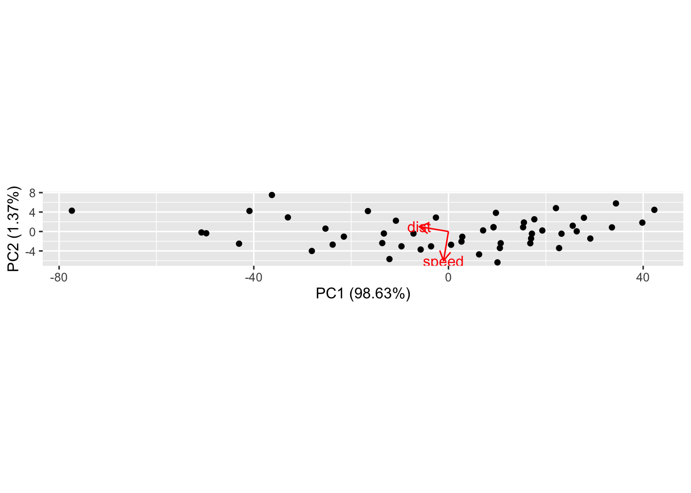
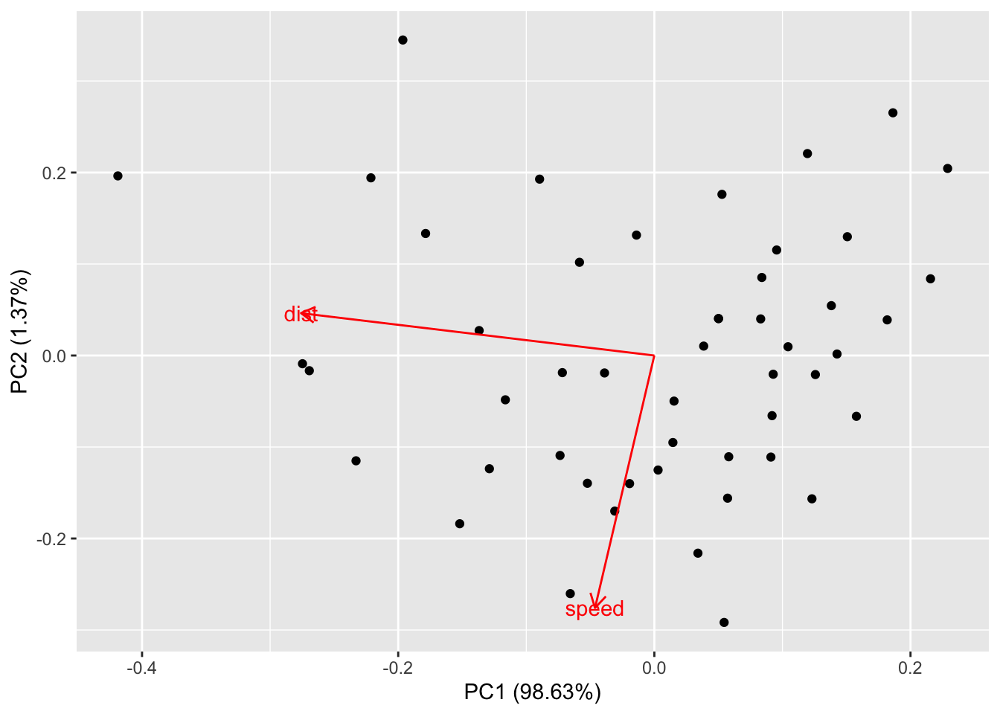
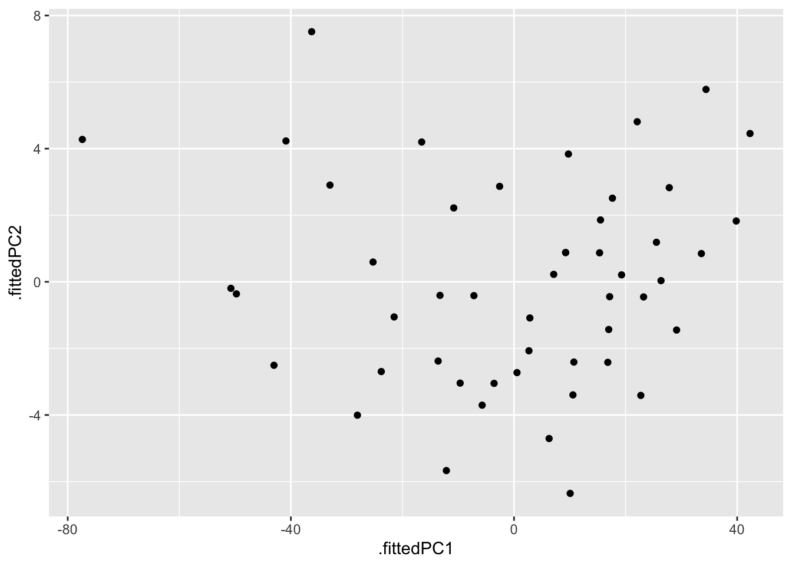
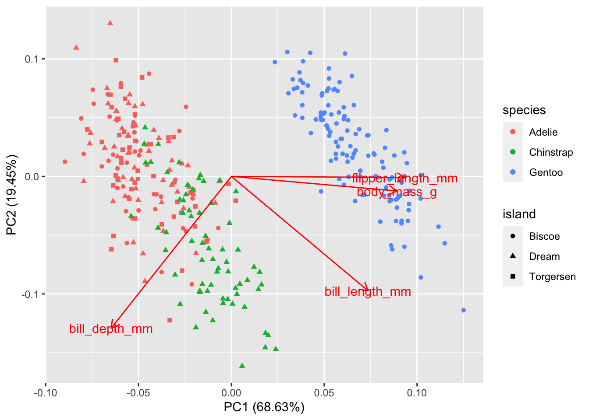
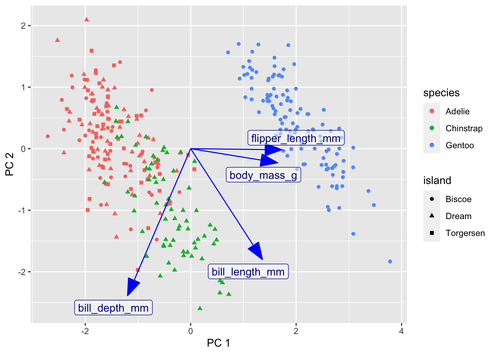

# Principal component analysis {#pca}


Datasets are said to be high-dimensional when several quantitative (or categorical) variables are recorded for each observation. Visualizing these datasets can be challenging, because visualizations work best with two dimensions and it is difficult to visualize 4 or more dimensions simultaneously. Many plots of pairs of variables can be displayed, but these projections require the viewer to try to reconstruct complex interactions among variables. [Ordination](https://en.wikipedia.org/wiki/Ordination_(statistics)) is a suite of techniques for creating projections of high-dimensional data, usually in 2 or 3 dimensions. The name refers to the goal of *ordering* observations in a two dimensional plane so that observations which are close in the high-dimensional space are still close in the projected 2-dimensional space. Not all features of the original dataset can be maintained -- information is lost -- so some care must be taken when interpreting ordination plots. In this course we will examine Principal Component Analysis (in this lesson) and metric and non-metric dimensional analysis (in the next). There are many other techniques for [dimensionality reduction](https://en.wikipedia.org/wiki/Dimensionality_reduction).

Principal component analysis (from now on, PCA) defines new variables which are weighted sums (a.k.a. linear combinations) of variables in your data. These sums are called principal components. The principal components can be used as new axes for your data, defining new coordinates for each point. The underlying transformation is a rotation (and usually a scaling) which is used to form a new coordinate system. The coordinate along each axis known as the first, second, etc., principal component. The rotation is chosen to maximize the variance in the first principal component. The second principal component is perpendicular to the first, but chosen so that as much of the remaining variation as possible is along that axis. And so on. In this way you can select as many of the first few principal components as you like to have a smaller set of variables that represent as much of the variation in the original data as possible.

If you have studied linear algebra, you will want to know that the principal component analysis is performed with the following steps:

* center the data at the origin by subtracting the mean of each variable (optionally scale each variable to have the same standard deviation),
* compute the covariance matrix (or optionally the correlation matrix),
* compute the eigenvalues of the covariance matrix. 

The eigenvalues and their corresponding eigenvectors are sorted from largest to smallest. 
The proportion of the variance explained by each principal component is proportional to the eigenvalues.
The rotation matrix is the orthogonal matrix composed of these eigenvalues. 
This is explained in our applied linear algebra course (Math 2040) in section 11.12 of [Peter Selinger's book](https://www.mathstat.dal.ca/~selinger/linear-algebra/) textbook. 

## Example 

A simple example in two dimensions is really helpful. No one does PCA on two variables, because you can just plot the data in a normal scatterplot, but as a demonstration it shows how the principal components are chosen.

First, let's look at a regular scatterplot of two variables that have a reasonably strong linear relationship. I've used `coord_fixed` to force the same scale on the vertical and horizontal axes, to make this plot easier to compare with the next plot we will draw.


```r
cars %>% ggplot(aes(x=speed, y=dist)) + geom_point() + coord_fixed()
```


Now let's perform the PCA. There are three results: the amount of variation accounted for by each principal component, the directions of the principal components along each of the original axes, and the coordinates of the observations along the principal component axes.


```r
pca1 <- cars %>% prcomp()
```

The `tidy` functions let you obtain

-   the percent of the total variance projected along ("explained by") each principal component (determined by the eigenvalues)
-   the directions of the original axes along the new principal component axes (rotation)
-   the original data transformed to the new principal component axes (scores)


```r
pca1 %>% tidy(matrix = "eigenvalues") %>% kable()
```

<table>
 <thead>
  <tr>
   <th style="text-align:right;"> PC </th>
   <th style="text-align:right;"> std.dev </th>
   <th style="text-align:right;"> percent </th>
   <th style="text-align:right;"> cumulative </th>
  </tr>
 </thead>
<tbody>
  <tr>
   <td style="text-align:right;"> 1 </td>
   <td style="text-align:right;"> 26.12524 </td>
   <td style="text-align:right;"> 0.98628 </td>
   <td style="text-align:right;"> 0.98628 </td>
  </tr>
  <tr>
   <td style="text-align:right;"> 2 </td>
   <td style="text-align:right;"> 3.08084 </td>
   <td style="text-align:right;"> 0.01372 </td>
   <td style="text-align:right;"> 1.00000 </td>
  </tr>
</tbody>
</table>

```r
pca1 %>% tidy(matrix = "rotation") %>% kable()
```

<table>
 <thead>
  <tr>
   <th style="text-align:left;"> column </th>
   <th style="text-align:right;"> PC </th>
   <th style="text-align:right;"> value </th>
  </tr>
 </thead>
<tbody>
  <tr>
   <td style="text-align:left;"> speed </td>
   <td style="text-align:right;"> 1 </td>
   <td style="text-align:right;"> -0.1656479 </td>
  </tr>
  <tr>
   <td style="text-align:left;"> speed </td>
   <td style="text-align:right;"> 2 </td>
   <td style="text-align:right;"> -0.9861850 </td>
  </tr>
  <tr>
   <td style="text-align:left;"> dist </td>
   <td style="text-align:right;"> 1 </td>
   <td style="text-align:right;"> -0.9861850 </td>
  </tr>
  <tr>
   <td style="text-align:left;"> dist </td>
   <td style="text-align:right;"> 2 </td>
   <td style="text-align:right;"> 0.1656479 </td>
  </tr>
</tbody>
</table>

```r
pca1 %>% tidy(matrix = "scores") %>% 
  pivot_wider(names_from = "PC", names_prefix = "PC_", values_from = "value") %>% 
  kable() %>% scroll_box(height = 50)
```

<div style="border: 1px solid #ddd; padding: 0px; overflow-y: scroll; height:50; "><table>
 <thead>
  <tr>
   <th style="text-align:right;position: sticky; top:0; background-color: #FFFFFF;"> row </th>
   <th style="text-align:right;position: sticky; top:0; background-color: #FFFFFF;"> PC_1 </th>
   <th style="text-align:right;position: sticky; top:0; background-color: #FFFFFF;"> PC_2 </th>
  </tr>
 </thead>
<tbody>
  <tr>
   <td style="text-align:right;"> 1 </td>
   <td style="text-align:right;"> 42.3022457 </td>
   <td style="text-align:right;"> 4.4542578 </td>
  </tr>
  <tr>
   <td style="text-align:right;"> 2 </td>
   <td style="text-align:right;"> 34.4127660 </td>
   <td style="text-align:right;"> 5.7794410 </td>
  </tr>
  <tr>
   <td style="text-align:right;"> 3 </td>
   <td style="text-align:right;"> 39.8329321 </td>
   <td style="text-align:right;"> 1.8269987 </td>
  </tr>
  <tr>
   <td style="text-align:right;"> 4 </td>
   <td style="text-align:right;"> 22.0816028 </td>
   <td style="text-align:right;"> 4.8086608 </td>
  </tr>
  <tr>
   <td style="text-align:right;"> 5 </td>
   <td style="text-align:right;"> 27.8330646 </td>
   <td style="text-align:right;"> 2.8285885 </td>
  </tr>
  <tr>
   <td style="text-align:right;"> 6 </td>
   <td style="text-align:right;"> 33.5845265 </td>
   <td style="text-align:right;"> 0.8485162 </td>
  </tr>
  <tr>
   <td style="text-align:right;"> 7 </td>
   <td style="text-align:right;"> 25.5293989 </td>
   <td style="text-align:right;"> 1.1875144 </td>
  </tr>
  <tr>
   <td style="text-align:right;"> 8 </td>
   <td style="text-align:right;"> 17.6399193 </td>
   <td style="text-align:right;"> 2.5126975 </td>
  </tr>
  <tr>
   <td style="text-align:right;"> 9 </td>
   <td style="text-align:right;"> 9.7504396 </td>
   <td style="text-align:right;"> 3.8378807 </td>
  </tr>
  <tr>
   <td style="text-align:right;"> 10 </td>
   <td style="text-align:right;"> 26.3499360 </td>
   <td style="text-align:right;"> 0.0356815 </td>
  </tr>
  <tr>
   <td style="text-align:right;"> 11 </td>
   <td style="text-align:right;"> 15.5019014 </td>
   <td style="text-align:right;"> 1.8578084 </td>
  </tr>
  <tr>
   <td style="text-align:right;"> 12 </td>
   <td style="text-align:right;"> 29.1428430 </td>
   <td style="text-align:right;"> -1.4474471 </td>
  </tr>
  <tr>
   <td style="text-align:right;"> 13 </td>
   <td style="text-align:right;"> 23.2257332 </td>
   <td style="text-align:right;"> -0.4535598 </td>
  </tr>
  <tr>
   <td style="text-align:right;"> 14 </td>
   <td style="text-align:right;"> 19.2809934 </td>
   <td style="text-align:right;"> 0.2090318 </td>
  </tr>
  <tr>
   <td style="text-align:right;"> 15 </td>
   <td style="text-align:right;"> 15.3362535 </td>
   <td style="text-align:right;"> 0.8716234 </td>
  </tr>
  <tr>
   <td style="text-align:right;"> 16 </td>
   <td style="text-align:right;"> 17.1429756 </td>
   <td style="text-align:right;"> -0.4458574 </td>
  </tr>
  <tr>
   <td style="text-align:right;"> 17 </td>
   <td style="text-align:right;"> 9.2534959 </td>
   <td style="text-align:right;"> 0.8793258 </td>
  </tr>
  <tr>
   <td style="text-align:right;"> 18 </td>
   <td style="text-align:right;"> 9.2534959 </td>
   <td style="text-align:right;"> 0.8793258 </td>
  </tr>
  <tr>
   <td style="text-align:right;"> 19 </td>
   <td style="text-align:right;"> -2.5807236 </td>
   <td style="text-align:right;"> 2.8671005 </td>
  </tr>
  <tr>
   <td style="text-align:right;"> 20 </td>
   <td style="text-align:right;"> 16.9773277 </td>
   <td style="text-align:right;"> -1.4320423 </td>
  </tr>
  <tr>
   <td style="text-align:right;"> 21 </td>
   <td style="text-align:right;"> 7.1154781 </td>
   <td style="text-align:right;"> 0.2244366 </td>
  </tr>
  <tr>
   <td style="text-align:right;"> 22 </td>
   <td style="text-align:right;"> -16.5529610 </td>
   <td style="text-align:right;"> 4.1999861 </td>
  </tr>
  <tr>
   <td style="text-align:right;"> 23 </td>
   <td style="text-align:right;"> -36.2766602 </td>
   <td style="text-align:right;"> 7.5129440 </td>
  </tr>
  <tr>
   <td style="text-align:right;"> 24 </td>
   <td style="text-align:right;"> 22.7287895 </td>
   <td style="text-align:right;"> -3.4121147 </td>
  </tr>
  <tr>
   <td style="text-align:right;"> 25 </td>
   <td style="text-align:right;"> 16.8116798 </td>
   <td style="text-align:right;"> -2.4182273 </td>
  </tr>
  <tr>
   <td style="text-align:right;"> 26 </td>
   <td style="text-align:right;"> -10.8014991 </td>
   <td style="text-align:right;"> 2.2199138 </td>
  </tr>
  <tr>
   <td style="text-align:right;"> 27 </td>
   <td style="text-align:right;"> 10.7289221 </td>
   <td style="text-align:right;"> -2.4105249 </td>
  </tr>
  <tr>
   <td style="text-align:right;"> 28 </td>
   <td style="text-align:right;"> 2.8394424 </td>
   <td style="text-align:right;"> -1.0853417 </td>
  </tr>
  <tr>
   <td style="text-align:right;"> 29 </td>
   <td style="text-align:right;"> 10.5632742 </td>
   <td style="text-align:right;"> -3.3967098 </td>
  </tr>
  <tr>
   <td style="text-align:right;"> 30 </td>
   <td style="text-align:right;"> 2.6737945 </td>
   <td style="text-align:right;"> -2.0715267 </td>
  </tr>
  <tr>
   <td style="text-align:right;"> 31 </td>
   <td style="text-align:right;"> -7.1880550 </td>
   <td style="text-align:right;"> -0.4150477 </td>
  </tr>
  <tr>
   <td style="text-align:right;"> 32 </td>
   <td style="text-align:right;"> 0.5357767 </td>
   <td style="text-align:right;"> -2.7264158 </td>
  </tr>
  <tr>
   <td style="text-align:right;"> 33 </td>
   <td style="text-align:right;"> -13.2708127 </td>
   <td style="text-align:right;"> -0.4073453 </td>
  </tr>
  <tr>
   <td style="text-align:right;"> 34 </td>
   <td style="text-align:right;"> -32.9945119 </td>
   <td style="text-align:right;"> 2.9056126 </td>
  </tr>
  <tr>
   <td style="text-align:right;"> 35 </td>
   <td style="text-align:right;"> -40.8839916 </td>
   <td style="text-align:right;"> 4.2307958 </td>
  </tr>
  <tr>
   <td style="text-align:right;"> 36 </td>
   <td style="text-align:right;"> 6.2872386 </td>
   <td style="text-align:right;"> -4.7064882 </td>
  </tr>
  <tr>
   <td style="text-align:right;"> 37 </td>
   <td style="text-align:right;"> -3.5746110 </td>
   <td style="text-align:right;"> -3.0500092 </td>
  </tr>
  <tr>
   <td style="text-align:right;"> 38 </td>
   <td style="text-align:right;"> -25.2706801 </td>
   <td style="text-align:right;"> 0.5942445 </td>
  </tr>
  <tr>
   <td style="text-align:right;"> 39 </td>
   <td style="text-align:right;"> 10.0663305 </td>
   <td style="text-align:right;"> -6.3552647 </td>
  </tr>
  <tr>
   <td style="text-align:right;"> 40 </td>
   <td style="text-align:right;"> -5.7126288 </td>
   <td style="text-align:right;"> -3.7048984 </td>
  </tr>
  <tr>
   <td style="text-align:right;"> 41 </td>
   <td style="text-align:right;"> -9.6573687 </td>
   <td style="text-align:right;"> -3.0423068 </td>
  </tr>
  <tr>
   <td style="text-align:right;"> 42 </td>
   <td style="text-align:right;"> -13.6021085 </td>
   <td style="text-align:right;"> -2.3797152 </td>
  </tr>
  <tr>
   <td style="text-align:right;"> 43 </td>
   <td style="text-align:right;"> -21.4915882 </td>
   <td style="text-align:right;"> -1.0545321 </td>
  </tr>
  <tr>
   <td style="text-align:right;"> 44 </td>
   <td style="text-align:right;"> -23.7952539 </td>
   <td style="text-align:right;"> -2.6956062 </td>
  </tr>
  <tr>
   <td style="text-align:right;"> 45 </td>
   <td style="text-align:right;"> -12.1266823 </td>
   <td style="text-align:right;"> -5.6695659 </td>
  </tr>
  <tr>
   <td style="text-align:right;"> 46 </td>
   <td style="text-align:right;"> -28.0712895 </td>
   <td style="text-align:right;"> -4.0053845 </td>
  </tr>
  <tr>
   <td style="text-align:right;"> 47 </td>
   <td style="text-align:right;"> -49.7673586 </td>
   <td style="text-align:right;"> -0.3611308 </td>
  </tr>
  <tr>
   <td style="text-align:right;"> 48 </td>
   <td style="text-align:right;"> -50.7535436 </td>
   <td style="text-align:right;"> -0.1954829 </td>
  </tr>
  <tr>
   <td style="text-align:right;"> 49 </td>
   <td style="text-align:right;"> -77.3805375 </td>
   <td style="text-align:right;"> 4.2770102 </td>
  </tr>
  <tr>
   <td style="text-align:right;"> 50 </td>
   <td style="text-align:right;"> -43.0297118 </td>
   <td style="text-align:right;"> -2.5068510 </td>
  </tr>
</tbody>
</table></div>

We can perform these calculations "by hand" following the linear algebra instructions:


```r
carsM <- scale(as.matrix(cars), center = TRUE, scale = FALSE)  # If scale = TRUE, then use correlation matrix below
B1 <- cov(carsM)  
B2 <- (t(carsM) %*% carsM ) / (nrow(carsM) - 1)  # divide (M^T * M) by N-1 to get covariance matrix
sqrt(eigen(B1)$values)
```

```
## [1] 26.12524  3.08084
```

```r
eigen(B1)$vectors
```

```
##           [,1]       [,2]
## [1,] 0.1656479 -0.9861850
## [2,] 0.9861850  0.1656479
```

The the "scores" output is equal to the original data multiplied by the rotation matrix.


```r
rotation <- pca1 %>% tidy(matrix = "rotation") %>% pull(value) %>% matrix(2, 2)  # also available as  pca1$rotation
center <- cars %>% summarize(speed = mean(speed), dist = mean(dist)) # also available as pca1$center
scores1 <- pca1 %>% tidy(matrix = "scores") %>% pull(value) %>% matrix(ncol = 2, byrow = TRUE)
# scores2 <- t((t(cars) - pca1$center)) %*% pca1$rotation
scores2 <- scale(cars, center = TRUE, scale = FALSE) %*% rotation
```

Now I'll plot the data projected onto the principal components. Notice that it is wide and thin (especially compared to the previous plot) because the data have been rotated to arrange as much of the variation as possible in the horizontal direction.


```r
pca1 %>% tidy(matrix = "scores") %>% 
  pivot_wider(names_from="PC", names_prefix = "PC_", values_from = "value") %>%
  ggplot(aes(x=PC_1, y=PC_2)) + geom_point() + coord_fixed()
```


An easy way to display the results of the PCA is to make a biplot using the `ggfortify` package. The biplot shows the observations as black dots and the original axes as red vectors. The option `scale=0` keeps the same scaling as in the original plot. In normal usage you would not have `coord_fixed()` in the original plot and you would not use `scale=0` in this plot.


```r
autoplot(pca1, data= cars, loadings=TRUE, loadings.label=TRUE, scale=0) + coord_equal()
```

```
## Warning: `select_()` is deprecated as of dplyr 0.7.0.
## Please use `select()` instead.
## This warning is displayed once every 8 hours.
## Call `lifecycle::last_warnings()` to see where this warning was generated.
```



Normal use of `autoplot` would be to allow changing the scale of the two principal components (`scale = 1`) and to allow the axes to be scaled independently of each other (no `coord_fixed()`):


```r
autoplot(pca1, data= cars, loadings=TRUE, loadings.label=TRUE, scale=1, variance_percentage = TRUE)
```



The `autoplot` function is convenient and you can customize many features using the options in `ggbiplot`.  I like to know exactly how a plot is drawn to check my understanding, so I'll show you how to reproduce this plot using `augment` and `ggplot`.

We can make this plot (called a biplot) from the raw data by using a few scaling factors (lam, scaling) commonly used in these plots:


```r
lam <- pca1$sdev[1:2] * sqrt(nrow(pca1$x))
scaling <- min(apply(abs(scores2), 2, max) / apply(abs(rotation), 2, max) / lam) * 0.8
ve <- pca1$sdev^2 / sum(pca1$sdev^2)
scores2 %>% as_tibble() %>% ggplot(aes(V1/lam[1], V2/lam[2])) + geom_point()  + 
  geom_segment(aes(x = 0, y = 0, xend = V1*scaling, yend = V2*scaling), 
               arrow = arrow(length = unit(0.25,"cm")),
               color = "red",
               data = as_tibble(rotation)) +
  labs(x = paste0("PC1: ", round(ve[1]*100, 2), "%"),
       y = paste0("PC2: ", round(ve[2]*100, 2), "%"))
```

```
## Warning: The `x` argument of `as_tibble.matrix()` must have unique column names if `.name_repair` is omitted as of tibble 2.0.0.
## Using compatibility `.name_repair`.
## This warning is displayed once every 8 hours.
## Call `lifecycle::last_warnings()` to see where this warning was generated.
```


If all you want is the scores and you don't care about the scaling, you can just use `augment` and `ggplot`:


```r
pca1 %>%
  augment(cars) %>%
  ggplot(aes(x=.fittedPC1, y= .fittedPC2)) +   # divide by lam[1] and lam[2] to get the scaled version
  geom_point()
```



### Second example: penguins.

The palmer penguin data have 4 quantitative variables. We will scale them all to have mean 0 and standard deviation 1, since the units and magnitude of the numbers are not comparable. We will colour points by speices to make the patterns easier to see.

`autoplot` has some quirks: the variable names must be quoted and colour must be spelled with a 'u'. (Most `ggplot` functions allow for alternate spellings - color with and without a 'u', summarize with an 's' instead of a 'z'.) I don't know of an easy way to use the `ggrepel` package with autoplot to avoid overprinting the text on the arrows or dots.


```r
penguins_no_na = na.omit(penguins)
pca2 <- prcomp(penguins_no_na %>% dplyr::select(flipper_length_mm, body_mass_g, bill_length_mm, bill_depth_mm), scale=TRUE )
autoplot(pca2, data = penguins_no_na, loadings=TRUE, loadings.label=TRUE,
         colour='species', shape='island')
```



Gentoo penguins are mostly distinguished by having the highest body mass. Adélie and Chinstrap penguins have similar masses, but are distinguished by dimensions of their bills and flippers. You can use `frame.type` to shade the areas containing 
data from each species to highlight where the points are concentrated (by color).


```r
autoplot(pca2, data = penguins_no_na, loadings = TRUE, loadings.label = TRUE,
         colour = 'species', shape = 'island', 
         frame.type = "norm", frame.level = 0.90)   # frame.type convex, norm, euclid, t; see ?ggbiplot
```


Without a PCA, you could attempt to see these patterns by making a complex array of scatterplots for each pair of variables.


```r
penguins_no_na %>% 
  dplyr::select(flipper_length_mm, body_mass_g, bill_length_mm, bill_depth_mm, species) %>% 
  ggpairs(aes(color=species))
```


You should practice seeing how many of the pairwise differences in this pairs plot can be revealed in the single PCA.

Here is a customized ggplot of the PCA results. I simplifed the work in the first example by not using the conventional scaling; instead I just picked scales for the arrows that looked good. **Need to fix this.**


```r
rotation2 <- pca2 %>% 
  tidy(matrix = "rotation") %>%
  pivot_wider(names_from = PC, names_prefix = "PC", values_from = value) 
pca2 %>%
  augment(penguins_no_na) %>%
  ggplot() +
  geom_point(aes(x = .fittedPC1, y = .fittedPC2, color = species, shape = island)) +
  geom_segment(data = rotation2, mapping = aes(x = 0, xend = 3*PC1, y = 0, yend = 3*PC2), color = "blue",
               arrow = arrow(angle = 20, type = "closed"))  +
  geom_label_repel(data = rotation2,
                  aes(x = 3*PC1, y = 3*PC2, label = column), 
                  color = "darkblue", fill = "#FFFFFF80",
                  arrow = arrow(angle = 20, type = "closed")) +
  labs(x = "PC 1", y = "PC 2")
```




## Further reading

-   Claus Wilke's [PCA tutorial](https://clauswilke.com/blog/2020/09/07/pca-tidyverse-style/)
-   [Example PCA on iris data](https://bookdown.org/Maxine/r4ds/examples.html)
-   <https://juliasilge.com/blog/stack-overflow-pca/>
-   PCA using [tidymodels](https://juliasilge.com/blog/cocktail-recipes-umap/)
-   [PCA](https://melinaluethje.com/2020/11/12/multivariate-ordinations-101/)
