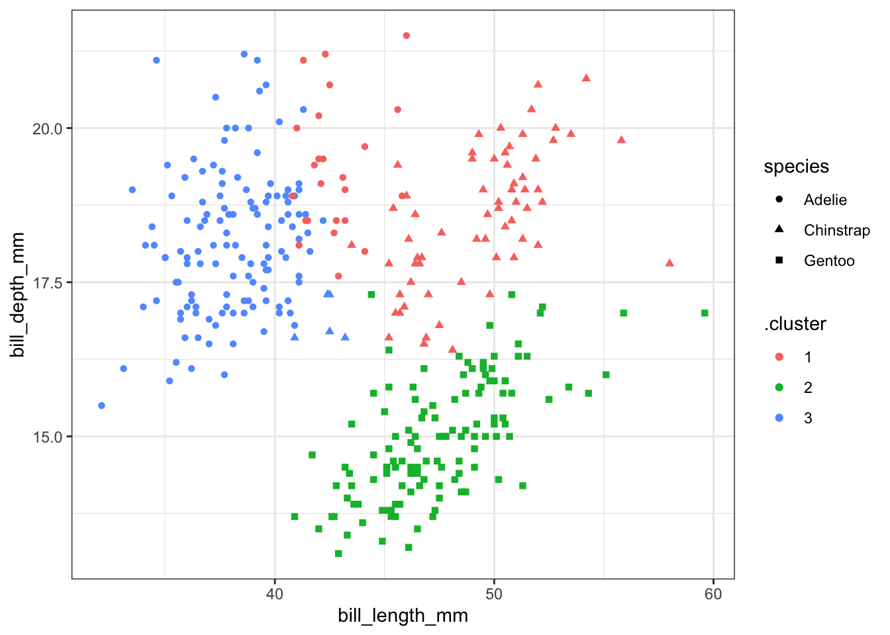
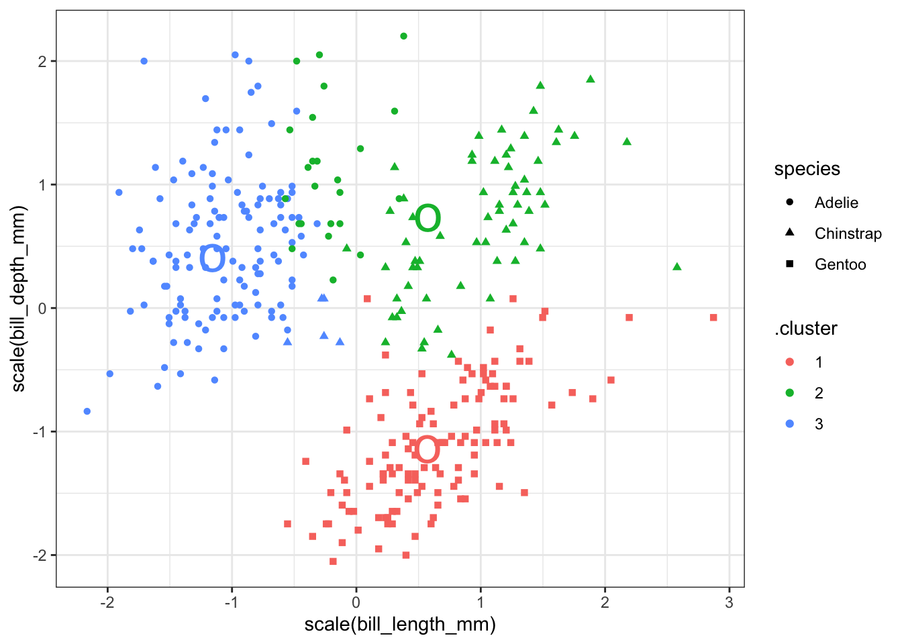
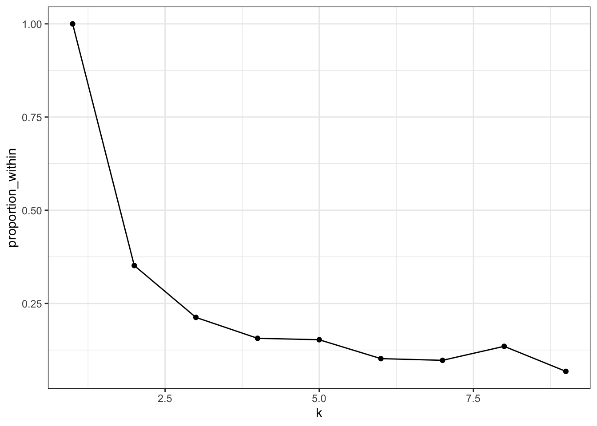
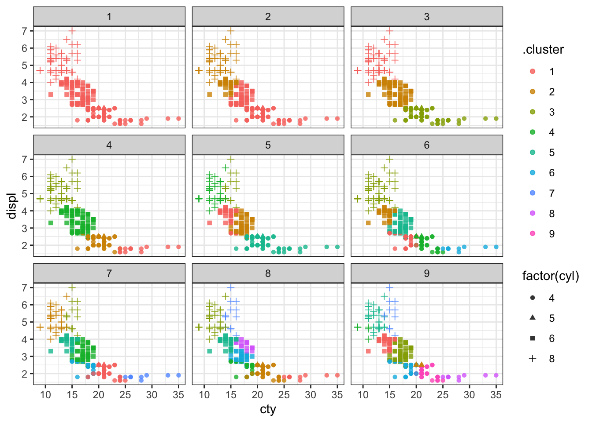
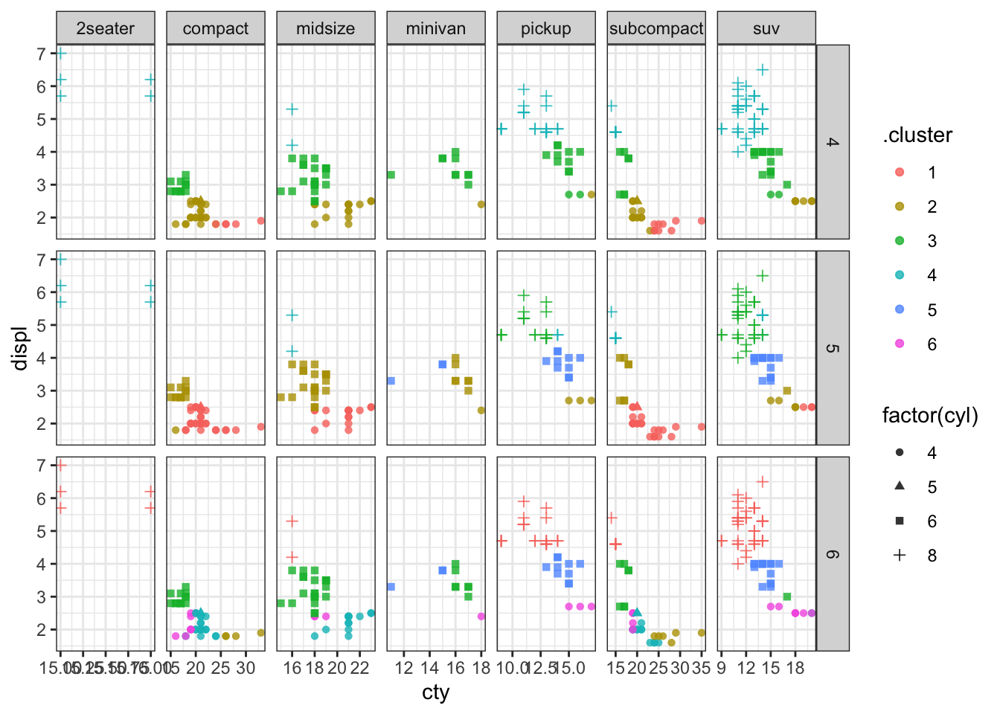

# K-means clustering {#k-means}


PCA and MDS are both ways of exploring "structure" in data with many variables. These methods both arrange observations across a plane as an approximation of the underlying structure in the data. K-means is another method for illustrating structure, but the goal is quite different: each point is assigned to one of $k$ different clusters, according to their proximity to each other. You, as the analyst, must specify the number of clusters in advance. Sometimes there is an obviously correct number of clusters, other times you construct many different clusterings and select the one which best represents the data.  Clustering can be combined with PCA and MDS and used as labels on those ordination visualizations. There are many methods of clustering; we will only look at one in this course.


## Make clusters from points

Let's start by making 3 clusters from the quantitative variables in the Palmer penguins data. We omit missing data and scale each variable to have mean 0 and standard deviation 1. We don't want the different scales each variable is measured on to give more weight to one variable compared to the other. (We might choose to give one variable more weight, but we don't want that to be simply a consequence of the units used to report the variables.)


```r
penguin_q <- penguins %>% select(species, 
                                 flipper_length_mm, bill_length_mm, bill_depth_mm, body_mass_g) %>%
  na.omit() 
kclust1 <- kmeans(penguin_q %>% select(-species) %>% scale(),
                 centers = 3)
```

The kclust object reports the means (centroid) of each cluster and the membership of each observation (1-3). We also get sum of squared deviations between the cluster mean and each observation. This is then compared to the total sums of squares, which is the sum of squared deviations from the mean if there was only one cluster. In our example, 72% of the total sums of squares is within clusters and the remainder (28%) is between clusters. This tells us that the three main clusters account for almost 75% of the squared deviations. This measure is the same one used in linear regression, which minimizes the total sum of squared deviations between the regression line and each observation.


```r
kclust1
```

```
## K-means clustering with 3 clusters of sizes 132, 123, 87
## 
## Cluster means:
##   flipper_length_mm bill_length_mm bill_depth_mm body_mass_g
## 1        -0.8899121     -1.0465260     0.4858415  -0.7694891
## 2         1.1571696      0.6562677    -1.0983711   1.0901639
## 3        -0.2857869      0.6600059     0.8157307  -0.3737654
## 
## Clustering vector:
##   [1] 1 1 1 1 1 1 1 1 3 1 1 1 1 1 1 1 3 1 3 1 1 1 1 1 1 1 1 1 1 1 1 1 1 1 1 1 1
##  [38] 1 1 1 1 1 3 1 1 1 1 1 3 1 1 1 3 1 1 1 1 1 1 1 3 1 1 1 1 1 1 1 3 1 1 1 3 1
##  [75] 3 1 1 1 3 1 3 1 1 1 1 1 1 1 1 1 3 1 1 1 3 1 1 1 3 1 3 1 1 1 1 1 1 1 3 1 3
## [112] 1 3 1 3 1 1 1 1 1 1 1 3 1 1 1 1 1 3 1 3 1 1 1 1 1 1 1 1 1 1 1 1 1 1 1 1 1
## [149] 1 1 3 2 2 2 2 2 2 2 2 2 2 2 2 2 2 2 2 2 2 2 2 2 2 2 2 2 2 2 2 2 2 2 2 2 2
## [186] 2 2 2 2 2 2 2 2 2 2 2 2 2 2 2 2 2 2 2 2 2 2 2 2 2 2 2 2 2 2 2 2 2 2 2 2 2
## [223] 2 2 2 2 2 2 2 2 2 2 2 2 2 2 2 2 2 2 2 2 2 2 2 2 2 2 2 2 2 2 2 2 2 2 2 2 2
## [260] 2 2 2 2 2 2 2 2 2 2 2 2 2 2 2 3 3 3 3 3 3 3 3 3 3 3 3 3 3 3 3 3 3 3 3 1 3
## [297] 1 3 3 3 3 3 3 3 1 3 1 3 3 3 3 3 3 3 3 3 3 3 3 3 3 3 3 3 3 3 3 3 1 3 3 3 3
## [334] 3 3 3 3 3 3 3 3 3
## 
## Within cluster sum of squares by cluster:
## [1] 122.1477 143.1502 112.9852
##  (between_SS / total_SS =  72.3 %)
## 
## Available components:
## 
## [1] "cluster"      "centers"      "totss"        "withinss"     "tot.withinss"
## [6] "betweenss"    "size"         "iter"         "ifault"
```

These data can be presented in an easy to use table with `tidy`:


```r
tidy(kclust1) %>% kable(digits = 2)
```

<table>
 <thead>
  <tr>
   <th style="text-align:right;"> flipper_length_mm </th>
   <th style="text-align:right;"> bill_length_mm </th>
   <th style="text-align:right;"> bill_depth_mm </th>
   <th style="text-align:right;"> body_mass_g </th>
   <th style="text-align:right;"> size </th>
   <th style="text-align:right;"> withinss </th>
   <th style="text-align:left;"> cluster </th>
  </tr>
 </thead>
<tbody>
  <tr>
   <td style="text-align:right;"> -0.89 </td>
   <td style="text-align:right;"> -1.05 </td>
   <td style="text-align:right;"> 0.49 </td>
   <td style="text-align:right;"> -0.77 </td>
   <td style="text-align:right;"> 132 </td>
   <td style="text-align:right;"> 122.15 </td>
   <td style="text-align:left;"> 1 </td>
  </tr>
  <tr>
   <td style="text-align:right;"> 1.16 </td>
   <td style="text-align:right;"> 0.66 </td>
   <td style="text-align:right;"> -1.10 </td>
   <td style="text-align:right;"> 1.09 </td>
   <td style="text-align:right;"> 123 </td>
   <td style="text-align:right;"> 143.15 </td>
   <td style="text-align:left;"> 2 </td>
  </tr>
  <tr>
   <td style="text-align:right;"> -0.29 </td>
   <td style="text-align:right;"> 0.66 </td>
   <td style="text-align:right;"> 0.82 </td>
   <td style="text-align:right;"> -0.37 </td>
   <td style="text-align:right;"> 87 </td>
   <td style="text-align:right;"> 112.99 </td>
   <td style="text-align:left;"> 3 </td>
  </tr>
</tbody>
</table>

Categorical variables (species) can be added to the resuls using `augment` as we have done with other models. We can then pick two variables and plot them along with the cluster identity and species. Here the colours show the cluster number and the shapes show the species. We can see that the clusters do not perfectly separate out observations by species, but there is a strong similarity. This means that the variables we selected are mostly, but not completely, sufficient to distingush the three species. Remember that we used 4 variables for the classification, not just the two shown here.


```r
kc1 <- augment(kclust1, penguin_q)
ggplot(kc1, aes(x=bill_length_mm, y = bill_depth_mm, color=.cluster, shape=species)) + 
  geom_point() + theme_bw()
```



You can add the center of each cluster to the plot, but since the clustering was done on data scaled to have mean 0 and standard deviation 1, you must be careful to scale the data here as well.


```r
kc1 <- augment(kclust1, penguin_q)
ggplot(kc1, aes(x = scale(bill_length_mm), 
                y = scale(bill_depth_mm))) + 
  geom_point(aes(color = .cluster, shape = species)) +
  geom_point(data = tidy(kclust1), aes(color = cluster), 
             size = 10, shape = "o", show.legend = FALSE) + theme_bw()
```




We can make a table of the number of each species in each cluster using `summarize`. Adélie penguins make up most of cluster 1, with 8 observations appearing in cluster 3. Chinstrap penguins make up most of cluster 3, with 5 observations in cluster 1. All the Gentoo penguins are in cluster 2 and there are no other species of penguin in this cluster. This result should seem reasonable given all the previous exploration we have done on this data.


```r
augment(kclust1, data = penguin_q) %>%
  count(.cluster, species)
```

```
## # A tibble: 5 x 3
##   .cluster species       n
##   <fct>    <fct>     <int>
## 1 1        Adelie      127
## 2 1        Chinstrap     5
## 3 2        Gentoo      123
## 4 3        Adelie       24
## 5 3        Chinstrap    63
```

## Example 2

Let's take a look at a dataset with a lot more groups. The `mpg` dataset has several quantitative variables that might be useful for classifying cars (displ, cyl, cty, hwy). We can make a series of clusterings of these data and see how well they correspond to the class of the car (compact, subcompact, etc).


```r
kclust2 <- kmeans(mpg %>% select(displ, cyl, cty, hwy) %>% scale, 
                  centers = 4)
tidy(kclust2)
```

```
## # A tibble: 4 x 7
##    displ     cyl     cty    hwy  size withinss cluster
##    <dbl>   <dbl>   <dbl>  <dbl> <int>    <dbl> <fct>  
## 1 -1.05  -1.14    1.10    1.05     75    78.4  1      
## 2 -0.299 -0.135   0.0717  0.229    61    31.7  2      
## 3  1.29   1.31   -1.01   -0.976    70    47.5  3      
## 4  0.251  0.0689 -0.596  -0.860    28     4.62 4
```

Compare these clusters to the class of the cars. There are many classes of each car in some clusters.


```r
augment(kclust2, mpg) %>% count(.cluster, class)
```

```
## # A tibble: 18 x 3
##    .cluster class          n
##    <fct>    <chr>      <int>
##  1 1        compact       33
##  2 1        midsize       16
##  3 1        subcompact    23
##  4 1        suv            3
##  5 2        compact       14
##  6 2        midsize       23
##  7 2        minivan        8
##  8 2        pickup         3
##  9 2        subcompact     7
## 10 2        suv            6
## 11 3        2seater        5
## 12 3        midsize        2
## 13 3        pickup        20
## 14 3        subcompact     5
## 15 3        suv           38
## 16 4        minivan        3
## 17 4        pickup        10
## 18 4        suv           15
```

If we use `glance` we get to see how the sums of squares are partitioned. I'll add a fifth variable that measures the proportion of sums of squares within compared to the total.


```r
glance(kclust2) %>% mutate(proportion_within = tot.withinss / totss)
```

```
## # A tibble: 1 x 5
##   totss tot.withinss betweenss  iter proportion_within
##   <dbl>        <dbl>     <dbl> <int>             <dbl>
## 1   932         162.      770.     2             0.174
```

How can we decide how many clusters to make? Let's compute the proportion of sums of squares accounted for by the clustering for 2, 3, 4, etc., clusters. We will use functions in `broom` to accomplish this including `nest` and `map`.


```r
kclusts2 <- 
  tibble(k = 1:9) %>%
  mutate(
    kclust = map(k, ~kmeans(mpg %>% select(displ, cyl, cty, hwy) %>% scale,
                            centers = .x)),
    tidied = map(kclust, tidy),
    glanced = map(kclust, glance),
    augmented = map(kclust, augment, mpg)
  )
```

That one object has a lot of information -- the tidy and glance results on 9 clusterings plus the augmented data for each. Let's extract them into 3 different tables to make the results easier to work with.


```r
clusters2    <- kclusts2 %>% unnest(cols = c(tidied))
assignments2 <- kclusts2 %>% unnest(cols = c(augmented))
clusterings2 <- kclusts2 %>% unnest(cols = c(glanced))
```

We can score each cluster according to the sums of squares as follows:


```r
clusterings2 %>% mutate(proportion_within = tot.withinss / totss) %>%
  ggplot(aes(x = k, y = proportion_within)) + 
  geom_line() + geom_point() + theme_bw()
```



Seven clusters is slightly worse than 6, so that's probably too many. Most of the decrease happens with 4 or 5 clusters, so that may be enough.

Let's plot the clusters. I'll show the number of cylinders using a symbol; there are only 4 to show, so that won't be too many to look at.


```r
p1 <- ggplot(assignments2, aes(x = cty, y = displ)) +
        geom_point(aes(color = .cluster, shape=factor(cyl)), alpha = 0.8) + 
        facet_wrap(~ k) + theme_bw()
p1
```



We can try to make a facetted plot, showing car classification and clusters. There are 7 classes and 9 clusters, so that would make 63 facets, which is a lot to look at. I'll select just the classifications with 4, 5, and 6 clusters.


```r
p2 <- assignments2 %>% filter(k >= 4, k <= 6) %>%
  ggplot(aes(x = cty, y = displ)) +
        geom_point(aes(color = .cluster, shape = factor(cyl)), alpha = 0.8) + 
        facet_grid(k ~ class, scales = "free") + theme_bw()
p2
```



We can see that most classes of cars (except 2 seaters) get divided up into multiple clusters. So a clustering of these 4 quantiative variables does not separate out cars according to their class.


## Further reading

These two sources provide more detail on how k-means clustering works.

* Notes on [K-means](https://www.tidymodels.org/learn/statistics/k-means/) from the tidymodels package
* Chapter on [K-means](https://bookdown.org/rdpeng/exdata/k-means-clustering.html) from Roger Peng's book
