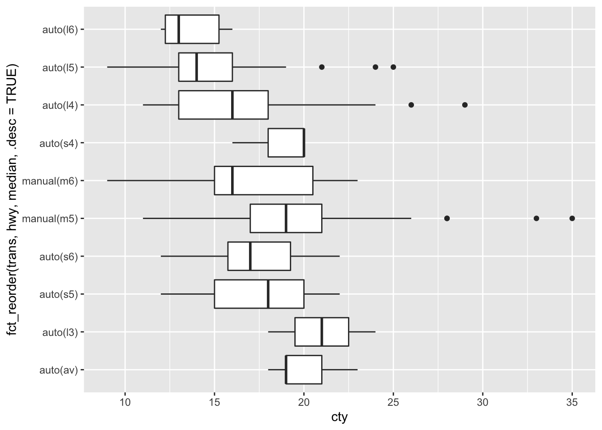

# Working with text, factors, dates and times {#factors-dates}


In this lesson I'll show you how to work with the most common non-numeric data. Text (called [strings](https://en.wikipedia.org/wiki/String_(computer_science))) is the most basic type and represents a sequence of letters (plus spaces, numbers, punctuation, emoij, and more) that is not interpreted by the computer. In statistics, strings can be interpreted as [categorical data](https://en.wikipedia.org/wiki/Categorical_variable) which usually means that there is a mapping from a set of text strings to natural numbers. The categories can be considered as ordered or unordered; when they are unordered, R usually arranges them in alphabetical order (A-Z). Dates and times have familiar purposes in natural language, but there are many ways to represent them, so that topic needs some discussion. Dates are surprisingly complicated.

## Working with text

When making visualizations it is frequently useful to manipulate text ("strings") directly. Sometimes this is to simplify text that is being displayed on a graph. Or perhaps there is a typographical error or formatting problem with text. The [stringr](https://cran.r-project.org/web/packages/stringr/vignettes/stringr.html) package contains many useful functions for manipulating text strings. I will explain a few simple examples that I use frequently.

* A very common task is to remove leading, trailing, and duplicated spaces in a string. The `str_squish` function removes whitespace (including tabs, new lines, and spaces) in these positions.


```r
my_string <- "   A cat  is a small, living
                    and furry animal.  "
my_string2 <- str_squish(my_string)
my_string2
```

```
## [1] "A cat is a small, living and furry animal."
```

* It can be helpful to convert all text to a uniform pattern of capitalization: all capital letters, all lower case, and other patterns.


```r
str_to_lower(my_string2)
```

```
## [1] "a cat is a small, living and furry animal."
```

```r
str_to_upper(my_string2)
```

```
## [1] "A CAT IS A SMALL, LIVING AND FURRY ANIMAL."
```

```r
str_to_sentence(my_string2)
```

```
## [1] "A cat is a small, living and furry animal."
```

```r
str_to_title(my_string2)
```

```
## [1] "A Cat Is A Small, Living And Furry Animal."
```

* If there are particular letters or symbols you want to remove, the `str_remove` function can accomplish this. This can be used on literal strings or on patterns. Patterns allow for the use of character classes, selecting specific sequences, and more complex symbolic descriptions of strings. I will give a couple of simple examples of patterns. `str_remove` matches only once; `str_remove_all` matches the pattern as many times as possible.


```r
str_remove(my_string2, "cat")
```

```
## [1] "A  is a small, living and furry animal."
```

```r
str_remove_all(my_string2, "[aeiou]")
```

```
## [1] "A ct s  smll, lvng nd frry nml."
```

```r
str_remove_all(my_string2, "[ ,\\.!]")
```

```
## [1] "Acatisasmalllivingandfurryanimal"
```

* If a variable contains numbers, but R is interpreting the data as text, you can use the function `as.numeric` to convert the text to numbers. Any string that can't be interpreted as a number will be converted to `NA`.


```r
text_and_numbers <- tibble( text = c("Andrew", "33", "12.45", 
                                     "-1.00", "Inf"))
text_and_numbers %>% mutate(numbers = as.numeric(text), 
                            integers = as.integer(text))
```

```
## # A tibble: 5 x 3
##   text   numbers integers
##   <chr>    <dbl>    <int>
## 1 Andrew    NA         NA
## 2 33        33         33
## 3 12.45     12.4       12
## 4 -1.00     -1         -1
## 5 Inf      Inf         NA
```


* If a pattern appears in a string, you might want to extract that information. `str_extract` allows you to write a pattern that matches part of the string and extract that from the source material.


```r
sets <- c("A1", "A2", "B1", "B4", "C5")
str_extract(sets, "[0-9]")
```

```
## [1] "1" "2" "1" "4" "5"
```

```r
str_extract(sets, "[A-Z]")
```

```
## [1] "A" "A" "B" "B" "C"
```

Thinking about patterns is a lot of work and prone to error, so the pair of functions `glue` and `unglue` were created to perform common tasks of combining text and data and then to separate them again.


```r
library(glue)
library(unglue)
a <- 1
b <- 6
c <- 15.63
my_string3 <- glue("The numbers a, b, and c are {a}, {b}, and {c}, respectively. Their sum is {a+b+c}.")
my_string3
```

```
## The numbers a, b, and c are 1, 6, and 15.63, respectively. Their sum is 22.63.
```

```r
unglue(my_string3, "The numbers a, b, and c are {a}, {b}, and {c}, respectively. Their sum is {d}.")
```

```
## $`1`
##   a b     c     d
## 1 1 6 15.63 22.63
```

```r
my_strings1 <- tibble(greeting = c("My name is Andrew.", "My name is Li.", "My name is Emily."))
unglue_unnest(my_strings1, greeting, "My name is {name}.", remove=FALSE)
```

```
## # A tibble: 3 x 2
##   greeting           name  
## * <chr>              <chr> 
## 1 My name is Andrew. Andrew
## 2 My name is Li.     Li    
## 3 My name is Emily.  Emily
```

## Working with factors

Factors are categorical variables in which a set of text labels ("strings") are the possible values of a variable. These are sometimes interpreted as integers and sometimes interpreted as text. In data visualization, our primary concern is mapping factors on to sequence of colours, shapes, or locations on an axis. In R, if a factor is not given an explicit order by the analyst, but must have an order (on a scale), this is usually alphabetical. This ordering is rarely the best one for visualizations!

The [forcats](https://forcats.tidyverse.org/) package has a series of functions for reordering factors. These can be used to explicitly reorder a factor by value (level) or a quantitative value can be used to reorder a factor. 

Here are a few examples using the `mpg` data set. First a visualization without any explicit reordering of factors.


```r
mpg %>% ggplot(aes(x = cty,
                   y = trans)) +
  geom_boxplot()
```


Here the transmission factor is reordered according to the minimum value of highway fuel economy. The three arguments to `fct_reorder` are the categorical variable to be reordered, the quantitative variable to use for the reordering, and a function that converts a vector of numbers to a single value for sorting (such as mean, median, min, max, length). The smallest value is plotted on the left of the horizontal axis or the bottom of the vertical axis. The option `.desc=TRUE` (descending = TRUE) is an easy way to reverse the order of factors and is especially useful for the vertical axis.


```r
mpg %>% ggplot(aes(x = cty,
                   y = fct_reorder(trans, hwy, median, .desc=TRUE))) +
  geom_boxplot() 
```



Of course you will want to pratice working with strings and factors to develop flexible methods of customizing your display of categorical variables.
Here we extract the number of gears from the transmission and reorder transmission on this basis.


```r
mpg %>% unglue_unnest(trans, "{trans_desc}({trans_code})", remove=FALSE)  %>%
  mutate(gears = str_extract(trans_code, "[0-9]") %>% as.numeric()) %>%
  ggplot(aes(x = cty,
             y = fct_reorder(trans, gears))) +
  geom_boxplot() 
```


When there are too many cateogories to display on a graph, it can be helpful to pick out the ones with the most observations and to group the remaining observations together in an "other" category. Here's how you can accomplish that.


```r
mpg %>% 
  ggplot(aes(x = cty,
             y = fct_lump(trans, 4))) +
  geom_boxplot() 
```


## Working with dates and times

Dates and times are complex data to work with. Dates are represented in many formats. Times are reported in time zones, which change depending on the time of year and the location of the measurement. Dates are further complicated by leap years and local rules operating in specific countries. Special formatting is required for labelling dates and times on plots.

The package `lubridate` contains many functions to help you work with dates and times. For data visualization purposes I mostly use functions to parse dates and times (converting text to a date-time object), some basic arithmetic, extract components of a date, and format axis labels.

To see some nicely formatted dates and times, use the `today` and `now` functions. When reporting times, you need to pick a time zone. This can be surprisingly complicated, especially since the time zone used in a particular location changes (daylight savings time) and according to changes in local regulations and legislation. Many people report time in UTC (referenced to longitude 0, Greenwich UK, but without the complexity of daylight savings time) to make times a bit easier. Of course, the date in UTC may not be the date where you are right now (it could be 'yesterday' or 'tomorrow'), so be on the lookout for that!


```r
today()
```

```
## [1] "2021-03-12"
```

```r
now() # for me this is: now(tz = "America/Halifax") 
```

```
## [1] "2021-03-12 12:55:03 AST"
```

```r
now(tz = "UTC")
```

```
## [1] "2021-03-12 16:55:03 UTC"
```

### Reading dates

There are a family of functions `ymd`, `dmy`, `mdy`, and `ymd_hms` among others that are used to turn text (such as in a table you read from a file) into a date. I strongly endorse the use of ISO 8601 date formatting. Illegal dates are converted to NA_Date.


```r
dt1 <- tibble(text_date = c("1999-01-31", "2000-02-28", "2010-06-28",
                            "2024-03-14", "2021-02-29"),
             date = ymd(text_date))
```

```
## Warning: 1 failed to parse.
```

```r
dt1
```

```
## # A tibble: 5 x 2
##   text_date  date      
##   <chr>      <date>    
## 1 1999-01-31 1999-01-31
## 2 2000-02-28 2000-02-28
## 3 2010-06-28 2010-06-28
## 4 2024-03-14 2024-03-14
## 5 2021-02-29 NA
```

Here is an example with times. You can specify a [time zone](https://en.wikipedia.org/wiki/List_of_tz_database_time_zones) if you want, but sometimes you can get away with ignoring the problem. Here the timezone information tells the computer how to interpret the text representation of the time.


```r
dt2 <- tibble(text_date = c("1999-01-31 09:14", "2000-02-28 12:15",
                            "2010-06-28 23:45", 
                            "2024-03-14 07:00 AM", "2021-03-01 6:16 PM"),
             date_time = ymd_hm(text_date, tz="America/Halifax"))
dt2
```

```
## # A tibble: 5 x 2
##   text_date           date_time          
##   <chr>               <dttm>             
## 1 1999-01-31 09:14    1999-01-31 09:14:00
## 2 2000-02-28 12:15    2000-02-28 12:15:00
## 3 2010-06-28 23:45    2010-06-28 23:45:00
## 4 2024-03-14 07:00 AM 2024-03-14 07:00:00
## 5 2021-03-01 6:16 PM  2021-03-01 18:16:00
```

These functions are remarkably powerful, for example they work on formats like this:


```r
tibble(date = c("Jan 5, 1999", "Saturday May 16, 70", "8-8-88",
               "December 31/99", "Jan 1, 01"),
      decoded = mdy(date))
```

```
## # A tibble: 5 x 2
##   date                decoded   
##   <chr>               <date>    
## 1 Jan 5, 1999         1999-01-05
## 2 Saturday May 16, 70 1970-05-16
## 3 8-8-88              1988-08-08
## 4 December 31/99      1999-12-31
## 5 Jan 1, 01           2001-01-01
```

As with people working in the [late 20th century](https://en.wikipedia.org/wiki/Year_2000_problem), 
you should be very careful with two digit years. Best not to use them.

If you want to know how much time has passed since the earliest observation in a dataset, you can do arithmetic. Note the data types of each column (character, date, time, double = numeric).


```r
dt1 %>% arrange(date) %>%
  mutate(elapsed = date - min(date, na.rm=TRUE),
         t_days = as.numeric(elapsed))
```

```
## # A tibble: 5 x 4
##   text_date  date       elapsed   t_days
##   <chr>      <date>     <drtn>     <dbl>
## 1 1999-01-31 1999-01-31    0 days      0
## 2 2000-02-28 2000-02-28  393 days    393
## 3 2010-06-28 2010-06-28 4166 days   4166
## 4 2024-03-14 2024-03-14 9174 days   9174
## 5 2021-02-29 NA           NA days     NA
```

Let's add some random data to the second table and make a scatter graph. Special codes are used to format dates and times, but these are fairly well standardized (see the help for `strptime`).


```r
dt2 %>% mutate(r = rnorm(n(), 20, 3)) %>%
  ggplot(aes(x = date_time, y = r)) + 
  geom_point() +
  scale_x_datetime(date_labels = "%Y\n%b-%d")
```


There are lots more options for formatting date and time axes. See the help pages for more (in particular the examples, as always).


## Working with missing data

Data are often missing. Missing data are encoded as `NA` in R, but occasionally you need to know a bit more than this. There are a few ways you can get tripped up with missing data.

### Reading from a file

If you read data from a csv or spreadsheet, an empty cell (and sometimes "NA") will be interpreted as missing data. If some other value is used to represent NA, then you can use the option `na = ` in `read_csv` or `read_excel`. (`read_excel` only makes missing values into NA unless you specify that NA is missing.)

### Computations with NA

Any arithmetic computation with an NA will result in an NA result.


```r
1 + NA
```

```
## [1] NA
```

```r
Inf + NA
```

```
## [1] NA
```

```r
NA/0
```

```
## [1] NA
```

```r
log(NA)
```

```
## [1] NA
```

When we use functions that turn a vector into a single number (mean, min, median, etc.), sometimes we want to ignore missing values. The option `na.rm=` is useful here.


```r
dt3 <- tibble(x = c(1, 5, 9, 14.5, NA, 21, NA))
dt3 %>% summarize(mean_with_NA = mean(x),
                  mean_no_NA = mean(x, na.rm = TRUE))
```

```
## # A tibble: 1 x 2
##   mean_with_NA mean_no_NA
##          <dbl>      <dbl>
## 1           NA       10.1
```

If you want to know the number of observations, non-missing or missing data, use `n` or the idiom `sum(!is.na(...))` and `sum(is.na(...))` The exclamation mark (!, sometimes called [bang](https://en.wikipedia.org/wiki/Exclamation_mark)) means logical not so `!is.na` means not missing.


```r
dt3 %>% summarize(n_with_NA = n(),
                  n_no_NA = sum(!is.na(x)),
                  n_is_NA = sum(is.na(x)))
```

```
## # A tibble: 1 x 3
##   n_with_NA n_no_NA n_is_NA
##       <int>   <int>   <int>
## 1         7       5       2
```

If you have missing data in one or more columns and want to remove all observations from a table that have missing data, you can use `na.omit`.


```r
na.omit(dt3)
```

```
## # A tibble: 5 x 1
##       x
##   <dbl>
## 1   1  
## 2   5  
## 3   9  
## 4  14.5
## 5  21
```

## Further reading

* A blog post about [missing values](https://www.njtierney.com/post/2020/09/17/missing-flavour/) and data types


