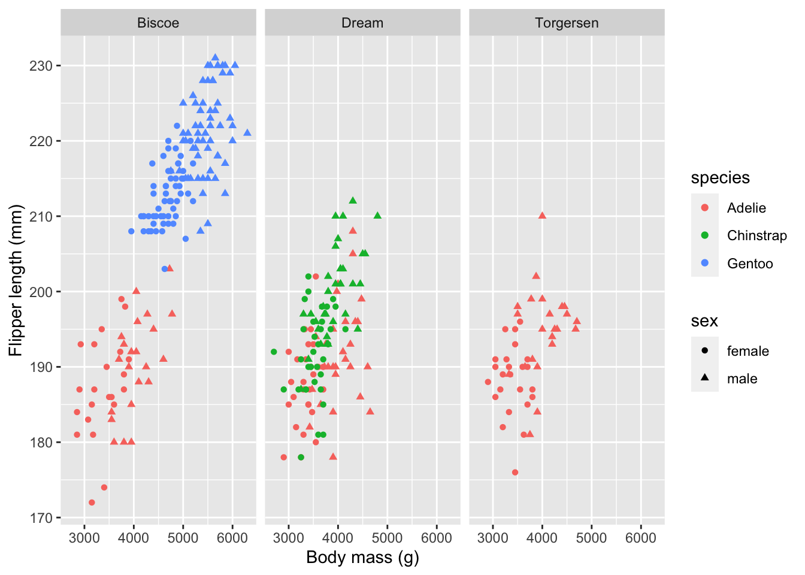

# Graphics formatting {#output-files}


This lesson is about a grab-bag of concepts related to presenting, storing, and repurposing visualizations. First, and most directly linked to the rest of the course, we will consider how a visualization might be changed according to its particular application, whether it is on a poster, in an oral presentation, in a written document, or as part of a technical report. Second we will explore the various notions of the size of a visualization and what that tends to do to parts that are easily scaled and parts that need to be scaled differently. Third we will review formats for storing images, both the general differences between vector and raster formats, and the particulars of various often used file formats and why they matter. Finally I'll lead you to some resources on dealing with text in non-Latin scripts.

## Formatting visualizations for a purpose

A final design check for your visualization can be done by asking two questions:

* How big will this graphic be and how far away will the viewer be from it?
* How long will the viewer have to look at the graphic?

These two questions focus your attention on whether elements of your visualization are too small and whether your visualization is too complex to be understood in the time available. Many visualizations are both too complex and contain detail that is too small. To exercise your thinking about these questions, design a visualization and then ask yourself how it could be made simpler or more complex, and how it should change if its apparent size changed.

Let's start with a frequently used visualization of penguin data.


```r
p1 <- penguins %>% ggplot(aes(body_mass_g, flipper_length_mm, 
                        color = species, shape = sex)) + 
        facet_wrap( ~ island) + 
        geom_point() +
        scale_shape(na.translate = FALSE) +
        labs(x = "Body mass (g)", y = "Flipper length (mm)")
p1
```



This is a fairly complex figure, but it's fine if you will have a minute to look at it on a monitor or printed page within a metre. For quick or distant viewing, the text should be made bigger, the symbols for sex should be dropped (or made more prominent if they are critical information), and the facets should be combined (unless they are critical.) Essentially what I've done with the figure above is to make a "multi-purpose" figure that shows a lot of data, but I've avoided the "should I show feature X?" question. This is one reason editing figures for other uses is so valuable: it focusses your attention on what is essential for your story.

Let's simplify the visualization to emphasize the species differences, discard the sex and island differences, and make it suitable for display in an oral presentation or poster.


```r
p2 <- penguins %>% ggplot(aes(body_mass_g, flipper_length_mm, 
                        color = species)) + 
        geom_point(size = 3, alpha = 0.5) + 
        theme_clean() + 
        theme(axis.title = element_text(size = 18),
              axis.text = element_text(size = 14),
              legend.position = "none") +
        geom_text(aes(label = species),
                  size = 8,
               data = tibble(species = c("Adelie", "Chinstrap", "Gentoo"),
                             body_mass_g = c(4000, 3200, 4500),
                             flipper_length_mm = c(173, 207, 227))) +
        labs(x = "Body mass (g)", y = "Flipper length (mm)")
p2
```


## Graphics formats

Computer graphics can be divided into two types: raster images and vector drawings. A photograph is a raster image; there is a separate color value for each of millions of pixels. A scatter plot is often best represented as a vector drawing which is just a list of instructions: make circles of a certain colour at these locations, draw lines for axes of a particular thickness, etc. For "simple" visualizations, the vector graphics format is smaller to store, faster to transmit, and easy to display at high fidelity on devices with different numbers of dots per unit length. 

R can produce graphics files in many formats, of which the most common vector formats are [PDF](https://en.wikipedia.org/wiki/PDF) (which can include raster images as well) and [SVG](https://en.wikipedia.org/wiki/Scalable_Vector_Graphics) and the most common raster formats are [PNG](https://en.wikipedia.org/wiki/Portable_Network_Graphics) and [JPEG](https://en.wikipedia.org/wiki/JPEG). There are a huge number of other formats, some of which R can produce directly and others can be achieved by conversion.

When you create a PDF or SVG file, you specify the size in units such as mm, cm, or inches. The function `ggsave` will write out a graphic to a file name you specify.


```r
ggsave("static/penguin-plot.pdf", p2, width = 15, height = 10 , units = "cm")
```

```
## Warning: Removed 2 rows containing missing values (geom_point).
```

```r
ggsave("static/penguin-plot.svg", p2, width = 15, height = 10 , units = "cm")
```

```
## Warning: Removed 2 rows containing missing values (geom_point).
```

Figures are often produced with an aspect ratio (height / width) in the range of 0.6-0.7. Square images almost always look "too tall". For multi-panel figures such as the first facetted plot above, this ratio is usually applied to each panel. Deviations from this ratio arise from aesthetich preference, constraints imposed by external factors, and the size of axis labels, titles, and legends.

If you examine the versions of this plot in the PDF file just created, in the HTML version of this book, and the interactive version produced by Rstudio, you will see that they are all slightly different. This includes minor features like the placement of the dots in the horizontal gridlines relative to other features and major features like the size of the on-graph "legend". In particular, text near a border can easily fall partially outside the boarder and get clipped. (In the first version of my PDF of the "C" in Chinstrap was clipped by the y-axis even though it looked fine in the Rstudio preview.) The only way I know to resolve these problems is by testing and iterative refinement of the graph.

The actual sizes of these plots are of course completely fictional. The instructions stored on a computer have no physical size! What purpose to the size measurements have? They allow for the relative sizing of different elements: lines, symbols, and text. If you change the size of the images created above, all that will change is the relative sizes of these elements. This is why the "size" of text elements is not closely tied to a "point size" for a font; ggplot does not know how the figure will be rendered not when stored in a file a certainly not when ultimately placed on a computer monitor, phone, projected on a wall, printed on a page or a poster. The size of a figure in these functions serves as a convenient reminder of how you are planning to use the image and will help you think about your design. Sometimes the simplest way to refine a plot is to change the "size" it is created at slightly to make a bit more or less white space between the graphical elements.

Here is how to make the raster format images; it's fairly easy to guess the functions now!


```r
ggsave("static/penguin-plot.png", p2, width = 15, height = 10, units = "cm", dpi = 300)
```

```
## Warning: Removed 2 rows containing missing values (geom_point).
```

```r
ggsave("static/penguin-plot.jpeg", p2, width = 15, height = 10, units = "cm", dpi = 144)
```

```
## Warning: Removed 2 rows containing missing values (geom_point).
```

For raster images, the the "dots per inch" (dpi) provides some information on how the figure is intended to be displayed. Montiors, phones, and other devices generally range from 100-250 dpi and physical printing usually ranges from 300-600 dpi. There are, of course, exceptions.

The JPEG file format was designed to store photographic images compactly. Image compression algorithms are used to reduce the size of the file from the literal content (x resolution x y resolution x colour bits per pixel, commonly a total of 30-40 million bytes even for a camera phone) to a size of 5-10% of that total. Photographs rarely include precisely straight lines, crisp text, and lots of small symbols. The JPEG compression tends to create lots of "artifacts" or "jaggies" on an image since the data compression algorithms smooth out sharp, high contrast boundaries that are common in data visualizations and rare in photographs. Don't use JPEG for ggplot figures.

The PNG format, by contrast, is excellent at high contrast lines and shapes and has none of these problems. It is also good at photographic images. This is the format you should use for `ggplot` visualizations if, for some reason, you need to produce a raster image. One reason to produce a raster image is that you will know exactly what it will look like when it is displayed or printed. You don't know what size it will be, but you can know the relative placement of all elements on the figure.

A third application for rendering visualiztions is the one we have been using in this course since the very first lesson: in an interactive or rendered R markdown document. There are several options you can provide on the `{r}` line that opens a code block: fig.height and  fig.width which control the size in inches, fig.align (left, right, or center) to control placement left-to-right, and out.height and out.width for scaling to a percentage. For more, see [these notes](https://rmd4sci.njtierney.com/customising-your-figures.html) by Nicholas Tierney. You can also get a figure written to a file in any of the formats discussed above using the option dev. Here I'll demonstrate a few of these options. Some of these options only have an effect when your document is knitted.


```r
p1
```


## Vector or raster?

The quality of a vector image (PDF, svg) should always be superior to a raster image (png). Vector images can be redrawn at different scales easily, making it possible for your reader to zoom in on your graphics. If your plot has millions of points or a huge number of lines, then a vector format which requires the computer to draw each feature every time the image is shown will be slow. So you should normally use a raster format (svg for the web, pdf for printing) and only use raster formats (png) for very complicated figures, for example if you notice that your graphics are displaying slowly.


```r
p1
```

```
## Warning: Removed 11 rows containing missing values (geom_point).
```


## Size and resolution

The differences between raster and vector formats give rise to different ideas of a graphics size. Raster images are defined by the number of pixels in each dimension. Vector graphics are not made of pixels, so they are defined by a target size for presentation in inches or centimeters. When they are actually displayed, raster images may be simplified to lower resolution or dots may be interpolated to match the device you are using. Similarly, a vector image on a monitor, printed page, or projected on a screen will have very different sizes, even if the computer doesn't know it. These resizing operations happen all the time, sometimes even interactively (as you zoom on a phone for example) and the person creating the image has no control over how it will be displayed!

## Recommendations

In your code chunks use 

* `fig.width = 6` (6 inches)
* `fig.asp = 0.65` (aspect ratio of height is 65% of the width)
* `out.width = '70%'` (so that there is some blank margin on both sides of your image)
* `fig.align = 'center'`
* `dev = 'svg'` or `dev = 'svglite'` (the output format)

You can set the defaults in your first code chunk using the following code:


```r
knitr::opts_chunk$set(
  fig.width = 6, fig.asp = 0.65, fig.align="center", out.width = '70%'
)
```

Then you only need to specify these chunk options if you need to change them for some reason.


## A solution for scaling graphics

When you show a figure on the screen, on a projector, printed page, or poster, you will want to redesign some elements. There is a relatively new solution to this resizing challenge. (So new it seems to not work sometimes.) 
Once you have made a graphic look just the way you want, you can adjust the scale of the elements of the figure without changing the “physical” size of the image. Here I make the graphic have a much larger "physical" size, but I also scale up all the elements of the graphic by a factor of three (using `scaling = 3`). This allows you to make a high resolution object you can include in a printed poster without redesigning a figure too much -- just set the scaling factor and adjust the width and height by the same factor.


```r
pngfile <- fs::path(knitr::fig_path(),  "penguins-ragg.png")
ggsave(pngfile, p2, device = agg_png, 
        width = 45, height = 30, units = "cm", res = 300, scaling = 3)
```

```
## Warning: Removed 2 rows containing missing values (geom_point).
```

```r
knitr::include_graphics(pngfile)
```


```r
# agg_png("static/penguins-ragg.png", width = 45, height = 30, units = "cm", res = 300, scaling = 3)
# p2
# invisble(dev.off())
```

The `ragg` library and graphics output device also provides reliable rendering text in many (perhaps most) languages and a way to scale the size of images across different output formats. See the link below for more information.


## Further reading

* Notes on [figure scaling in R Markdown](https://r4ds.had.co.nz/graphics-for-communication.html#figure-sizing) from R for Data Science.
* For a demonstration of text in other languages, please see [here](https://www.tidyverse.org/blog/2021/02/modern-text-features/). For a discussion of scaling plots see [here](https://www.tidyverse.org/blog/2020/08/taking-control-of-plot-scaling/).
