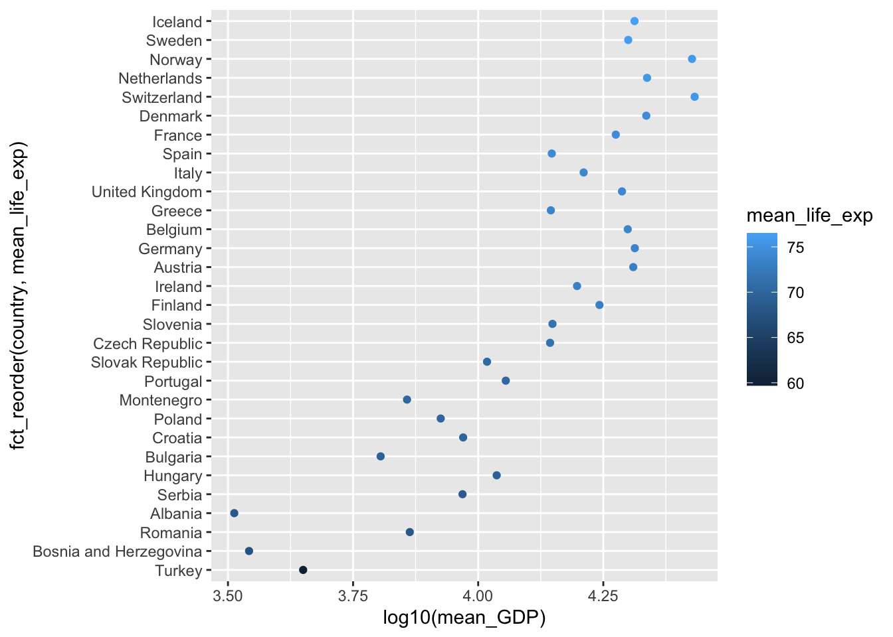
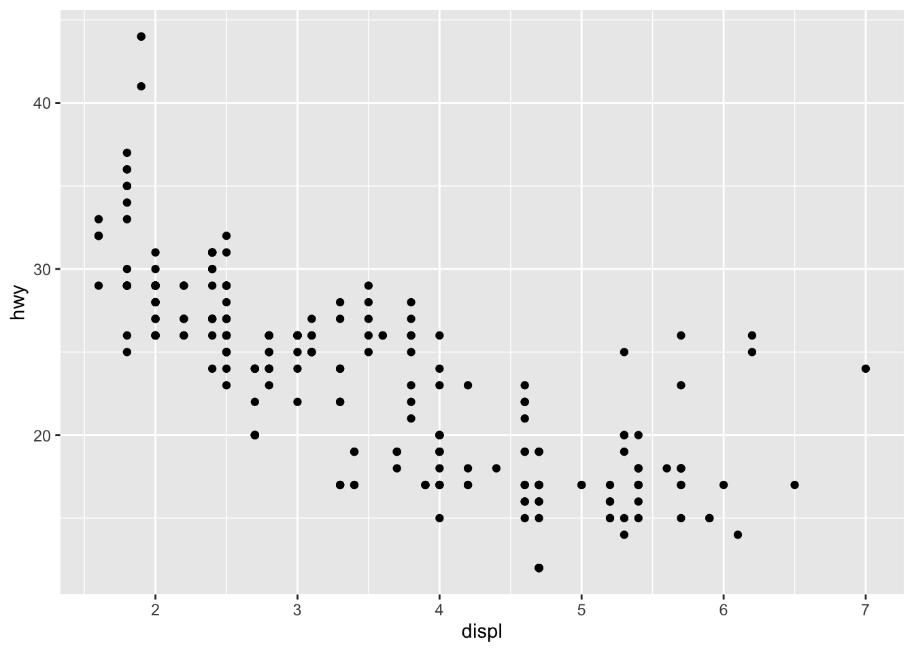

# Reproducible reports {#reproduce}

We've seen throughout the course how to combine computer code, data, tabular and graphical resultss, and natural language writing to explain and communicate our work. R markdown documents are a great tool for writing reports and ensuring they are reproducible. In this lesson we will examine a few more features of R markdown to help customize your reports, make them easier to revise, and make them more effective data analysis communication tools.


## What is reproducibility and why should I care?

Many people use R as an interactive computer tool. This means they sit at the keyboard, type a series of commands, and store the results they want. It's like a very fancy calculator. This is a fantastic way to explore data, learn R, and test out ideas quickly. This work is not reproducible. You would need a recording of everything that was done to reproduce the analysis. If you need to change a small step in your work, you will need to repeat all the steps.

In this course, we have been using R in a slightly more disciplined way, at least for assigned work. For every project, you create a new R markdown file, and then you write your computer instructions in code "chunks", interspersed with English (or any other natural human language) explanations. With Rstudio, you can still use R interactively in this mode, clicking the "play" button on each chunk and seeing the output. When your analysis is done, you can "knit" the whole document. This does two important things:

* all the code is executed in order from top to bottom, and
* the results are kept in a new file.

You may have had the experience during the course of preparing your R markdown file, trying to knit it, and discovering an error. This error is evidence that your R markdown document is not complete, so if you rely on it, you will not be able to repeat your steps later on. So the first way R markdown aids you in reproducing your work is by giving you an easy way to test if your instructions are complete. If you can knit your file today, you can turn off your computer, and come back in a week, and be confident you will be able to reproduce your work then.

We have stressed the value of communication in this course. For some purposes you will just want to communicate by sending someone your knitted report.  When you work in a team, communication is not just about the knitted report, but it includes the instructions needed to recreate the report. R markdown is great for this. But most analyses will require more than just one R markdown file. They will require data. This is why we have also learned to use R projects, version control, and to share files using GitHub. Now you can write a document to show someone else how to reproduce your work, from gathering data to making a report, and you can be confident that they will be able to make all the steps work and even add to your work in a time-efficient way.


## What are barriers to reproducibility and how I can overcome them?

### File paths

If you have a complex project, you will have multiple directories, and possibly many data files. When reading a data file, you will need to refer to the file by name. Make sure you never use the way files are organized on your computer as part of the script. In particular never write anything like:

```
my_data <- read_csv("/Users/airwin/Documents/Stats-project/data/my_data.csv")
```

because there is no way that will work on someone else's computer! If you reorganize your Documents folder, it won't even work on your computer! What should you do instead?

We have been using R packages and organizing all files for a project in a folder (and sub-folders) created just for that project. This is a good first step. The `here` package provides a useful function that allows you refer to a file relative to the directory where your `.Rproj` file is stored. This is [important](https://malco.io/2018/11/05/why-should-i-use-the-here-package-when-i-m-already-using-projects/) to make your R code work on someone else's computer. Here's how you use it:

```
my_data <- read_csv(here("static", "annual-number-of-deaths-by-cause.csv"))
```

If this code works on your computer, with your R project, and you give the whole folder to a collaborator, you don't need to worry how they organize their files.

Sometimes you will think a dataset is too large to put in your project folder. Or the data may be used by multiple projects, and you don't want to have multiple copies. What should you do? The best options are: put the common data files in a GitHub repository (public or private), deposit the data in an online repository such as [osf.io](https://osf.io/), or create an [R data package](https://r-pkgs.org/data.html) of your own to manage the data on your computer and the computers of your collaborators. Which method you prefer will depend on many factors including the size of the data, how often it changes, whether it is public, or if you are allowed to redistribute it.

### Caching time-consuming computations 

R markdown is a great way to manage a analysis notebook, but every time you want to update your analysis, you need to recalculate everything in your document. It is possible to store (cache) the results of a code chunk by giving it a name and setting `cache=TRUE`. This will store the results of that computation so that when the markdown file is recomputed, the stored results are used. This can save time, but also lead to unpredictable results depending on how the results of one code chunk and external data influence the cached code chunk.

Here is an example using the code chunk header `{r test_caching, cache=TRUE}`:


```r
s1 <- summarize(mpg, count = n()) 
s1
```

```
## # A tibble: 1 x 1
##   count
##   <int>
## 1   234
```

If you are going to use this feature, you should read more about [caching in Rmarkdown](https://bookdown.org/yihui/rmarkdown-cookbook/cache.html). This page describes a do-it-yourself caching method which I recommend as well.


### Finding and installing R packages

R packages can be obtained from several sources. The most common sources are [CRAN](https://cran.r-project.org/), [Bioconductor](http://www.bioconductor.org/), and GitHub. The most widely used packages are on CRAN and they are checked regularly to be sure they still work. Anyone can distribute a package on GitHub and make it available, but these packages are missing a level of quality control. We have not used Bioconductor in this course; it is a CRAN-like repository forcussed on bioinformatics computations. 

Installing a new package from CRAN is easy. If you put the appropriate `library` function call in your R markdown document, but you are missing the package, Rstudio will offer to download it for you. If the package is on GitHub, Rstudio won't be able to help. The usual process is to search for the package on Google, then install it. You will help yourself and your colleagues if you write the installation command next to your `library` function call, but preface it with a comment character `#` to stop the code from being executed.

## Make your report look good

An easy to read report is a better report. (Formatting will not turn a bad report into a good one, but good formatting can help make good results easier to digest.)

Specific recommendations:

* Use headings (lines starting with one or more `#`.) Always put a blank line before and after a heading row.
* Use bulletted or numbered lists (start a seqeunce of lines with a `*` or `1.`) when appropriate
* Format your code nicely. Use a [style guide](https://style.tidyverse.org/). Or use an automatic code formatter such as styler (see below). Leave a blank line before and after your code chunk blocks.
* Format your output nicely. This includes tables and figures. (See below.) 
* knit your report, read the formatted version, revise the markdown source, and repeat.

Headings make your markdown document easier to navigate too. Look for the "show outline" button in the upper right of Rstudio's editing pane.

## Code formatting

There is a [tidyverse style guide](https://style.tidyverse.org/). Google has their [own](https://google.github.io/styleguide/Rguide.html), revised from the tidyverse guide. It's worthwhile reading these guides. Code that is formatted in a standard way is easier for you to read and easier for someone else to read.

Here is some carelessly formatted code.

```
gapminder %>% filter(continent =="Europe") %>% group_by(country) %>% summarize(mean_life_exp = mean(lifeExp), mean_GDP = mean(gdpPercap)) %>% ggplot(
aes(color = mean_life_exp, x = log10(mean_GDP), y=fct_reorder(country, mean_life_exp))) + geom_point()
```

Here is the same code (and its output) formatted using `styler`:


```r
gapminder %>%
  filter(continent == "Europe") %>%
  group_by(country) %>%
  summarize(mean_life_exp = mean(lifeExp), mean_GDP = mean(gdpPercap)) %>%
  ggplot(
    aes(color = mean_life_exp, x = log10(mean_GDP), y = fct_reorder(country, mean_life_exp))
  ) +
  geom_point()
```

```
## `summarise()` ungrouping output (override with `.groups` argument)
```



I suggest you write neat and easy to read code in your markdown documents. Don't use automatic tidying as an excuse to make messy code.

## Customization of result reporting in R markdown

The first line of a code chunk can be as simple as `{r}` but you can also include many options between the braces. The [markdown book](https://bookdown.org/yihui/rmarkdown-cookbook/chunk-options.html) describes the options available. Here I will demonstrate a few chunk options related to figures and formatting output.

Knitting a document usually stops when an error is encountered. This is a safety measure to alert you to a document which is not reproducible becuase of errors. On rare occasions you may want to use the option `error=TRUE` to allow error messages to appear in knitted output and not stop the knitting process.


```r
1 + "A"
```

```
## Error in 1 + "A": non-numeric argument to binary operator
```

You can output graphics in multiple file formats by adding `dev = c("png", "pdf")` (and other formats) to the chunk options. These files will be deleted unless you [reqest they be kept](https://bookdown.org/yihui/rmarkdown-cookbook/keep-files.html#keep-files), which is easily done by caching the results of at least one code chunk.


```r
mpg %>% ggplot(aes(displ, hwy)) + geom_point()
```



You can use chunk options to control whether the knitted document includes:

* code (`echo=FALSE` to hide)
* results (`results='hide'`)
* messages (`message=FALSE` to hide)
* warnings (`warning=FALSE` to hide)
* plots (`fig.show='hide'`)
* everything (`include=FALSE`)

You can also stop the code from being evaluated by setting `eval=FALSE`.

If you have multiple lines of code with output in your chunk, the knitted document will contain several blocks of code and output with space between the blocks. These blocks can be combined into one by setting `collapse=TRUE`.

R code that is formatted in standardized way is easier for others to read. You can get your code automatically reformatted using `tidy=TRUE` and the `formatR` package. The `styler` package is another approach to automatic reformatting of R code. Use `tidy='styler'` in the code chunk options.

You can change the size of a figure using `fig.width = 6` and `fig.height=4` where 6 and 4 are lengths in inches. You can also use `out.width="85%"` to set the width of the figure as a proportion of the document width. You can center a figure horizontally using `fig.align='center'`.

You can use R [variables and code](https://bookdown.org/yihui/rmarkdown-cookbook/chunk-variable.html) in the chunk options.

## Documenting which packages you use

If you use R for long enough and with enough other people, you will discover that R packages get revised and don't always work the same way as they used to. This can be a major impediment to reproducibility. The simplest solution to this problem is to document the R packages you use in your analysis by adding a line of code to the end of your report that lists the packages and their version numbers in use. By looking at your knitted output, a user having trouble (possibly you in the future!) can look to see which packages have changed.


```r
sessionInfo()
```

```
## R version 4.0.3 (2020-10-10)
## Platform: x86_64-apple-darwin17.0 (64-bit)
## Running under: macOS Mojave 10.14.6
## 
## Matrix products: default
## BLAS:   /Library/Frameworks/R.framework/Versions/4.0/Resources/lib/libRblas.dylib
## LAPACK: /Library/Frameworks/R.framework/Versions/4.0/Resources/lib/libRlapack.dylib
## 
## locale:
## [1] en_CA.UTF-8/en_CA.UTF-8/en_CA.UTF-8/C/en_CA.UTF-8/en_CA.UTF-8
## 
## attached base packages:
## [1] stats     graphics  grDevices utils     datasets  methods   base     
## 
## other attached packages:
##  [1] gapminder_0.3.0 here_1.0.1      report_0.2.0    forcats_0.5.0  
##  [5] stringr_1.4.0   dplyr_1.0.2     purrr_0.3.4     readr_1.4.0    
##  [9] tidyr_1.1.2     tibble_3.0.4    ggplot2_3.3.2   tidyverse_1.3.0
## 
## loaded via a namespace (and not attached):
##  [1] Rcpp_1.0.6           lubridate_1.7.9.2    assertthat_0.2.1    
##  [4] rprojroot_2.0.2      digest_0.6.27        R6_2.5.0            
##  [7] cellranger_1.1.0     backports_1.2.1      reprex_0.3.0        
## [10] evaluate_0.14        httr_1.4.2           pillar_1.4.7        
## [13] rlang_0.4.9          readxl_1.3.1         rstudioapi_0.13     
## [16] jquerylib_0.1.3      R.utils_2.10.1       R.oo_1.24.0         
## [19] effectsize_0.4.3-1   rmarkdown_2.6.4      styler_1.3.2        
## [22] labeling_0.4.2       munsell_0.5.0        broom_0.7.4         
## [25] compiler_4.0.3       modelr_0.1.8         xfun_0.19           
## [28] pkgconfig_2.0.3      parameters_0.11.0.1  htmltools_0.5.0.9003
## [31] downlit_0.2.1        insight_0.13.0.1     tidyselect_1.1.0    
## [34] bookdown_0.21.6      fansi_0.4.1          crayon_1.3.4        
## [37] dbplyr_2.0.0         withr_2.3.0          R.methodsS3_1.8.1   
## [40] rappdirs_0.3.1       grid_4.0.3           jsonlite_1.7.2      
## [43] gtable_0.3.0         lifecycle_0.2.0      DBI_1.1.0           
## [46] magrittr_2.0.1       bayestestR_0.8.2.1   scales_1.1.1        
## [49] cli_2.2.0            stringi_1.5.3        farver_2.0.3        
## [52] fs_1.5.0             xml2_1.3.2           bslib_0.2.3.9000    
## [55] ellipsis_0.3.1       generics_0.1.0       vctrs_0.3.6         
## [58] tools_4.0.3          R.cache_0.14.0       glue_1.4.2          
## [61] hms_0.5.3            yaml_2.2.1           colorspace_2.0-0    
## [64] rvest_0.3.6          knitr_1.30           haven_2.3.1         
## [67] sass_0.2.0.9005
```

If you want to produce bibliographic citations for your packages you can use the `report` package:


```r
report::cite_packages()  
```

```
##   - H. Wickham. ggplot2: Elegant Graphics for Data Analysis. Springer-Verlag New York, 2016.
##   - Hadley Wickham (2019). stringr: Simple, Consistent Wrappers for Common String Operations. R package version 1.4.0. https://CRAN.R-project.org/package=stringr
##   - Hadley Wickham (2020). forcats: Tools for Working with Categorical Variables (Factors). R package version 0.5.0. https://CRAN.R-project.org/package=forcats
##   - Hadley Wickham (2020). tidyr: Tidy Messy Data. R package version 1.1.2. https://CRAN.R-project.org/package=tidyr
##   - Hadley Wickham and Jim Hester (2020). readr: Read Rectangular Text Data. R package version 1.4.0. https://CRAN.R-project.org/package=readr
##   - Hadley Wickham, Romain François, Lionel Henry and Kirill Müller (2020). dplyr: A Grammar of Data Manipulation. R package version 1.0.2. https://CRAN.R-project.org/package=dplyr
##   - Jennifer Bryan (2017). gapminder: Data from Gapminder. R package version 0.3.0. https://CRAN.R-project.org/package=gapminder
##   - Kirill Müller (2020). here: A Simpler Way to Find Your Files. R package version 1.0.1. https://CRAN.R-project.org/package=here
##   - Kirill Müller and Hadley Wickham (2020). tibble: Simple Data Frames. R package version 3.0.4. https://CRAN.R-project.org/package=tibble
##   - Lionel Henry and Hadley Wickham (2020). purrr: Functional Programming Tools. R package version 0.3.4. https://CRAN.R-project.org/package=purrr
##   - Makowski, D., Lüdecke, D., & Ben-Shachar, M.S. (2020). Automated reporting as a practical tool to improve reproducibility and methodological best practices adoption. CRAN. Available from https://github.com/easystats/report. doi: .
##   - R Core Team (2020). R: A language and environment for statistical computing. R Foundation for Statistical Computing, Vienna, Austria. URL https://www.R-project.org/.
##   - Wickham et al., (2019). Welcome to the tidyverse. Journal of Open Source Software, 4(43), 1686, https://doi.org/10.21105/joss.01686
```

```r
# See also report::report(sessionInfo())
```

To absolutely guarantee you can use R code in the future, some applications will benefit from you keeping copies of all the required packages on your own computer system. The [packrat](https://rstudio.github.io/packrat/) and [checkpoint](https://github.com/RevolutionAnalytics/checkpoint) packages can help you manage packages. I have never felt the need to have this level of reproducibility, but I find it reassuring to know these tools exist.


## Using other languages with R markdown

R markdown is primarily designed to work with R, but there are many other software tools that are commonly combined with R. These specific tools are outside the goals of this course, but it is valuable to learn about connections between R, R markdown and other computer tools.

In data science, many people work with the [python](https://www.python.org/) programming language. Python works with R markdown much the same way as R. Instead of starting a code chunk with `{r}`, begin with `{python}`. Here's an example


```python
import random
[ random.random() for i in range(10) ]
```

```
## [0.015094272619626259, 0.46773991868822884, 0.6216514998803183, 0.15727500109640813, 0.22347816810292087, 0.6362176204272811, 0.7568207398080973, 0.3971201803329304, 0.20311081816872134, 0.04761445064635084]
```

This example requires the R package `reticulate` and a working python interpreter that R can find.

You can use the language [julia](https://julialang.org/) in R markdown as well if you have the R package `JuliaCall` and julia installed on your computer.


```julia
f(x) = x ^ 2
```

```
## f (generic function with 1 method)
```

```julia
f.(1:5)
```

```
## 5-element Array{Int64,1}:
##   1
##   4
##   9
##  16
##  25
```

Both of these langauges have excellent tools for using them directly and can they can be directly connected to R functions, but this method is available in R markdown. Related to the topic of interoperation of computing langauges, but departing from the topic of R markdown, you can also write C++ code in an R session and execute the compiled code directly from R. 

[SQL](https://en.wikipedia.org/wiki/SQL) is a language for describing queries to a widely used style of database. R contains tools for interacting with SQL databases, but it can aslo generate SQL code from `dplyr` functions. 


```r
library(dbplyr)
```

```
## 
## Attaching package: 'dbplyr'
```

```
## The following objects are masked from 'package:dplyr':
## 
##     ident, sql
```

```r
library(RSQLite)
con <- DBI::dbConnect(RSQLite::SQLite(), dbname = ":memory:")
copy_to(con, palmerpenguins::penguins, "penguins")
penguins <- tbl(con, "penguins")
penguins_aggr <-
  penguins %>%
  group_by(species) %>%
  summarize(
    N = n(),
    across(ends_with("mm"), sum, .names = "TOT_{.col}"),
    across(ends_with("mm"), var, .names = "VAR_{.col}"),
    across(ends_with("mm"), mean, .names = "AVG_{.col}"),
  )
penguins_aggr
```

```
## Warning: Missing values are always removed in SQL.
## Use `SUM(x, na.rm = TRUE)` to silence this warning
## This warning is displayed only once per session.
```

```
## Warning: Missing values are always removed in SQL.
## Use `var(x, na.rm = TRUE)` to silence this warning
## This warning is displayed only once per session.
```

```
## Warning: Missing values are always removed in SQL.
## Use `mean(x, na.rm = TRUE)` to silence this warning
## This warning is displayed only once per session.
```

```
## # Source:   lazy query [?? x 11]
## # Database: sqlite 3.34.1 [:memory:]
##   species     N TOT_bill_length… TOT_bill_depth_… TOT_flipper_len…
##   <chr>   <int>            <dbl>            <dbl>            <int>
## 1 Adelie    152            5858.            2770.            28683
## 2 Chinst…    68            3321.            1253.            13316
## 3 Gentoo    124            5843.            1843.            26714
## # … with 6 more variables: VAR_bill_length_mm <dbl>, VAR_bill_depth_mm <dbl>,
## #   VAR_flipper_length_mm <dbl>, AVG_bill_length_mm <dbl>,
## #   AVG_bill_depth_mm <dbl>, AVG_flipper_length_mm <dbl>
```

```r
capture.output(show_query(penguins_aggr))
```

```
## [1] "<SQL>"                                                                                                                                                                                                                                                                                                                                                                                                                                                                                              
## [2] "SELECT `species`, COUNT(*) AS `N`, SUM(`bill_length_mm`) AS `TOT_bill_length_mm`, SUM(`bill_depth_mm`) AS `TOT_bill_depth_mm`, SUM(`flipper_length_mm`) AS `TOT_flipper_length_mm`, VARIANCE(`bill_length_mm`) AS `VAR_bill_length_mm`, VARIANCE(`bill_depth_mm`) AS `VAR_bill_depth_mm`, VARIANCE(`flipper_length_mm`) AS `VAR_flipper_length_mm`, AVG(`bill_length_mm`) AS `AVG_bill_length_mm`, AVG(`bill_depth_mm`) AS `AVG_bill_depth_mm`, AVG(`flipper_length_mm`) AS `AVG_flipper_length_mm`"
## [3] "FROM `penguins`"                                                                                                                                                                                                                                                                                                                                                                                                                                                                                    
## [4] "GROUP BY `species`"
```

```r
rm(con)
```

What does using other tools have to do with making your work reproducible? R markdown is a flexible tool that lets you use more than just R, so if your workflow contains steps external to R, they can sometimes still be included in your report.

## Further reading

* [Project workflow](https://r4ds.had.co.nz/workflow-projects.html) from R4DS
* [Generating SQL with dbplyr](https://emilyriederer.netlify.app/post/sql-generation/)
* Peng. Reproducible research in computatonal science. [10.1126/science.1213847](https://doi.org/10.1126/science.1213847)
* LeVeque et al. [Reproducible research for scientific computing](https://web.stanford.edu/~vcs/papers/CiSE2012-LMS.pdf)
* Sandve et al. Ten simple rules for reproducible computational research. [10.1371/journal.pcbi.1003285](https://doi.org/10.1371/journal.pcbi.1003285)


