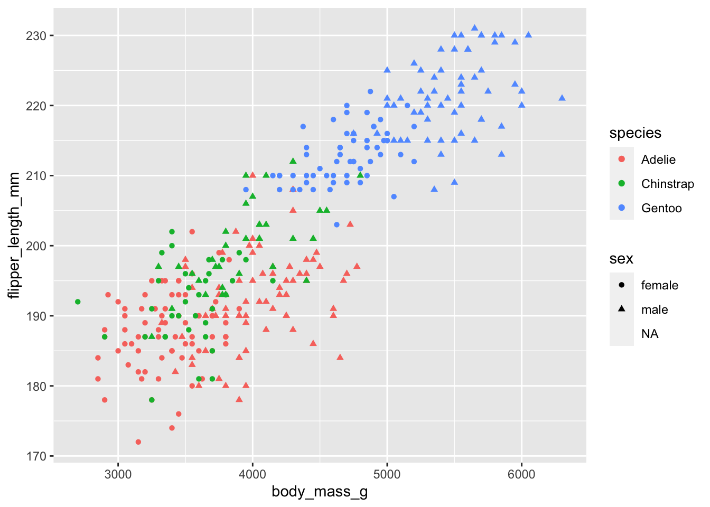
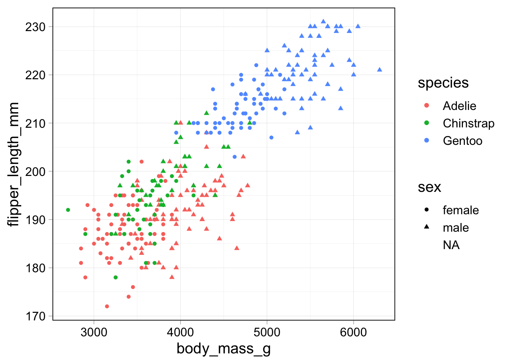
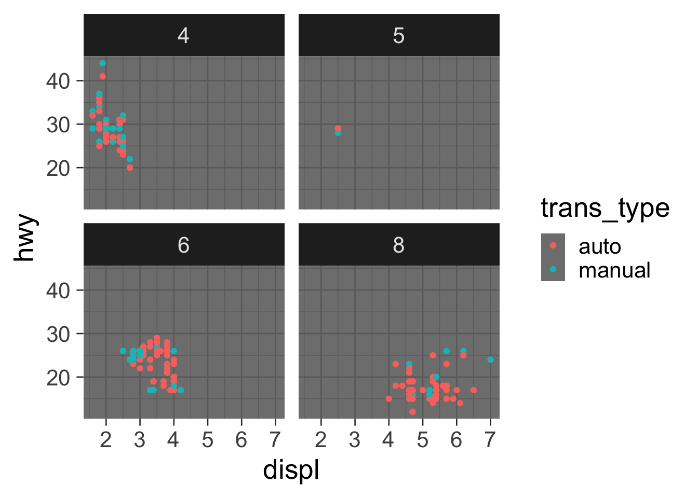
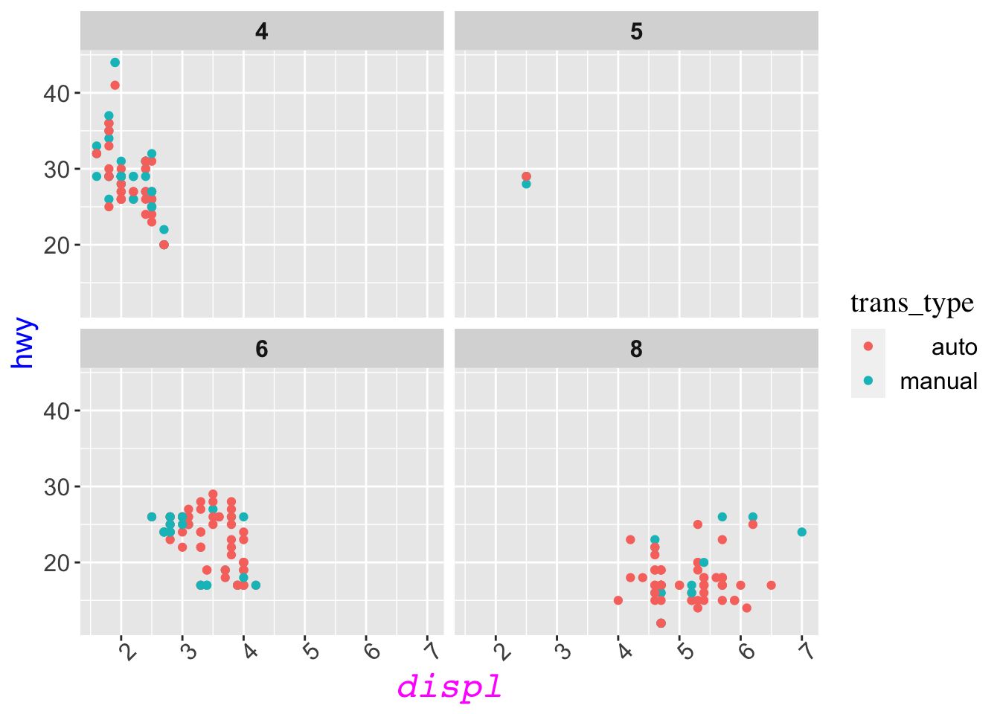
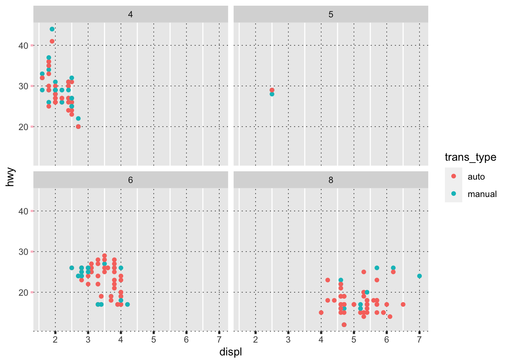
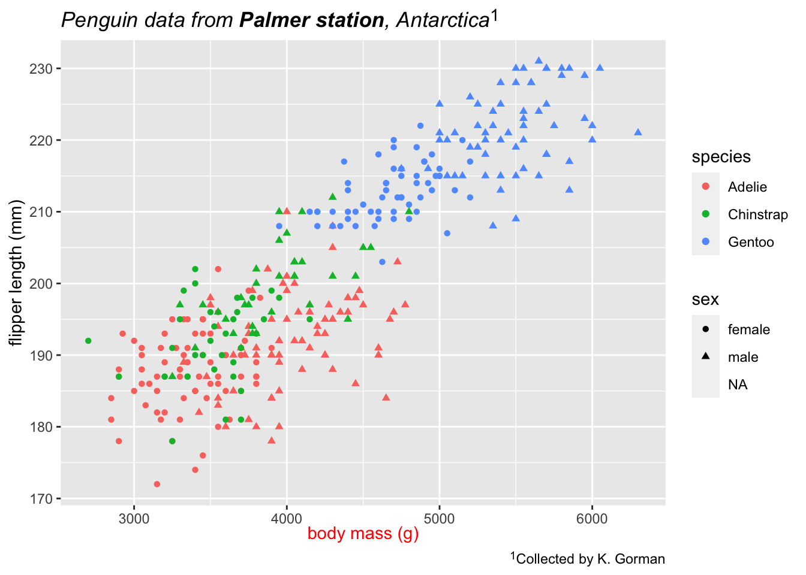

# Themes {#theme}


The theme of a plot refers to all the parts that are not linked to data. This includes titles, axis lables, as well as the labelling of the axis labels or legends (also known as guides). It also includes text characteristics (font, size, colour, bold, italics) and the colour and placement of axes, tick marks, boxes around the plot and legend.

There is a single function, `theme` that controls most of these features, with many options. I'll give examples showing how to control many aspects of the theme.

Within a presentation or report, we often want to use a consistent theme for all figures. You can define many features of a theme and store them in an object in your R environment. You can then use this theme for all your figures. Changing the theme for many figures is then possible with only a single change in one location.

There are many add on packages for working with themes. I'll give examples from [ggtext](), [ggthemes](), and [patchwork]().

## Example plots for customization

We'll use a couple of plots repeatedly: one with facets, and one with many other elements, but no facets.


```r
p1 <- penguins %>% ggplot(aes(x = body_mass_g, y = flipper_length_mm, 
                              color = species, shape = sex)) + 
  geom_point()
p1
```

```
## Warning: Removed 11 rows containing missing values (geom_point).
```



```r
p2 <- mpg %>% 
  unglue_unnest(trans, "{trans_type}({trans_code})") %>%
           ggplot(aes(x = displ, y = hwy, color = trans_type)) +
                    geom_point() +
                    facet_wrap(~ factor(cyl))
p2
```


## Built-in themes

There are [many themes available](https://ggplot2.tidyverse.org/reference/ggtheme.html) that change the whole look of your plot. I've used `theme_bw` many times already, so here are a couple of other examples. For each you can use the `base_size` option (default value 11) to scale text elements and `base_line_size` to scale line elements of the figure.


```r
p1 + theme_linedraw(base_size = 15, base_line_size = 0.2)
```

```
## Warning: Removed 11 rows containing missing values (geom_point).
```



```r
p2 + theme_dark(base_size = 20)
```



There are also add-in packages with more themes: `ggthemes` has `theme_tufte` and `theme_economist`


```r
p1 + theme_economist() + scale_fill_economist()
```

```
## Warning: Removed 11 rows containing missing values (geom_point).
```


Another collection of themes is available in [ggthemer](https://github.com/Mikata-Project/ggthemr). The main goal of this lesson is to give you the vocabulary and skills to customize the theme of your plot, so I won't spend any more time on theme packages. On to the details!

## Customizing text on a figure

The most common change I want to make to a plot's theme (after axis and guide labels) is to increase the size of the text. This can be done using `theme(text= ...)` or for specific elements, `theme(axis.title=...)` (see the help page for more elements of the theme that can be set with a text element.) On the right side of the equals sign, you need the function `element_text` which allows you to control 10 different characteristics of your text. Here is an example of a few of the features.

Themes are controlled hierarchically, so adjusting `text` affects all text on the plot. Adjusting `axis.title` affects both `axis.title.x` and `axis.title.y`.


```r
p2  + theme(text = element_text(size = 15),
            axis.text.x = element_text(angle = 45),
            axis.title.y = element_text(color = "blue"),
            strip.text = element_text(face = "bold"),
            legend.text = element_text(hjust = 1),
            legend.title = element_text(family = "serif"),
            axis.title.x = element_text(color = "#FF00FF", size = 18, face = "italic", family = "mono"))
```



Compare this with the original version of the plot and play "spot the differences".


## Customizing borders, ticks, axis labels

There are many elements on a plot drawn with lines. These too can be customized all at once using `theme(line = ...)` or element by element using, for example `theme(axis.line.x=...)` or `theme(axis.ticks.y=...)`. The grid lines can be adjusted using `panel.grid.major` and `panel.grid.minor`. These elements are named and controlled hierarchically as well. The right hand size of the expressions above must have an `element_line` function which allows you to control color, size, linetype and other features like arrows. 


```r
p2 + theme(line = element_line(size = 1),
           axis.ticks.y = element_line(color = "pink"),
           axis.line.x = element_line(linetype = 3, size = 0.25),
           panel.grid.minor.y = element_blank(),
           panel.grid.major = element_line(linetype = 3, color = "black", size = 0.25))
```



## Enhanced text

The `ggtext` package allows you to use markdown and HTML code in any text element on your plot. You need to use `element_markdown` (or `element_textbox_simple`) instead of `element_text` for each element you want to use this enhanced formatting method with.

Unlike other theme elements, you can't easily use `ggtext` formatting hierarchically: you can't simply set all text to use `elemment_markdown` or even both axis labels. You must control each element individually.


```r
p1 + labs(title = "_Penguin data from **Palmer station**, Antarctica_<sup>1</sup>",
          x = "<span style = 'color:red;'>body mass (g)</span>",
          y = "flipper length (mm)",
          caption = "<sup>1</sup>Collected by K. Gorman"
          ) + 
  theme(plot.title = element_markdown(lineheight = 1.2),
        plot.caption = element_markdown(),
        axis.title.x = element_textbox_simple(halign = 0.5)
        )
```

```
## Warning: Removed 11 rows containing missing values (geom_point).
```



You can also add formatted boxes for the titles of facets and at any location on a plot.


```r
p2 + theme(
    strip.background = element_blank(),
    strip.text = element_textbox(
      size = 12,
      color = "white", fill = "#5D729D", box.color = "#4A618C",
      halign = 0.5, linetype = 1, r = unit(5, "pt"), width = unit(1, "npc"),
      padding = margin(2, 0, 1, 0), margin = margin(3, 3, 3, 3)
    )
)
```


```r
text_annotations <- tibble(
  label = c(
    "Some text **in bold.**",
    "Linebreaks<br>Linebreaks<br>Linebreaks",
    "*x*<sup>2</sup> + 5*x* + *C*<sub>*i*</sub>",
    "Some <span style='color:blue'>blue text **in bold.**</span>"
  ),
  x = c(4000, 5200, 5700, 5000),
  y = c(220, 200, 175, 150),
  hjust = c(0.5, 0, 0, 1),
  vjust = c(0.5, 1, 0, 0.5),
  angle = c(0, 0, 45, -45),
  # sex = c("male", "male", "male", "male")
)
p1 + geom_richtext(mapping = aes(x = x, y = y, label = label,
                                 angle = angle, hjust = hjust, vjust = vjust),
                   data = text_annotations,
                   inherit.aes = FALSE,
                   fill = NA,
                   color = "black")
```

```
## Warning: Removed 11 rows containing missing values (geom_point).
```


## Further reading

* [ggplot tidyverse documentation](https://ggplot2.tidyverse.org/reference/theme.html) - like the `theme` help page, but shows the results of the examples
* Documentation for [ggtext](https://github.com/wilkelab/ggtext)
