# Making maps {#mapping-1}


There are many ways to make maps with R. The two general types are: vector maps where regions are represented by a set of points and lines around region boundaries and tile maps where a pre-drawn map is downloaded from a cloud service such as Google maps. In both cases, points, lines, and colour tiles can be added to display data on the map. Vector maps are drawn from a series of points and so can be drawn using many different projections, giving you the freedom to choose the projection most suitable for your map. Tile maps are images and can't be reprojected, but can have a lot of information on them in the form of colours for terrain, labels, and points of interest. Tile maps can be used in a pan-and-zoom mode like many familiar online mapping tools.

In this lesson we will look at drawing vector maps.

## Vector map

Here is a map of the 48 continental US states, with a quantiative variable used to shade each region. To change the variable used to colour the states, simply provide a new dataset with a numeric column and a text column called "state". The map is drawn with ggplot, so the other features of ggplot including annotation, setting colour scales, labelling axes, etc., are all available to you and work the same way as for other visualizations we have created.


```r
states_map <- map_data("state")
crimes <- as_tibble(USArrests, rownames="state") %>% mutate(state = tolower(state))
ggplot(crimes, aes(map_id = state)) +
    geom_map(aes(fill = Murder), map = states_map) +
    expand_limits(x = states_map$long, y = states_map$lat) +
  coord_map("albers", 40, 100)
```

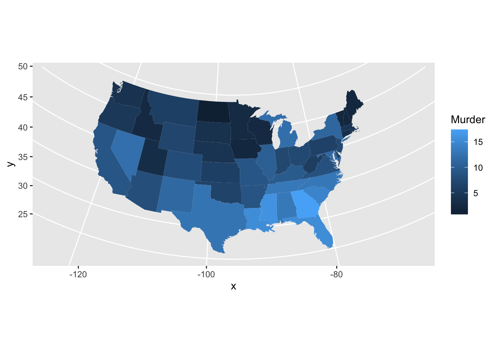

The `map_data` function works with maps from the `maps` package, including two world maps (`world` and `world2`) and detailed maps of France, Italy, New Zealand, the USA and its states. The `maps` package has several other datasets including a list of canadian cities with population greater than about 1000. The world is a large and complex place and you will often need to obtain data and map boundaries for regions which are not readily available in this package. Some guidance appears at the end of the lesson, but this can be a challenging task.

The surface of the Earth is curved, so choices need to be made when plotting it on a flat surface. These choices are called [projections](https://en.wikipedia.org/wiki/List_of_map_projections).
Here's a map of France using an azimuthal equal area projection (see `mapproj::mapproject()` for more)


```r
map_data <- map_data('france') 
ggplot(data = map_data, aes(group = group, map_id=region)) + 
       geom_map(map = map_data,
                  aes(x = long, y = lat),
                  fill = "white", colour = "#7f7f7f", alpha = 0.5, size=0.5)  +
  coord_map("azequalarea")
```

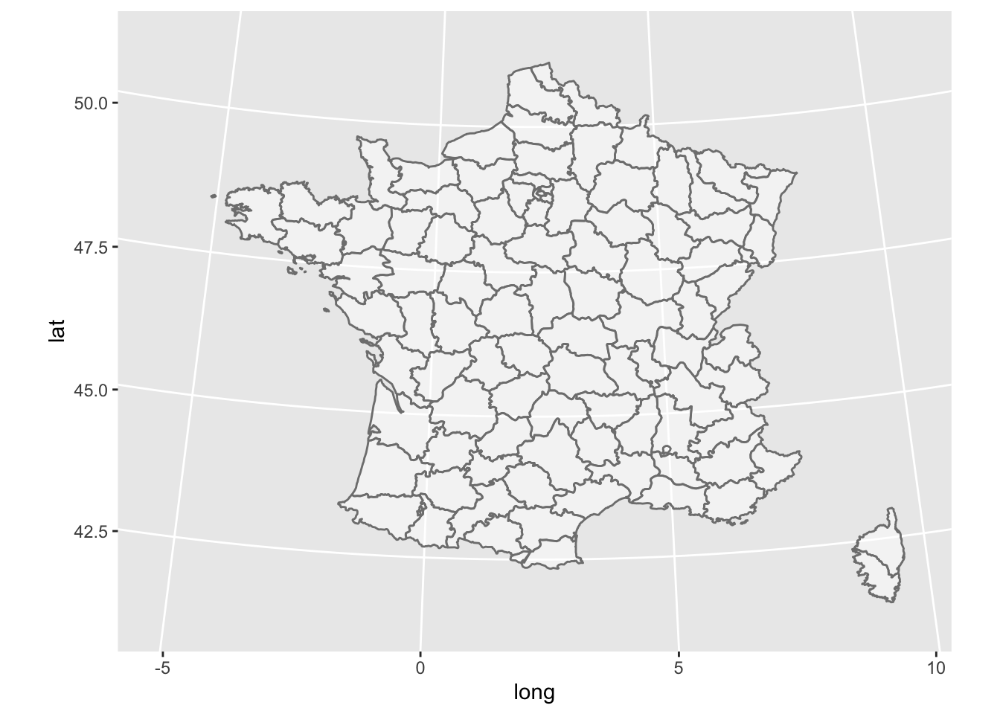

Incidentally, a frequently used projection for the USA is the Bonne. Revise the USA map to use that projection by adding the following code `+ coord_map("bonne", 45)`. (Albers:  `coord_map("albers", 40, 100)`  and Lambert: `coord_map("lambert", 40, 100)`
are also used, although Lambert makes the USA look very wide in the North.)

Political boundaries for the world are available as "world" (centered on the Atlantic Ocean) or "world2" (centered on the Pacific Ocean.)


```r
WorldData <- map_data('world')  
ggplot(WorldData, aes(map_id=region)) + 
  geom_map(map = WorldData,
           aes(x = long, y = lat),
                  fill = "lightgray", colour = "#7f7f7f", alpha = 0.5, size=0.5) +
  theme_bw()
```

```
## Warning: Ignoring unknown aesthetics: x, y
```

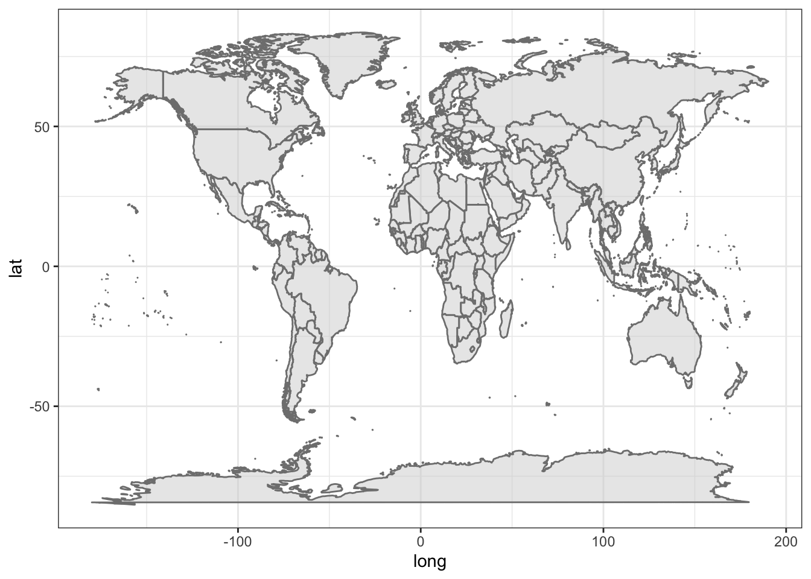
You can select a specific country if you want, for example, Canada:


```r
my_map <- map_data('world', region='Canada')  
ggplot(my_map, aes(map_id=region)) + 
  geom_map(map = my_map,
           aes(x = long, y = lat),
                  fill = "white", colour = "#7f7f7f", alpha = 0.5, size=0.5) +
  theme_bw() +
  coord_map("albers", 60, 90)
```

```
## Warning: Ignoring unknown aesthetics: x, y
```

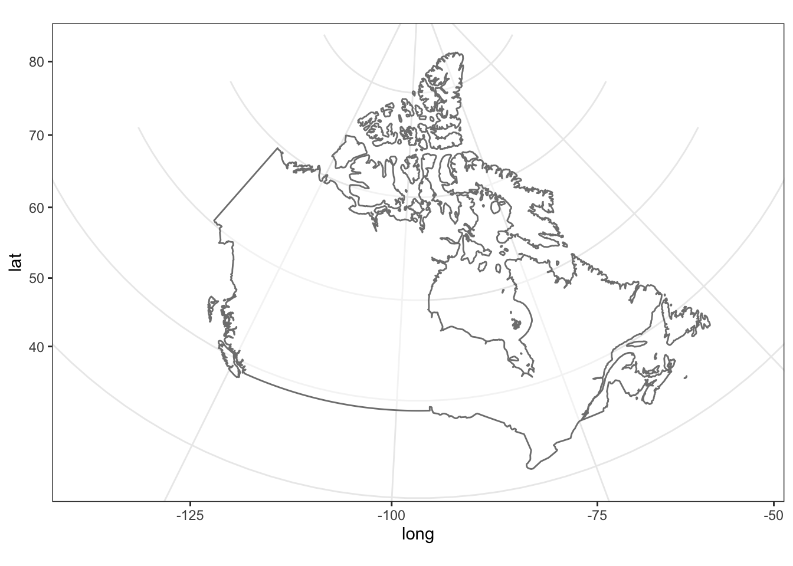

This map of Canada is made of 141 regions, separating islands, but does not contain provincial boundaries.


```r
ggplot(my_map, aes(map_id=region)) + 
  geom_map(map = my_map,
           aes(x = long, y = lat),
           size=0.5) +
  theme_bw() +  coord_map("albers", 60, 90)
```

```
## Warning: Ignoring unknown aesthetics: x, y
```

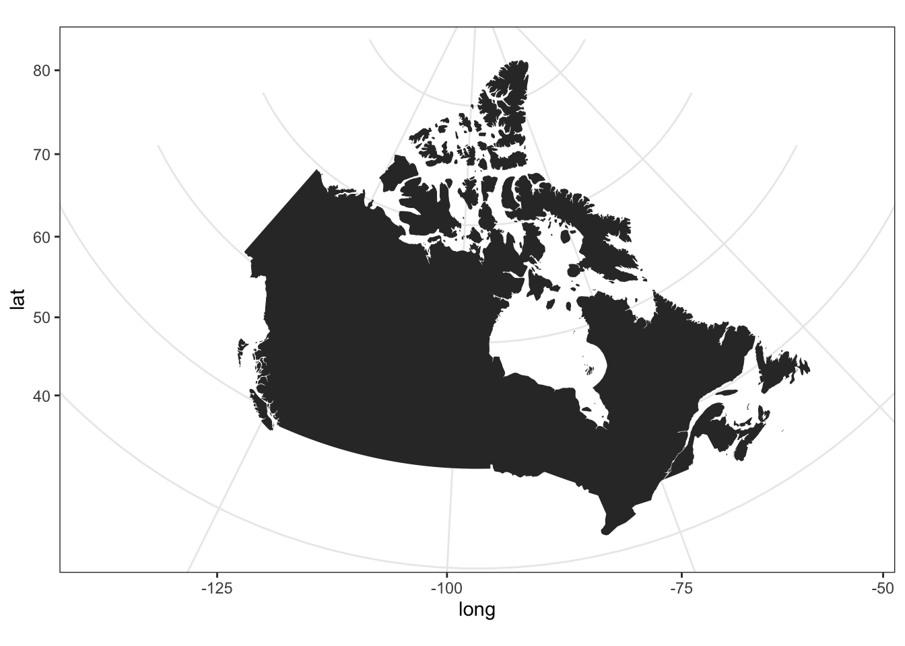

Here is a list of 252 regions available in the world map (abbreviated here).


```r
WorldData %>% pull(region) %>% unique() %>% head()
```

```
## [1] "Aruba"       "Afghanistan" "Angola"      "Anguilla"    "Albania"    
## [6] "Finland"
```

The map of the globe and even of Canada does not look good at high latitudes, espcially if either pole is included. Here is a projection that is a bit more suitable for those regions. The `geom_map` function is not perfect; it creates stray lines when a region is clipped by the projection.


```r
p1 <- ggplot(WorldData, aes(group=group, map_id=region)) + 
  geom_map(map = WorldData, aes(long, lat),
                  fill = "gray80", colour = "#7f7f7f", alpha = 0.5, size=0.5) +
  labs(x="", y="") + theme_bw() +
  theme(axis.text = element_blank(), 
        axis.ticks = element_blank(), 
        rect = element_blank())
```

```
## Warning: Ignoring unknown aesthetics: x, y
```

```r
p2a <- p1 + coord_map("perspective", 2.5, 
                      orientation=c(60, -100, 0))
      # observer distance 2.5 Earth radii 
p2b <- p1 + coord_map("perspective", 2.5, 
                      orientation=c(-60, 80, 0)) 
      # try also orthographic, with no observer distance
p2a + p2b
```

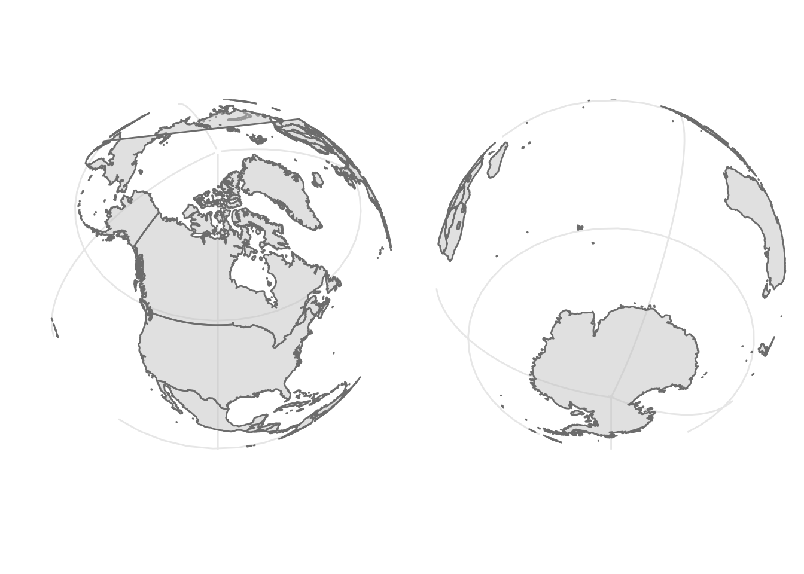

## Detailed maps of Canada

Detailed maps of Canada are not part of the `maps` package in R, so we need to do a bit of extra work. I will show you how to obtain map files called "shapefiles" from Statistics Canada and learn to use them with R. This is well worth learning as many maps are distributed in this format after being developed with GIS software. You don't need to repeat these steps unless you want to make your own custom maps of Canada.

Here are some packages we need to get the job done.


```r
library(sf) # the base package manipulating shapes
library(rgdal) # geo data abstraction library
library(geojsonio) # geo json input and output
library(spdplyr) # the `dplyr` counterpart for shapes
library(rmapshaper) # the package that allows geo shape transformation
```

I  followed [these instructions](https://tengl.net/blog/2020/1/7/drawing-canada-maps-in-r) to get and transform the shape files for 2011 census divisions in Canada. There are many [other options](https://www12.statcan.gc.ca/census-recensement/2011/geo/bound-limit/bound-limit-2016-eng.cfm).
The [2011](https://www12.statcan.gc.ca/census-recensement/2011/geo/bound-limit/bound-limit-2011-eng.cfm) files are marked as archived content, but I had trouble with the 2016 files. Choose ARCGis .shp file format. Pick the cartographic boundary file. You should get a zip file called `gpr_000b11a_e`.

The shapefiles are very detailed and need to be simplified before being plotted with R. Here is some code to simplify these very detailed shapefiles down to simpler maps. This processing took about two hours on my computer, so when we are done we store the results in a file to enable rapid reuse.

```
canada_raw = readOGR(dsn = "~/Downloads/gcd_000b11a_e", layer = "gcd_000b11a_e", encoding = 'latin1') 
canada_raw_json <- geojson_json(canada_raw)  # takes a few minutes
canada_raw_sim <- ms_simplify(canada_raw_json) # also takes a few minutes
geojson_write(canada_raw_sim, file = "static/canada_cd_sim.geojson") 
```

### Draw the map

Now that the preliminary work is done we can read the map data into R and get to mapmaking.


```r
canada_cd <- st_read("static/canada_cd_sim.geojson", quiet = TRUE) 
```

The official projection for maps of Canada is the Lambert conformal conic ("lcc") with the following latitude and longitude parameters.


```r
crs_string = "+proj=lcc +lat_1=49 +lat_2=77 +lon_0=-91.52 +x_0=0 +y_0=0 +datum=NAD83 +units=m +no_defs"
```

Here is a theme for the map to remove axes, ticks, borders and more.


```r
theme_map <- function(base_size=9, base_family="") { 
	# require(grid)
	theme_bw(base_size=base_size, base_family=base_family) %+replace%
		theme(axis.line=element_blank(),
			  axis.text=element_blank(),
			  axis.ticks=element_blank(),
			  axis.title=element_blank(),
			  panel.background=element_blank(),
			  panel.border=element_blank(),
			  panel.grid=element_blank(),
			  panel.spacing=unit(0, "lines"),
			  plot.background=element_blank(),
			  legend.justification = c(0,0),
			  legend.position = c(0,0)
		)
}
```

Now we draw the map with some colours from a palette.


```r
map_colors <- RColorBrewer::brewer.pal(9, "Pastel1") %>% rep(2)   # 18 colours, 9 repeated

ggplot() +
	geom_sf(aes(fill = PRUID), color = "gray60", size = 0.1, data = canada_cd ) +
	coord_sf(crs = crs_string) + # 6
  scale_fill_manual(values = map_colors) +
	guides(fill = FALSE) +
	theme_map() +
	theme(panel.grid.major = element_line(color = "white"))
```

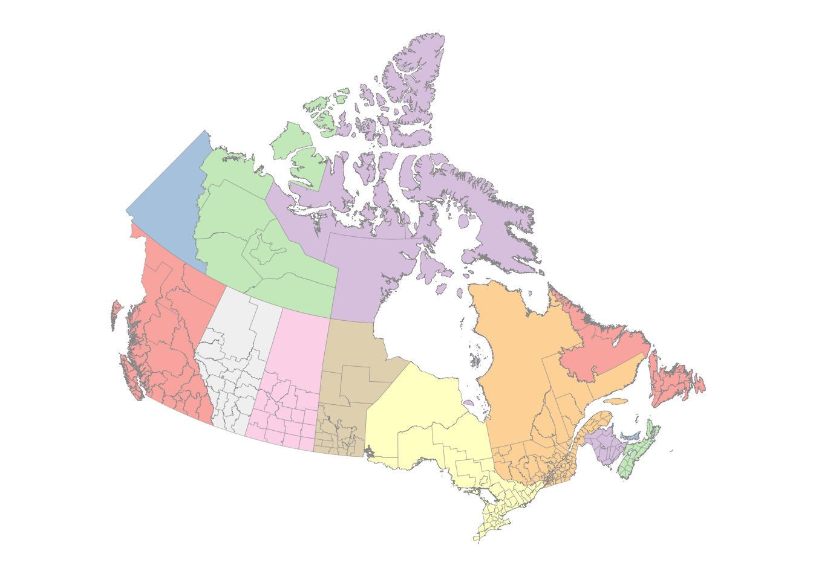

If we have a list of latitudes and longitudes, we can add points to the map.


```r
city_coords <- tribble( ~city, ~lat, ~long,
"Vancouver",	49.2827,	-123.1207,
"Calgary",	51.0447,	-114.0719,
"Edmonton",	53.5461,	-113.4938,
"Toronto",	43.6532,	-79.3832,
"Ottawa",	45.4215,	-75.6972,
"Montreal",	45.5017, 	-73.5673,
"Halifax", 44.6488, -63.5752)
```

Convert the latitude and longitudes to map coordinates.


```r
sf_cities = city_coords %>%
	select(long, lat) %>% # 1
	as.matrix() %>% # 2
	st_multipoint(dim = 'XY') %>% 
	st_sfc() %>% 
	st_set_crs(4269)
```

Make the map with projected points.


```r
ggplot() +
	geom_sf(aes(fill = PRUID), color = "gray60", size = 0.1, data = canada_cd) +
	geom_sf(data = sf_cities, color = '#001e73', alpha = 0.5, size = 3) + # 17
	coord_sf(crs = crs_string) +
	scale_fill_manual(values = map_colors) +
	guides(fill = FALSE) +
	theme_map() +
	theme(panel.grid.major = element_line(color = "white"),
		  legend.key = element_rect(color = "gray40", size = 0.1))
```

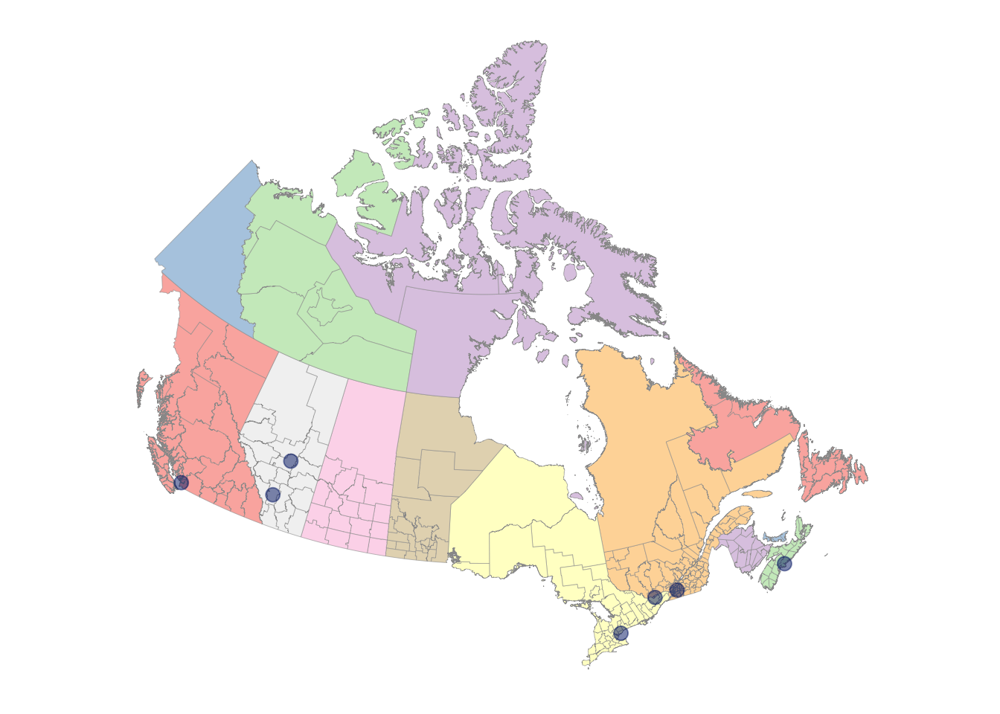

It's easy to focus in on the Maritimes region of Canada -- just filter the data to include only the province or census districts you want. Here are some of the names in the map data that you can use for filtering.


```r
canada_cd %>% pull(PRNAME) %>% unique()
```

```
##  [1] "Manitoba"                                           
##  [2] "British Columbia / Colombie-Britannique"            
##  [3] "Alberta"                                            
##  [4] "Saskatchewan"                                       
##  [5] "Ontario"                                            
##  [6] "Quebec / Québec"                                    
##  [7] "Newfoundland and Labrador / Terre-Neuve-et-Labrador"
##  [8] "Nova Scotia / Nouvelle-Écosse"                      
##  [9] "New Brunswick / Nouveau-Brunswick"                  
## [10] "Prince Edward Island / Île-du-Prince-Édouard"       
## [11] "Northwest Territories / Territoires du Nord-Ouest"  
## [12] "Nunavut"                                            
## [13] "Yukon"
```

```r
canada_cd %>% pull(CDNAME) %>% unique() %>% sample(10)
```

```
##  [1] "Division No. 16"  "Lajemmerais"      "Montcalm"         "Matane"          
##  [5] "Montréal"         "Sunbury"          "Algoma"           "Central Okanagan"
##  [9] "Richmond"         "Kenora"
```

I've changed the latitude and longitude parameters for the projection to values more suitable for this part of Canada.
 

```r
crs_string2 = "+proj=lcc +lat_1=40 +lat_2=50 +lon_0=-75 +x_0=0 +y_0=0 +datum=NAD83 +units=m +no_defs"
ggplot() +
	geom_sf(aes(fill = PRUID), color = "gray60", size = 0.1, 
	        data = canada_cd %>% filter(PRNAME %in% c("Nova Scotia / Nouvelle-Écosse", "New Brunswick / Nouveau-Brunswick", "Prince Edward Island / Île-du-Prince-Édouard"))) +
	# geom_sf(data = sf_cities, color = '#001e73', alpha = 0.5, size = 3) + # 17
	coord_sf(crs = crs_string2) +
	scale_fill_manual(values = map_colors) +
	guides(fill = FALSE) +
	theme_map() +
	theme(panel.grid.major = element_line(color = "white"),
		  legend.key = element_rect(color = "gray40", size = 0.1))
```

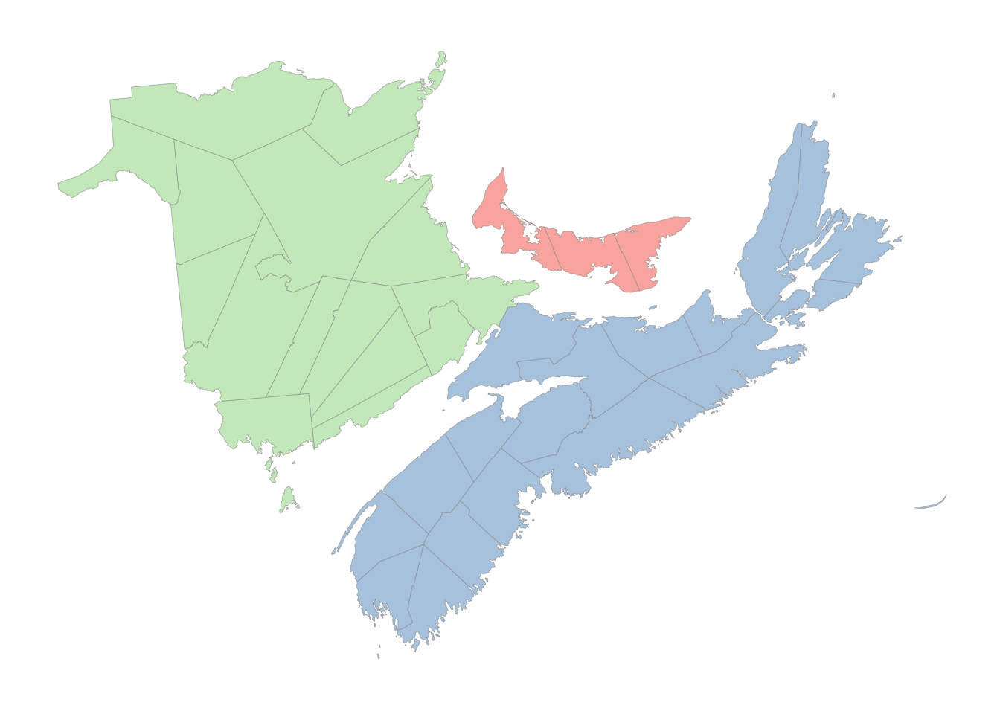

You can also [crop](https://datascience.blog.wzb.eu/2019/04/30/zooming-in-on-maps-with-sf-and-ggplot2/) the data to be drawn or the projected map. This is a bit more complex than you might expect since you need to be sure you are specifying the area to be plotted and the actual projected coordinates in the same coordinate system. You can easily get errors (invalid points in a projection), empty maps, or croppings that don't look right. See the link at the start of this paragraph for several approaches.


```r
crs_string2 = "+proj=lcc +lat_1=40 +lat_2=50 +lon_0=-75 +x_0=0 +y_0=0 +datum=NAD83 +units=m +no_defs"
zoom_to <- c(-64.3683, 45.8979) # Sackville, New Brunswick; could try c(-63.5752, 44.6488)  # Halifax
zoom_level <- 6
C <- 40075016.686   # ~ circumference of Earth in meters
x_span <- C / 2^zoom_level
y_span <- C / 2^(zoom_level)
zoom_to_xy <- st_transform(st_sfc(st_point(zoom_to), crs = 4326),
                           crs = crs_string2)
disp_window <- st_sfc(
    st_point(st_coordinates(zoom_to_xy - c(x_span / 2, y_span / 2))),
    st_point(st_coordinates(zoom_to_xy + c(x_span / 2, y_span / 2))),
    crs = crs_string2
)
ggplot() +
	geom_sf(aes(fill = PRUID), color = "gray60", size = 0.1, 
	        data = canada_cd) +
  # geom_sf(data = sf_cities, color = '#001e73', alpha = 0.5, size = 3) + # 17
  geom_sf(data = zoom_to_xy, color = 'red') +
  coord_sf(xlim = st_coordinates(disp_window)[,'X'],
             ylim = st_coordinates(disp_window)[,'Y'],
             crs = crs_string2, datum = crs_string2) +
	scale_fill_manual(values = map_colors) +
	guides(fill = FALSE) +
	theme_map() +
	theme(panel.grid.major = element_line(color = "white"),
		  legend.key = element_rect(color = "gray40", size = 0.1))
```

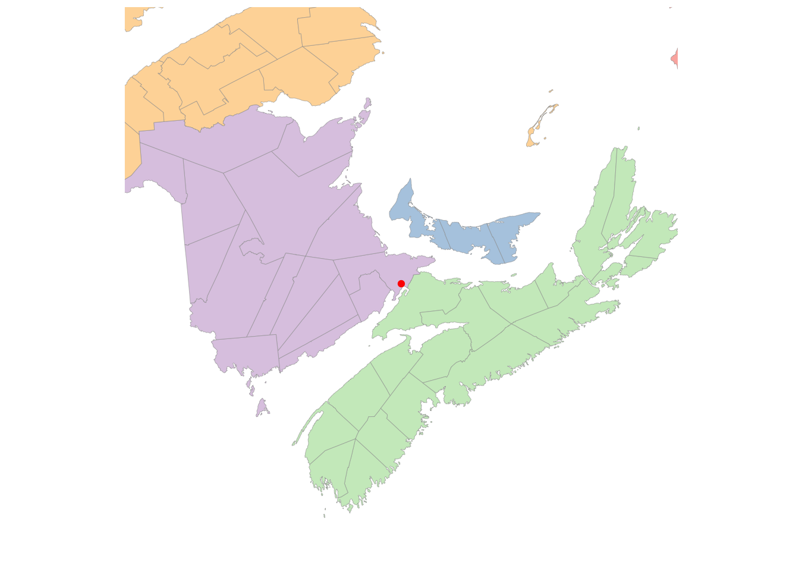

### Just the map, please

[Here](https://gist.githubusercontent.com/mikelotis/2156d7c170d10d2c77cb79424fe2137d/raw/7a13748ed7ea5ba64876c77c53b6cb64dd5c3ab0/canada-province.geojson) is a file of province boundaries that can be used without showing the census district regions. I've added a latitude-longitude grid to the map.


```r
canada_prov <- geojson_read("https://gist.githubusercontent.com/mikelotis/2156d7c170d10d2c77cb79424fe2137d/raw/7a13748ed7ea5ba64876c77c53b6cb64dd5c3ab0/canada-province.geojson", what="sp") %>% st_as_sf()

ggplot() +
	geom_sf(aes(fill = name), 
	        color = "gray60", size = 0.1, 
	        data = canada_prov ) +
	coord_sf(crs = crs_string) + 
  scale_fill_manual(values = map_colors) +
	guides(fill = FALSE) +
	theme_map() +
	theme(panel.grid.major = element_line(color = "lightgray"),
	      panel.grid.minor = element_line(color = "lightgray")) +
  scale_x_continuous(breaks = seq(-160, 0, 10)) +
  scale_y_continuous(breaks = seq(40, 85, 5))
```

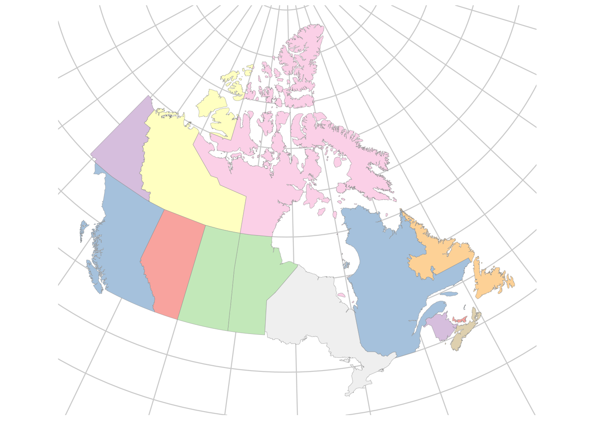
## Summary

Map making is complex for at least two reasons: obtaining the data to describe complex political boundaries and using suitable projections for your data. This lesson introduced you to some simple solutions to both problems and gave a starting point for learning more about the complexity of making customized maps.

## Further reading

* [Wilke](https://clauswilke.com/dataviz/geospatial-data.html)
* [Healy](https://socviz.co/maps.html#maps)
* Mapping example in our [MDS](#mds) lesson.
* A collection of maps from a [30 day challenge](https://github.com/AlexandraKapp/30daymapchallenge)
* Maps using [ggmap + openstreetmaps](https://www.earthdatascience.org/courses/earth-analytics/lidar-raster-data-r/ggmap-basemap/)
* The [PROJ](http://www.euref.eu/documentation/Tutorial2019/t-01-Evers.pdf) tool for projecting map coordiates
* R journal article on [mapping with mapmisc](https://journal.r-project.org/archive/2016-1/brown.pdf)
* Finding and fixing problems with [simple feature geometry](https://www.r-spatial.org/r/2017/03/19/invalid.html) and a [book](https://keen-swartz-3146c4.netlify.app/), especially section 8.4
* There are a huge number of map projections. Here is an [introduction](http://geokov.com/education/map-projection.aspx) to some of the kinds of projections.

### Maps of Canada

* The [blog](https://tengl.net/blog/2020/1/7/drawing-canada-maps-in-r) I used as source material for the detailed maps of Canada
* Province and census division [shape files](https://www12.statcan.gc.ca/census-recensement/2011/geo/bound-limit/bound-limit-s-eng.cfm?year=19) from Statistics Canada
* [Election data](https://cran.r-project.org/web/packages/mapcan/readme/README.html) for boundaries and chloropleths and populated weighted chloropleths 
* A map showing [wind turbines](https://discuss.ropensci.org/t/osmdata-rnaturalearth-and-magick-for-tidytuesday/2255) in Maritimes


