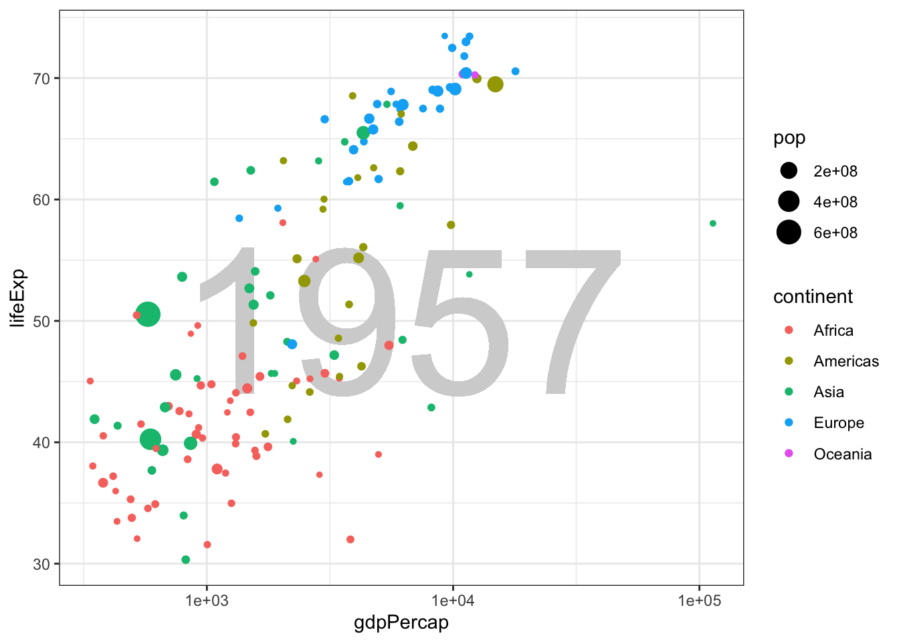
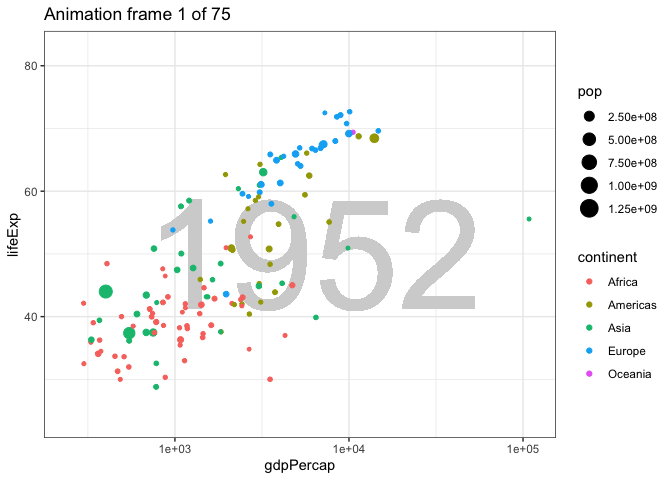

# Dynamic graphics {#dynamic}


In this short lesson I'll introduce two kinds of dynamic graphics. The first is a graphic that allows the reader to interact with the visualization. We've already seen 3d graphs that can be rotated, but you can also get information from hovering over data points. A second kind creates an animation to add another dimension (time) to the visualization. This can be helpful to "tell your story", but it can also be challenging to get the speed of the animation right and to describe it effectively to an audience. That's why Hans Rosling used his animation (way back in lesson 1) as part of an oral presentation.

## Reader interactions

Visualizations that are designed to respond to interactions (clicks, mouse movement) from the reader can show additional detail and provide opportunities for new ways of communication that are not possible with a static visualization. If you, as a creator of a visualization, require the reader to interact with your work to get the full meaning, you may find that your message is not communicated as effectively.

We will use the javascript plotly package, which is easily combined with ggplot graphics, to create some simple interactive visualizations.

## Example

The javascript package plot_ly can be used with R, both in Rstudio and in knitted HTML output. It automatically shows the coordinates of any point you aim your pointer at. It also provides the ability to pan and zoom the plot to focus in on part of the data. When you mouse is over the plot area, a menu appears at the top of the graph. Experiment with each control until you know what they all do.

plot_ly is a bit slow with a large dataset, so I'll use a subset of the diamonds data.


```r
diamonds %>% slice_sample(n = 1000) %>%
  plot_ly(x = ~ carat, 
          y = ~ price) %>%
  add_markers(color = ~ color)
```

```{=html}
<div id="htmlwidget-577b83b2c696e89a0a9d" style="width:672px;height:480px;" class="plotly html-widget"></div>
<script type="application/json" data-for="htmlwidget-577b83b2c696e89a0a9d">{"x":{"visdat":{"18f42163b55e":["function () ","plotlyVisDat"]},"cur_data":"18f42163b55e","attrs":{"18f42163b55e":{"x":{},"y":{},"alpha_stroke":1,"sizes":[10,100],"spans":[1,20],"type":"scatter","mode":"markers","color":{},"inherit":true}},"layout":{"margin":{"b":40,"l":60,"t":25,"r":10},"xaxis":{"domain":[0,1],"automargin":true,"title":"carat"},"yaxis":{"domain":[0,1],"automargin":true,"title":"price"},"hovermode":"closest","showlegend":true},"source":"A","config":{"showSendToCloud":false},"data":[{"x":[1.5,0.77,0.35,0.65,1.51,1.59,2.32,1.51,0.57,2.02,1.55,1.01,1.67,1.21,1.57,1.32,0.53,1.3,1.5,1,1.5,1.05,0.7,1.35,1.51,1.51,1.72,2.05,1.28,1.29,1.01,1.51,0.32,1.2,1.53,0.3,1.29,2.06,1.2,0.9,0.65,1.52,2.06,0.37,0.71,2.05,2.03,0.82,1.57,1.6,0.7,1.23,1.01,0.96,1.34,2.51,1,0.91,1.28],"y":[7177,2147,591,1276,7651,7943,14666,7139,1100,11463,8749,3952,7911,4968,8752,6147,1023,6334,7832,3780,8760,4253,1874,6396,6976,7418,5240,15067,5759,6918,3499,8298,684,3782,9424,427,5676,11854,4177,3445,1214,7109,11337,624,1986,12654,13357,2033,8035,8418,1817,5181,3801,2517,6010,16278,3920,3169,4967],"type":"scatter","mode":"markers","name":"J","marker":{"color":"rgba(253,231,37,1)","line":{"color":"rgba(253,231,37,1)"}},"textfont":{"color":"rgba(253,231,37,1)"},"error_y":{"color":"rgba(253,231,37,1)"},"error_x":{"color":"rgba(253,231,37,1)"},"line":{"color":"rgba(253,231,37,1)"},"xaxis":"x","yaxis":"y","frame":null},{"x":[0.72,1.39,0.44,0.36,1.06,0.4,2.04,0.51,0.9,1.1,1.08,1.06,2.01,0.79,0.4,0.32,1.2,0.3,0.7,0.34,1.2,1.03,2.02,1.53,1.98,1.53,0.9,0.54,2.01,1.1,0.38,2.09,0.52,0.79,0.3,1.34,2.02,1.02,1.18,0.7,1.55,0.31,0.73,0.52,0.91,2.25,1.24,0.74,2.22,0.91,0.71,1.09,0.7,0.41,1.17,1.2,0.33,1.19,1.25,1.01,0.89,0.9,0.32,2.04,0.71,1.56,0.81,2.17,0.33,1.58,0.76,2.04,1.14,1.5,1.25,1.32,1.01,0.75,1.5,2.01,0.54,1.51,1.23,0.47,0.9,1,0.41,0.7,1.53,1.19,0.39,0.71,1.12,0.71,2.34],"y":[2420,6694,912,729,4887,1035,11820,1084,3805,5196,4790,4449,15475,2756,1080,471,5699,394,2287,589,6324,4401,16018,8637,16171,9022,3120,1057,12829,5273,700,17999,1401,2296,422,6763,17533,3856,5163,2394,8069,489,2397,1310,3664,11104,5555,2557,14662,3579,2432,6225,2351,600,4423,5510,573,5464,5740,4584,3238,3880,466,10282,2104,9609,3084,16716,594,9176,2120,14775,4785,9533,6664,7079,5067,2680,8736,15528,1317,8752,5269,1093,2503,4516,1061,2353,8981,4665,787,2327,3669,2218,15818],"type":"scatter","mode":"markers","name":"I","marker":{"color":"rgba(143,215,68,1)","line":{"color":"rgba(143,215,68,1)"}},"textfont":{"color":"rgba(143,215,68,1)"},"error_y":{"color":"rgba(143,215,68,1)"},"error_x":{"color":"rgba(143,215,68,1)"},"line":{"color":"rgba(143,215,68,1)"},"xaxis":"x","yaxis":"y","frame":null},{"x":[0.91,1.2,1.21,1.15,1.58,1.22,0.54,1.08,1.61,0.77,1.21,1,0.57,0.72,0.31,0.37,0.77,1,0.31,0.41,0.35,1.12,2.01,1.11,0.41,0.38,2.01,0.3,1.7,1.01,1.34,1,1.5,1.57,0.32,0.33,0.53,1.04,1.07,1.04,0.41,0.7,0.51,2.27,0.31,0.62,1.51,1.59,0.81,0.7,0.31,1.22,0.78,0.43,1.02,0.7,0.5,1.02,0.33,0.55,0.3,0.7,2.03,0.64,1,0.35,1.5,1.16,2.11,0.9,0.7,0.31,1.16,0.27,1.71,1.03,0.91,0.51,0.44,1.32,0.31,0.7,0.56,0.7,0.42,1.01,0.71,0.55,1.32,0.55,1.13,0.3,2,1.51,1.2,0.31,1.1,0.52,0.7,1.22,0.81,1.39,0.31,1.25,0.79,1.66,0.38,1.51,0.53,0.34,0.51,1.02,1.2,0.46,1.21,1.02,0.7,0.71,1.5,1.02,1.21,1.24,0.32,0.72,0.42,1.32,0.38,3.24,1.23,0.81,2,1.5,0.56,1.21,1.01,0.4,1.01,2.02,1.05,0.7,0.7,2.1,0.5,0.7,1.02,0.26,1.21,0.31,0.36,0.41,0.9,0.33,1.03,1.55,2.02,1.23,1.5,1.5,0.91],"y":[3855,3965,7113,3220,11262,7105,1453,6856,9341,3089,9290,4469,1218,3167,578,552,3027,4978,625,1061,552,5363,16582,4456,827,680,15528,421,10255,3676,7816,6132,8736,12098,403,579,1449,4435,3775,3203,683,2389,1381,15783,446,1159,11686,12047,3266,2058,739,7152,3015,716,5008,2268,1140,4518,693,1084,878,2018,16642,1880,3584,798,8333,5480,12179,3669,2682,544,5852,480,10457,5768,4201,1163,1069,4879,435,2421,1814,2767,1142,4578,1986,1668,7270,2120,5650,655,15096,7509,6870,1046,5056,1389,3235,4914,3446,7986,628,7414,2348,15210,700,11263,1678,537,1250,3581,6129,1130,6058,4167,2351,3229,8931,4884,5324,8299,720,2548,847,6505,700,12300,5183,2482,6344,8224,1694,7555,4779,895,4191,15851,3822,3167,2276,12121,1362,1982,4462,448,6566,544,587,722,3770,668,4520,8678,18236,8585,4939,10668,4922],"type":"scatter","mode":"markers","name":"H","marker":{"color":"rgba(53,183,121,1)","line":{"color":"rgba(53,183,121,1)"}},"textfont":{"color":"rgba(53,183,121,1)"},"error_y":{"color":"rgba(53,183,121,1)"},"error_x":{"color":"rgba(53,183,121,1)"},"line":{"color":"rgba(53,183,121,1)"},"xaxis":"x","yaxis":"y","frame":null},{"x":[0.52,1.01,0.31,1.21,1.01,0.5,0.62,1.65,0.5,1,0.31,0.42,1.59,0.4,1.08,0.54,0.56,0.9,0.31,0.32,0.3,0.9,1,1.2,0.94,0.3,1.23,0.37,0.71,0.8,0.33,1.02,0.24,2.05,0.33,1.01,0.4,0.9,0.3,1.08,0.71,0.81,0.42,1.11,1.2,0.31,2.1,0.81,0.33,1.24,0.38,0.83,0.44,0.62,0.51,0.33,0.31,0.9,0.68,0.3,0.4,0.32,1.01,1.01,1.76,1.01,0.35,1.7,0.32,0.77,0.4,0.31,0.57,0.39,1,0.7,1.5,0.34,1.23,0.33,0.3,0.59,0.71,1.06,1.69,0.91,1.31,1.59,0.41,0.73,1.18,0.38,0.45,1.51,0.34,0.36,0.52,0.52,0.71,1,0.55,0.3,0.33,0.52,0.35,1.04,0.35,0.4,0.71,0.9,0.72,0.73,2.8,2,1.13,1.08,0.25,0.33,0.91,0.9,1.07,0.71,0.5,0.51,0.55,0.54,0.31,0.3,1.04,0.31,0.41,0.9,1.53,0.35,1.01,0.34,1.5,0.9,0.49,1.18,1,0.28,1.12,1.27,0.71,1.31,1.08,0.7,0.53,0.41,0.82,0.95,0.3,1.22,0.33,0.4,0.33,0.3,0.3,0.3,1.63,0.32,0.74,2.03,0.46,0.31,0.34,0.31,0.73,0.4,0.5,0.24,0.62,0.5,0.3,1.07,0.98,0.31,0.42,0.83,1.5,0.5,1.02,0.7,0.71,0.55,1.01,0.34,1.19,0.8,0.3,0.51,0.31,1.7,1.01,0.41,0.96,1.01,1.51,1.14,1.04,0.55,0.35,0.92,0.42],"y":[2093,4395,891,7454,5273,1202,1253,14456,1138,6235,802,882,8441,736,3701,1287,2442,3774,891,730,605,3615,4824,2655,6088,630,9574,957,2423,2723,868,3204,559,12515,743,6618,840,4183,655,4124,2364,4751,823,8858,8596,493,16112,3398,666,10485,833,2800,1160,2869,1560,730,408,4540,2040,895,980,720,4653,6412,17888,7430,1044,15941,842,2846,655,891,1949,1154,5600,3300,4140,714,6545,946,776,1355,2599,4238,11843,3387,10071,15843,899,2659,5190,886,1323,8973,765,537,1306,1577,2283,3965,2399,776,984,1878,1001,4752,1103,820,2522,3669,3043,2548,18788,17760,6525,4318,451,1114,3363,3350,4201,1963,1197,1842,1856,1962,707,1013,7294,544,889,3353,9572,959,4004,974,13720,3681,1084,6286,6389,497,8721,4936,2895,9891,7187,3145,1727,1110,4130,3724,737,8485,579,1200,1114,826,878,673,10680,1020,2447,18166,864,698,863,593,3389,967,1327,554,1395,1935,1013,6730,3332,891,984,4989,11524,1107,5758,2170,3061,2116,6340,974,7130,2856,1013,1844,924,13417,5538,961,4136,4209,11640,10313,8120,2022,669,3650,756],"type":"scatter","mode":"markers","name":"G","marker":{"color":"rgba(33,144,140,1)","line":{"color":"rgba(33,144,140,1)"}},"textfont":{"color":"rgba(33,144,140,1)"},"error_y":{"color":"rgba(33,144,140,1)"},"error_x":{"color":"rgba(33,144,140,1)"},"line":{"color":"rgba(33,144,140,1)"},"xaxis":"x","yaxis":"y","frame":null},{"x":[1.51,0.54,1.01,0.25,0.91,1.04,0.41,0.5,0.36,0.62,1.51,1.01,0.5,1.22,1.1,0.8,0.47,0.73,0.72,0.35,1.24,0.37,0.55,0.28,1.52,1.51,0.4,1.01,1.1,2.01,0.7,0.91,0.45,0.31,0.72,0.91,1.07,0.51,0.7,0.3,0.9,0.3,0.34,0.71,0.71,0.37,1.01,0.71,0.52,1,1.13,0.76,0.53,0.58,0.7,1.01,1.12,0.24,0.3,1.01,0.6,0.71,0.41,0.52,1,0.54,0.74,1.02,0.4,0.41,1.51,0.35,1.71,0.38,1.15,0.34,0.39,0.81,0.7,0.41,1,0.35,0.51,0.5,0.72,1.02,1,0.31,0.32,0.32,0.78,0.58,0.77,1.01,0.98,0.77,0.3,0.72,1.02,1.01,1.02,0.3,0.72,1,0.64,0.78,0.71,1.18,0.7,1.09,1,0.7,1.23,0.32,0.62,1.04,1,0.81,1.01,0.54,0.81,0.31,0.4,0.31,1,0.75,0.46,1.55,0.38,0.91,1.03,0.48,0.51,2.01,0.41,0.44,0.39,1.52,1.14,1.09,0.37,0.71,1.51,0.7,0.51,0.56,0.55,1.01,1.5,0.24,0.58,0.31,0.36,0.31,0.71,0.3,0.32,1.01,1.25,0.5,0.51,1.05,1.23,0.3,1,1.01,0.72,0.97,0.23,0.42,0.6,1.24,0.58,1.01],"y":[13945,2356,5560,535,5225,6458,1076,1333,781,1234,14247,6416,1436,7154,3918,3429,1226,3166,2514,906,8907,616,1624,596,12364,14414,1236,6097,10329,17078,2062,5317,1833,840,2563,3885,4232,1882,3119,605,3951,886,880,3494,2365,957,7017,2130,870,4081,5014,3680,1624,1983,2956,4121,7727,373,995,8956,2358,2458,863,2504,7056,2231,2328,3686,1116,863,14165,754,6971,1120,5120,880,847,3043,4341,1115,4984,1011,1220,1395,3952,4318,4340,917,867,943,3429,2001,3018,7835,3622,3655,673,2787,9598,7001,4319,776,2466,3789,1646,2444,2917,6542,2401,5922,4939,2726,9694,556,1942,7035,6328,2403,4197,1662,3689,802,737,695,6841,3822,851,12373,1096,4642,6178,994,1569,13201,1076,832,1011,12477,5228,11888,746,2327,7695,2059,1749,1340,1175,4276,10995,461,2772,903,786,975,2889,570,616,5861,9377,1231,1421,4987,10342,612,5592,6244,2795,4726,505,1221,1875,6125,1869,7001],"type":"scatter","mode":"markers","name":"F","marker":{"color":"rgba(49,104,142,1)","line":{"color":"rgba(49,104,142,1)"}},"textfont":{"color":"rgba(49,104,142,1)"},"error_y":{"color":"rgba(49,104,142,1)"},"error_x":{"color":"rgba(49,104,142,1)"},"line":{"color":"rgba(49,104,142,1)"},"xaxis":"x","yaxis":"y","frame":null},{"x":[0.26,1.02,0.51,0.3,0.8,0.3,0.36,0.54,0.36,0.34,0.9,0.58,1.5,1.01,1.06,0.76,1,0.27,1.01,0.32,0.36,0.56,0.73,0.5,0.7,0.52,0.23,1.51,0.5,0.36,0.51,0.3,0.7,1.02,0.26,1,0.44,0.55,0.27,1.02,0.9,1.01,0.31,0.57,1.51,0.56,1,0.3,0.38,0.52,2.57,0.3,0.5,0.3,0.51,0.31,0.76,0.56,0.71,1.07,0.51,0.31,1.65,0.74,0.59,1.22,0.34,0.59,0.31,0.51,1.2,0.55,1.05,0.52,0.7,0.53,0.41,0.7,1.2,0.7,1.11,0.7,0.32,0.33,0.71,0.75,0.7,0.36,0.33,0.27,0.25,0.7,0.71,1.09,0.7,0.31,0.32,0.31,0.91,0.24,0.59,1,0.78,0.92,0.3,0.73,0.5,0.3,0.4,0.9,1.25,1.01,0.5,0.51,0.31,0.28,1.07,0.31,0.81,1.57,0.44,0.7,0.38,0.31,0.91,0.72,0.6,0.61,0.32,0.24,1.1,0.85,0.92,0.41,0.4,0.4,2.01,0.74,1.75,0.71,0.4,0.31,0.36,0.5,1.21,0.56,0.46,1.04,0.24,0.47,0.27,0.52,0.75,0.3,0.32,0.31,0.34,1.02,1.61,0.52,0.53,0.96,0.51,1.11,0.7,0.71,1,0.63,0.57,0.59,0.3,0.5,0.41,1.28,0.32,0.92,0.34,0.3,0.38,0.31,0.4,1.51,1.2,0.3,0.25,0.36,0.4,0.28,0.32,0.4,1.55,0.41,0.32,0.4,0.42,1,0.8],"y":[452,4404,1638,838,2939,1071,789,1246,1013,835,4770,1641,8910,6522,6716,3170,4435,577,5646,576,684,1915,2871,1181,2159,1689,530,17689,1695,605,1634,640,2407,3199,599,6043,1155,1975,799,11420,3508,7198,853,2319,10588,1819,4620,844,940,1343,17116,844,1746,918,1443,872,3249,1773,2552,8015,1636,642,8455,2594,1633,14414,775,1993,698,1590,6534,2079,9858,3033,2164,1827,969,2332,5494,2310,12725,2257,716,1052,2717,2831,2415,1229,928,470,548,4644,2866,5539,2887,987,825,853,3743,485,1664,6720,3601,4258,658,2902,1801,603,687,3332,13006,4355,1746,1781,872,646,10043,865,2973,17548,1073,2553,641,733,2486,3798,1250,2324,702,485,5174,4089,4258,705,1125,912,14948,3804,12238,2843,1056,872,1013,1629,10137,1755,1452,4892,419,1447,620,1190,2702,658,427,734,454,4404,9961,1793,1707,3016,1781,4102,2239,2629,4321,1952,1728,1652,779,1581,1153,7927,561,3941,596,844,660,680,737,6139,13597,895,575,878,1053,572,561,975,9557,1076,702,705,1024,4312,3622],"type":"scatter","mode":"markers","name":"E","marker":{"color":"rgba(68,58,131,1)","line":{"color":"rgba(68,58,131,1)"}},"textfont":{"color":"rgba(68,58,131,1)"},"error_y":{"color":"rgba(68,58,131,1)"},"error_x":{"color":"rgba(68,58,131,1)"},"line":{"color":"rgba(68,58,131,1)"},"xaxis":"x","yaxis":"y","frame":null},{"x":[0.34,1.1,0.38,0.56,0.3,0.41,0.31,0.3,0.7,0.35,0.53,0.41,0.4,0.9,0.9,1.03,0.34,1.35,2.05,1.01,1,0.32,0.71,0.36,0.33,0.5,0.75,1.5,0.36,0.56,1,0.5,0.31,0.5,0.7,1.02,0.52,0.41,0.96,0.4,1.74,0.77,0.36,1.03,0.38,0.4,0.6,0.71,0.36,1.51,0.32,0.71,2.03,0.6,0.35,0.36,0.55,0.31,0.5,0.51,0.41,0.33,0.3,1.5,1.06,0.4,0.71,0.27,0.52,0.52,1.03,0.57,0.52,0.85,0.32,1.01,1.04,1.01,0.35,0.32,0.59,0.41,0.24,0.52,0.9,0.78,1.52,0.5,2.03,1.05,0.71,0.31,1.13,0.62,0.7,0.41,0.52,1.71,0.52,0.32,0.9,0.24,0.57,0.56,0.3,0.39,0.31,0.33,0.56,1.51,0.71],"y":[802,4725,1021,2066,911,683,732,710,1990,601,1631,744,917,3205,4612,5491,1052,10796,17776,3337,7717,867,2368,928,492,1368,4007,11352,852,2292,5096,1819,571,1758,2475,4971,2296,1015,3419,644,9880,3351,1094,6610,1140,982,1338,2652,852,15152,809,3222,18120,1196,1063,1094,1692,734,1752,2387,638,948,710,14368,5253,918,2235,470,1919,1289,17590,1982,1600,4211,1067,5694,9254,4468,644,477,2254,818,499,1158,4739,3736,9959,1792,18286,5659,4363,816,4854,2311,2310,1007,1822,11844,3373,671,3780,687,1865,2066,552,1095,537,728,2066,15513,2822],"type":"scatter","mode":"markers","name":"D","marker":{"color":"rgba(68,1,84,1)","line":{"color":"rgba(68,1,84,1)"}},"textfont":{"color":"rgba(68,1,84,1)"},"error_y":{"color":"rgba(68,1,84,1)"},"error_x":{"color":"rgba(68,1,84,1)"},"line":{"color":"rgba(68,1,84,1)"},"xaxis":"x","yaxis":"y","frame":null}],"highlight":{"on":"plotly_click","persistent":false,"dynamic":false,"selectize":false,"opacityDim":0.2,"selected":{"opacity":1},"debounce":0},"shinyEvents":["plotly_hover","plotly_click","plotly_selected","plotly_relayout","plotly_brushed","plotly_brushing","plotly_clickannotation","plotly_doubleclick","plotly_deselect","plotly_afterplot","plotly_sunburstclick"],"base_url":"https://plot.ly"},"evals":[],"jsHooks":[]}</script>
```

Plot_ly can do a lot more than this example shows, including animation. There is a lot of documentation you can find at the link under Further Reading.

## Animations

Let's recreate a version of Rosling's plot of life expectancy as a function of income over time.

First we'll make the plot for just one year. Then we will animate the plot changing year over time in the animation.


```r
gapminder %>% 
  filter(year == 1957) %>%
  ggplot() +
  geom_text(aes(label = min(year)), x = 3.8, y = 50, size = 40, color = "lightgray") +
  geom_point(aes(x = gdpPercap,
             y = lifeExp,
             size = pop,
             color = continent)) +
  theme_bw() +
  scale_x_log10()
```



Now we will use functions from the `gganimate` package to change year from one frame to the next. Here we use `transition_state` to change the plot along values of `year`. The animation is produced with just one function: `transition_time(year)` which uses the quantitative value of year to control the display of data over time. The code to show the year in the `geom_text` is not at all obvious.


```r
animation <- gapminder %>% 
  ggplot() +
  geom_text(aes(label = format(round(year))), 
            x = 3.8, y = 50, 
            size = 40, color = "lightgray") +
  geom_point(aes(x = gdpPercap,
             y = lifeExp,
             size = pop,
             color = continent)) +
  theme_bw() +
  scale_x_log10() +
  transition_time(year) +
  labs(title = "Animation frame {frame} of {nframes}")
animate(animation, nframes = 75)
```

<!-- -->

## Further reading

* Documentation for [plot_ly](https://plotly.com/r/) graphics for R
* Documentation for [gganimate](https://gganimate.com/index.html), the grammar of animations
