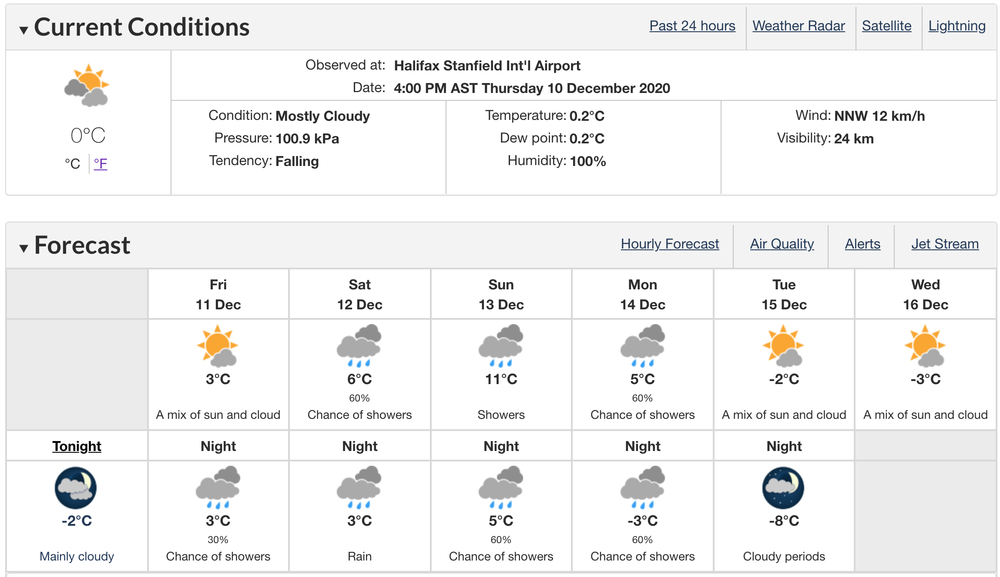

class: middle

```{r setup, include=FALSE}
options(htmltools.dir.version = FALSE)
```

# What is data visualization?

* Turn data into pictures

* Iterative process to explore data

* Filter, summarize, and present data

---
class: middle

# What is the purpose of data visualization?

* Summarize data compactly

* Leverage vision machinery in brain 

* Helps you tell a story with data

* A familiar visualization tells a story "by itself"

???

---
class: middle

# What makes a good visualization?

* Effective communication aid

* Memorable & understandable

* Aesthetically pleasing - nothing jarring or out of place


---
class: inverse, center, middle

# Influential Visualizations


---
class: middle
  
```{r echo=FALSE, out.width = '90%', fig.align="center"}
knitr::include_graphics("../static/mlo_two_years.png")
```

Source [co2.earth](https://www.co2.earth/daily-co2) and [sioweb.ucsd.edu](https://sioweb.ucsd.edu/programs/keelingcurve/)

---
class: middle
  
```{r co2-full-record, echo=FALSE, out.width = '90%', fig.align="center"}
knitr::include_graphics("../static/mlo_full_record.png")
```

---
class: middle
  
```{r gapminder-fertility, echo=FALSE, out.width = '90%', fig.align="center", fig.cap="Hans Rosling's visualizations from gapminder.org"}
knitr::include_graphics("../static/gapminder-fertility-income.png")
```

---
class: middle

```{r env-canada-weather, echo=FALSE, fig.cap="Environment Canada weather forecast for Halifax NS, December 10, 2020", out.width = '90%', fig.align="center"}

```

---
class: middle

```{r weatherspark, echo=FALSE, fig.cap="Climatological mean daily high and low temperatures in Halifax NS from weatherspark.com", out.width = '90%', fig.align="center"}
knitr::include_graphics("../static/weatherspark-hfx-temperature.png")
```


---
class: middle

# Suggested reading

* Course notes: Welcome

* Course notes: Invitation to Data Visualization

* Wilke: Chapter 29: Telling a story and making a point

* Video: Hans Rosling's TED talk (linked in "Invitation")

* Video: Excerpt from Claus Wilke's talk for the Santa Fe Institute (linked in "Invitation")

---
class: middle, inverse

# Task

* Prepare a short report on two visualizations you like or could improve on.

* Details in Course notes (Detailed outline, Evaluation)


