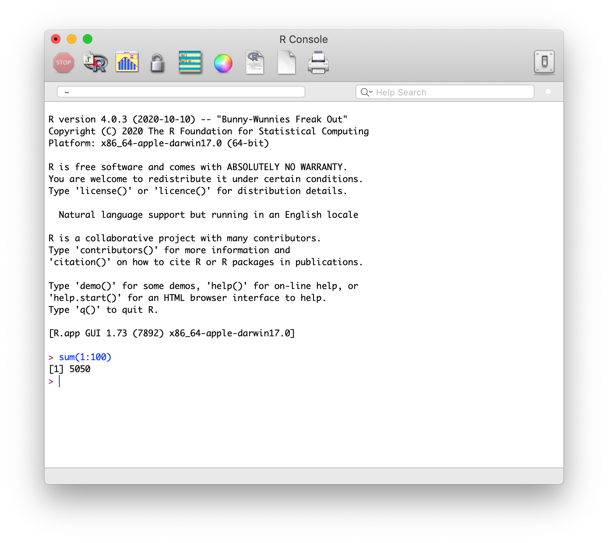
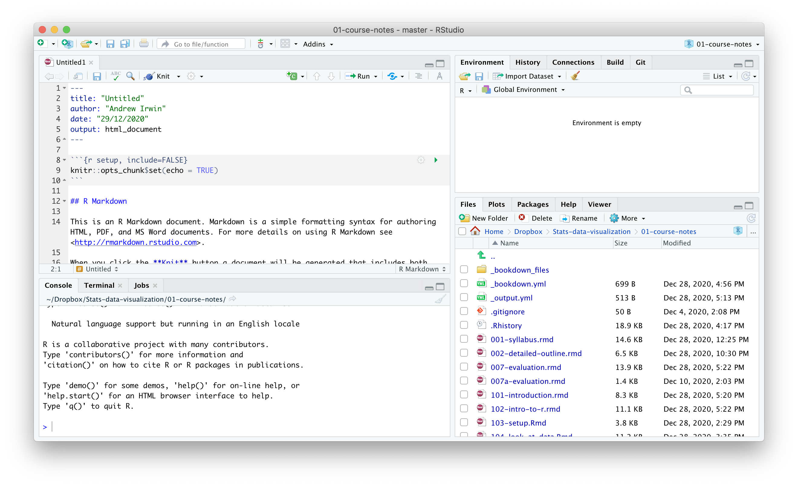
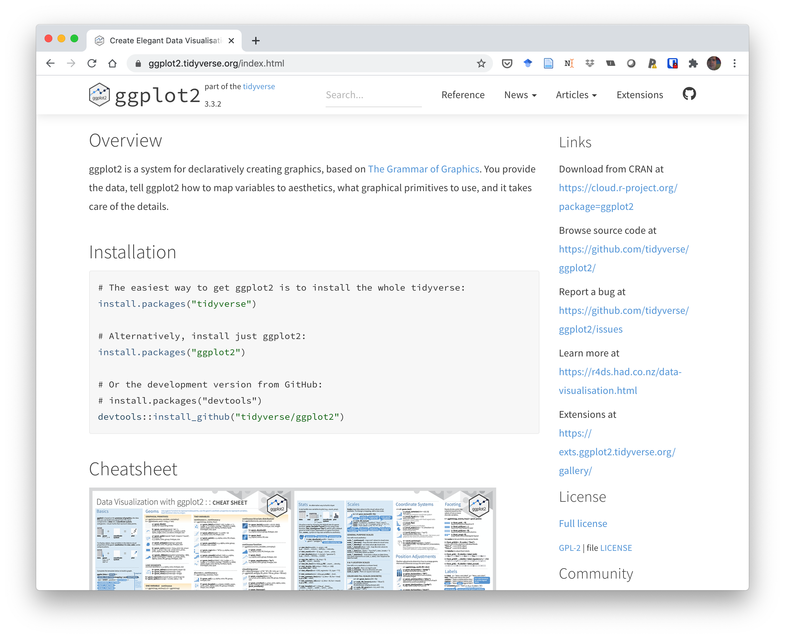
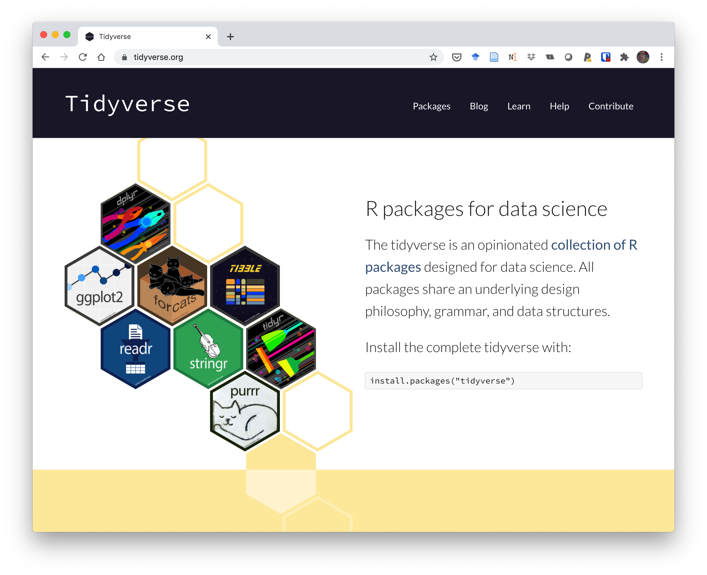
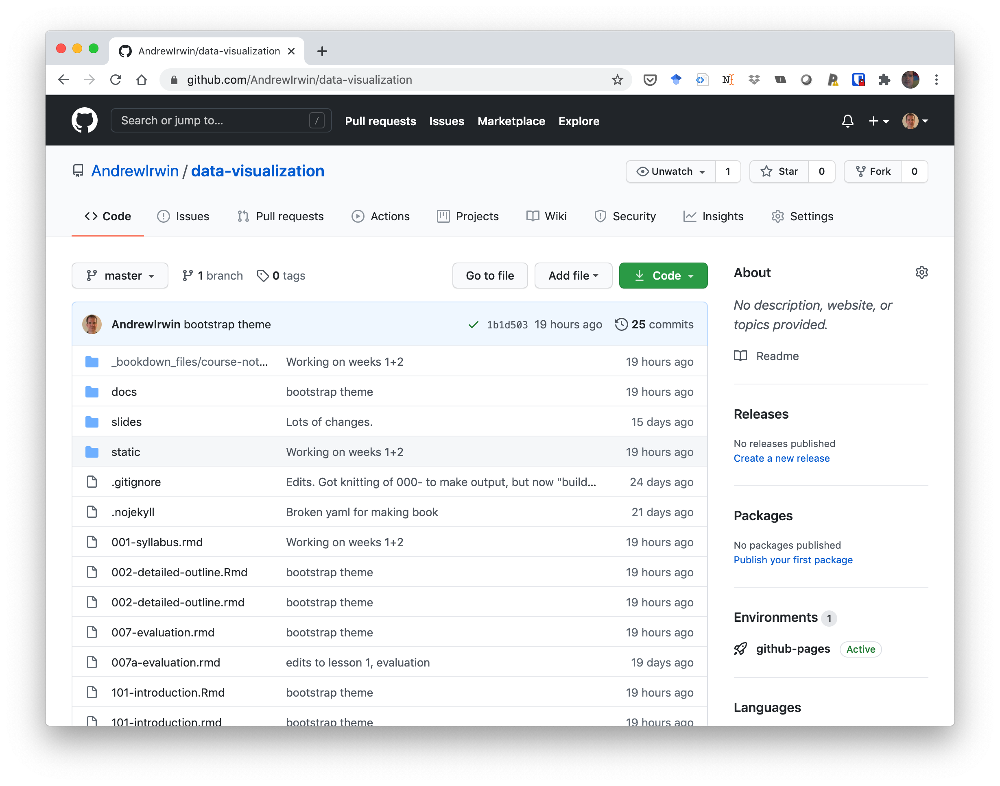

class: middle

```{r setup, include=FALSE}
options(htmltools.dir.version = FALSE)
```

# What computing tools will we learn?

* R

* Rstudio

* ggplot

* tidyverse

* Rmarkdown

* git

* github

---
class: middle

# Why are we learning to use these tools?

* Powerful set of tools for data analysis and visualization, communication, maintenance and dissemination

* Widely used and actively developed

* Will eventually be displaced by new methods

* Core principles are long-lived and will be useful for decades

???

---
class: middle

# R

```{r echo=FALSE, fig.align="center", out.width='90%'}

```

---
class: middle

# Rstudio

```{r echo=FALSE, fig.align="center", out.width='90%'}

```

---
class: middle

# Grammar of Graphics

```{r echo=FALSE, fig.align="center", out.width='90%'}

```

---
class: middle

# tidyverse

```{r echo=FALSE, fig.align="center", out.width='90%'}

```

---
class: middle

# R markdown

```{r echo=FALSE, fig.align="center", out.width='90%'}
knitr::include_graphics("../static/Rmarkdown.png")
```

---
class: middle

# git

```{r echo=FALSE, fig.align="center", out.width='70%'}
knitr::include_graphics("../static/git.png")
```


---
class: middle

# github

```{r echo=FALSE, fig.align="center", out.width='90%'}

```


---
class: middle

# Suggested reading

* Course notes: Computer Tools

* Healy. Preface

* Healy. Sections 2.1, 2.2: Getting started 

* R4DS. Chapter 1: Introduction

---
class: middle, inverse

# Task

* Lesson 3 course notes: Setting up your computer

* Videos to accompany Lesson 3

* Task 2: 
  * Install the software, 
  * Create github account
  * Complete quiz on Brightspace


