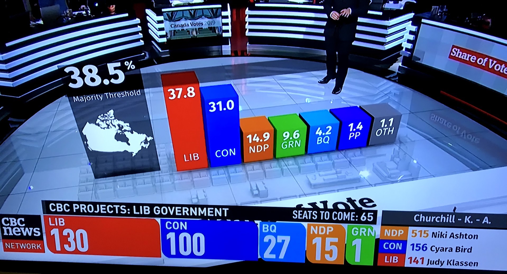
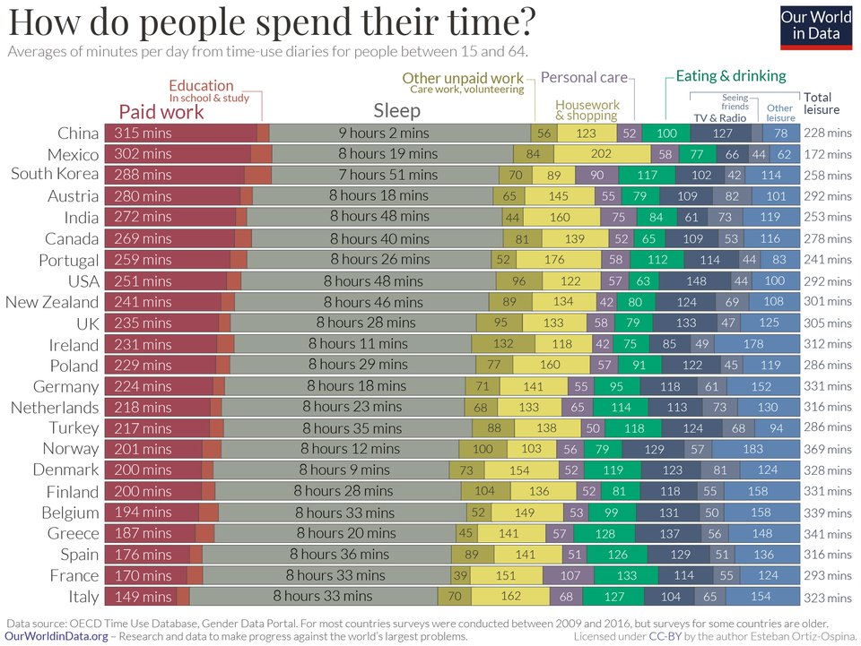

class: middle

```{r setup, include=FALSE}
options(htmltools.dir.version = FALSE)
library(tidyverse)
library(patchwork)
library(kableExtra)
```

# Principles of data visualization

* What can you learn more easily from a visualization than from a table of data?

* What makes a visualization good?

* What features of human visual perception should be considered when designing data visualizations?

???

This is an overview to a vast range of concerns that you will ask yourself over and over again.

Strongly suggesting reading Healy & Wilke on this. Suggested reading at end.

---
class: middle, center, inverse

# Why visualize data?

---
class: middle, center

# Anscombe's Quartet

```{r echo=FALSE, message=FALSE}
anscombe %>%
 pivot_longer(everything(),
   names_to = c(".value", "set"),
   names_pattern = "(.)(.)"
 ) %>% group_by(set) %>%
  summarize(n = n(), 
            x_mean = mean(x),
            x_sd = sd(x),
            y_mean = mean(y),
            y_sd = sd(y),
            correlation = cor(x,y)) %>%
  kable() %>%
  kable_styling(full_width = FALSE)
```

---
class: middle, center

# Anscombe's Quartet

```{r echo=FALSE, message=FALSE, fig.height=6, fig.width=8, fig.align="center"}
my_theme <- theme_bw() + theme(text=element_text(size=13))
p1 <- anscombe %>% ggplot(aes(x=x1, y=y1)) + geom_point() + my_theme + labs(x="", y="") + geom_smooth(method="lm")
p2 <- anscombe %>% ggplot(aes(x=x2, y=y2)) + geom_point() + my_theme + labs(x="", y="") + geom_smooth(method="lm")
p3 <- anscombe %>% ggplot(aes(x=x3, y=y3)) + geom_point() + my_theme + labs(x="", y="") + geom_smooth(method="lm")
p4 <- anscombe %>% ggplot(aes(x=x4, y=y4)) + geom_point() + my_theme + labs(x="", y="") + geom_smooth(method="lm")
p1 + p2 + p3 + p4 + plot_annotation(tag_levels="1", tag_prefix="Set ")
```

---
class: middle, center

# Datasaurus Dozen

```{r echo=FALSE, fig.cap="The Datasaurus Dozen", out.width = '55%', fig.align="center"}

```

---
class: middle, center, inverse

# What is a good visualization?


---
class: middle

```{r, fig.cap="Still from CBC Canadian Federal election coverage, October 21, 2019. Does the three-dimensional bar chart help you understand the election outcome? Are the bars the right height? Is it helpful to have the bar chart appear in the middle of the studio set? Can you judge the height of the bars?", fig.align="center", out.width="75%"}

```

???

A good visualization leads the viewer to a correct interpretation of the underlying data.


---
class: middle

```{r, echo=FALSE, fig.cap=""}

```

???

Bad data. Or more realistically, the data are not what the reader thinks they are.


---
class: middle, center, inverse

# Visual perception

---
class: middle

```{r echo=FALSE, out.width = "100%", fig.cap="The checker shadow illusion."}

```

---
class: middle

```{r echo=FALSE, out.width = "100%", fig.cap="The checker shadow illusion."}

```

---
class: middle

```{r echo=FALSE, out.width = "100%", fig.cap="The checker shadow illusion."}

```

---
class: middle

.pull-left[
```{r echo=FALSE, out.width = "80%", fig.cap=""}

```
]

.pull-right[
```{r echo=FALSE, out.width = "80%", fig.cap="Healy. Fig. 1.24."}

```
]


???

distance, postition, area, shape


---
class: middle

# Proportions: bar and pie charts

```{r echo=FALSE, out.width = "80%", fig.cap="Wilke. Fig. 10.4."}
knitr::include_graphics("../static/marketshare-pies-1.png")
```

???

---
class: middle

# Proportions: bar and pie charts

```{r echo=FALSE, out.width = "80%", fig.cap="Wilke. Fig. 10.6."}
knitr::include_graphics("../static/marketshare-side-by-side-1.png")
```


---
class: middle

# Where to put 0?

```{r echo=FALSE, out.width = "80%", fig.cap="Healy. Fig. 1.27."}
knitr::include_graphics("../static/ch-01-law-enrollments-1.png")
```

---
class: middle

# Where to put 0?

```{r echo=FALSE, out.width = "80%", fig.cap="Healy. Fig. 1.27."}

```


---
class: middle

# Suggested reading

* Course notes: Look at Data

* Healy. Chapter 1: Look at Data (Strongly recommended)

* Wilke. Chapter 1: Introduction

* Wilke. Chapters 5-16: "Visualizing" series of chapters. Return to these over time.

---
class: middle, inverse

# Task

* Task 3: Answer 2 questions about data visualization

  * Use arguments provided in the lessons and readings

  * You can agree or disagree, but you must engage with the ideas


