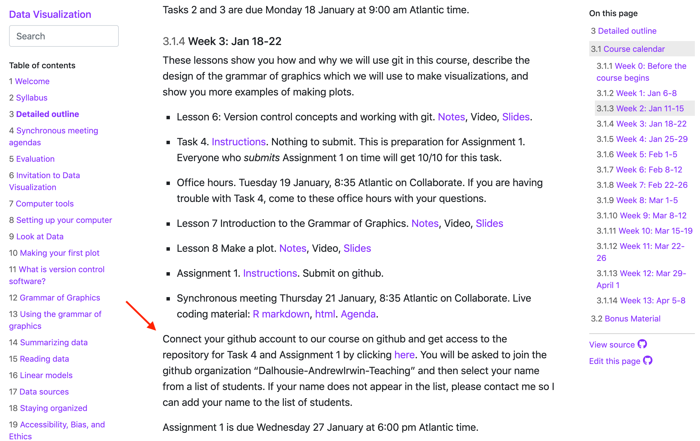
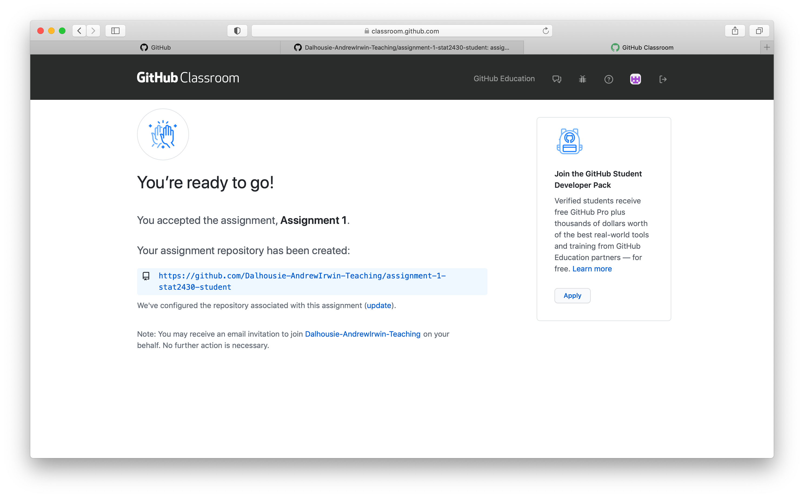
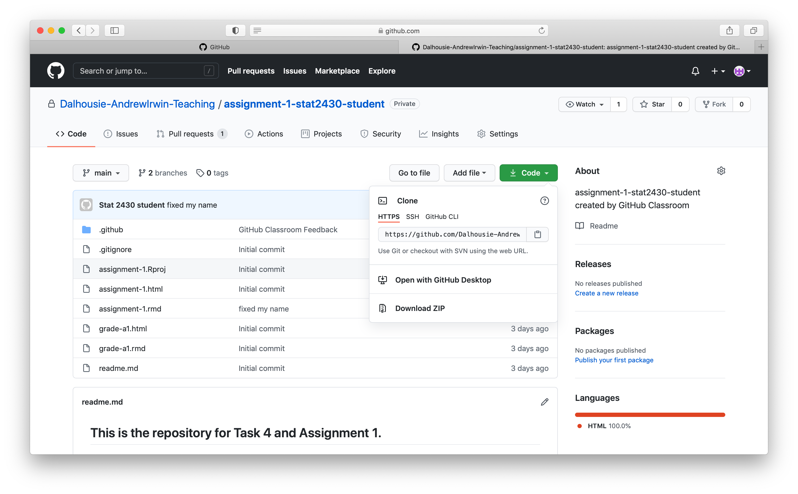
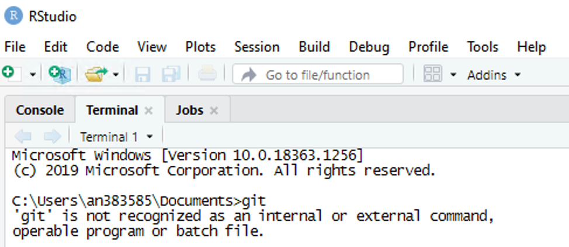
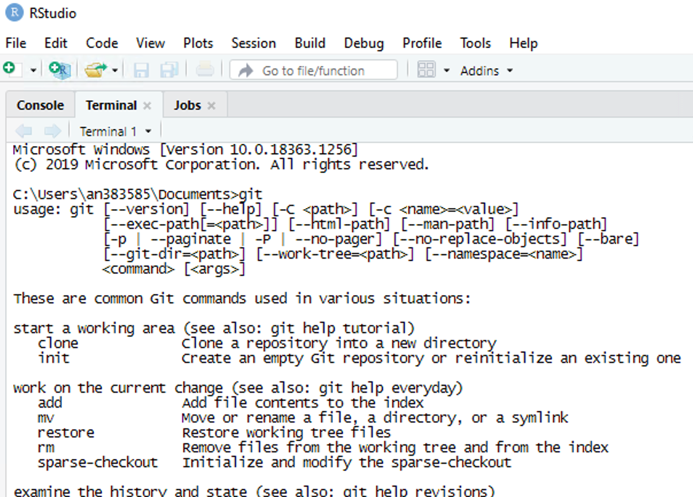
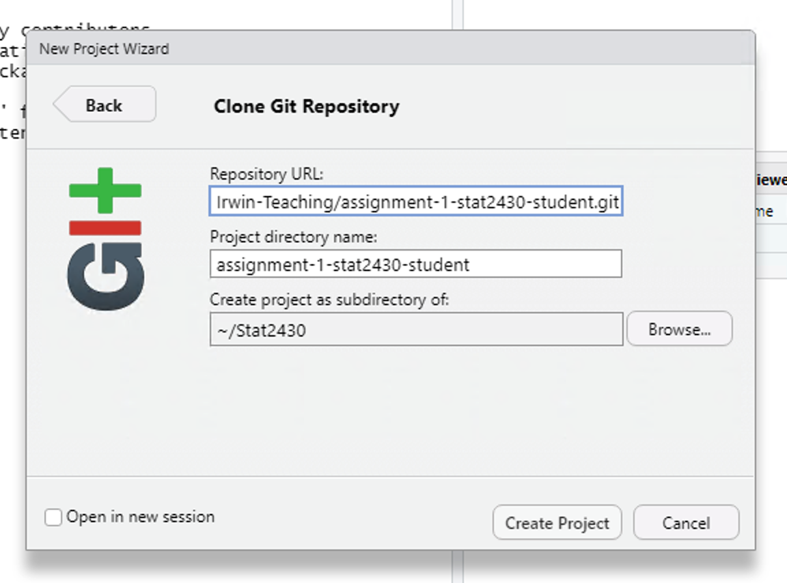
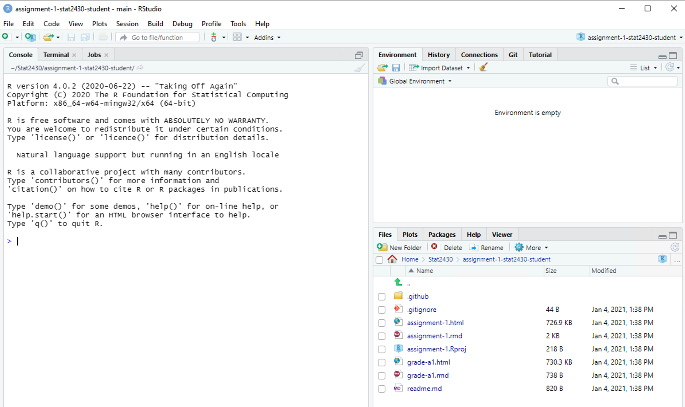
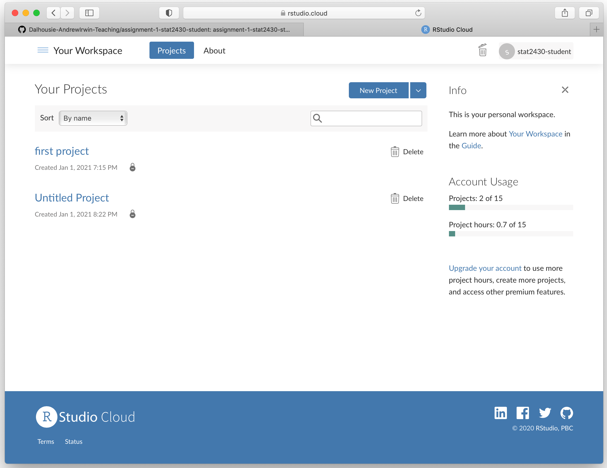
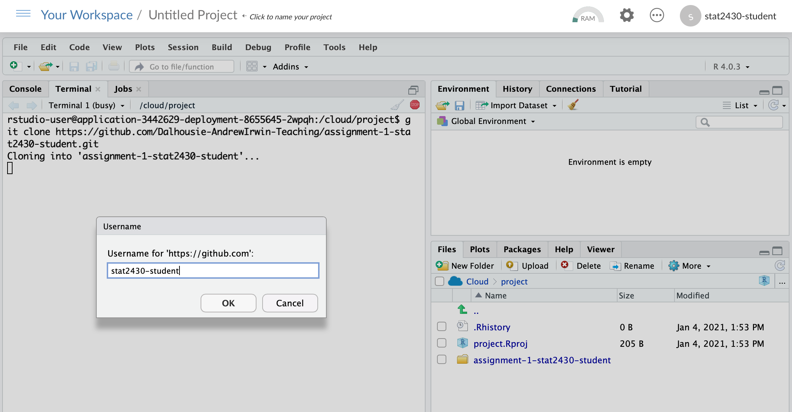
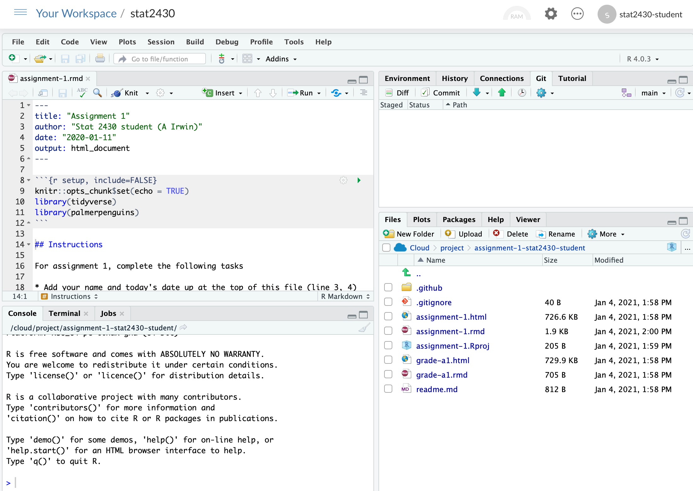

class: middle

```{r setup, include=FALSE}
options(htmltools.dir.version = FALSE)
```

# Task

* Task 4: 
  * Check out the github repository for your assignment 1

---
class: middle, inverse

# Steps

* Click the link to access the repository on the detailed outline

* Copy the link provided by github
  
* Create a new R project from github repo

* Do the assignment
  
* Push the changes to github

---
class: middle

# Click the link to access the repository on the detailed outline

  * This will create a copy of the task/assignment as a repository on your github account
  * The first time you do this, you may be asked to authorize access to your github account by the course (Dalhousie-AndrewIrwin-Teaching)
  * You will be asked to find your name in a list of students registered in the course. If you are not listed, contact me for help
  * You will get an email notification from github

---
class: middle

```{r echo=FALSE}

```

---
class: middle

```{r echo=FALSE}

```

---
class: middle
# Copy the link provided by github

```{r echo=FALSE}

```

---
class: middle

# Create a new project from github: Windows & Mac
  
* Check if git is installed

* Create new project

* Authenticate

* Tell git your name (once only)
  * git config --global user.email "you@example.com"
  * git config --global user.name "Your Name"
 
---
class: middle

## Check git is installed

```{r echo=FALSE}

```

Go back to Syllabus or Lesson 3: Version Control for instructions.

---
class: middle

## Check git is installed

```{r echo=FALSE}

```

---
class: middle

```{r echo=FALSE}

```

---
class: middle

```{r echo=FALSE}

```

---
class: middle

# rstudio.cloud

* Create new project (not from github)

* git clone <paste link from github>

* Tell git your name (once only)
  * git config --global user.email "you@example.com"
  * git config --global user.name "Your Name"

* Open new project

---
class: middle

```{r echo=FALSE}

```

---
class: middle

```{r echo=FALSE}

```

---
class: middle

```{r echo=FALSE}

```


---
class: middle
# Do the assignment

* Stage and commit your changes to your local repository

---
class: middle

# Push the changes to github
  
* You may get a warning email about password authentication being discontinued later this year
* You can switch to an alternative authentication method, but there is no hurry

---
class: middle

# Pull my changes to get your assessment

* Wait a few days! (I will send a notification email.)
* Grades will also appear on Brightspace
  
  

Prompt to "sign in with your browser" (authorize credential manager from browser)


Use PAT (personal access token) system.
https://github.com/settings/tokens/new
Later

---
class: middle, inverse, center

# All done!

# Congratulations

---
# Debris

  * https://github.com/Dalhousie-AndrewIrwin-Teaching/assignment-1-stat2430-student.git
    * Optionally add your user name as follows:
    * https://stat2430-student@github.com/Dalhousie-AndrewIrwin-Teaching...

  * You may be asked to restart Rstudio


Session > Restart R
