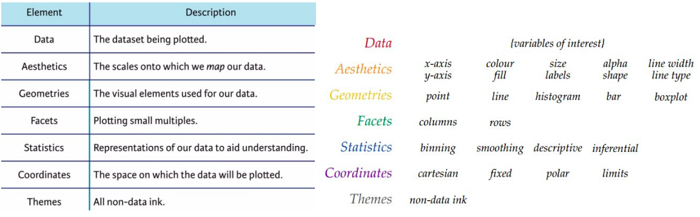

class: middle

```{r include=FALSE}
options(htmltools.dir.version = FALSE)
```

# What is the grammar of graphics?

* A way of describing a visualization 

  * Data
  * Mapping from data to aesthetic features
  * Geometry for representing data
  * Scales
  * Facets
  * Statistics
  * Coordinates
  * Themes
  
---
class: middle, center

```{r echo=FALSE, out.width="80%", fig.align="center"}

```

---
class: middle
## Data

We will always be using "tidy data" arranged in an array

  * columns are variable
  * rows are observations

This arrangement makes it easy to use one variable for each aesthetic feature of a plot (axis position, colour, facet, text labels, ...)

---
class: middle
## Aesthetic mappings

We map variables to features of the graph

  * x axis position
  * y axis position
  * colour (outline, fill)
  * shape
  * line type
  * size
  * error bar extent
  * many more used less frequently, depending on the geometry

Discrete and quantitative variables are handled the same way. The details of the scale and geometry will determine their interprettion.

---
class: middle
## Scales

* range of values on x or y axis; formatting of axis labels

* mapping from values to a discrete or continuous colour scale; choice of colours

* mapping from values to a shape, or line thickness, or symbol size


---
class: middle

## Geometry
What kind of plot do you want?

.pull-left[
```{r echo=FALSE, out.width="80%", fig.align="center"}

```
]
.pull-right[

```{r echo=FALSE, out.width="80%", fig.align="center"}

```
]

---
class: middle

## Facets

```{r echo=FALSE, out.width="80%", fig.align="center"}

```

---
class: middle

## Statistics & Coordinates

* Do you want to perform calculations on your data before plotting?

  * Calculate average and standard deviation
  * Smooth data
  * Add a regression line
  
* What coordinate system do you want to use?

  * Cartesian (x-y) 
    * Fixed aspect ratio
  * Polar (r, $\theta$)
  * Map projections


---
class: middle

# Theme

All the "non-data ink":

* Titles, axis labels, tick marks
* Background shading, box around plot
* How and where the legend (colour, shape) is displayed
* Other annotations - shading, text

---
class: middle

# Summary

The grammar of graphics is a way of describing a visulization. 

`ggplot2` is a computer implementation of this idea.

(Also implemented in python (plotnine), javascript (D3), julia (Gadfly).)

---
class: middle

# Suggested reading

* Course notes

---
# Self-quiz / Bonus task

Aesthetics are mappings between variables in your dataset and your visualization, defined using the `aes` function.

Which of the following is a possible aesthetic mapping for the `gapminder` data set?

1. `aes(country = x, pop = y)`
2. `aes(x = country, y = pop)`
3. `aes(x <- country, y <- pop)`

---
# Self-quiz / Bonus task

The geometry (or geom) of a plot determines how the data are displayed in your visualization. 

Select the true statement.

1. You can have only one geometry, such as `geom_point` per plot
2. You can use mutiple geoms per plot, for example combining both `geom_plot` and `geom_line`.


---
# Self-quiz / Bonus task

True or false: To change all the points in a scatterplot to red circles, you need to add variables to your data frame with values "red" and "circle" and map those variables to the colour and shape aesthetic.

