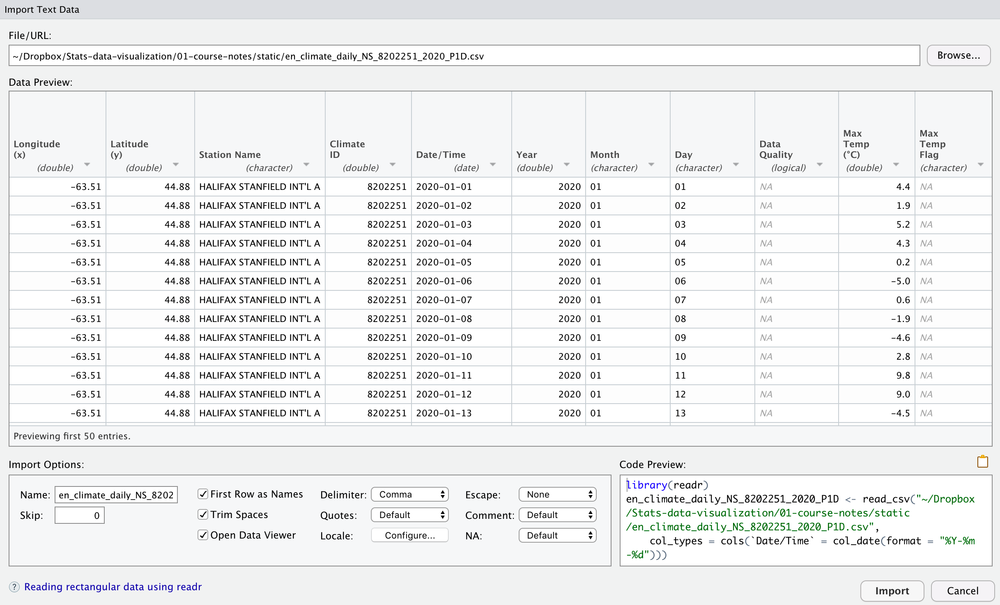

class: middle

```{r setup, include=FALSE}
options(htmltools.dir.version = FALSE)
library(tidyverse)
library(readxl)
library(rmarkdown)
```

# Reading data

* Most data originates outide of R

* To use the data with R, you must

  * Obtain a copy of the data in some format
  
  * Get R to "read" those data
  
  * Check that the data were interpreted correctly

---
class: middle
## What formats do data come in?

* Spreadsheet (Excel, Numbers, LibreOffice Calc)

* Text files (csv, tab separated, delimited)

* Binary formats (various)

* Self-documenting (NetCDF for geophysical data, specialized for astronomy)

* An almost infinite variety of custom formats 

---
class: middle
# Examples

* Create your own excel worksheet

* Environment Canada weather: https://climate.weather.gc.ca/climate_data/daily_data_e.html?StationID=50620

* CO2: https://www.esrl.noaa.gov/gmd/webdata/ccgg/trends/co2/co2_mm_mlo.txt

---
class: middle
# Spreadsheet

```{r}
library(readxl)
dt1 <- read_excel("../static/test-data.xlsx", sheet=1)
dt1 
```

---
class: middle
# Comma separated values

```{r}
library(tidyverse)
dt2 <- read_csv("../static/en_climate_daily_NS_8202251_2020_P1D.csv")
```
---

```{r}
dt2 %>% paged_table()
```

---
class: middle
# Tab separated values
With a header

```{r}
dt3 <- read_delim("../static/co2_mm_mlo.txt", delim=" ", 
                  comment="#", col_names = FALSE)
```

---

```{r}
dt3 %>% paged_table()
```


---
## Clean-up

```{r}
names(dt3) <- c("year", "month", "decimal_year", "co2_monthly", 
                "co2_deseasoned", "n_days", "sdev_days", "uncertainty_mean")
dt3 <- dt3 %>% 
  mutate(across(everything(), as.numeric)) %>%
  mutate(n_days = na_if(n_days, -1), 
         sdev_days = na_if(sdev_days, -9.99),
         uncertainty_mean = na_if(uncertainty_mean, -0.99))
```

---

```{r}
dt3 %>% paged_table()
```

---
# Another way to convert columns

```{r}
library(hablar)
dt3 <- dt3 %>% convert(int(year), int(month), num(decimal_year:uncertainty_mean) ) 
```

Warning, `hablar` has some functions with same names as functions in `dplyr`. For example, need to use `dplyr::na_if` to use the masked `na_if` function.

---
class: middle
# Rstudio data import helper

Flle > Import dataset > From text (readr) ...

```{r out.width = "75%", echo=FALSE, fig.align="center"}

```

---
class: middle

# Things to watch out for

* Multi-row headings, missing headings

* Extra rows at the top of the file

* Missing data coded in an "interesting" way

* Multiple tabs in a spreadsheet

* Date formats

* Numeric data interpreted as text

---
class: middle

# Summary

* `read_excel` to read from spreadsheets

* `read_csv`, `read_tsv`, and `read_delim` to read many text files

* Try the Rstudio data import tool. Notice the R code generated for you.

* **Always check your data table**

* Lots of ways to get trouble

* _Practice, practice, practice_ and ask for help!


---
class: middle

# Further reading

* Lots more examples with different data in the course notes

---
class: middle, inverse

## Task

Practice these skills by performing the tasks in this lesson's task.

