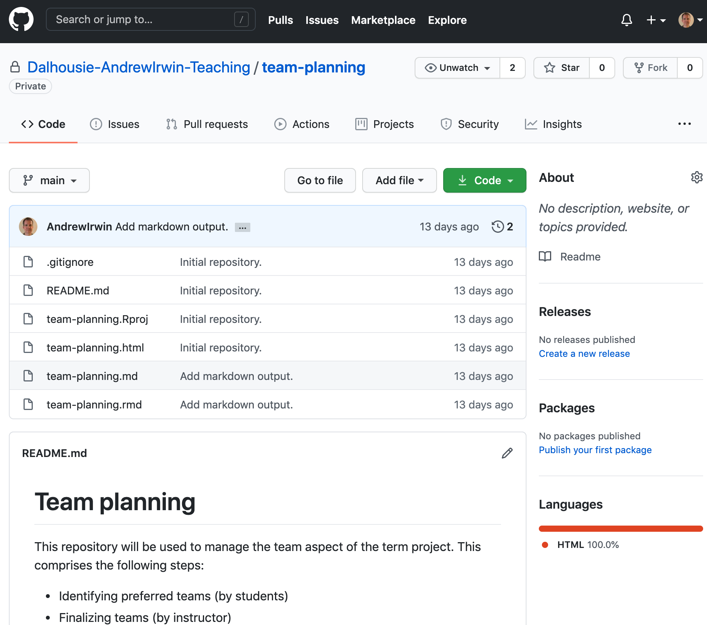
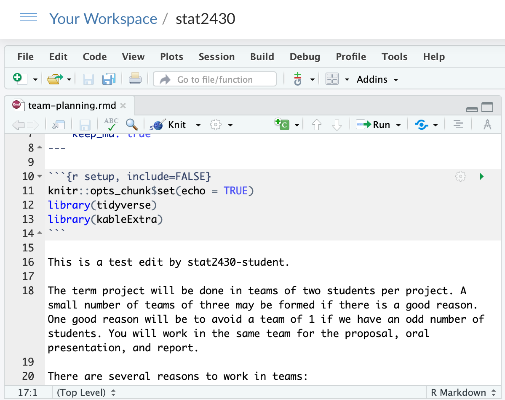
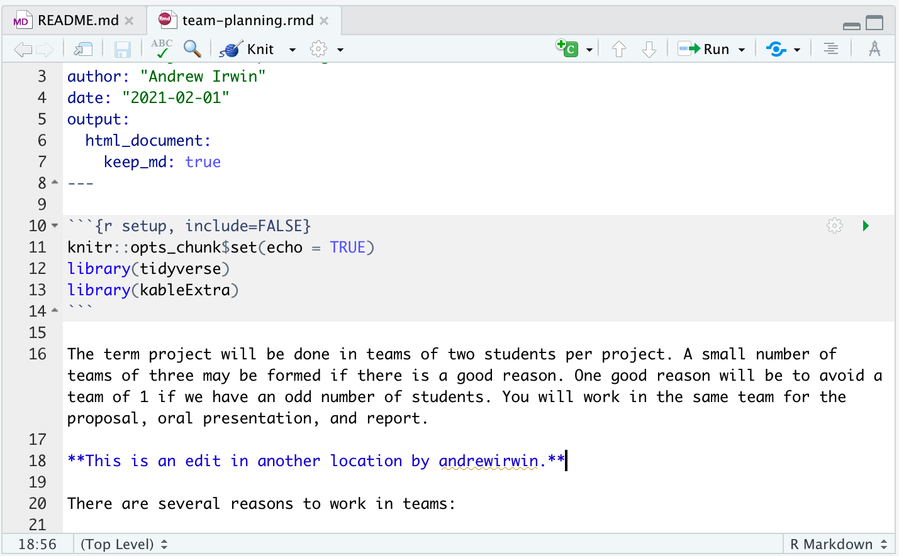
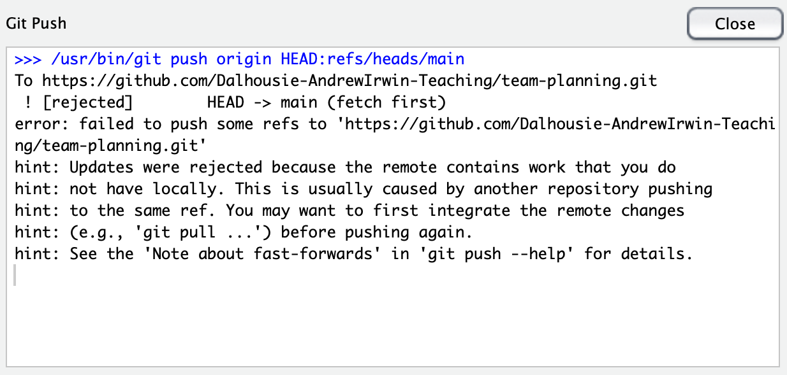
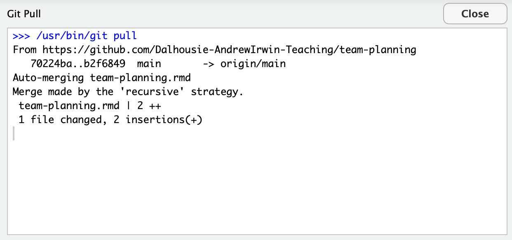
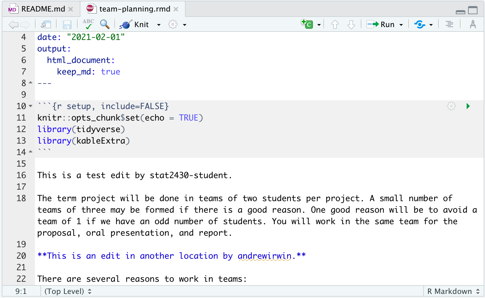
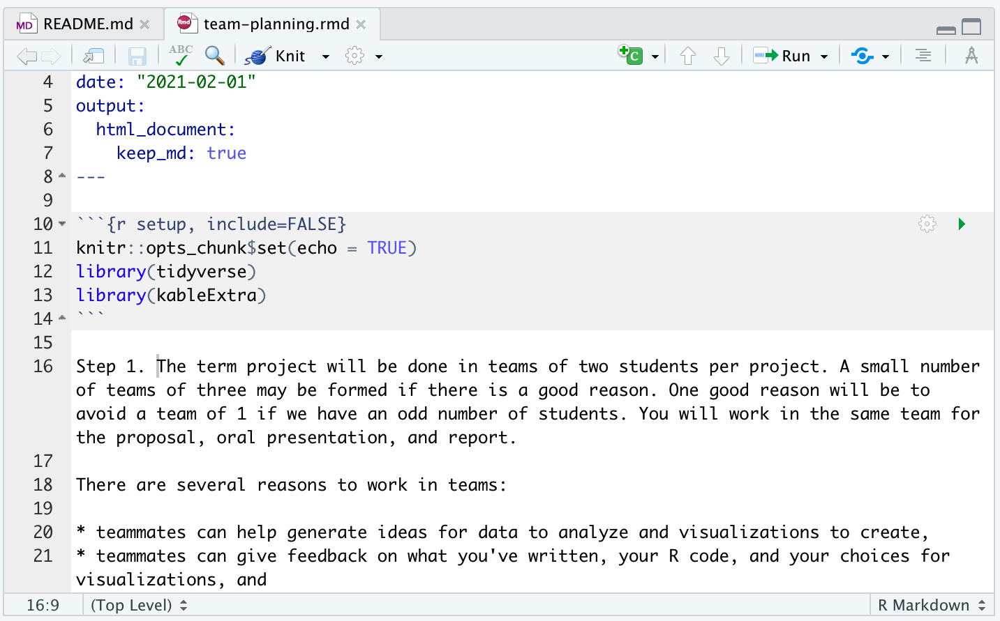
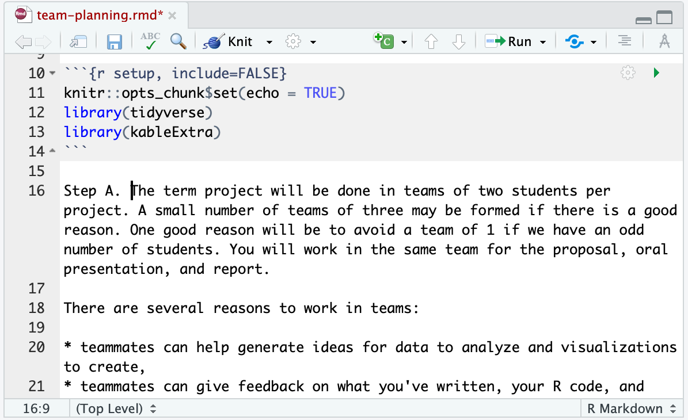
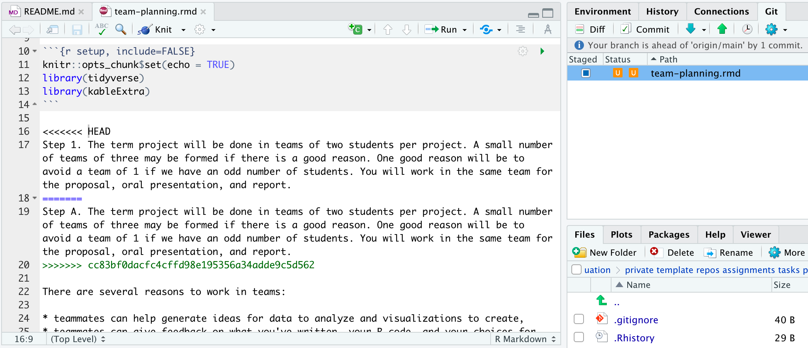

class: middle

```{r setup, include=FALSE}
options(htmltools.dir.version = FALSE)
library(tidyverse)
my_theme = theme_classic() + 
  theme(text = element_text(size=18))
```

# Plan

* Collaborating with GitHub and Rstudio

* How editing conflicts arise

* Resolving editing conflicts

* Other workflows

---
class: inverse, middle
## Using the team-planning repository

```{r echo=FALSE, fig.align="center", out.width='90%'}

```

---
class: middle
### Scenario

* Two people have cloned the repository to their computer and are both editing the same file

.pull-left[
```{r echo=FALSE, fig.align="center", out.width='100%'}

```
]
.pull-right[
```{r echo=FALSE, fig.align="center", out.width='100%'}

```
]


---
class: middle
### One person pushes a change to GitHub

* What happens when the second person tries to push a change?

```{r echo=FALSE, fig.align="center", out.width='90%'}

```

---
class: middle
### One person pushes a change to GitHub

* What happens when the second person tries to push a change?

```{r echo=FALSE, fig.align="center", out.width='90%'}

```

---
class: middle
### Later, the other user pulls the changes

```{r echo=FALSE, fig.align="center", out.width='90%'}

```


---
class: middle
### Conflicting edits on the same line can't be resolved automatically

.pull-left[
```{r echo=FALSE, fig.align="center", out.width='100%'}

```
]
.pull-right[
```{r echo=FALSE, fig.align="center", out.width='100%'}

```
]

---
class: middle
### Conflicting edits on the same line can't be resolved automatically

```{r echo=FALSE, fig.align="center", out.width='90%'}
knitr::include_graphics("../static/collaboration-06-message.png")
```

---
class: middle
### Pull, edit, stage, commit, push

```{r echo=FALSE, fig.align="center", out.width='90%'}

```

---
class: middle

# Summary

* The pull - edit - commit - push editing workflow

* Non-conflicting "simultaneous" edits

* Conflicting simultaneous edits on the same line and how to resolve them
  * Commit to local repository
  * Pull remote changes
  * Resolve conflicts
  * Stage, commit, and push changes
  
---
class: middle

# Further reading

* Course notes

* [Collaboration tutorial](https://uoftcoders.github.io/studyGroup/lessons/git/collaboration/lesson/) linked in course notes

* [Resolving merge conflicts on GitHub](https://docs.github.com/en/github/collaborating-with-issues-and-pull-requests/resolving-a-merge-conflict-using-the-command-line)

---
class: middle, inverse

## Task

* Task 11: 
  * Add your name to the collaboration list, as part of a team, or by yourself. 
  * People not in teams will be assigned teams randomly. 
  * Resolve any conflicts that arise -- for example, two people using the same line of the table.

