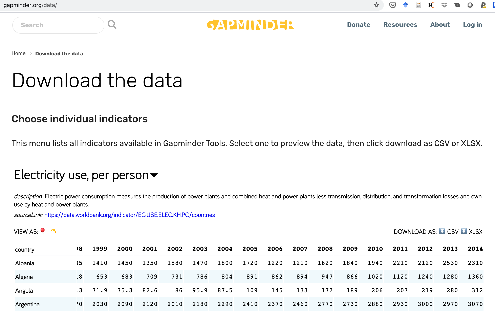
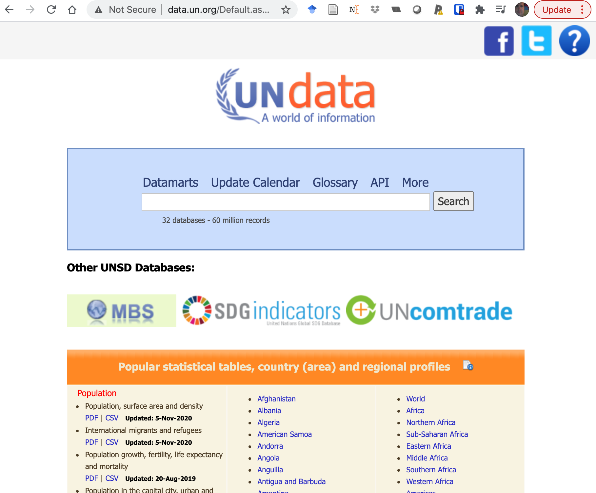
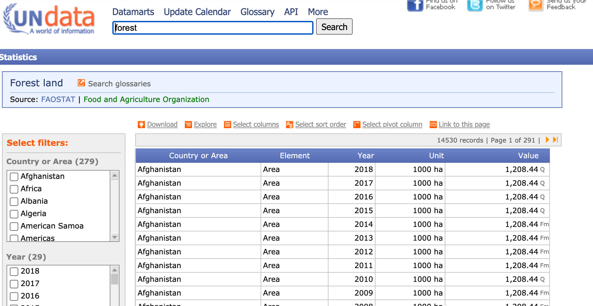
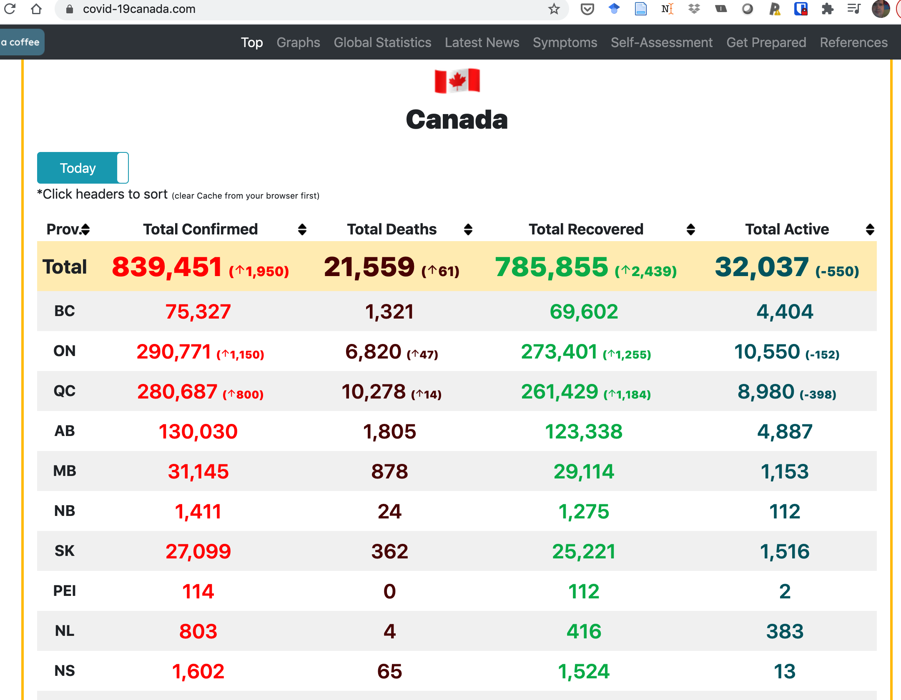

class: middle

```{r setup, include=FALSE}
options(htmltools.dir.version = FALSE)
library(tidyverse)
my_theme = theme_bw() + 
  theme(text = element_text(size=18))
```

# Plan

* Finding data

* Reading data

* Checking data

* Subsetting data (filtering observations, selecting variables)

* Importance of metadata (source, units, how/why/when)

---
class: middle
# Where to get data?

* R packages

* Websites: gapminder, Our World in Data, Tidy Tuesday

* Large repositories: Statistics Canada, OECD

* Specialized repositories: Many COVID data repositories

* Small collections made by individuals

* Government "Open data"

* Many, many, many more sources: google

---
class: middle
# What to look for?

* Downloadable spreadsheets, comma separated variables files, text files

* R packages to download data

* GitHub repositories (and others: pangaea.de, osf.io, and many, many more)

* A license or terms and conditions of reuse and redistribution

---
class: middle
## Example: gapminder

```{r echo=FALSE, out.width = '60%', fig.align="center"}

```

---
class: middle
### Example: gapminder

```{r message=FALSE}
electricity <- read_csv("../static/electricity_use_per_person.csv")
electricity %>% 
  filter(str_starts(country, "[AM]")) %>%
  ggplot(aes(`2010`, fct_reorder(country, `2010`))) +
  geom_point() +
  labs(x = "Electricity use in 2010\n(annual kWh per capita)", y = "") + my_theme
```

---
class: middle
## Example: UN

```{r echo=FALSE, out.width = '60%', fig.align="center"}

```


---
class: middle
## Example: UN

```{r echo=FALSE, out.width = '60%', fig.align="center"}

```

---
class: middle
### Example: UN

```{r message=FALSE, warning=FALSE}
forest_UN <- read_csv("../static/UNdata_Export_20210219_185253716.csv")
forest_UN %>%
  filter(Year == 2017, Unit == "1000 ha",
         str_starts(`Country or Area`, "[BU]")) %>%
  ggplot(aes(x = Value, y = fct_reorder(`Country or Area`, Value))) +
  geom_point() + labs(x = "Forest area (1000 ha)", y = "") + my_theme +
  scale_x_log10() + theme(axis.title.y = element_text(size=10))
```

---
class: middle
## Datapasta

```{r echo=FALSE, out.width = '60%', fig.align="center"}

```

---
class: middle
### Datapasta

Addins > Paste as data.frame

```{r}
data.frame(
  stringsAsFactors = FALSE,
             Prov. = c("Total","BC","ON","QC","AB",
                       "MB","NB","SK","PEI","NL","NS","YT","NT","NU",
                       "\U0001f6a2"),
   Total.Confirmed = c("839,451 (arrow_upward1,950)",
                       "75,327","290,771 (arrow_upward1,150)",
                       "280,687 (arrow_upward800)","130,030","31,145","1,411","27,099",
                       "114","803","1,602","72","47","330","13"),
      Total.Deaths = c("21,559 (arrow_upward61)",
                       "1,321","6,820 ( arrow_upward 47)",
                       "10,278 ( arrow_upward 14)","1,805","878","24","362","0","4","65","1",
                       "0","1","0"),
   Total.Recovered = c("785,855 (arrow_upward2,439)",
                       "69,602","273,401 ( arrow_upward 1,255)",
                       "261,429 ( arrow_upward 1,184)","123,338","29,114","1,275","25,221",
                       "112","416","1,524","69","39","302","13"),
      Total.Active = c("32,037 (-550)","4,404",
                       "10,550 (-152)","8,980 (-398)","4,887","1,153","112",
                       "1,516","2","383","13","2","8","27","0")
)
```


---
class: middle

# Summary

* Highlighted a few sources of data

* Easiest case is a `csv` format file

* Many R packages have data or have functions to retrieve data

* Always examine your data to be sure it was read and interpreted correctly

* Always look for metadata: units, how was data collected, who collected data, ...

---
class: middle

# Further reading

* Course notes

* [Importing data](https://r4ds.had.co.nz/data-import.html) from R4DS

* Roger Peng's notes on [importing data](https://bookdown.org/rdpeng/rprogdatascience/getting-data-in-and-out-of-r.html)

* An older but comprehensive guide to [importing data](https://cran.r-project.org/doc/manuals/r-release/R-data.html)

---
class: middle, inverse

## Task

* Bonus task: 

  * Find data online that you have not used before from a source in this lesson or anywhere else.
  * Download the data to your computer. 
  * Read the data into R. 
  * Make a simple plot of the data.
