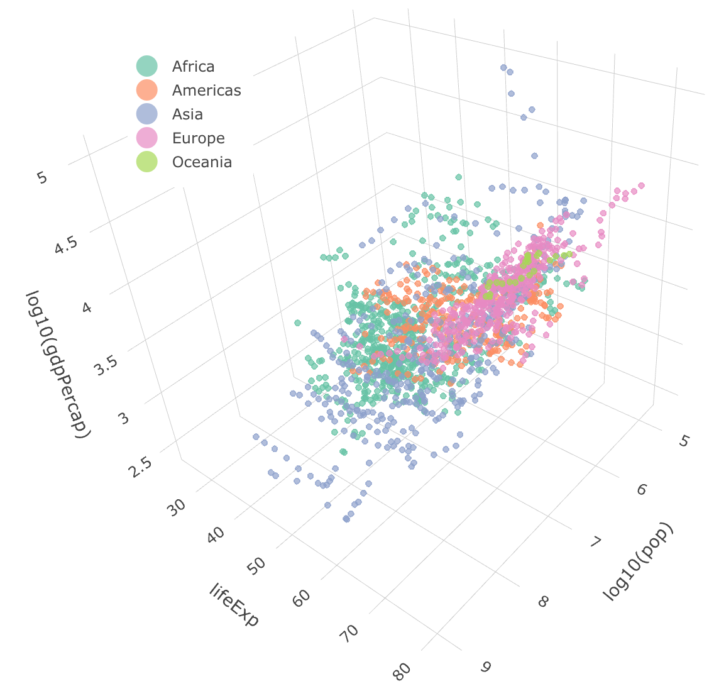

class: middle

```{r setup, include=FALSE}
options(htmltools.dir.version = FALSE)
library(tidyverse)
library(gapminder)
library(plotly)
library(GGally)
library(ggfortify)
library(palmerpenguins)
library(kableExtra)
library(broom)
library(here)
my_theme = theme_classic() + 
  theme(text = element_text(size=18))
```

# Plan

* What is PCA and why do we use it?

* Demonstration with gapminder data in 3 dimensions

* More demonstrations

---
class: middle
### What is PCA?

* A tool for simplifying data sets with many variables down to a small number

* Works best with quantitative variables that are partially correlated

* Usually used in combination with one or more categorical variables to identify subgroups

* Main results are
  * Spatial pattern of points
  * Directions of principal components along original axes (loadings)
  * Amount of variation along each PC axis

* Be careful with scaling and units 

---
class: middle
### Example data

[Interactive version](plotly-1.html)
```{r echo=FALSE, warning=FALSE, message=FALSE}
my_gapminder <- gapminder %>%
  mutate(logPop = log10(pop),
         logGDPpercap = log10(gdpPercap)) %>%
  select(year, continent, lifeExp, logGDPpercap, logPop) 

pi <- my_gapminder %>% plot_ly(x = ~ logPop, y = ~ lifeExp, z = ~ logGDPpercap, color = ~ continent, size = 1)
# pi <- plot_ly(z = volcano, type = "heatmap")
f <- paste0("plotly-",1,".html")
htmlwidgets::saveWidget(pi, f)
# orca(pi, "plotly-1.svg")
```
```{r echo=FALSE, out.width = '60%', fig.align="center"}
#htmltools::tags$iframe(src=f, width="100%", height="400", scrolling="no", seamless="seamless", frameBorder="0")

```


---
class: middle
### Pairs plot

```{r echo=TRUE, message=FALSE, out.width = '60%', fig.align="center"}
my_gapminder %>% select(-year) %>% ggpairs(aes(color = continent))
```


---
class: middle
### PCA: 2007 data only
```{r include=FALSE, warning=FALSE, message=FALSE}
my_gapminder2 <- my_gapminder %>% filter(year == 2007) %>% select(-year)
```

```{r warning=FALSE, out.width="55%", fig.align="center", message=FALSE}
pca1 <- prcomp(my_gapminder2 %>% select(-continent), scale=TRUE)
autoplot(pca1, data = my_gapminder2, loadings=TRUE, loadings.label = TRUE,
         colour = 'continent')
```


---
class: middle
### PCA: All years

```{r out.width="55%", fig.align="center"}
pca1 <- prcomp(my_gapminder %>% select(-continent, -year), 
               scale=TRUE)
autoplot(pca1, data = my_gapminder, loadings=TRUE, 
         loadings.label = TRUE, colour = 'continent')
```

---
class: middle
### Penguins

```{r echo=FALSE, out.width="80%", fig.align="center"}
my_penguins_raw = penguins_raw %>% select(-`Sample Number`) %>% select(Species, where(is.numeric) ) %>% na.omit() %>%
  mutate(Species = str_remove(Species, "\\(.*\\)"))
pca2 <- my_penguins_raw %>% select(-Species) %>% prcomp(scale = TRUE)
autoplot(pca2, data = my_penguins_raw, loadings = TRUE, loadings.label = TRUE,
         loadings.label.colour = "black", loadings.colour = "black",
         colour = 'Species') + xlim(-0.15, 0.15) + ylim(-0.15, 0.15) + coord_fixed()
```

---
class: middle

```{r}
pca2 %>% tidy(matrix="loadings") %>%
  filter(PC < 3) %>%
  pivot_wider(values_from="value", 
              names_from="PC", names_prefix="PC_") %>% kable()
```

---
class: middle

# Summary

* PCA to reduce the number of dimensions (variables) in your data

* Interpreting loadings (arrows and numeric vectors)

* Interpreting proportion of variance along each principal component

* Consequences of scaling variables (or not scaling them)

---
class: middle

# Further reading

* Course notes

---
class: middle, inverse

## Task

* Bonus task: Practice the PCA skills in this lesson 

---
class: middle
### Penguin PCA code

```{r eval=FALSE}
my_penguins_raw = penguins_raw %>% select(-`Sample Number`) %>% 
  select(Species, where(is.numeric) ) %>% na.omit() %>%
  mutate(Species = str_remove(Species, "\\(.*\\)"))
pca2 <- my_penguins_raw %>% select(-Species) %>% prcomp(scale=TRUE)
autoplot(pca2, data = my_penguins_raw, 
         loadings=TRUE, loadings.label = TRUE,
         loadings.label.colour = "black", loadings.colour = "black",
         colour = 'Species') + xlim(-0.15, 0.15) + ylim(-0.15, 0.15)
```
