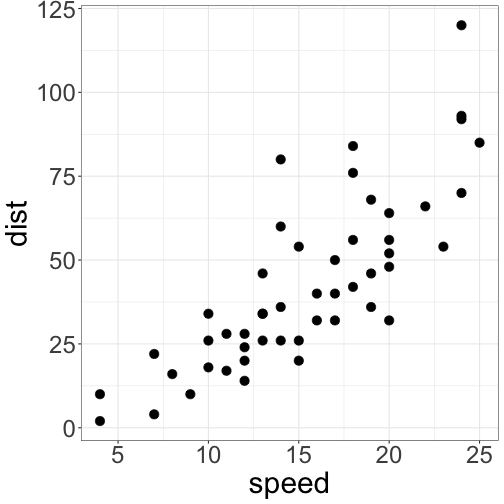
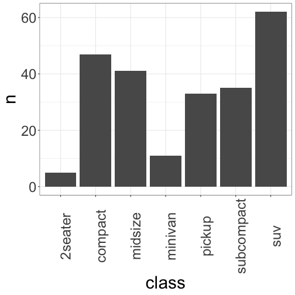

Making slide presentations
========================================================
author: Andrew Irwin
date: 2021-02-26
autosize: true


Goals
========================================================

- Why we make slides for data visualization
- How to make slides using "R presentation" format


Showing a visualization
========================================================




Showing computer code
========================================================


```r
summary(cars)
```

```
     speed           dist       
 Min.   : 4.0   Min.   :  2.00  
 1st Qu.:12.0   1st Qu.: 26.00  
 Median :15.0   Median : 36.00  
 Mean   :15.4   Mean   : 42.98  
 3rd Qu.:19.0   3rd Qu.: 56.00  
 Max.   :25.0   Max.   :120.00  
```

Formatting text and other tricks
=======

All markdown formatting for *italics*, **bold**, [hyperlinks](https://www.r-project.org/) are available.

You can include images from the internet or your own computer.


Two column format
=========
left: 45%


```r
mpg %>% count(class)
```

<table class="table" style="margin-left: auto; margin-right: auto;">
 <thead>
  <tr>
   <th style="text-align:left;"> class </th>
   <th style="text-align:right;"> n </th>
  </tr>
 </thead>
<tbody>
  <tr>
   <td style="text-align:left;"> 2seater </td>
   <td style="text-align:right;"> 5 </td>
  </tr>
  <tr>
   <td style="text-align:left;"> compact </td>
   <td style="text-align:right;"> 47 </td>
  </tr>
  <tr>
   <td style="text-align:left;"> midsize </td>
   <td style="text-align:right;"> 41 </td>
  </tr>
  <tr>
   <td style="text-align:left;"> minivan </td>
   <td style="text-align:right;"> 11 </td>
  </tr>
  <tr>
   <td style="text-align:left;"> pickup </td>
   <td style="text-align:right;"> 33 </td>
  </tr>
  <tr>
   <td style="text-align:left;"> subcompact </td>
   <td style="text-align:right;"> 35 </td>
  </tr>
  <tr>
   <td style="text-align:left;"> suv </td>
   <td style="text-align:right;"> 62 </td>
  </tr>
</tbody>
</table>

***



