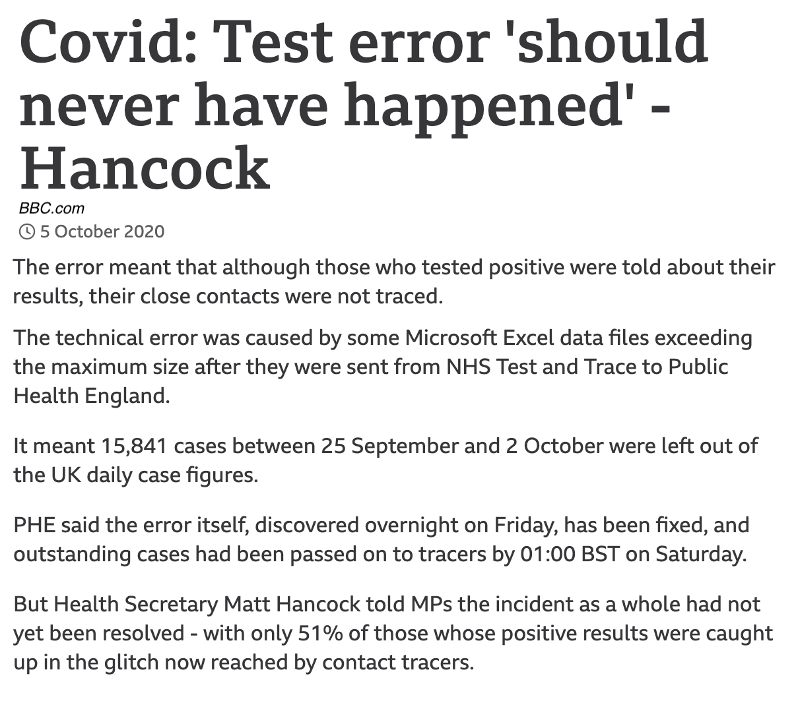
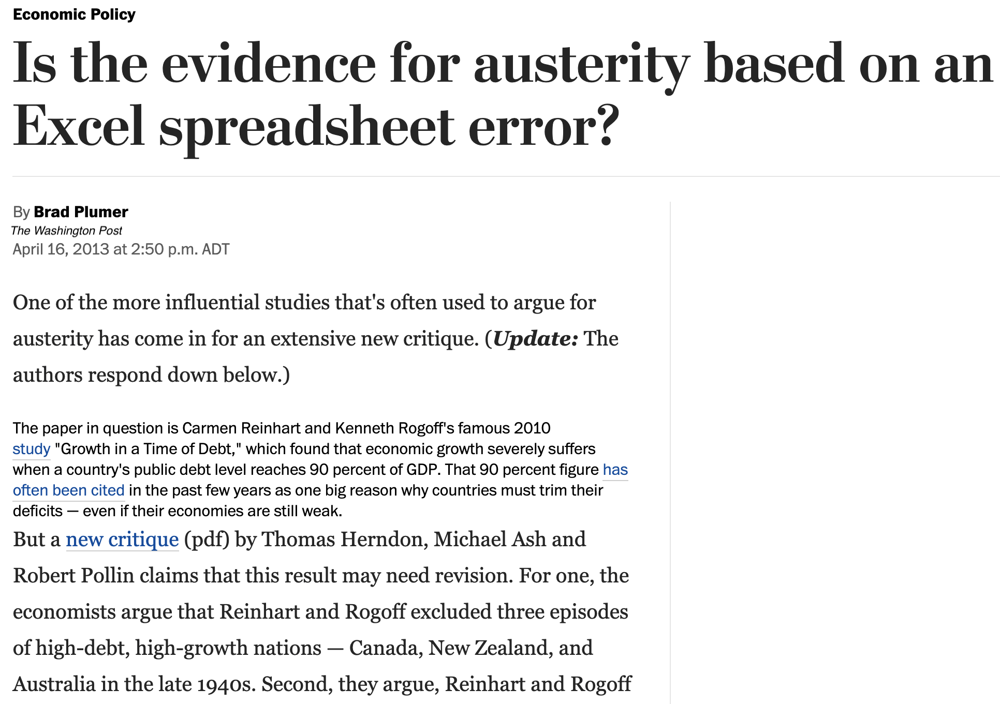

class: middle

```{r setup, include=FALSE}
options(htmltools.dir.version = FALSE)
library(tidyverse)
library(here)
library(janitor)
#library(GGally)
#library(ggfortify)
library(kableExtra)
# library(gapminder)
# library(broom)
# library(plotly)
# library(vegan)
my_theme = theme_classic() + 
  theme(text = element_text(size=18))
```

# Plan

* Why is testing important?

* Testing data

* Testing code

* Examples

* Application in this course

---
class: middle
### Data error

```{r echo=FALSE}

```

---
class: middle
### Computing error

```{r echo=FALSE}

```

---
class: middle
### Why is testing important?

* Visualizations are powerful and help people draw conclusions

* Data errors and misunderstandings can corrupt your work

* Mistakes in analysis (summarize, grouping, calculations) can lead to wrong conclusions

* Checking (manually and automatically) your work improves confidence

* If you return to a project later, or give it to someone else, misunderstandings can lead to misinterpretation


---
class: middle
### Testing data

Things to check

* Were the data read correctly by R (numbers, text, dates, missing values)?

* Are the expected numbers of rows and columns present? Is there a way to check?

* Are any values impossible? (Negative counts or lengths.)

* Changes in units? (Lots of "outliers") Human-coded numbers (commas, spaces, scales like M, K for millions and thousands)

* Spelling errors, abbreviations, or variants? Capitalization. Extra spaces.

* Duplicated data?

* Date formatting. Times and time zones.

---
class: middle
### How to test data?

Most powerful and easiest to use techniques:

* Summary tables: counts, means, ranges

* Simple visualizations: histograms, boxplots, scatter plots

Check the "obvious" things.

---
class: middle
### Testing calculations

* Test your code on sample or simulated data

* Perform a part of the calculation by hand to independently check a result

* Positive and negative controls (just like experiments)

* Provide a test dataset and correct report for future users to check

---
class: middle
### Example: Jelly bean data

Key variables: treatment, flavour, reaction time, accuracy.

```{r include=FALSE}
jelly <- read_csv(here("static/jelly-bean-data.csv")) %>% clean_names() %>% filter(!is.na(flavour)) %>%
  rename(treatment = group_choose_from_drop_down)
```

```{r}
jelly %>% count(treatment) %>% kable() %>% kable_styling(full_width = FALSE)
```

---
class: middle
### Example: Jelly bean data

```{r}
jelly %>% count(flavour) %>% kable() %>% kable_styling(full_width = FALSE)
```

---
class: middle
### Example: Jelly bean data

```{r}
jelly %>% count(tolower(flavour)) %>% kable() %>% kable_styling(full_width = FALSE)
```


---
class: middle
### Example: Sorting

```{r}
jelly %>% count(tolower(flavour)) %>% arrange(n) %>%
  kable() %>% kable_styling(full_width = FALSE)
```

---
class: middle
### Summary: testing in this course

* We are not routinely testing data or code in this course

* You should be aware of the way errors get into analyses and that there are methods for guarding against them

* You should do some checking of the data in your term project, but it's not an assigned part of the work


---
class: middle

# Further reading

* Course notes

---
class: middle, inverse

## Task

* No task for this lesson


