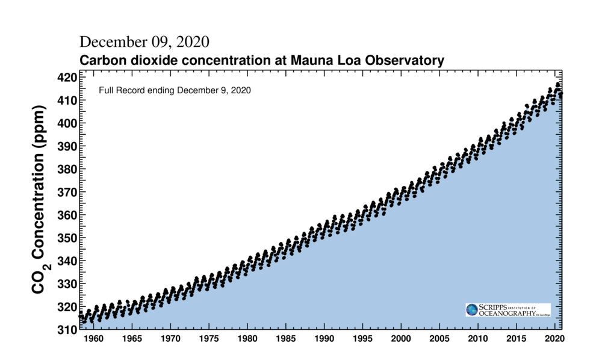

# What is Data Visualization?

```{r setup, include=FALSE}
options(htmltools.dir.version = FALSE)
```

???

* turning data into graphics, more easily interpreted than the raw data, faithful to the original data, not misleading the intended audience

* infographics vs data report continuum

---
class: center, middle

# Telling Stories

## Opening - Challenge - Action - Resolution

Usually requires two figures, a "reveal" or an animation.

https://clauswilke.com/dataviz/telling-a-story.html

---
class: inverse, center, middle

# Influential Visualizations

---


# Atmospheric CO<sub>2</sub>

```{r echo=FALSE, out.width = '90%', fig.align="center"}
knitr::include_graphics("../static/mlo_two_years.png")
```

Source [co2.earth](https://www.co2.earth/daily-co2) and [sioweb.ucsd.edu](https://sioweb.ucsd.edu/programs/keelingcurve/)

---

# Atmospheric CO<sub>2</sub>

```{r co2-full-record, echo=FALSE, out.width = '90%', fig.align="center"}

```

.center[Source [co2.earth](https://www.co2.earth/daily-co2) and [sioweb.ucsd.edu](https://sioweb.ucsd.edu/programs/keelingcurve/)]

---

# Hans Rosling's Human Health & Development

```{r echo=FALSE, out.width = '90%', fig.align="center"}
knitr::include_graphics("../static/gapminder-fertility-income.png")
```

.center[gapminder.org]
